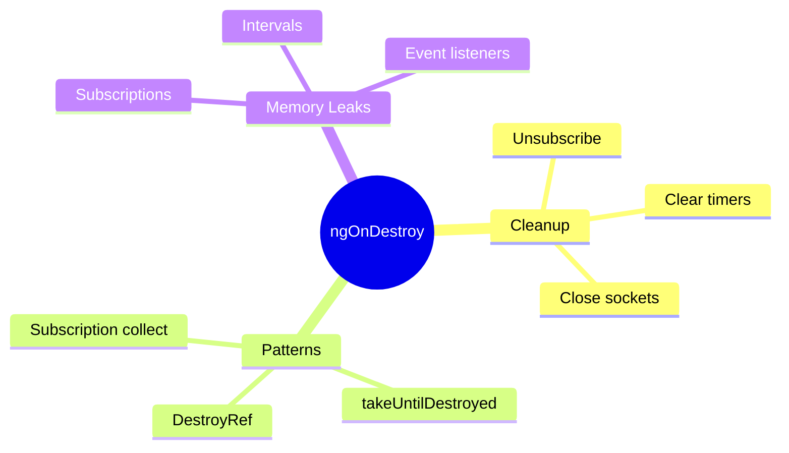

# 🗑️ Use Case 6: ngOnDestroy

> **💡 Lightbulb Moment**: `ngOnDestroy` is your cleanup hook - unsubscribe, clear timers, disconnect sockets here!

---

## 1. 🔍 What is ngOnDestroy?

Called just before Angular destroys the component. Used for cleanup.

```typescript
export class LiveDataComponent implements OnDestroy {
    private subscription: Subscription;
    private intervalId: any;
    
    ngOnInit() {
        this.subscription = this.dataService.stream$.subscribe(...);
        this.intervalId = setInterval(() => this.poll(), 5000);
    }
    
    ngOnDestroy() {
        this.subscription.unsubscribe();  // Prevent memory leak!
        clearInterval(this.intervalId);   // Stop timer!
    }
}
```

---

## 2. 🚀 Common Cleanup Tasks

### Unsubscribe from Observables
```typescript
private subscription = new Subscription();

ngOnInit() {
    this.subscription.add(this.data$.subscribe(...));
    this.subscription.add(this.events$.subscribe(...));
}

ngOnDestroy() {
    this.subscription.unsubscribe();  // Unsubscribes all
}
```

### Using takeUntilDestroyed (Angular 16+)
```typescript
private destroyRef = inject(DestroyRef);

ngOnInit() {
    this.data$.pipe(
        takeUntilDestroyed(this.destroyRef)
    ).subscribe(...);
}
// No manual cleanup needed!
```

---

## 3. ❓ Interview Questions

### Basic Questions

#### Q1: Why is ngOnDestroy important?
**Answer:** Prevents memory leaks! Subscriptions, timers, event listeners continue running even after component is destroyed unless cleaned up.

#### Q2: What are common memory leak sources?
**Answer:**
- Observable subscriptions
- setInterval/setTimeout
- Event listeners
- WebSocket connections
- Third-party library instances

#### Q3: Does async pipe need cleanup?
**Answer:** No! Async pipe automatically unsubscribes when component is destroyed.

---

### Scenario-Based Questions

#### Scenario: WebSocket Cleanup
**Question:** Component connects to WebSocket. How to cleanup?

**Answer:**
```typescript
private socket: WebSocket;

ngOnInit() {
    this.socket = new WebSocket('ws://server');
    this.socket.onmessage = (e) => this.handleMessage(e);
}

ngOnDestroy() {
    if (this.socket) {
        this.socket.close();  // Close connection
        this.socket = null!;
    }
}
```

---

## 🧠 Mind Map


