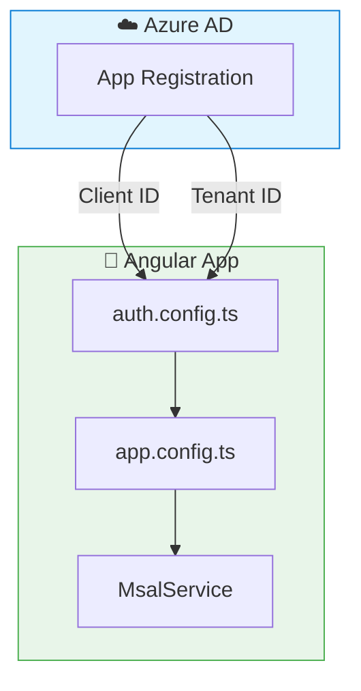

# ⚙️ MSAL Setup

> **💡 Lightbulb Moment**: MSAL handles the OAuth 2.0 complexity - you just configure and call methods!


## 📋 Table of Contents
- [🔍 How It Works](#how-it-works)
- [🚀 Step-by-Step Setup](#step-by-step-setup)
  - [1. Azure AD App Registration](#1-azure-ad-app-registration)
  - [2. Install Packages](#2-install-packages)
  - [3. Create auth.config.ts](#3-create-authconfigts)
- [❓ Interview Questions](#interview-questions)
  - [📦 Data Flow Summary (Visual Box Diagram)](#data-flow-summary-visual-box-diagram)

---
---

## 🔍 How It Works

MSAL Angular wraps the OAuth 2.0 / OpenID Connect protocols, handling:
- Token acquisition
- Token caching
- Token refresh
- Redirect handling



---

## 🚀 Step-by-Step Setup

### 1. Azure AD App Registration
- Go to Azure Portal → Azure AD → App registrations
- Create new registration
- Add redirect URI: `http://localhost:4200`
- Copy Client ID and Tenant ID

### 2. Install Packages
```bash
npm install @azure/msal-angular@3 @azure/msal-browser@3
```

### 3. Create auth.config.ts
```typescript
export const msalConfig = {
    auth: {
        clientId: 'YOUR_CLIENT_ID',
        authority: 'https://login.microsoftonline.com/YOUR_TENANT_ID',
        redirectUri: 'http://localhost:4200'
    }
};
```

---

## ❓ Interview Questions

| Question | Answer |
|----------|--------|
| What is MSAL? | Microsoft Authentication Library for Azure AD authentication |
| Where to get Client ID? | Azure Portal → App Registration → Overview |
| What's the authority URL? | `https://login.microsoftonline.com/{tenant-id}` |

---

### 📦 Data Flow Summary (Visual Box Diagram)

```
┌─────────────────────────────────────────────────────────────┐
│  MSAL SETUP: AZURE AD AUTHENTICATION                        │
│                                                             │
│   AZURE AD (Azure Portal):                                  │
│   ┌───────────────────────────────────────────────────────┐ │
│   │ App Registration → Create                             │ │
│   │ • Get Client ID                                       │ │
│   │ • Get Tenant ID                                       │ │
│   │ • Add Redirect URI: http://localhost:4200             │ │
│   └───────────────────────────────────────────────────────┘ │
│                       │                                     │
│                       ▼                                     │
│   ANGULAR APP:                                              │
│   ┌───────────────────────────────────────────────────────┐ │
│   │ npm install @azure/msal-angular@3 @azure/msal-browser │ │
│   │                                                       │ │
│   │ // auth.config.ts                                     │ │
│   │ export const msalConfig = {                           │ │
│   │   auth: {                                             │ │
│   │     clientId: 'YOUR_CLIENT_ID',                       │ │
│   │     authority: 'https://login.microsoftonline.com/...'│ │
│   │   }                                                   │ │
│   │ };                                                    │ │
│   └───────────────────────────────────────────────────────┘ │
│                                                             │
│   MSAL handles: Token acquisition, caching, refresh        │
└─────────────────────────────────────────────────────────────┘
```

> **Key Takeaway**: MSAL abstracts OAuth 2.0 complexity. Configure Client ID + Tenant ID from Azure Portal, then just call methods!

