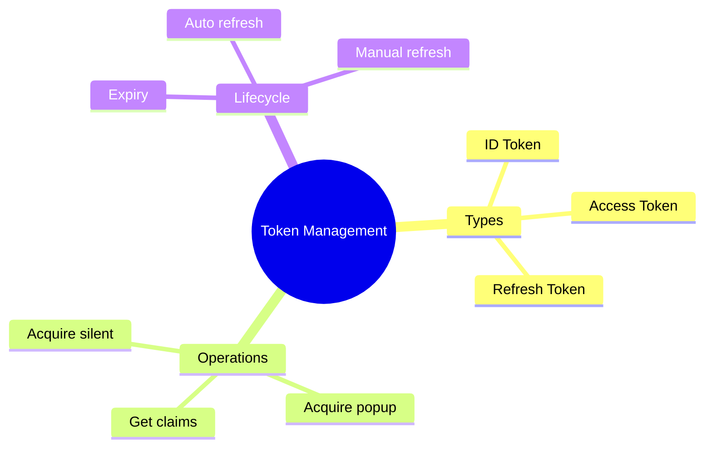

# 🎫 Token Management

> **💡 Lightbulb Moment**: Understanding token lifecycle and management is crucial for secure, reliable auth!


## 📋 Table of Contents
- [1. 🔍 Token Types](#1--token-types)
- [2. 🚀 Token Operations](#2--token-operations)
  - [Get Token Silently](#get-token-silently)
  - [Access User Claims](#access-user-claims)
- [3. ❓ Interview Questions](#3--interview-questions)
  - [Basic Questions](#basic-questions)
    - [Q1: ID token vs Access token?](#q1-id-token-vs-access-token)
    - [Q2: How does token refresh work?](#q2-how-does-token-refresh-work)
  - [Scenario-Based Questions](#scenario-based-questions)
    - [Scenario: Check Token Expiry](#scenario-check-token-expiry)
  - [📦 Data Flow Summary (Visual Box Diagram)](#data-flow-summary-visual-box-diagram)
- [🧠 Mind Map](#mind-map)

---
---

## 1. 🔍 Token Types

| Token | Purpose | Lifetime |
|-------|---------|----------|
| **ID Token** | User identity claims | ~1 hour |
| **Access Token** | API authorization | ~1 hour |
| **Refresh Token** | Get new tokens | 24h - 90 days |

---

## 2. 🚀 Token Operations

### Get Token Silently
```typescript
this.msalService.acquireTokenSilent({
    scopes: ['user.read']
}).subscribe({
    next: result => console.log('Token:', result.accessToken),
    error: err => {
        // Silent failed, try interactive
        this.msalService.acquireTokenPopup({ scopes: ['user.read'] });
    }
});
```

### Access User Claims
```typescript
const account = this.msalService.instance.getActiveAccount();
const claims = account?.idTokenClaims;

console.log('Name:', claims?.name);
console.log('Email:', claims?.preferred_username);
console.log('Roles:', claims?.roles);
```

---

## 3. ❓ Interview Questions

### Basic Questions

#### Q1: ID token vs Access token?
**Answer:**
| ID Token | Access Token |
|----------|--------------|
| User identity | API access |
| Contains user claims | Contains permissions |
| For your app | For APIs |

#### Q2: How does token refresh work?
**Answer:** MSAL automatically uses refresh token to get new access tokens when they expire. This happens silently in the background.

---

### Scenario-Based Questions

#### Scenario: Check Token Expiry
**Question:** Check if current token is valid before API call.

**Answer:**
```typescript
const account = this.msalService.instance.getActiveAccount();
const token = account?.idTokenClaims;

const expiryTime = token?.exp as number * 1000;
const isExpired = Date.now() > expiryTime;

if (isExpired) {
    await this.msalService.acquireTokenSilent({ scopes: [...] }).toPromise();
}
```

---

### 📦 Data Flow Summary (Visual Box Diagram)

```
┌─────────────────────────────────────────────────────────────┐
│  TOKEN MANAGEMENT                                           │
│                                                             │
│   TOKEN TYPES:                                              │
│   ┌───────────────────────────────────────────────────────┐ │
│   │ ID Token:     User identity claims (~1 hour)          │ │
│   │ Access Token: API authorization (~1 hour)             │ │
│   │ Refresh Token: Get new tokens (24h - 90 days)         │ │
│   └───────────────────────────────────────────────────────┘ │
│                                                             │
│   ACQUIRE TOKEN:                                            │
│   ┌───────────────────────────────────────────────────────┐ │
│   │ msalService.acquireTokenSilent({ scopes: [...] })     │ │
│   │   .subscribe({                                        │ │
│   │     next: result => console.log(result.accessToken),  │ │
│   │     error: () => msalService.acquireTokenPopup(...)   │ │
│   │   });                                                 │ │
│   └───────────────────────────────────────────────────────┘ │
│                                                             │
│   ACCESS CLAIMS:                                            │
│   const claims = account?.idTokenClaims;                   │
│   claims.name, claims.preferred_username, claims.roles     │
│                                                             │
│   MSAL auto-refreshes tokens using refresh token!          │
└─────────────────────────────────────────────────────────────┘
```

> **Key Takeaway**: ID token = identity, Access token = API access. Silent first, popup fallback. MSAL handles refresh automatically!

---

## 🧠 Mind Map


