# ⚙️ Use Case 1: MSAL Setup

> **💡 Lightbulb Moment**: MSAL handles the OAuth 2.0 complexity - you just configure and call methods!

---

## 🔍 How It Works

MSAL Angular wraps the OAuth 2.0 / OpenID Connect protocols, handling:
- Token acquisition
- Token caching
- Token refresh
- Redirect handling

```mermaid
flowchart TB
    subgraph Azure["☁️ Azure AD"]
        AppReg["App Registration"]
    end
    
    subgraph App["📱 Angular App"]
        Config["auth.config.ts"]
        AppConfig["app.config.ts"]
        MsalSvc["MsalService"]
    end
    
    AppReg -->|"Client ID"| Config
    AppReg -->|"Tenant ID"| Config
    Config --> AppConfig
    AppConfig --> MsalSvc
    
    style Azure fill:#e1f5fe,stroke:#0078d4
    style App fill:#e8f5e9,stroke:#4caf50
```



---

## 🚀 Step-by-Step Setup

### 1. Azure AD App Registration
- Go to Azure Portal → Azure AD → App registrations
- Create new registration
- Add redirect URI: `http://localhost:4200`
- Copy Client ID and Tenant ID

### 2. Install Packages
```bash
npm install @azure/msal-angular@3 @azure/msal-browser@3
```

### 3. Create auth.config.ts
```typescript
export const msalConfig = {
    auth: {
        clientId: 'YOUR_CLIENT_ID',
        authority: 'https://login.microsoftonline.com/YOUR_TENANT_ID',
        redirectUri: 'http://localhost:4200'
    }
};
```

---

## ❓ Interview Questions

| Question | Answer |
|----------|--------|
| What is MSAL? | Microsoft Authentication Library for Azure AD authentication |
| Where to get Client ID? | Azure Portal → App Registration → Overview |
| What's the authority URL? | `https://login.microsoftonline.com/{tenant-id}` |
