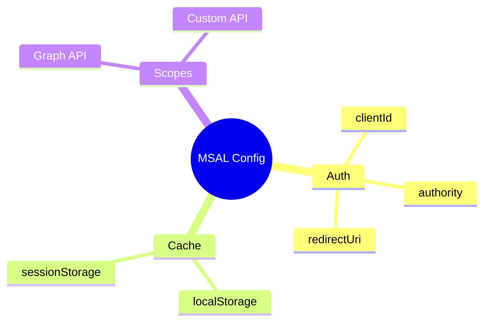

# 🔐 Use Case 2: MSAL Configuration

> **💡 Lightbulb Moment**: Proper MSAL configuration is the foundation of Azure AD authentication!

---

## 1. 🔍 Configuration Structure

```typescript
export const msalConfig: Configuration = {
    auth: {
        clientId: 'your-client-id',
        authority: 'https://login.microsoftonline.com/your-tenant-id',
        redirectUri: 'http://localhost:4200',
        postLogoutRedirectUri: 'http://localhost:4200'
    },
    cache: {
        cacheLocation: 'localStorage',  // or 'sessionStorage'
        storeAuthStateInCookie: false
    },
    system: {
        loggerOptions: {
            logLevel: LogLevel.Info
        }
    }
};
```

---

## 2. 🚀 Protected Resources

```typescript
export const protectedResources = {
    graphApi: {
        endpoint: 'https://graph.microsoft.com/v1.0/me',
        scopes: ['user.read']
    },
    customApi: {
        endpoint: 'https://your-api.com/api',
        scopes: ['api://your-api-id/access_as_user']
    }
};
```

---

## 3. ❓ Interview Questions

### Basic Questions

#### Q1: clientId vs tenantId?
**Answer:**
- **clientId**: Your app's unique ID in Azure AD
- **tenantId**: Your organization's Azure AD ID

#### Q2: localStorage vs sessionStorage for cache?
**Answer:**
| localStorage | sessionStorage |
|--------------|----------------|
| Persists across tabs | Tab-specific |
| Stays on refresh | Cleared on tab close |
| SSO across tabs | Better security |

---

### Scenario-Based Questions

#### Scenario: Multi-tenant App
**Question:** Configure for any Azure AD tenant.

**Answer:**
```typescript
authority: 'https://login.microsoftonline.com/common'
// or 'organizations' for work accounts only
// or 'consumers' for personal accounts only
```

---

### 📦 Data Flow Summary (Visual Box Diagram)

```
┌─────────────────────────────────────────────────────────────┐
│  MSAL CONFIGURATION                                         │
│                                                             │
│   msalConfig: {                                             │
│   ┌───────────────────────────────────────────────────────┐ │
│   │ auth: {                                               │ │
│   │   clientId: 'your-app-id',    // From Azure Portal    │ │
│   │   authority: 'https://login.../tenant-id',            │ │
│   │   redirectUri: 'http://localhost:4200',               │ │
│   │ },                                                    │ │
│   │ cache: {                                              │ │
│   │   cacheLocation: 'localStorage', // or sessionStorage │ │
│   │ }                                                     │ │
│   └───────────────────────────────────────────────────────┘ │
│   }                                                         │
│                                                             │
│   PROTECTED RESOURCES:                                      │
│   ┌───────────────────────────────────────────────────────┐ │
│   │ graphApi: { endpoint: 'https://graph.../me',          │ │
│   │             scopes: ['user.read'] }                   │ │
│   │ customApi: { endpoint: 'https://your-api.../api',     │ │
│   │              scopes: ['api://id/access_as_user'] }    │ │
│   └───────────────────────────────────────────────────────┘ │
│                                                             │
│   MULTI-TENANT: authority = 'https://.../common'           │
└─────────────────────────────────────────────────────────────┘
```

> **Key Takeaway**: clientId = your app, tenantId = your organization. Use 'common' for multi-tenant apps. localStorage = SSO across tabs.

---

## 🧠 Mind Map


