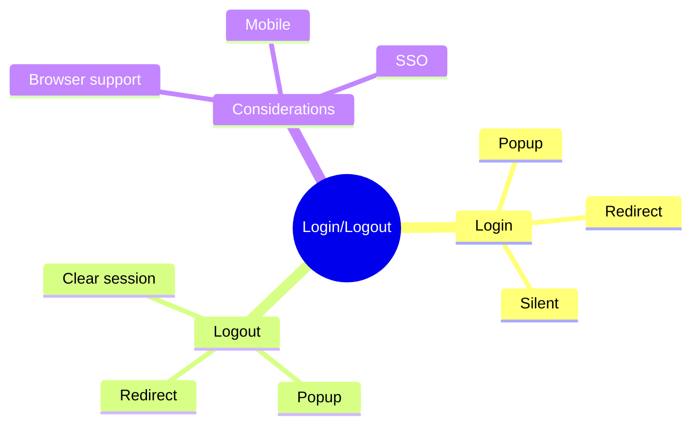

# 🚪 Use Case 3: Login & Logout

> **💡 Lightbulb Moment**: MSAL provides both popup and redirect login flows - choose based on your UX needs!

---

## 1. 🔍 Login Methods

### Popup Login (Smoother UX)
```typescript
login() {
    this.msalService.loginPopup({
        scopes: ['user.read']
    }).subscribe({
        next: result => console.log('Logged in:', result.account),
        error: err => console.error('Login failed:', err)
    });
}
```

### Redirect Login (More reliable)
```typescript
login() {
    this.msalService.loginRedirect({
        scopes: ['user.read']
    });
    // Page will redirect to Azure AD
}
```

---

## 2. 🚀 Logout

```typescript
logout() {
    this.msalService.logout();
    // or
    this.msalService.logoutPopup();
    // or
    this.msalService.logoutRedirect();
}
```

---

## 3. ❓ Interview Questions

### Basic Questions

#### Q1: Popup vs Redirect - when use which?
**Answer:**
| Popup | Redirect |
|-------|----------|
| Same page, less disruptive | Full page redirect |
| May be blocked by browsers | More reliable |
| Better for SPA UX | Required for some iOS |

#### Q2: What are scopes?
**Answer:** Permissions your app requests. Examples:
- `user.read` - Read user profile
- `mail.read` - Read emails
- `api://xxx/access` - Custom API scope

---

### Scenario-Based Questions

#### Scenario: Silent Login Check
**Question:** Auto-login if session exists.

**Answer:**
```typescript
ngOnInit() {
    this.msalService.handleRedirectObservable().subscribe();
    
    const accounts = this.msalService.instance.getAllAccounts();
    if (accounts.length > 0) {
        this.msalService.instance.setActiveAccount(accounts[0]);
    }
}
```

---

### 📦 Data Flow Summary (Visual Box Diagram)

```
┌─────────────────────────────────────────────────────────────┐
│  LOGIN & LOGOUT WITH MSAL                                   │
│                                                             │
│   LOGIN OPTIONS:                                            │
│   ┌───────────────────────────────────────────────────────┐ │
│   │ POPUP (smoother UX):                                  │ │
│   │   msalService.loginPopup({ scopes: ['user.read'] })   │ │
│   │   .subscribe(result => ...)                           │ │
│   │   • Same page • May be blocked by browsers            │ │
│   │                                                       │ │
│   │ REDIRECT (more reliable):                             │ │
│   │   msalService.loginRedirect({ scopes: [...] })        │ │
│   │   • Full page redirect • Required for some iOS        │ │
│   └───────────────────────────────────────────────────────┘ │
│                                                             │
│   LOGOUT OPTIONS:                                           │
│   msalService.logout()  / .logoutPopup() / .logoutRedirect()│
│                                                             │
│   SILENT LOGIN CHECK:                                       │
│   ┌───────────────────────────────────────────────────────┐ │
│   │ const accounts = msalService.instance.getAllAccounts()│ │
│   │ if (accounts.length > 0) {                            │ │
│   │   msalService.instance.setActiveAccount(accounts[0]); │ │
│   │ }                                                     │ │
│   └───────────────────────────────────────────────────────┘ │
└─────────────────────────────────────────────────────────────┘
```

> **Key Takeaway**: Popup = better UX but may be blocked. Redirect = more reliable. Check for existing accounts on init for silent login!

---

## 🧠 Mind Map


