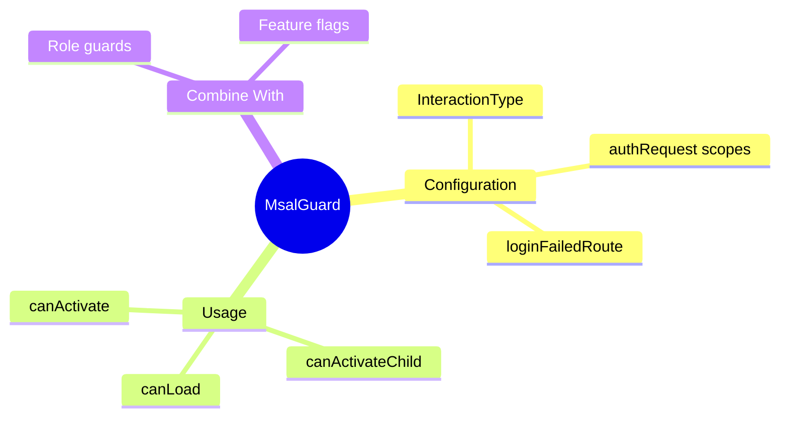

# 🛡️ Use Case 4: Route Guards with MSAL

> **💡 Lightbulb Moment**: Use MsalGuard to protect routes - automatic redirect to login if not authenticated!

---

## 1. 🔍 MsalGuard Setup

```typescript
// app.routes.ts
export const routes: Routes = [
    { path: '', component: HomeComponent },
    { 
        path: 'dashboard', 
        component: DashboardComponent,
        canActivate: [MsalGuard]  // Protected!
    },
    { 
        path: 'admin', 
        component: AdminComponent,
        canActivate: [MsalGuard, RoleGuard]  // Multiple guards
    }
];
```

---

## 2. 🚀 Guard Configuration

```typescript
// app.config.ts
export const appConfig: ApplicationConfig = {
    providers: [
        provideRouter(routes),
        {
            provide: MSAL_GUARD_CONFIG,
            useValue: {
                interactionType: InteractionType.Redirect,
                authRequest: {
                    scopes: ['user.read']
                },
                loginFailedRoute: '/login-failed'
            } as MsalGuardConfiguration
        }
    ]
};
```

---

## 3. ❓ Interview Questions

### Basic Questions

#### Q1: What happens when MsalGuard blocks?
**Answer:** User is redirected to Azure AD login. After successful login, they're sent back to the protected route.

#### Q2: How to protect child routes?
**Answer:**
```typescript
{
    path: 'admin',
    canActivate: [MsalGuard],
    canActivateChild: [MsalGuard],
    children: [...]
}
```

---

### Scenario-Based Questions

#### Scenario: Role-Based Access
**Question:** Only allow users with 'Admin' role to access admin routes.

**Answer:**
```typescript
@Injectable({ providedIn: 'root' })
export class RoleGuard implements CanActivate {
    constructor(private msalService: MsalService) {}
    
    canActivate(): boolean {
        const account = this.msalService.instance.getActiveAccount();
        const roles = account?.idTokenClaims?.roles as string[];
        return roles?.includes('Admin') ?? false;
    }
}
```

---

### 📦 Data Flow Summary (Visual Box Diagram)

```
┌─────────────────────────────────────────────────────────────┐
│  ROUTE GUARDS WITH MSAL                                     │
│                                                             │
│   USAGE:                                                    │
│   ┌───────────────────────────────────────────────────────┐ │
│   │ { path: 'dashboard', component: Dashboard,            │ │
│   │   canActivate: [MsalGuard] }  // Protected!           │ │
│   │                                                       │ │
│   │ { path: 'admin', component: Admin,                    │ │
│   │   canActivate: [MsalGuard, RoleGuard] }               │ │
│   └───────────────────────────────────────────────────────┘ │
│                                                             │
│   CONFIGURATION:                                            │
│   ┌───────────────────────────────────────────────────────┐ │
│   │ { provide: MSAL_GUARD_CONFIG, useValue: {             │ │
│   │     interactionType: InteractionType.Redirect,        │ │
│   │     authRequest: { scopes: ['user.read'] },           │ │
│   │     loginFailedRoute: '/login-failed'                 │ │
│   │ }}                                                    │ │
│   └───────────────────────────────────────────────────────┘ │
│                                                             │
│   FLOW: Not authenticated → Azure AD login → Return to route│
└─────────────────────────────────────────────────────────────┘
```

> **Key Takeaway**: MsalGuard auto-redirects to Azure AD. Combine with custom RoleGuard for RBAC. Always set loginFailedRoute!

---

## 🧠 Mind Map


