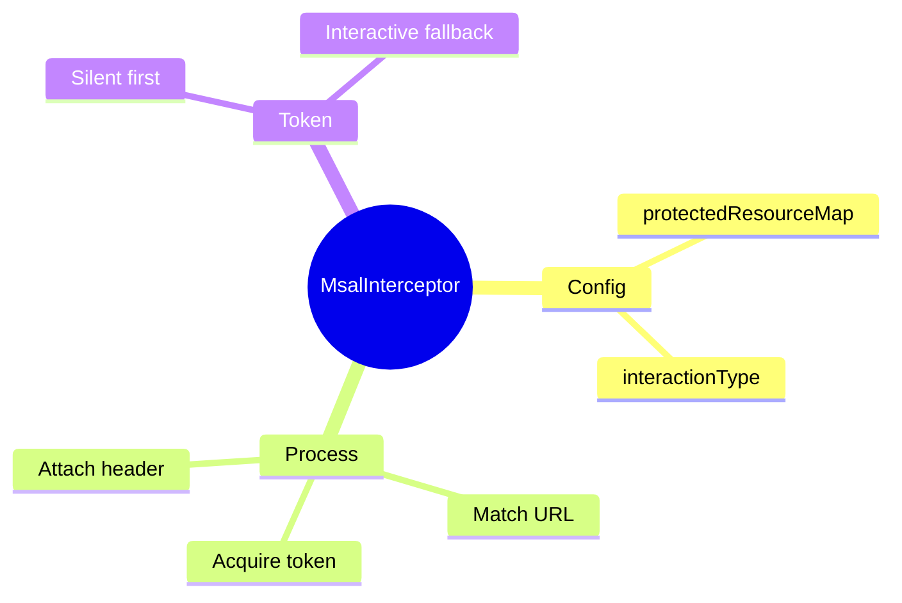

# 🔑 Use Case 5: MSAL Interceptor

> **💡 Lightbulb Moment**: MsalInterceptor automatically attaches access tokens to your API requests!

---

## 1. 🔍 Interceptor Setup

```typescript
// app.config.ts
export const appConfig: ApplicationConfig = {
    providers: [
        provideHttpClient(
            withInterceptors([MsalInterceptor])
        ),
        {
            provide: MSAL_INTERCEPTOR_CONFIG,
            useValue: {
                interactionType: InteractionType.Redirect,
                protectedResourceMap: new Map([
                    ['https://graph.microsoft.com/v1.0/', ['user.read']],
                    ['https://your-api.com/api/', ['api://xxx/access']]
                ])
            } as MsalInterceptorConfiguration
        }
    ]
};
```

---

## 2. 🚀 How It Works

```
1. App makes HTTP request to protected API
2. MsalInterceptor checks if URL matches protectedResourceMap
3. If match, acquires token silently (or prompts if needed)
4. Attaches token as Authorization: Bearer <token>
5. Request proceeds with token
```

---

## 3. ❓ Interview Questions

### Basic Questions

#### Q1: What is protectedResourceMap?
**Answer:** A Map of API endpoints to their required scopes. Interceptor only adds tokens for matching URLs.

#### Q2: Silent vs Interactive token acquisition?
**Answer:**
- **Silent**: Uses cached token or refresh token (no UI)
- **Interactive**: Opens popup/redirect for user login

---

### Scenario-Based Questions

#### Scenario: Multiple APIs
**Question:** App calls Graph API and custom backend.

**Answer:**
```typescript
protectedResourceMap: new Map([
    ['https://graph.microsoft.com/v1.0/', ['user.read', 'mail.read']],
    ['https://backend.mycompany.com/api/', ['api://backend/read']],
    ['https://other-api.mycompany.com/', ['api://other/access']]
])
```

---

## 🧠 Mind Map


