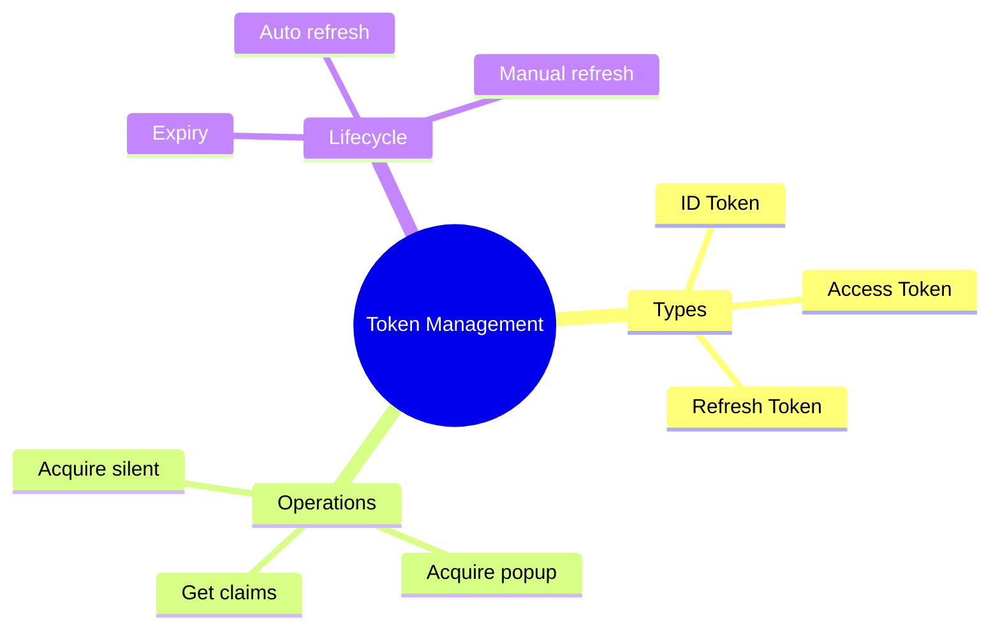

# 🎫 Use Case 6: Token Management

> **💡 Lightbulb Moment**: Understanding token lifecycle and management is crucial for secure, reliable auth!

---

## 1. 🔍 Token Types

| Token | Purpose | Lifetime |
|-------|---------|----------|
| **ID Token** | User identity claims | ~1 hour |
| **Access Token** | API authorization | ~1 hour |
| **Refresh Token** | Get new tokens | 24h - 90 days |

---

## 2. 🚀 Token Operations

### Get Token Silently
```typescript
this.msalService.acquireTokenSilent({
    scopes: ['user.read']
}).subscribe({
    next: result => console.log('Token:', result.accessToken),
    error: err => {
        // Silent failed, try interactive
        this.msalService.acquireTokenPopup({ scopes: ['user.read'] });
    }
});
```

### Access User Claims
```typescript
const account = this.msalService.instance.getActiveAccount();
const claims = account?.idTokenClaims;

console.log('Name:', claims?.name);
console.log('Email:', claims?.preferred_username);
console.log('Roles:', claims?.roles);
```

---

## 3. ❓ Interview Questions

### Basic Questions

#### Q1: ID token vs Access token?
**Answer:**
| ID Token | Access Token |
|----------|--------------|
| User identity | API access |
| Contains user claims | Contains permissions |
| For your app | For APIs |

#### Q2: How does token refresh work?
**Answer:** MSAL automatically uses refresh token to get new access tokens when they expire. This happens silently in the background.

---

### Scenario-Based Questions

#### Scenario: Check Token Expiry
**Question:** Check if current token is valid before API call.

**Answer:**
```typescript
const account = this.msalService.instance.getActiveAccount();
const token = account?.idTokenClaims;

const expiryTime = token?.exp as number * 1000;
const isExpired = Date.now() > expiryTime;

if (isExpired) {
    await this.msalService.acquireTokenSilent({ scopes: [...] }).toPromise();
}
```

---

## 🧠 Mind Map


