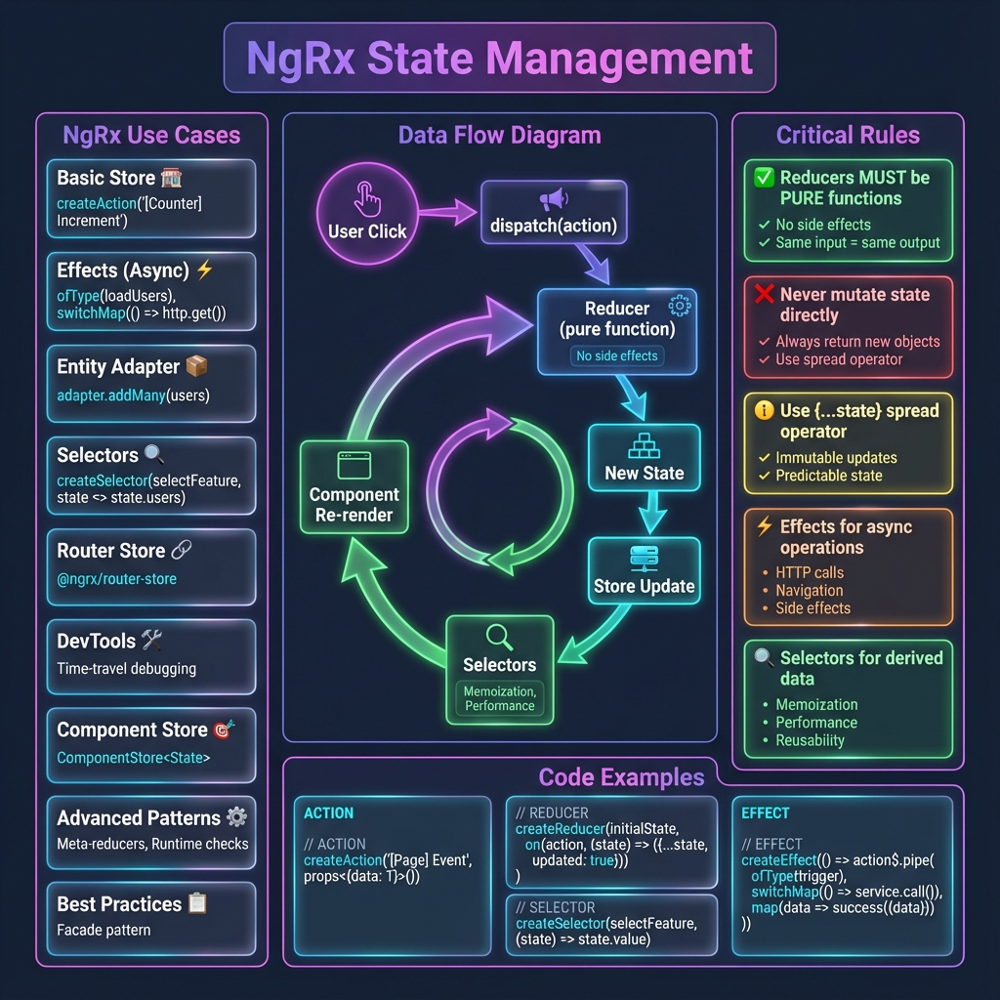

# NgRx State Management - Complete Guide



## Overview

Comprehensive NgRx learning path covering all 9 use cases from basics to advanced production patterns.

## 🎯 All Use Cases

### Core NgRx (Use Cases 1-6)

1. **[Store Basics](./components/use-case-1/)** - Actions, Reducers, Selectors
2. **[Effects](./components/use-case-2/)** - Async operations and side effects
3. **[Entity Adapter](./components/use-case-3/)** - Normalized state with O(1) operations
4. **[Selectors](./components/use-case-4/)** - Memoization and derived state
5. **[DevTools](./components/use-case-5/)** - Time-travel debugging
6. **[Best Practices](./components/use-case-6/)** - Patterns and anti-patterns

### Advanced NgRx (Use Cases 7-9)

7. **[Router Store](./components/use-case-7/)** - Route state sync with NgRx
8. **[Component Store](./components/use-case-8/)** - Local reactive state management
9. **[Advanced Patterns](./components/use-case-9/)** - Meta-reducers, runtime checks, production setup

---

## 📚 Learning Path

**Beginner** → Start with Use Cases 1-3
- Understand Actions, Reducers, Selectors
- Learn Effects for async operations
- Master Entity Adapter for collections

**Intermediate** → Continue with Use Cases 4-6
- Deep dive into Selectors and memoization
- Use DevTools for debugging
- Learn Best Practices and patterns

**Advanced** → Complete with Use Cases 7-9
- Integrate Router Store
- Use Component Store for local state
- Apply production patterns (meta-reducers, runtime checks)

---

## 🎓 Features

Each use case includes:
- ✅ **Working demo component** - Live interactive example
- ✅ **Comprehensive guide** - Problem/solution, implementation, best practices
- ✅ **Technical infographic** - Visual reference with actual code
- ✅ **20-25 interview questions** - Practice and preparation
- ✅ **Real-world examples** - Production-ready patterns

---

## 🚀 Quick Start

Navigate to any use case:
```
/ngrx/use-case-1  → Store Basics
/ngrx/use-case-2  → Effects
/ngrx/use-case-3  → Entity Adapter
/ngrx/use-case-4  → Selectors
/ngrx/use-case-5  → DevTools
/ngrx/use-case-6  → Best Practices
/ngrx/use-case-7  → Router Store
/ngrx/use-case-8  → Component Store
/ngrx/use-case-9  → Advanced Patterns
```

---

## 📖 Key Concepts

### State Management Flow
```
User Action → dispatch(action) → Reducer → New State → Store → Selectors → Components
```

### Critical Rules
1. ✅ **Reducers must be PURE functions** - no side effects
2. ❌ **Never mutate state directly** - always return new objects
3. ⚡ **Effects for async operations** - HTTP, navigation, side effects
4. 🔍 **Selectors for derived data** - memoization and performance

---

## 🛠️ Installation

```bash
npm install @ngrx/store
npm install @ngrx/effects
npm install @ngrx/entity
npm install @ngrx/store-devtools
npm install @ngrx/router-store
npm install @ngrx/component-store
```

---

## 📊 Total Coverage

- **9 Use Cases** - Complete NgRx spectrum
- **180+ Interview Questions** - Comprehensive practice
- **48+ Real-World Examples** - Production patterns
- **9 Technical Infographics** - Visual learning aids

---

> **Your complete NgRx State Management reference!** 🦁
