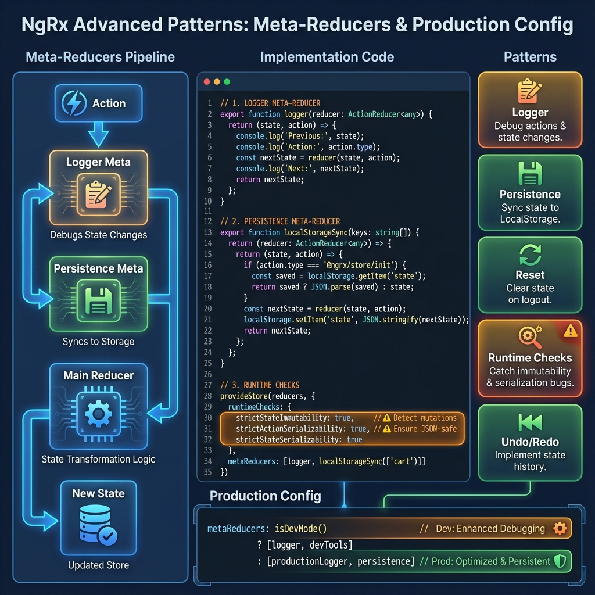

# ⚡ Advanced Patterns & Production Setup

> **💡 Lightbulb Moment**: Advanced patterns are like **safety rails and power tools** for NgRx. They prevent bugs, add debugging capabilities, and handle cross-cutting concerns!




## 📋 Table of Contents
- [1. 🎯 What Problem Does It Solve?](#1--what-problem-does-it-solve)
  - [The Problem: Basic NgRx Isn't Production-Ready](#the-problem-basic-ngrx-isnt-production-ready)
  - [How Advanced Patterns Solve This](#how-advanced-patterns-solve-this)
- [2. ⚙️ Meta-Reducers](#2--meta-reducers)
  - [What Are Meta-Reducers?](#what-are-meta-reducers)
  - [1. Logger Meta-Reducer](#1-logger-meta-reducer)
  - [2. State Persistence Meta-Reducer](#2-state-persistence-meta-reducer)
  - [3. State Reset Meta-Reducer](#3-state-reset-meta-reducer)
  - [4. Hydration Meta-Reducer (SSR)](#4-hydration-meta-reducer-ssr)
  - [5. Undo/Redo Meta-Reducer](#5-undoredo-meta-reducer)
- [3. 🔍 Runtime Checks](#3--runtime-checks)
  - [Configuration](#configuration)
  - [What Each Check Does](#what-each-check-does)
  - [Environment-Specific Configuration](#environment-specific-configuration)
- [4. 🌍 Real-World Use Cases](#4--real-world-use-cases)
  - [1. Production Logging System](#1-production-logging-system)
  - [2. Cart Persistence](#2-cart-persistence)
  - [3. Analytics Tracking](#3-analytics-tracking)
  - [4. Feature Flag Validation](#4-feature-flag-validation)
  - [5. State Size Monitoring](#5-state-size-monitoring)
  - [6. Optimistic Update Rollback](#6-optimistic-update-rollback)
- [❓ Complete Interview Questions (20+)](#complete-interview-questions-20)
  - [Meta-Reducer Questions](#meta-reducer-questions)
  - [Runtime Checks Questions](#runtime-checks-questions)
  - [State Persistence Questions](#state-persistence-questions)
  - [Production Setup Questions](#production-setup-questions)
  - [Advanced Scenarios](#advanced-scenarios)
- [🧠 Quick Reference](#quick-reference)
  - [Essential Meta-Reducers](#essential-meta-reducers)
  - [Production Config](#production-config)

---
---

## 1. 🎯 What Problem Does It Solve?

### The Problem: Basic NgRx Isn't Production-Ready

**Without Advanced Patterns:**
```typescript
// Problem 1: No logging - hard to debug
// Problem 2: No mutation detection - bugs slip through
// Problem 3: State lost on refresh
// Problem 4: No global reset on logout
// Problem 5: Non-serializable data causes DevTools issues
```

**Real Production Issues:**
1. **Silent Mutations**: State mutated, UI doesn't update, no error thrown
2. **No Audit Trail**: Can't see what happened before bug occurred
3. **Lost State**: User refreshes, loses cart/form data
4. **Security Leak**: Logout doesn't clear sensitive data
5. **DevTools Breaks**: Non-JSON data crashes time-travel

### How Advanced Patterns Solve This

| Problem | Solution | Pattern |
|---------|----------|---------|
| Silent mutations | Runtime immutability checks | `strictStateImmutability` |
| No audit trail | Action/state logging | Logger meta-reducer |
| Lost state on refresh | Persist to localStorage | Persistence meta-reducer |
| State not cleared on logout | Reset on specific action | Reset meta-reducer |
| DevTools breaks | Serialize actions/state | `strict ActionSerializability` |

---

## 2. ⚙️ Meta-Reducers

### What Are Meta-Reducers?

**Meta-reducer** = Higher-order function that wraps regular reducers.

```typescript
// Signature
type MetaReducer<T> = (reducer: ActionReducer<T>) => ActionReducer<T>;

// It receives a reducer and returns an enhanced reducer
```

### 1. Logger Meta-Reducer

```typescript
// meta-reducers/logger.meta-reducer.ts
import { ActionReducer } from '@ngrx/store';

export function logger(reducer: ActionReducer<any>): ActionReducer<any> {
    return (state, action) => {
        console.group(action.type);
        console.log('Previous State:', state);
        console.log('Action:', action);
        
        const nextState = reducer(state, action);  // Call original reducer
        
        console.log('Next State:', nextState);
        console.groupEnd();
        
        return nextState;
    };
}

// Register
provideStore(reducers, {
    metaReducers: [logger]
});
```

**Use Case**: Development debugging, audit logs

---

### 2. State Persistence Meta-Reducer

```typescript
// meta-reducers/local-storage-sync.meta-reducer.ts
export function localStorageSync(keys: string[]) {
    return (reducer: ActionReducer<any>): ActionReducer<any> => {
        return (state, action) => {
            // Load state from localStorage on init
            if (action.type === '@ngrx/store/init') {
                const savedState = localStorage.getItem('app-state');
                return savedState ? JSON.parse(savedState) : reducer(state, action);
            }
            
            // Run normal reducer
            const nextState = reducer(state, action);
            
            // Save specified keys to localStorage
            const toSave = keys.reduce((acc, key) => {
                acc[key] = nextState[key];
                return acc;
            }, {} as any);
            
            localStorage.setItem('app-state', JSON.stringify(toSave));
            
            return nextState;
        };
    };
}

// Usage
provideStore(reducers, {
    metaReducers: [localStorageSync(['cart', 'preferences'])]
});
```

**Use Case**: Persist cart, user preferences, form drafts

---

### 3. State Reset Meta-Reducer

```typescript
// meta-reducers/clear-state.meta-reducer.ts
export function clearState(reducer: ActionReducer<any>): ActionReducer<any> {
    return (state, action) => {
        if (action.type === '[Auth] Logout') {
            // Reset to initial state, but keep some data
            state = {
                ...undefined,  // Clear all state
                router: state?.router  // Keep router state
            };
        }
        return reducer(state, action);
    };
}
```

**Use Case**: Clear sensitive data on logout

---

### 4. Hydration Meta-Reducer (SSR)

```typescript
// meta-reducers/hydration.meta-reducer.ts
export function hydration(reducer: ActionReducer<any>): ActionReducer<any> {
    return (state, action) => {
        if (action.type === '@ngrx/store/init') {
            // Check if running in browser
            if (typeof window !== 'undefined') {
                // Get state transferred from server
                const serverState = (window as any).__STATE__;
                if (serverState) {
                    return { ...state, ...serverState };
                }
            }
        }
        return reducer(state, action);
    };
}
```

**Use Case**: Server-side rendering, faster initial load

---

### 5. Undo/Redo Meta-Reducer

```typescript
// meta-reducers/undo-redo.meta-reducer.ts
let history: any[] = [];
let historyIndex = -1;

export function undoRedo(reducer: ActionReducer<any>): ActionReducer<any> {
    return (state, action) => {
        if (action.type === '[History] Undo' && historyIndex > 0) {
            historyIndex--;
            return history[historyIndex];
        }
        
        if (action.type === '[History] Redo' && historyIndex < history.length - 1) {
            historyIndex++;
            return history[historyIndex];
        }
        
        const nextState = reducer(state, action);
        
        // Save state to history (skip undo/redo actions)
        if (!action.type.startsWith('[History]')) {
            history = history.slice(0, historyIndex + 1);
            history.push(nextState);
            historyIndex = history.length - 1;
        }
        
        return nextState;
    };
}
```

**Use Case**: Canvas apps, rich text editors

---

## 3. 🔍 Runtime Checks

### Configuration

```typescript
import { provideStore } from '@ngrx/store';

provideStore(reducers, {
    runtimeChecks: {
        // Detect state mutations
        strictStateImmutability: true,
        
        // Detect action mutations
        strictActionImmutability: true,
        
        // Ensure actions are serializable (JSON-compatible)
        strictActionSerializability: true,
        
        // Ensure state is serializable
        strictStateSerializability: true,
        
        // Prevent dispatching in reducers
        strictActionWithinNgZone: true,
        
        // Prevent type-based actions
        strictActionTypeUniqueness: true
    }
})
```

### What Each Check Does

**1. `strictStateImmutability`**
```typescript
// ❌ CAUGHT: Mutation detected
on(addItem, (state, { item }) => {
    state.items.push(item);  // ERROR: Mutating state!
    return state;
})

// ✅ CORRECT
on(addItem, (state, { item }) => ({
    ...state,
    items: [...state.items, item]
}))
```

**2. `strictActionImmutability`**
```typescript
// ❌ CAUGHT: Mutating action
store.dispatch(addItem({ item }));
item.name = 'Changed';  // ERROR: Mutating action payload!
```

**3. `strictActionSerializability`**
```typescript
// ❌ CAUGHT: Non-serializable action
store.dispatch(saveUser({ 
    user,
    callback: () => {}  // ERROR: Functions not serializable!
}));

// ✅ CORRECT: Use Effects for callbacks
```

**4. `strictStateSerializability`**
```typescript
// ❌ CAUGHT: Non-serializable state
interface State {
    data: any;
    timestamp: Date;  // ERROR: Date is not JSON-serializable!
}

// ✅ CORRECT: Use ISO string
interface State {
    data: any;
    timestamp: string;  // Store as ISO string
}
```

### Environment-Specific Configuration

```typescript
import { isDevMode } from '@angular/core';

provideStore(reducers, {
    runtimeChecks: {
        strictStateImmutability: isDevMode(),  // Only in dev
        strictActionImmutability: isDevMode(),
        strictActionSerializability: isDevMode(),
        strictStateSerializability: false,  // Expensive, disable
        strictActionWithinNgZone: isDevMode(),
        strictActionTypeUniqueness: isDevMode()
    }
})
```

---

## 4. 🌍 Real-World Use Cases

### 1. Production Logging System

```typescript
function productionLogger(reducer: ActionReducer<any>): ActionReducer<any> {
    return (state, action) => {
        const nextState = reducer(state, action);
        
        // Send critical actions to logging service
        if (action.type.includes('Error') || action.type.includes('Failure')) {
            loggingService.error({
                action: action.type,
                payload: action,
                state: nextState,
                timestamp: new Date().toISOString()
            });
        }
        
        return nextState;
    };
}
```

### 2. Cart Persistence

```typescript
function persistCart(reducer: ActionReducer<any>): ActionReducer<any> {
    return (state, action) => {
        const nextState = reducer(state, action);
        
        // Save cart to localStorage whenever it changes
        if (nextState.cart !== state?.cart) {
            localStorage.setItem('cart', JSON.stringify(nextState.cart));
        }
        
        return nextState;
    };
}
```

### 3. Analytics Tracking

```typescript
function analyticsTracker(reducer: ActionReducer<any>): ActionReducer<any> {
    return (state, action) => {
        // Track specific user actions
        if (action.type.startsWith('[Product]') || action.type.startsWith('[Cart]')) {
            analytics.track(action.type, action);
        }
        
        return reducer(state, action);
    };
}
```

### 4. Feature Flag Validation

```typescript
function featureFlagCheck(reducer: ActionReducer<any>): ActionReducer<any> {
    return (state, action) => {
        // Block actions if feature is disabled
        if (action.type.startsWith('[NewFeature]') && !featureFlags.newFeature) {
            console.warn('Feature disabled:', action.type);
            return state;  // Don't process
        }
        
        return reducer(state, action);
    };
}
```

### 5. State Size Monitoring

```typescript
function stateSizeMonitor(reducer: ActionReducer<any>): ActionReducer<any> {
    return (state, action) => {
        const nextState = reducer(state, action);
        
        const size = JSON.stringify(nextState).length;
        if (size > 1000000) {  // 1MB
            console.warn('State size exceeded 1MB:', size);
        }
        
        return nextState;
    };
}
```

### 6. Optimistic Update Rollback

```typescript
function optimisticRollback(reducer: ActionReducer<any>): ActionReducer<any> {
    let lastStableState: any = null;
    
    return (state, action) => {
        // Save state before optimistic update
        if (action.type.includes('Optimistic')) {
            lastStableState = state;
        }
        
        // Rollback on failure
        if (action.type.includes('Failure') && lastStableState) {
            return lastStableState;
        }
        
        const nextState = reducer(state, action);
        
        // Clear saved state on success
        if (action.type.includes('Success')) {
            lastStableState = null;
        }
        
        return nextState;
    };
}
```

---

## ❓ Complete Interview Questions (20+)

### Meta-Reducer Questions

**Q1: What is a meta-reducer?**
> A: Higher-order function that wraps a reducer. Receives a reducer, returns an enhanced reducer.

**Q2: When should you use meta-reducers?**
> A: For cross-cutting concerns:
> - Logging
> - State persistence
> - Global state reset
> - Analytics
> - Hydration

**Q3: How do you register meta-reducers?**
> A:
> ```typescript
> provideStore(reducers, {
>     metaReducers: [logger, persistence]
> });
> ```

**Q4: Can meta-reducers modify actions?**
> A: No! They can observe actions but shouldn't modify them. Modify state instead.

**Q5: Do meta-reducers run in order?**
> A: Yes! They compose left-to-right. First in array runs first.

---

### Runtime Checks Questions

**Q6: What is `strictStateImmutability`?**
> A: Development check that detects state mutations. Throws error if state is modified directly.

**Q7: Should runtime checks be enabled in production?**
> A: No! They're expensive. Use `isDevMode()` to enable only in development.

**Q8: What happens if action contains a function?**
> A: `strictActionSerializability` throws error. Actions must be JSON-serializable for DevTools.

**Q9: How do you store Dates in state?**
> A: As ISO strings:
> ```typescript
> timestamp: new Date().toISOString()
> ```

**Q10: What is `strictActionWithinNgZone`?**
> A: Ensures actions aren't dispatched within NgZone (prevents infinite loops).

---

### State Persistence Questions

**Q11: How do you persist state to localStorage?**
> A: Use persistence meta-reducer:
> ```typescript
> function persist(reducer) {
>     return (state, action) => {
>         const next = reducer(state, action);
>         localStorage.setItem('state', JSON.stringify(next));
>         return next;
>     };
> }
> ```

**Q12: Should you persist entire state?**
> A: No! Only persist necessary slices (cart, preferences). Exclude sensitive data.

**Q13: How do you restore state on app init?**
> A: Check for `@ngrx/store/init` action:
> ```typescript
> if (action.type === '@ngrx/store/init') {
>     return JSON.parse(localStorage.getItem('state'));
> }
> ```

**Q14: What if localStorage is full?**
> A: Catch and handle quota errors:
> ```typescript
> try {
>     localStorage.setItem('state', json);
> } catch (e) {
>     console.error('Storage quota exceeded');
> }
> ```

---

### Production Setup Questions

**Q15: What meta-reducers should production apps have?**
> A:
> - Logger (errors only to backend)
> - Persistence (cart, preferences)
> - Reset on logout
> - Analytics tracker

**Q16: How do you configure NgRx for production?**
> A:
> ```typescript
> provideStore(reducers, {
>     metaReducers: isDevMode() ? [logger] : [productionLogger],
>     runtimeChecks: {
>         strictStateImmutability: isDevMode(),
>         strictActionImmutability: isDevMode()
>     }
> })
> ```

**Q17: Should you log all actions in production?**
> A: No! Only errors/critical events. Full logging is expensive and leaks data.

---

### Advanced Scenarios

**Q18: How do you implement undo/redo?**
> A: Meta-reducer that stores state history:
> ```typescript
> let history = [];
> if (action.type === 'UNDO') return history.pop();
> history.push(nextState);
> ```

**Q19: How do you reset state on logout?**
> A:
> ```typescript
> function clearState(reducer) {
>     return (state, action) => {
>         if (action.type === 'LOGOUT') state = undefined;
>         return reducer(state, action);
>     };
> }
> ```

**Q20: Can meta-reducers dispatch actions?**
> A: No! Meta-reducers are synchronous. Use Effects to dispatch actions.

**Q21: How do you debug meta-reducers?**
> A: Add console.logs, check order in DevTools, verify they're registered.

**Q22: Can you conditionally apply meta-reducers?**
> A: Yes:
> ```typescript
> metaReducers: isDevMode() ? [logger] : []
> ```

**Q23: How do you test meta-reducers?**
> A:
> ```typescript
> it('should log actions', () => {
>     const spy = spyOn(console, 'log');
>     const metaReducer = logger(mockReducer);
>     metaReducer(state, action);
>     expect(spy).toHaveBeenCalled();
> });
> ```

**Q24: What's the performance impact of meta-reducers?**
> A: Each meta-reducer adds overhead. Keep them lightweight. Disable heavy ones in production.

**Q25: Can you have feature-specific meta-reducers?**
> A: No, meta-reducers are global. For feature-specific logic, use feature reducers or Effects.

---

## 🧠 Quick Reference

### Essential Meta-Reducers
```typescript
// Logger (dev only)
function logger(reducer) { ... }

// Persistence (specific keys)
function persist(keys: string[]) { ... }

// Reset on logout
function clearState(reducer) { ... }
```

### Production Config
```typescript
provideStore(reducers, {
    metaReducers: [
        isDevMode() ? logger : productionLogger,
        persist(['cart', 'preferences']),
        clearState
    ],
    runtimeChecks: {
        strictStateImmutability: isDevMode(),
        strictActionImmutability: isDevMode(),
        strictActionSerializability: isDevMode()
    }
})
```

---

> **Key Takeaway**: Advanced patterns make NgRx production-ready. Meta-reducers handle cross-cutting concerns, runtime checks catch bugs early, and proper configuration ensures performance and security!
