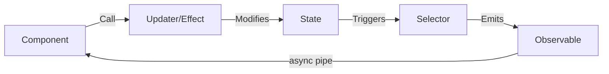

# 🎯 Component Store (@ngrx/component-store)

> **💡 Lightbulb Moment**: Component Store is **NgRx for local component state**. Like having a mini-Redux store that lives and dies with your component!


## 📋 Table of Contents
- [📑 Index](#index)
- [🔍 Implementation Architecture](#implementation-architecture)
  - [How Component Store Is Structured](#how-component-store-is-structured)
  - [Key Implementation Parts](#key-implementation-parts)
  - [Data Flow](#data-flow)
- [🗄️ The Personal Assistant Analogy](#the-personal-assistant-analogy)
- [🧠 Mind Map](#mind-map)
- [📚 Key Classes & Types](#key-classes--types)
  - [1. `ComponentStore<T>`](#1-componentstoret)
  - [2. `select()` Method](#2-select-method)
  - [3. `updater()` Method](#3-updater-method)
  - [4. `effect()` Method](#4-effect-method)
  - [5. `tapResponse()` Utility](#5-tapresponse-utility)
- [1. 🎯 What Problem Does It Solve?](#1--what-problem-does-it-solve)
  - [The Problem: Service-Based State is Messy](#the-problem-service-based-state-is-messy)
  - [How Component Store Solves This](#how-component-store-solves-this)
- [2. 🚀 Core API](#2--core-api)
  - [1. Initialization](#1-initialization)
  - [2. Selectors](#2-selectors)
  - [3. Updaters](#3-updaters)
  - [4. Effects](#4-effects)
  - [5. Lifecycle](#5-lifecycle)
- [3. 🌍 Real-World Use Cases](#3--real-world-use-cases)
  - [1. Modal State Management](#1-modal-state-management)
  - [2. Multi-Step Wizard](#2-multi-step-wizard)
  - [3. Form State with Validation](#3-form-state-with-validation)
  - [4. Accordion/Collapse State](#4-accordioncollapse-state)
  - [5. Pagination State](#5-pagination-state)
  - [6. Search/Filter State](#6-searchfilter-state)
- [❓ Complete Interview Questions (25+)](#complete-interview-questions-25)
  - [Basic Conceptual Questions](#basic-conceptual-questions)
  - [API Questions](#api-questions)
  - [Lifecycle Questions](#lifecycle-questions)
  - [Pattern Questions](#pattern-questions)
  - [Testing Questions](#testing-questions)
  - [Advanced Questions](#advanced-questions)
- [🧠 Quick Reference](#quick-reference)
  - [Minimal Example](#minimal-example)
  - [When to Use](#when-to-use)

---
## 📑 Index
1. [🎯 What Problem Does This Solve?](#1--what-problem-does-it-solve)
2. [🔍 Implementation Architecture](#-implementation-architecture)
3. [🚀 Core API](#2--core-api)
4. [🗄️ The Personal Assistant Analogy](#-the-personal-assistant-analogy)
5. [🧠 Mind Map](#-mind-map)
6. [🌍 Real-World Use Cases](#3--real-world-use-cases)
7. [📚 Key Classes & Types](#-key-classes--types)
8. [❓ Interview Questions](#-complete-interview-questions-25)

---

## 🔍 Implementation Architecture

### How Component Store Is Structured

```
┌─────────────────────────────────────────────┐
│       ModalStore (ComponentStore)           │
├─────────────────────────────────────────────┤
│  STATE (Interface)                          │
│  ├─ isOpen: boolean                         │
│  ├─ title: string                           │
│  ├─ content: string                         │
│  ├─ confirmText: string                     │
│  └─ loading: boolean                        │
├─────────────────────────────────────────────┤
│  SELECTORS (this.select)                    │
│  ├─ isOpen$    → Observable<boolean>        │
│  ├─ title$     → Observable<string>         │
│  └─ vm$        → Combined ViewModel         │
├─────────────────────────────────────────────┤
│  UPDATERS (this.updater)                    │
│  ├─ openModal(config)  → Updates state      │
│  ├─ closeModal()       → Resets isOpen      │
│  └─ setLoading(bool)   → Sets loading       │
├─────────────────────────────────────────────┤
│  EFFECTS (this.effect)                      │
│  └─ confirm()  → Async operation            │
└─────────────────────────────────────────────┘
```

### Key Implementation Parts

| Part | Purpose | Method |
|------|---------|--------|
| **State Interface** | Type-safe state shape | TypeScript interface |
| **`extends ComponentStore<T>`** | Inherits reactive capabilities | Class extension |
| **`super(initialState)`** | Sets initial state | Constructor call |
| **`this.select()`** | Creates reactive selectors | Returns `Observable<T>` |
| **`this.updater()`** | Synchronous state mutations | Returns void |
| **`this.effect()`** | Async side effects | Returns subscription |

### Data Flow



---

## 🗄️ The Personal Assistant Analogy

Think of ComponentStore like a **Personal Assistant** that only works for one person:

| ComponentStore | Personal Assistant |
|---------------|-------------------|
| **ComponentStore class** | The assistant hired for YOU |
| **State** | The assistant's notepad/memory |
| **Selectors** | Asking "What's my schedule?" |
| **Updaters** | "Update my calendar" commands |
| **Effects** | "Book a flight" (async task) |
| **Component lifecycle** | Assistant quits when you leave |

> **Key Insight**: Unlike a global store (company-wide database), ComponentStore is YOUR personal assistant that remembers YOUR stuff and leaves when you're done!

---

## 🧠 Mind Map

```mermaid
mindmap
  root((Component Store))
    Initialization
      super(initialState)
      Lazy: setState()
    Selectors
      this.select()
      Composed selectors
      ViewModel pattern
    Updaters
      this.updater()
      patchState()
      Immutable updates
    Effects
      this.effect()
      RxJS operators
      tapResponse()
    Lifecycle
      providers: []
      Auto cleanup
      OnDestroy
```

---

## 📚 Key Classes & Types

### 1. `ComponentStore<T>`
Base class that provides all reactive functionality.

```typescript
class MyStore extends ComponentStore<State> {
  constructor() {
    super(initialState);  // Required!
  }
}
```

### 2. `select()` Method
Creates memoized selectors that return Observables.

```typescript
// Simple
readonly count$ = this.select(s => s.count);

// Composed
readonly vm$ = this.select({
  count: this.count$,
  loading: this.loading$
});
```

### 3. `updater()` Method
Creates synchronous state update functions.

```typescript
readonly increment = this.updater((state, amount: number) => ({
  ...state,
  count: state.count + amount
}));
```

### 4. `effect()` Method
Creates async side-effect handlers.

```typescript
readonly load = this.effect<number>(id$ => 
  id$.pipe(
    switchMap(id => this.api.get(id)),
    tap(data => this.patchState({ data }))
  )
);
```

### 5. `tapResponse()` Utility
Helper for handling success/error in effects.

```typescript
import { tapResponse } from '@ngrx/component-store';

switchMap(id => this.api.get(id).pipe(
  tapResponse(
    data => this.setData(data),
    error => this.setError(error)
  )
))
```

---

## 1. 🎯 What Problem Does It Solve?

### The Problem: Service-Based State is Messy

**Without Component Store:**
```typescript
@Component({...})
export class WizardComponent implements OnDestroy {
    // Manual state management
    private currentStepSubject = new BehaviorSubject<number>(1);
    private dataSubject = new BehaviorSubject<WizardData>({});
    private loadingSubject = new BehaviorSubject<boolean>(false);
    
    currentStep$ = this.currentStepSubject.asObservable();
    data$ = this.dataSubject.asObservable();
    loading$ = this.loadingSubject.asObservable();
    
    private subscriptions = new Subscription();
    
    ngOnDestroy() {
        this.subscriptions.unsubscribe();  // Manual cleanup!
    }
    
    nextStep() {
        const current = this.currentStepSubject.value;
        this.currentStepSubject.next(current + 1);  // Manual state update
    }
}
```

**Problems:**
1. **Boilerplate Hell**: BehaviorSubject for every property
2. **Manual Cleanup**: Must unsubscribe subscriptions
3. **No Patterns**: No standard for state updates
4. **Hard to Test**: Need to mock all subjects
5. **Complex Logic**: No built-in effects pattern

### How Component Store Solves This

**With Component Store:**
```typescript
interface WizardState {
    currentStep: number;
    data: WizardData;
    loading: boolean;
}

class WizardStore extends ComponentStore<WizardState> {
    constructor() {
        super({ currentStep: 1, data: {}, loading: false });
    }
    
    // Selectors
    readonly currentStep$ = this.select(s => s.currentStep);
    readonly data$ = this.select(s => s.data);
    readonly loading$ = this.select(s => s.loading);
    
    // Updaters
    readonly nextStep = this.updater(s => ({ ...s, currentStep: s.currentStep + 1 }));
    readonly updateData = this.updater((s, data: Partial<WizardData>) => ({ 
        ...s, data: { ...s.data, ...data } 
    }));
    
    // Effects
    readonly saveStep = this.effect<void>(trigger$ =>
        trigger$.pipe(
            tap(() => this.patchState({ loading: true })),
            switchMap(() => this.api.save(this.get().data).pipe(
                tap(() => this.nextStep()),
                tap(() => this.patchState({ loading: false }))
            ))
        )
    );
}

@Component({
    providers: [WizardStore]  // Auto cleanup!
})
export class WizardComponent {
    constructor(public store: WizardStore) {}
}
```

| Problem | Component Store Solution |
|---------|-------------------------|
| Manual BehaviorSubjects | Built-in reactive state |
| Manual cleanup | Auto-destroyed with component |
| No update pattern | Updaters (immutable by default) |
| Hard to test | Easy to mock ComponentStore |
| No effects | Built-in effect() method |

---

## 2. 🚀 Core API

### 1. Initialization

```typescript
interface State {
    count: number;
    name: string;
}

class MyStore extends ComponentStore<State> {
    constructor() {
        super({ count: 0, name: '' });  // Initial state
    }
    
    // Or lazy initialization
    constructor() {
        super();  // Empty
    }
    
    init(initialState: State) {
        this.setState(initialState);
    }
}
```

### 2. Selectors

```typescript
// Simple selector
readonly count$ = this.select(state => state.count);

// Composed selector
readonly doubled$ = this.select(
    this.count$,
    count => count * 2
);

// Multi-selector
readonly vm$ = this.select({
    count: this.count$,
    doubled: this.doubled$,
    name: this.select(s => s.name)
});

// Selector with parameters (less common)
selectById = (id: string) => this.select(
    state => state.items.find(i => i.id === id)
);
```

### 3. Updaters

```typescript
// Simple updater
readonly increment = this.updater(state => ({
    ...state,
    count: state.count + 1
}));

// Updater with payload
readonly setName = this.updater((state, name: string) => ({
    ...state,
    name
}));

// Call updaters
this.increment();
this.setName('John');

// Or use patchState for simple updates
incrementByPatch() {
    this.patchState({ count: this.get().count + 1 });
}
```

### 4. Effects

```typescript
// Effect with trigger
readonly loadData = this.effect<number>(id$ =>
    id$.pipe(
        tap(() => this.patchState({ loading: true })),
        switchMap(id => this.api.get(id).pipe(
            tapResponse(
                data => this.patchState({ data, loading: false }),
                error => this.patchState({ error, loading: false })
            )
        ))
    )
);

// Call effect
this.loadData(123);

// Effect without parameters
readonly autoSave = this.effect(trigger$ =>
    trigger$.pipe(
        debounceTime(1000),
        switchMap(() => this.api.save(this.get()))
    )
);

// Trigger
this.autoSave();
```

### 5. Lifecycle

```typescript
// Component provides store
@Component({
    providers: [MyStore]  // New instance per component
})
export class MyComponent implements OnInit {
    constructor(private store: MyStore) {}
    
    ngOnInit() {
        this.store.setState({ count: 0 });
    }
    
    // Auto-cleanup on component destroy!
}
```

---

## 3. 🌍 Real-World Use Cases

### 1. Modal State Management

```typescript
interface ModalState {
    isOpen: boolean;
    data: any;
    loading: boolean;
}

class ModalStore extends ComponentStore<ModalState> {
    constructor() {
        super({ isOpen: false, data: null, loading: false });
    }
    
    readonly isOpen$ = this.select(s => s.isOpen);
    readonly data$ = this.select(s => s.data);
    
    readonly open = this.updater((s, data: any) => ({ ...s, isOpen: true, data }));
    readonly close = this.updater(s => ({ ...s, isOpen: false, data: null }));
    
    readonly confirm = this.effect<void>(trigger$ =>
        trigger$.pipe(
            tap(() => this.patchState({ loading: true })),
            switchMap(() => this.api.confirm(this.get().data).pipe(
                tap(() => this.close())
            ))
        )
    );
}
```

### 2. Multi-Step Wizard

```typescript
interface WizardState {
    step: number;
    steps: StepData[];
    canProceed: boolean;
}

class WizardStore extends ComponentStore<WizardState> {
    readonly currentStep$ = this.select(s => s.step);
    readonly canProceed$ = this.select(s => s.canProceed);
    
    readonly nextStep = this.updater(s => ({
        ...s,
        step: Math.min(s.step + 1, s.steps.length)
    }));
    
    readonly prevStep = this.updater(s => ({
        ...s,
        step: Math.max(s.step - 1, 1)
    }));
    
    readonly validateStep = this.effect<void>(trigger$ =>
        trigger$.pipe(
            switchMap(() => this.validator.validate(this.get().steps[this.get().step]).pipe(
                tap(valid => this.patchState({ canProceed: valid }))
            ))
        )
    );
}
```

### 3. Form State with Validation

```typescript
interface FormState {
    value: FormValue;
    errors: ValidationErrors;
    touched: boolean;
    dirty: boolean;
}

class FormStore extends ComponentStore<FormState> {
    readonly errors$ = this.select(s => s.errors);
    readonly isValid$ = this.select(s => Object.keys(s.errors).length === 0);
    
    readonly updateField = this.updater((s, field: Partial<FormValue>) => ({
        ...s,
        value: { ...s.value, ...field },
        dirty: true
    }));
    
    readonly validate = this.effect<void>(trigger$ =>
        trigger$.pipe(
            debounceTime(300),
            switchMap(() => this.validator.validate(this.get().value).pipe(
                tap(errors => this.patchState({ errors }))
            ))
        )
    );
}
```

### 4. Accordion/Collapse State

```typescript
interface AccordionState {
    openPanels: Set<string>;
    exclusive: boolean;
}

class AccordionStore extends ComponentStore<AccordionState> {
    readonly isOpen = (id: string) => this.select(s => s.openPanels.has(id));
    
    readonly toggle = this.updater((s, id: string) => {
        const openPanels = new Set(s.openPanels);
        if (s.exclusive) {
            openPanels.clear();
        }
        openPanels.has(id) ? openPanels.delete(id) : openPanels.add(id);
        return { ...s, openPanels };
    });
}
```

### 5. Pagination State

```typescript
interface PaginationState {
    page: number;
    pageSize: number;
    total: number;
    items: any[];
}

class PaginationStore extends ComponentStore<PaginationState> {
    readonly page$ = this.select(s => s.page);
    readonly pageSize$ = this.select(s => s.pageSize);
    readonly items$ = this.select(s => s.items);
    
    readonly totalPages$ = this.select(
        this.select(s => s.total),
        this.pageSize$,
        (total, pageSize) => Math.ceil(total / pageSize)
    );
    
    readonly loadPage = this.effect<number>(page$ =>
        page$.pipe(
            tap(page => this.patchState({ page })),
            switchMap(page => this.api.getPage(page, this.get().pageSize).pipe(
                tap(result => this.patchState({ 
                    items: result.items,
                    total: result.total 
                }))
            ))
        )
    );
}
```

### 6. Search/Filter State

```typescript
interface SearchState {
    query: string;
    filters: Filters;
    results: Item[];
    loading: boolean;
}

class SearchStore extends ComponentStore<SearchState> {
    readonly results$ = this.select(s => s.results);
    readonly loading$ = this.select(s => s.loading);
    
    readonly search = this.effect<string>(query$ =>
        query$.pipe(
            debounceTime(300),
            distinctUntilChanged(),
            tap(() => this.patchState({ loading: true })),
            switchMap(query => this.api.search(query).pipe(
                tap(results => this.patchState({ results, loading: false }))
            ))
        )
    );
}
```

---

## ❓ Complete Interview Questions (25+)

### Basic Conceptual Questions

**Q1: What is Component Store?**
> A: Local, reactive state management for individual components. Like NgRx Store but scoped to component lifecycle.

**Q2: When should you use Component Store vs Global Store?**
> A:
> - **Component Store**: Modals, wizards, forms, UI state
> - **Global Store**: User session, shared data, cross-component state

**Q3: Does Component Store require @ngrx/store?**
> A: No! Component Store is standalone. Can be used without global store.

**Q4: How is Component Store cleaned up?**
> A: Automatically destroyed when component is destroyed. No manual cleanup needed.

**Q5: Can you use Component Store with global store?**
> A: Yes! Use both. Global for shared data, Component Store for local UI state.

---

### API Questions

**Q6: What are the core methods of Component Store?**
> A:
> - `select()` - Create selectors
> - `updater()` - Update state
> - `effect()` - Side effects
> - `setState()` / `patchState()` - Direct state updates
> - `get()` - Get current state

**Q7: What's the difference between `setState` and `patchState`?**
> A:
> - `setState(newState)` - Replaces entire state
> - `patchState(partial)` - Merges into existing state

**Q8: How do you create a selector?**
> A:
> ```typescript
> readonly count$ = this.select(state => state.count);
> ```

**Q9: How do you create an updater?**
> A:
> ```typescript
> readonly increment = this.updater(state => ({
>     ...state,
>     count: state.count + 1
> }));
> ```

**Q10: How do you create an effect?**
> A:
> ```typescript
> readonly load = this.effect<number>(id$ =>
>     id$.pipe(switchMap(id => api.get(id)))
> );
> ```

---

### Lifecycle Questions

**Q11: How do you initialize Component Store?**
> A: In constructor:
> ```typescript
> constructor() {
>     super(initialState);
> }
> ```

**Q12: Can Component Store be lazy-initialized?**
> A: Yes:
> ```typescript
> constructor() { super(); }
> init(data: State) { this.setState(data); }
> ```

**Q13: How do you provide Component Store?**
> A: In component providers:
> ```typescript
> @Component({ providers: [MyStore] })
> ```

**Q14: What happens if you use Component Store in a service?**
> A: It works, but you lose automatic cleanup. Must call `ngOnDestroy` manually.

---

### Pattern Questions

**Q15: How do you handle async data loading?**
> A:
> ```typescript
> readonly load = this.effect<void>(trigger$ =>
>     trigger$.pipe(
>         tap(() => this.patchState({ loading: true })),
>         switchMap(() => api.load().pipe(
>             tapResponse(
>                 data => this.patchState({ data, loading: false }),
>                 error => this.patchState({ error, loading: false })
>             )
>         ))
>     )
> );
> ```

**Q16: How do you create a ViewModel selector?**
> A:
> ```typescript
> readonly vm$ = this.select({
>     data: this.data$,
>     loading: this.loading$,
>     error: this.error$
> });
> ```

**Q17: How do you debounce user input?**
> A:
> ```typescript
> readonly search = this.effect<string>(query$ =>
>     query$.pipe(
>         debounceTime(300),
>         switchMap(q => api.search(q))
>     )
> );
> ```

---

### Testing Questions

**Q18: How do you test Component Store?**
> A:
> ```typescript
> it('should increment', () => {
>     const store = new CounterStore();
>     store.increment();
>     expect(store.get()).toEqual({ count: 1 });
> });
> ```

**Q19: How do you test selectors?**
> A:
> ```typescript
> it('should select count', (done) => {
>     const store = new CounterStore();
>     store.count$.subscribe(count => {
>         expect(count).toBe(0);
>         done();
>     });
> });
> ```

**Q20: How do you test effects?**
> A: Mock dependencies:
> ```typescript
> const apiMock = { load: () => of(data) };
> const store = new MyStore(apiMock);
> store.load();
> // Assert state changed
> ```

---

### Advanced Questions

**Q21: Can Component Store communicate with global store?**
> A: Yes:
> ```typescript
> class MyStore extends ComponentStore<State> {
>     constructor(private globalStore: Store) {
>         super(initialState);
>     }
>     
>     readonly sync = this.effect<void>(trigger$ =>
>         trigger$.pipe(
>             tap(() => this.globalStore.dispatch(action({ data: this.get() })))
>         )
>     );
> }
> ```

**Q22: Can you have multiple Component Stores in one component?**
> A: Yes!
> ```typescript
> @Component({
>     providers: [FormStore, ValidationStore, UIStore]
> })
> ```

**Q23: How do you handle optimistic updates?**
> A:
> ```typescript
> readonly save = this.effect<Data>(data$ =>
>     data$.pipe(
>         tap(data => this.patchState({ data })),  // Optimistic
>         switchMap(data => api.save(data).pipe(
>             catchError(() => {
>                 this.patchState({ data: oldData });  // Rollback
>                 return EMPTY;
>             })
>         ))
>     )
> );
> ```

**Q24: Can you use Component Store with OnPush change detection?**
> A: Yes! Component Store is fully compatible with OnPush. Use async pipe.

**Q25: What's the performance impact of Component Store?**
> A: Minimal. Each store is lightweight. RxJS handles reactivity efficiently.

---

## 🧠 Quick Reference

### Minimal Example
```typescript
interface State { count: number; }

class CounterStore extends ComponentStore<State> {
    constructor() { super({ count: 0 }); }
    
    // Selector
    count$ = this.select(s => s.count);
    
    // Updater
    increment = this.updater(s => ({ count: s.count + 1 }));
}

@Component({ providers: [CounterStore] })
export class Component {
    constructor(public store: CounterStore) {}
}
```

### When to Use
- ✅ Modal/dialog state
- ✅ Multi-step wizards
- ✅ Form state management
- ✅ Accordion/collapse
- ✅ Pagination/search
- ❌ Shared cross-component data
- ❌ User authentication state

---

> **Key Takeaway**: Component Store = Local NgRx. Perfect for component-scoped reactive state without the complexity of global store!
