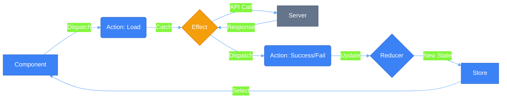
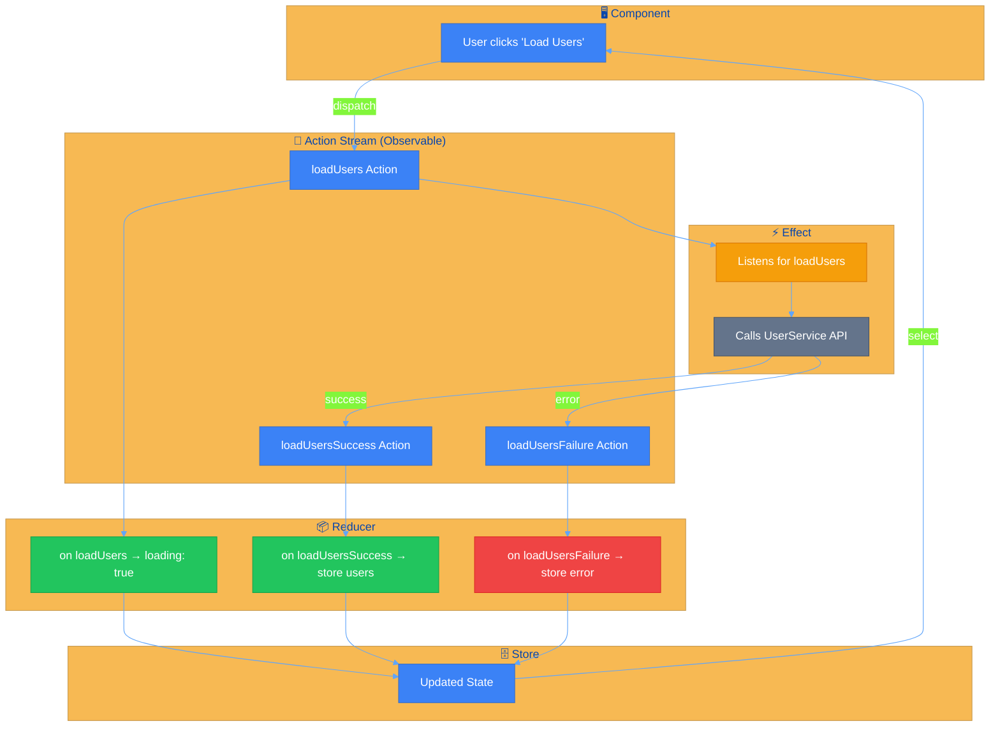
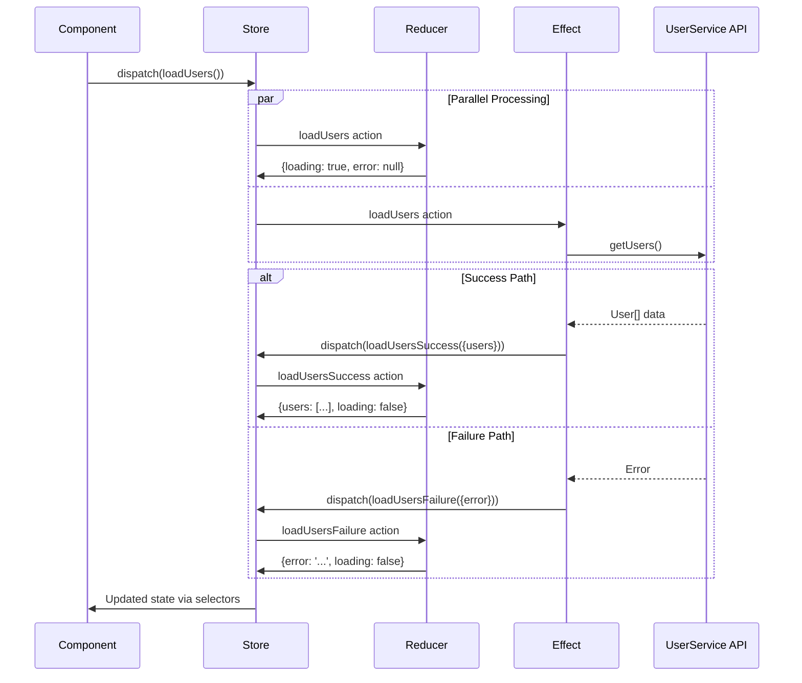

# ⚡ NgRx Effects (Async Operations)


## 📋 Table of Contents
- [📑 Index](#index)
- [🎯 What Problem Does This Solve?](#what-problem-does-this-solve)
  - [The Problem: Side Effects Break Pure Reducers](#the-problem-side-effects-break-pure-reducers)
  - [The Solution: NgRx Effects ⚡](#the-solution-ngrx-effects)
- [🔍 How It Works](#how-it-works)
  - [The Effects Lifecycle](#the-effects-lifecycle)
  - [Key Technical Rule: Inner Pipes](#key-technical-rule-inner-pipes)
- [🔗 How Effects Connect to Reducers](#how-effects-connect-to-reducers)
  - [The Complete Data Flow](#the-complete-data-flow)
  - [Step-by-Step Breakdown](#step-by-step-breakdown)
  - [Sequence Diagram: Timeline View](#sequence-diagram-timeline-view)
  - [Code Deep Dive: The Connection Points](#code-deep-dive-the-connection-points)
    - [1️⃣ Actions - The Shared Language](#1-actions---the-shared-language)
    - [2️⃣ Effect - Listens and Dispatches NEW Actions](#2-effect---listens-and-dispatches-new-actions)
    - [3️⃣ Reducer - Handles ALL Actions Independently](#3-reducer---handles-all-actions-independently)
  - [🔑 Key Insight: Parallel vs Sequential Processing](#key-insight-parallel-vs-sequential-processing)
  - [Why This Architecture?](#why-this-architecture)
- [🚀 Implementation](#implementation)
  - [1. Define the Action Triad](#1-define-the-action-triad)
  - [2. Create the Effect Class](#2-create-the-effect-class)
  - [3. Handle in Reducer](#3-handle-in-reducer)
- [🗄️ The Butler Analogy](#the-butler-analogy)
- [🧠 Mind Map](#mind-map)
- [📚 Key Classes & Types](#key-classes--types)
  - [1. `Actions$ (Observable<Action>)`](#1-actions-observableaction)
  - [2. `createEffect()`](#2-createeffect)
  - [3. `ofType()`](#3-oftype)
  - [4. RxJS Mapping Operators](#4-rxjs-mapping-operators)
- [🌍 Real-World Use Cases](#real-world-use-cases)
  - [1. **Auto-Save on Typing**](#1-auto-save-on-typing)
  - [2. **Global Error Notifications**](#2-global-error-notifications)
  - [3. **Logging & Analytics**](#3-logging--analytics)
  - [4. **Complex Initialization**](#4-complex-initialization)
  - [5. **Navigation Redirects**](#5-navigation-redirects)
- [❓ Interview Questions](#interview-questions)
  - [Basic (1-8)](#basic-1-8)
  - [Intermediate (9-16)](#intermediate-9-16)
  - [Advanced (17-25)](#advanced-17-25)

---
## 📑 Index
1. [🎯 What Problem Does This Solve?](#-what-problem-does-this-solve)
2. [🔍 How It Works](#-how-it-works)
3. [🔗 How Effects Connect to Reducers](#-how-effects-connect-to-reducers)
4. [🚀 Implementation](#-implementation)
5. [🗄️ The Butler Analogy](#-the-butler-analogy)
6. [🧠 Mind Map](#-mind-map)
7. [📚 Key Classes & Types](#-key-classes--apis)
8. [🌍 Real-World Use Cases](#-real-world-use-cases)
9. [❓ Interview Questions](#-interview-questions)

---

## 🎯 What Problem Does This Solve?

### The Problem: Side Effects Break Pure Reducers
In the Redux pattern, Reducers **must** be pure functions (synchronous, no side effects). However, real-world apps need to:
- Fetch data from APIs (Async)
- Interact with LocalStorage
- Handle Navigations
- Trigger Analytics
- Run Timers/Intervals

**❌ Without Effects**: Components become "Fat" by handling API logic, error handling, and dispatching multi-stage actions (loading, success, fail). This leads to code duplication and hard-to-test components.

### The Solution: NgRx Effects ⚡
Effects isolate side effects from components. The component simply says *"What"* happened (Dispatch), and the Effect handles the *"How"* (API call) and dispatches the result.

| Feature | Component (Without Effects) | Component (With Effects) |
|---------|---------------------------|--------------------------|
| **Logic** | Complex (API + Error handling) | Simple (Just Dispatch) |
| **Purity** | Impure | Pure (Declarative) |
| **Testing** | Hard (Mock HTTP + Store) | Easy (Test Dispatch only) |
| **Reusability**| Low | High |

---

## 🔍 How It Works

### The Effects Lifecycle
Effects listen to the **Action Stream**, perform a side effect, and (usually) return a new action.



### Key Technical Rule: Inner Pipes
API calls must use a nested pipe. If `catchError` is placed in the outer pipe, a single API failure will **kill the entire Effect stream** forever.

```typescript
// ✅ CORRECT: Inner pipe keeps effect alive
mergeMap(() => this.service.getData().pipe(
    map(data => success({data})),
    catchError(() => of(fail())) 
))
```

---

## 🔗 How Effects Connect to Reducers

> [!IMPORTANT]
> Effects and Reducers are **NOT directly connected**. They both independently listen to the **Action Stream**. Understanding this decoupled architecture is crucial for mastering NgRx.

### The Complete Data Flow

```
Component → dispatches → Action → Effect listens → calls Service → dispatches NEW Action → Reducer handles → updates State
```



### Step-by-Step Breakdown

| Step | What Happens | Who Handles | Code Reference |
|------|--------------|-------------|----------------|
| **1** | User clicks "Load Users" button | Component | `this.store.dispatch(loadUsers())` |
| **2** | `loadUsers` action is dispatched | Action Stream | Broadcasting to all listeners |
| **3** | Reducer catches `loadUsers` | **Reducer** | `on(loadUsers, state => ({...state, loading: true}))` |
| **4** | Effect catches `loadUsers` | **Effect** | `ofType(loadUsers)` |
| **5** | Effect calls API | UserService | `this.userService.getUsers()` |
| **6** | API returns data | HTTP Response | `users: User[]` |
| **7** | Effect dispatches `loadUsersSuccess` | **Effect** | `map(users => loadUsersSuccess({ users }))` |
| **8** | Reducer catches `loadUsersSuccess` | **Reducer** | `on(loadUsersSuccess, (state, { users }) => ...)` |
| **9** | State is updated | Store | `{ users: [...], loading: false }` |
| **10** | Component re-renders | Selectors | `this.users$ = this.store.select(selectAllUsers)` |

### Sequence Diagram: Timeline View



### Code Deep Dive: The Connection Points

#### 1️⃣ Actions - The Shared Language

```typescript
// user.actions.ts - SHARED by both Effect and Reducer
export const loadUsers = createAction('[User Page] Load Users');
export const loadUsersSuccess = createAction('[User API] Load Users Success', props<{ users: User[] }>());
export const loadUsersFailure = createAction('[User API] Load Users Failure', props<{ error: string }>());
```

> [!NOTE]
> Actions are the **only** connection between Effects and Reducers. They both import and use the same action creators.

#### 2️⃣ Effect - Listens and Dispatches NEW Actions

```typescript
// user.effects.ts
loadUsers$ = createEffect(() =>
    this.actions$.pipe(
        ofType(loadUsers),           // 👈 LISTENS for this action
        tap(() => console.log('Effects: Fetching users...')),
        mergeMap(() =>
            this.userService.getUsers().pipe(
                map(users => loadUsersSuccess({ users })),      // 👈 DISPATCHES new action
                catchError(error => of(loadUsersFailure({ error: error.message })))
            )
        )
    )
);
```

#### 3️⃣ Reducer - Handles ALL Actions Independently

```typescript
// user.reducer.ts
export const userReducer = createReducer(
    initialState,
    
    // ⏱️ Handles the INITIAL action (same action that Effect catches)
    on(loadUsers, state => ({
        ...state,
        loading: true,
        error: null
    })),
    
    // ✅ Handles the SUCCESS action (dispatched BY the Effect)
    on(loadUsersSuccess, (state, { users }) => ({
        ...state,
        users,
        loading: false,
        error: null
    })),
    
    // ❌ Handles the FAILURE action (dispatched BY the Effect)
    on(loadUsersFailure, (state, { error }) => ({
        ...state,
        loading: false,
        error
    })),
);
```

### 🔑 Key Insight: Parallel vs Sequential Processing

When `loadUsers` is dispatched, **both** the Effect AND the Reducer process it **simultaneously**:

```mermaid
%%{init: {'theme': 'base'}}%%
gantt
    title Action Processing Timeline
    dateFormat X
    axisFormat %S
    
    section loadUsers dispatched
    Reducer: loading=true    :r1, 0, 1
    Effect: starts API call  :e1, 0, 3
    
    section loadUsersSuccess dispatched
    Reducer: stores users    :r2, 3, 4
```



> [!TIP]
> **Memory Trick**: Think of Actions as **radio broadcasts**. Both Effects and Reducers are tuned to specific channels (`ofType` / `on`). They react **independently** when they hear their action - no direct wiring needed!

### Why This Architecture?

| Benefit | Explanation |
|---------|-------------|
| **Separation of Concerns** | Reducers handle state, Effects handle side effects |
| **Testability** | Test Reducers with pure functions, mock HTTP for Effects |
| **Predictability** | State changes only through Reducer, async via Effects |
| **Debugging** | DevTools show every action - trace the full flow |
| **Scalability** | Add new Effects without modifying Reducers |

---

## 🚀 Implementation

### 1. Define the Action Triad
```typescript
export const loadUsers = createAction('[User] Load');
export const loadSuccess = createAction('[User] Success', props<{ users: User[] }>());
export const loadFailure = createAction('[User] Failure', props<{ error: string }>());
```

### 2. Create the Effect Class
```typescript
@Injectable()
export class UserEffects {
  private actions$ = inject(Actions);
  private service = inject(UserService);

  loadUsers$ = createEffect(() => 
    this.actions$.pipe(
      ofType(loadUsers),
      mergeMap(() => this.service.getUsers().pipe(
        map(users => loadSuccess({ users })),
        catchError(err => of(loadFailure({ error: err.message })))
      ))
    )
  );
}
```

### 3. Handle in Reducer
```typescript
on(loadUsers, state => ({ ...state, loading: true })),
on(loadSuccess, (state, { users }) => ({ ...state, loading: false, users })),
on(loadFailure, (state) => ({ ...state, loading: false }))
```

---

## 🗄️ The Butler Analogy

Think of NgRx Effects like a **Personal Butler (Jeeves)**:

- **You (Component)**: The Master of the house. You don't cook, you don't shop, and you don't know where the grocery store is.
- **The Request (Action)**: You ring a bell and say, "Jeeves, I'm hungry for Pizza."
- **The Effect (Jeeves)**: Jeeves hears the request. He leaves the room, drives to the pizzeria (API Call), waits for the pizza, and brings it back.
- **The Result (Success Action)**: Jeeves returns and says, "Sir, your pizza has arrived." You then eat (Update State).
- **The Failure (Failure Action)**: If the pizzeria is closed, Jeeves returns and says, "Apologies Sir, they are closed."

> **Insight**: You never left your comfortable chair. You just made a request and reacted when the goal was met.

---

## 🧠 Mind Map

```mermaid
mindmap
  root((NgRx Effects))
    Purpose
      Side Effects
      Keep Components Pure
      API Integration
    Operators
      switchMap (Search)
      mergeMap (Parallel)
      concatMap (Sequence)
      exhaustMap (Ignore Busy)
    Pattern
      Action -> Effect -> Action
      Error Handling (Inner Pipe)
    Non-Dispatch
      { dispatch: false }
      Logging/Navigation
```

---

## 📚 Key Classes & Types

### 1. `Actions$ (Observable<Action>)`
The stream of all actions dispatched in the application. Effects filter this stream to find work.

### 2. `createEffect()`
The function that tells the NgRx Effects module: "Subscribe to this observable and dispatch every result."

### 3. `ofType()`
The most common operator; it acts as a filter to only catch specific actions.

### 4. RxJS Mapping Operators
- **`switchMap`**: Cancel previous (ideal for search).
- **`mergeMap`**: Parallel (ideal for list items).
- **`concatMap`**: Sequential (ideal for DB writes).
- **`exhaustMap`**: Ignore while busy (ideal for login).

---

## 🌍 Real-World Use Cases

### 1. **Auto-Save on Typing**
Listen for `formUpdate`, `debounceTime(1000)`, and call the API to save draft.

### 2. **Global Error Notifications**
Listen for *all* `Failure` actions (using a suffix check) and show a Toast notification.

### 3. **Logging & Analytics**
A non-dispatching effect that sends user actions to Google Analytics or Sentry.

### 4. **Complex Initialization**
An effect that waits for `AppStart`, then fetches config, then user profile, then notifications in a chain.

### 5. **Navigation Redirects**
After `LoginSuccess`, navigate to `/dashboard` automatically.

---

## ❓ Interview Questions

### Basic (1-8)
1. **What is an NgRx Effect?**
2. **Why not put API calls in Reducers?**
3. **What is the `ofType` operator for?**
4. **How do you start an Effect without dispatching a new action?**
5. **What is the "Action Triad" (Load/Success/Fail)?**
6. **How do you register an Effect class in Angular?**
7. **Can an Effect dispatch multiple actions?**
8. **What is the `Actions` stream?**

### Intermediate (9-16)
9. **Why is `catchError` inside the inner pipe critical?**
10. **Explain `switchMap` vs `mergeMap` in the context of Effects.**
11. **What is `exhaustMap` and when would you use it with a button?**
12. **How do you handle multiple triggers for the same Effect?**
13. **How do you test an Effect using Marble Diagrams?**
14. **What is the `{ dispatch: false }` metadata?**
15. **How does an Effect know which state it's working with? (`withLatestFrom`)**
16. **How do you implement a retry logic with exponential backoff in an Effect?**

### Advanced (17-25)
17. **What happens to the Effect if the `Actions` observable completes?**
18. **Explain the benefits of `concatMap` for sequential database operations.**
19. **How would you implement a polling mechanism using NgRx Effects?**
20. **Can you create an Effect that listens to non-NgRx events (e.g., window scroll)?**
21. **How do you debug an Effect that seems to be "hanging"?**
22. **What is the difference between `createEffect` and the older `@Effect()` decorator?**
23. **How would you coordinate multiple Effects that depend on each other?**
24. **Explain how to use `tap` efficiently for side-side-effects (like logging).**
25. **How would you implement a "loading bar" that starts/stops based on multiple Effects?**
