# 📦 Entity Adapter

> **💡 Lightbulb Moment**: Entity Adapter transforms your arrays into a **dictionary/map** structure. Finding, updating, or deleting an item is now O(1) instead of O(n)!


## 📋 Table of Contents
- [🎯 What Problem Does This Solve?](#what-problem-does-this-solve)
  - [The Problem: Array Operations Are Slow & Error-Prone](#the-problem-array-operations-are-slow--error-prone)
  - [How Entity Adapter Solves This](#how-entity-adapter-solves-this)
- [🔍 How It Works](#how-it-works)
  - [The Problem with Arrays](#the-problem-with-arrays)
  - [The Entity Solution](#the-entity-solution)
- [🔗 Entity Adapter Deep Dive: Complete Flow](#entity-adapter-deep-dive-complete-flow)
  - [The Transformation: Array → Dictionary](#the-transformation-array--dictionary)
  - [Complete Setup & Runtime Flow](#complete-setup--runtime-flow)
  - [Step-by-Step: What Happens When You Add a Product](#step-by-step-what-happens-when-you-add-a-product)
  - [Visual: State Transformation Example](#visual-state-transformation-example)
  - [Adapter Methods Reference (Your Implementation)](#adapter-methods-reference-your-implementation)
  - [Selectors Flow Diagram](#selectors-flow-diagram)
  - [🧠 Why Both `ids` Array AND `entities` Object?](#why-both-ids-array-and-entities-object)
  - [Code Connection: How Files Work Together](#code-connection-how-files-work-together)
- [🚀 Implementation](#implementation)
  - [Create Adapter](#create-adapter)
  - [Use in Reducer](#use-in-reducer)
  - [Built-in Selectors](#built-in-selectors)
- [🗄️ Filing Cabinet Analogy (Easy to Remember!)](#filing-cabinet-analogy-easy-to-remember)
  - [📖 Story to Remember:](#story-to-remember)
  - [🎯 Quick Reference:](#quick-reference)
- [🧠 Mind Map](#mind-map)
- [📚 Key Classes & Types Explained](#key-classes--types-explained)
  - [1. `EntityState<T>` (from `@ngrx/entity`)](#1-entitystatet-from-ngrxentity)
  - [2. `createEntityAdapter<T>()` (from `@ngrx/entity`)](#2-createentityadaptert-from-ngrxentity)
    - [Deep Dive: Understanding `createEntityAdapter<T>()`](#deep-dive-understanding-createentityadaptert)
  - [3. Adapter CRUD Methods](#3-adapter-crud-methods)
    - [Add Methods](#add-methods)
    - [Update Methods](#update-methods)
    - [Remove Methods](#remove-methods)
    - [Utility Methods](#utility-methods)
  - [4. `Update<T>` Type](#4-updatet-type)
  - [5. Built-in Selectors](#5-built-in-selectors)
  - [6. `Dictionary<T>` Type](#6-dictionaryt-type)
- [🌍 Real-World Use Cases](#real-world-use-cases)
  - [1. Product Catalog Management](#1-product-catalog-management)
  - [2. Shopping Cart with Quantities](#2-shopping-cart-with-quantities)
  - [3. User Management Dashboard](#3-user-management-dashboard)
  - [4. Real-Time Chat Messages](#4-real-time-chat-messages)
  - [5. Kanban Board with Drag-Drop](#5-kanban-board-with-drag-drop)
- [❓ Complete Interview Questions (25+)](#complete-interview-questions-25)
  - [Basic Conceptual Questions](#basic-conceptual-questions)
  - [Method-Specific Questions](#method-specific-questions)
  - [Selector Questions](#selector-questions)
  - [Configuration Questions](#configuration-questions)
  - [Scenario-Based Questions](#scenario-based-questions)
  - [Advanced Architecture Questions](#advanced-architecture-questions)

---
---

## 🎯 What Problem Does This Solve?

### The Problem: Array Operations Are Slow & Error-Prone

When managing collections in NgRx with plain arrays:

**Performance Issues:**
```typescript
// Finding user in array of 10,000 users
users.find(u => u.id === targetId);  // O(n) - checks up to 10,000!

// Updating one user
users.map(u => u.id === targetId ? { ...u, ...changes } : u);  // O(n)

// Deleting one user
users.filter(u => u.id !== targetId);  // O(n)
```

**Boilerplate Hell:**
```typescript
// ❌ Without Entity Adapter - lots of repetitive code
on(addUser, (state, { user }) => ({
    ...state,
    users: [...state.users, user]
})),
on(updateUser, (state, { id, changes }) => ({
    ...state,
    users: state.users.map(u => u.id === id ? { ...u, ...changes } : u)
})),
on(deleteUser, (state, { id }) => ({
    ...state,
    users: state.users.filter(u => u.id !== id)
}))
```

### How Entity Adapter Solves This

**Normalized State Structure:**
```typescript
// Instead of array:  [user1, user2, user3, ...]
// Entity uses dictionary:
{
    ids: [1, 2, 3],           // Preserves order
    entities: {
        1: { id: 1, name: 'John' },
        2: { id: 2, name: 'Jane' },
        3: { id: 3, name: 'Bob' }
    }
}
```

**O(1) Operations:**
```typescript
// Finding user 857
entities[857];  // Instant! O(1)

// Updating user 857
{ ...entities, 857: { ...entities[857], ...changes } };  // O(1)
```

**Clean Reducer Code:**
```typescript
// ✅ With Entity Adapter - clean and simple
on(addUser, (state, { user }) => adapter.addOne(user, state)),
on(updateUser, (state, { update }) => adapter.updateOne(update, state)),
on(deleteUser, (state, { id }) => adapter.removeOne(id, state))
```

| Aspect | Array | Entity Adapter |
|--------|-------|---------------|
| Find by ID | O(n) loop | O(1) lookup |
| Update one | O(n) map | O(1) update |
| Delete one | O(n) filter | O(1) remove |
| Code complexity | High (manual) | Low (helper methods) |
| Order preserved | Yes | Yes (ids array) |

---

## 🔍 How It Works

### The Problem with Arrays

```typescript
// Finding user with ID 5 in array of 1000 users
users.find(u => u.id === 5);  // O(n) - might check all 1000

// Updating user with ID 5
users.map(u => u.id === 5 ? { ...u, name: 'New' } : u);  // O(n)
```

### The Entity Solution

```typescript
// Entity State structure
{
  ids: [1, 2, 3, 4, 5],  // Maintains order
  entities: {
    1: { id: 1, name: 'John' },
    2: { id: 2, name: 'Jane' },
    // ...
  }
}

// Finding user with ID 5
entities[5];  // O(1) - instant!

// Updating user with ID 5
{ ...entities, 5: { ...entities[5], name: 'New' } };  // O(1)
```

---

## 🔗 Entity Adapter Deep Dive: Complete Flow

> [!IMPORTANT]
> Entity Adapter transforms your **array-based state** into a **dictionary-based state** with O(1) performance for all CRUD operations.

### The Transformation: Array → Dictionary

```mermaid
%%{init: {'theme': 'base', 'themeVariables': { 'primaryColor': '#3b82f6', 'primaryTextColor': '#fff'}}}%%
flowchart LR
    subgraph Array["❌ Traditional Array"]
        A1["[Product1, Product2, Product3, ...]"]
        A2["Find ID 5 → Loop through ALL items O(n)"]
    end
    
    subgraph Entity["✅ Entity Adapter"]
        E1["ids: [1, 2, 3, 5]"]
        E2["entities: { 1: {...}, 2: {...}, 3: {...}, 5: {...} }"]
        E3["Find ID 5 → Direct lookup entities[5] O(1)"]
    end
    
    Array --> |"createEntityAdapter()"| Entity
    
    style Array fill:#fee2e2
    style Entity fill:#dcfce7
```



### Complete Setup & Runtime Flow


### Step-by-Step: What Happens When You Add a Product

```mermaid
sequenceDiagram
    participant C as Component
    participant S as Store
    participant R as Reducer
    participant A as Adapter
    
    C->>S: dispatch(addProduct({ product: {id: 5, name: 'Laptop', price: 999} }))
    S->>R: addProduct action received
    R->>A: adapter.addOne(product, state)
    
    Note over A: 🔧 Adapter Internal Process:
    A->>A: 1. Check if ID 5 already exists
    A->>A: 2. Add '5' to ids array
    A->>A: 3. Add entity to entities[5]
    A->>A: 4. Apply sortComparer (reorder ids)
    A->>A: 5. Return NEW immutable state
    
    A-->>R: New state object
    R-->>S: Store updated
    
    Note over S: { ids: [5], entities: {5: {...}}, loading: false }
    S-->>C: Selectors emit new values
```



### Visual: State Transformation Example

When you call `adapter.addOne({ id: 4, name: 'Avocado', inStock: true }, state)`:

```
BEFORE addOne:
┌──────────────────────────────────────────────────┐
│ ids: [1, 2, 3]                                   │
│ entities: {                                      │
│   1: { id: 1, name: 'Apple', inStock: true }     │
│   2: { id: 2, name: 'Banana', inStock: false }   │
│   3: { id: 3, name: 'Cherry', inStock: true }    │
│ }                                                │
│ loading: false                                   │
│ error: null                                      │
└──────────────────────────────────────────────────┘
                         ↓
          adapter.addOne({ id: 4, name: 'Avocado', inStock: true })
                         ↓
AFTER addOne (sorted alphabetically by name!):
┌──────────────────────────────────────────────────┐
│ ids: [1, 4, 2, 3]    ← 4 inserted after 1        │
│                        (Apple < Avocado < Banana)│
│ entities: {                                      │
│   1: { id: 1, name: 'Apple', inStock: true }     │
│   4: { id: 4, name: 'Avocado', inStock: true }   │ ← NEW
│   2: { id: 2, name: 'Banana', inStock: false }   │
│   3: { id: 3, name: 'Cherry', inStock: true }    │
│ }                                                │
│ loading: false                                   │
│ error: null                                      │
└──────────────────────────────────────────────────┘
```

> [!NOTE]
> The `sortComparer: (a, b) => a.name.localeCompare(b.name)` automatically places "Avocado" between "Apple" and "Banana" in the `ids` array!

### Adapter Methods Reference (Your Implementation)

| Action in Code | Adapter Method | What It Does | Performance |
|----------------|----------------|--------------|-------------|
| `loadProductsSuccess` | `setAll(products, state)` | Replace ALL entities | O(n) |
| `addProduct` | `addOne(product, state)` | Add single entity | O(1) + sort |
| `updateProduct` | `updateOne({id, changes}, state)` | Partial update | O(1) |
| `toggleProductStock` | `updateOne({id, changes})` | Toggle boolean field | O(1) |
| `toggleAllStock` | `map(p => ({...p, inStock: !p.inStock}))` | Transform all entities | O(n) |
| `removeProduct` | `removeOne(id, state)` | Delete by ID | O(1) |
| `removeAllProducts` | `removeAll(state)` | Clear everything | O(1) |

### Selectors Flow Diagram

```mermaid
flowchart LR
    subgraph Store["🗄️ NgRx Store"]
        State["ProductState<br/>{ids, entities, loading, error}"]
    end
    
    subgraph AdapterSelectors["📦 Built-in Adapter Selectors"]
        S1["selectIds → [1, 2, 3]"]
        S2["selectEntities → {1: {...}, 2: {...}}"]
        S3["selectAll → Product[]"]
        S4["selectTotal → 3"]
    end
    
    subgraph CustomSelectors["🔧 Your Custom Selectors"]
        C1["selectInStockProducts<br/>products.filter(p => p.inStock)"]
        C2["selectProductById(id)<br/>entities[id]"]
        C3["selectInStockCount<br/>inStockProducts.length"]
    end
    
    subgraph Component["🖥️ Component"]
        V1["*ngFor loop"]
        V2["Product detail"]
        V3["Stats display"]
    end
    
    State --> S1
    State --> S2
    State --> S3
    State --> S4
    
    S3 --> C1
    S2 --> C2
    C1 --> C3
    
    S3 --> V1
    C2 --> V2
    C3 --> V3
    
    style AdapterSelectors fill:#dbeafe
    style CustomSelectors fill:#fef3c7
```



### 🧠 Why Both `ids` Array AND `entities` Object?

| Use Case | Which to Use | Why |
|----------|--------------|-----|
| **Display list in order** (for `*ngFor`) | `ids` array | Preserves insertion/sort order |
| **Quick lookup by ID** | `entities` dictionary | O(1) direct access |
| **Count items** | `ids.length` or `selectTotal` | Fast property access |
| **Check if exists** | `entities[id] !== undefined` | No loop needed |
| **Get all as array** | `selectAll` | Converts back for templates |

> [!TIP]
> **Memory Trick**: Think of `ids` as your **table of contents** (ordered list) and `entities` as the **actual chapters** (instant access by page number).

### Code Connection: How Files Work Together

```mermaid
flowchart TB
    subgraph Files["📁 Your Store Files"]
        M["product.model.ts<br/>interface Product"]
        A["product.actions.ts<br/>createAction()"]
        R["product.reducer.ts<br/>createEntityAdapter()"]
        S["product.selectors.ts<br/>getSelectors()"]
    end
    
    subgraph Flow["🔄 Data Flow"]
        M --> R
        A --> R
        R --> |"productAdapter"| S
    end
    
    subgraph Usage["🖥️ Component Usage"]
        dispatch["this.store.dispatch(addProduct({...}))"]
        select["this.store.select(selectAllProducts)"]
    end
    
    A --> dispatch
    S --> select
```



---

## 🚀 Implementation

### Create Adapter

```typescript
import { createEntityAdapter, EntityState } from '@ngrx/entity';

interface User {
  id: number;
  name: string;
}

// Create adapter with optional sort
export const userAdapter = createEntityAdapter<User>({
  selectId: user => user.id,  // Default is 'id'
  sortComparer: (a, b) => a.name.localeCompare(b.name)  // Optional sorting
});

// Initial state using adapter
export interface UserState extends EntityState<User> {
  loading: boolean;
  error: string | null;
}

export const initialState: UserState = userAdapter.getInitialState({
  loading: false,
  error: null
});
```

### Use in Reducer

```typescript
export const userReducer = createReducer(
  initialState,
  on(loadUsersSuccess, (state, { users }) => 
    userAdapter.setAll(users, { ...state, loading: false })
  ),
  on(addUser, (state, { user }) => 
    userAdapter.addOne(user, state)
  ),
  on(updateUser, (state, { id, changes }) => 
    userAdapter.updateOne({ id, changes }, state)
  ),
  on(deleteUser, (state, { id }) => 
    userAdapter.removeOne(id, state)
  )
);
```

### Built-in Selectors

```typescript
// Adapter provides selectors automatically!
const { selectIds, selectEntities, selectAll, selectTotal } = userAdapter.getSelectors();

export const selectUserState = createFeatureSelector<UserState>('users');

export const selectAllUsers = createSelector(selectUserState, selectAll);
export const selectUserEntities = createSelector(selectUserState, selectEntities);
export const selectUserCount = createSelector(selectUserState, selectTotal);
```

---

## 🗄️ Filing Cabinet Analogy (Easy to Remember!)

Think of Entity Adapter like a **filing cabinet vs stacked papers**:

| Concept | Cabinet Analogy | Memory Trick |
|---------|----------------|--------------|
| **Array** | 📚 **Stack of papers**: Find ID 5? Look through all | **"O(n) search"** |
| **Entity State** | 🗄️ **Filing cabinet**: Find ID 5? Go to folder 5 | **"O(1) lookup"** |
| **ids array** | 📑 **Index tabs**: Quick list of all folders | **"Ordered list"** |
| **entities** | 📁 **Folders**: { 1: {...}, 2: {...}, 5: {...} } | **"Dictionary"** |
| **Adapter** | 🏷️ **Label maker**: Creates/organizes files for you | **"Helper methods"** |

### 📖 Story to Remember:

> 🗄️ **The Office Filing System**
>
> You're managing 1000 employee records:
>
> **The Old Way (Array):**
> ```typescript
> // Find employee 857
> employees.find(e => e.id === 857);  // Check 1, 2, 3... 857
> // Had to check 857 papers! 🐌
> ```
>
> **The Smart Way (Entity Adapter):**
> ```typescript
> // Find employee 857
> entities[857];  // Go directly to folder 857!
> // Instant access! ⚡
> ```
>
> **Adapter does the organizing:**
> ```typescript
> adapter.addOne(employee, state);    // Files correctly
> adapter.updateOne({id, changes});   // Updates folder
> adapter.removeOne(id);              // Removes folder
> ```

### 🎯 Quick Reference:
```
📚 Array          = Stack of papers (slow search)
🗄️ Entity State   = Filing cabinet (instant access)
📑 ids            = Index tabs (order preserved)
📁 entities       = Folders (dictionary)
🏷️ Adapter        = Label maker (helper methods)
```

---

## 🧠 Mind Map

```mermaid
mindmap
  root((Entity Adapter))
    Structure
      ids array
      entities dictionary
      O(1) lookups
    Methods
      addOne/addMany
      updateOne/updateMany
      removeOne/removeMany
      upsertOne/upsertMany
      setAll
    Selectors
      selectIds
      selectEntities
      selectAll
      selectTotal
    Benefits
      Performance
      Less boilerplate
      Sorting built-in
```

---

## 📚 Key Classes & Types Explained

### 1. `EntityState<T>` (from `@ngrx/entity`)

```typescript
export interface EntityState<T> {
    ids: string[] | number[];
    entities: Dictionary<T>;
}
```

**What it is:** The shape of normalized state for collections.

**Properties:**
- `ids`: Ordered array of entity IDs (preserves insertion/sort order)
- `entities`: Dictionary mapping ID → entity object

**How to extend:**
```typescript
export interface UserState extends EntityState<User> {
    loading: boolean;
    error: string | null;
    selectedUserId: number | null;
}
```

---

### 2. `createEntityAdapter<T>()` (from `@ngrx/entity`)

```typescript
export const userAdapter = createEntityAdapter<User>({
    selectId: (user) => user.id,
    sortComparer: (a, b) => a.name.localeCompare(b.name)
});
```

**What it is:** Factory function that creates an adapter for your entity type.

**Configuration Options:**

| Option | Purpose | Default |
|--------|---------| ---------|
| `selectId` | Function to extract ID from entity | `entity.id` |
| `sortComparer` | Sorting function | None (insertion order) |

**When to use sortComparer:**
- Alphabetical lists: `(a, b) => a.name.localeCompare(b.name)`
- Date ordering: `(a, b) => b.createdAt - a.createdAt`
- Priority: `(a, b) => a.priority - b.priority`

#### Deep Dive: Understanding `createEntityAdapter<T>()`

**Type Parameter `<T>`:**
- **`T`** = Your entity type (provides type safety across all methods)

```typescript
// T = User
const adapter = createEntityAdapter<User>();
adapter.addOne(user, state);     // ✅ Typed as User
adapter.addOne(product, state);  // ❌ Type error!
```

**Configuration Deep Dive:**

**`selectId` - Custom ID Fields**
```typescript
// Default: entity.id
createEntityAdapter<User>()  // Uses user.id

// Custom: entity.sku
interface Product { sku: string; name: string; }
createEntityAdapter<Product>({
    selectId: (product) => product.sku  // Use SKU instead
})

// UUID
selectId: (item) => item.uuid

// Composite key
selectId: (item) => `${item.userId}_${item.postId}`
```

**`sortComparer` - Performance Considerations**
```typescript
// false = insertion order (FAST, no sorting overhead)
sortComparer: false  // Default

// Comparer function = maintains sort (SLOWER on mutations)
sortComparer: (a, b) => a.name.localeCompare(b.name)

// ⚠️ For 1000+ items, consider:
sortComparer: false  // Skip sorting
// Then sort in selector instead:
export const selectSortedUsers = createSelector(
    selectAllUsers,
    users => [...users].sort((a, b) => a.name.localeCompare(b.name))
)
```

**Common Sort Patterns:**
```typescript
// Alphabetical (A-Z)
sortComparer: (a, b) => a.name.localeCompare(b.name)

// Reverse alphabetical (Z-A)
sortComparer: (a, b) => b.name.localeCompare(a.name)

// Date (newest first)
sortComparer: (a, b) => b.createdAt - a.createdAt

// Date (oldest first)
sortComparer: (a, b) => a.createdAt - b.createdAt

// Numeric priority (low to high)
sortComparer: (a, b) => a.priority - b.priority

// Boolean flags (active first)
sortComparer: (a, b) => (b.isActive ? 1 : 0) - (a.isActive ? 1 : 0)

// Multi-level sort (category, then name)
sortComparer: (a, b) => {
    const catCompare = a.category.localeCompare(b.category);
    return catCompare !== 0 ? catCompare : a.name.localeCompare(b.name);
}
```

**What Adapter Returns:**
```typescript
const adapter = createEntityAdapter<User>();

// Returns EntityAdapter<User> with methods:
adapter.getInitialState()      // State initialization
adapter.addOne()               // Add single
adapter.addMany()              // Add multiple  
adapter.setAll()               // Replace all
adapter.updateOne()            // Update single
adapter.updateMany()           // Update multiple
adapter.upsertOne()            // Add or update single
adapter.removeOne()            // Remove single
adapter.removeMany()           // Remove multiple
adapter.removeAll()            // Clear all
adapter.map()                  // Transform all
adapter.getSelectors()         // Built-in selectors
```

**Internal State Structure:**
```typescript
// What EntityState looks like:
{
    ids: [1, 2, 3],              // Ordered IDs (for iteration)
    entities: {                  // Dictionary (for O(1) lookup)
        1: { id: 1, name: 'Alice' },
        2: { id: 2, name: 'Bob' },
        3: { id: 3, name: 'Charlie' }
    }
}
```

**Complete Production Example:**
```typescript
// 1. Entity type
interface Product {
    sku: string;
    name: string;
    price: number;
    category: string;
    inStock: boolean;
}

// 2. Create adapter
const productAdapter = createEntityAdapter<Product>({
    selectId: (p) => p.sku,
    sortComparer: (a, b) => a.name.localeCompare(b.name)
});

// 3. Extended state
interface ProductState extends EntityState<Product> {
    loading: boolean;
    error: string | null;
    filters: { category: string; inStock: boolean };
}

// 4. Initial state
const initialState = productAdapter.getInitialState({
    loading: false,
    error: null,
    filters: { category: 'all', inStock: true }
});

// 5. Reducer
const reducer = createReducer(
    initialState,
    on(loadSuccess, (s, { products }) =>
        productAdapter.setAll(products, { ...s, loading: false })
    ),
    on(addProduct, (s, { product }) =>
        productAdapter.addOne(product, s)
    ),
    on(updateStock, (s, { sku, inStock }) =>
        productAdapter.updateOne({ id: sku, changes: { inStock } }, s)
    ),
    on(deleteProduct, (s, { sku }) =>
        productAdapter.removeOne(sku, s)
    ),
    on(markAllOutOfStock, (s) =>
        productAdapter.map(p => ({ ...p, inStock: false }), s)
    )
);

// 6. Selectors
const { selectAll, selectEntities, selectTotal } = productAdapter.getSelectors();

export const selectProductState = createFeatureSelector<ProductState>('products');
export const selectAllProducts = createSelector(selectProductState, selectAll);
export const selectProductCount = createSelector(selectProductState, selectTotal);

// Custom selectors
export const selectProductBySku = (sku: string) => createSelector(
    selectProductState,
    state => state.entities[sku]
);

export const selectInStockProducts = createSelector(
    selectAllProducts,
    products => products.filter(p => p.inStock)
);
```

**Key Takeaways:**
- **Type Parameter `<T>`** ensures type safety
- **`selectId`** defaults to `entity.id`, customize for other fields
- **`sortComparer`** maintains order but adds overhead
- **Returns adapter** with CRUD methods + selectors
- **State is** `{ ids: [], entities: {} }` for O(1) performance
- **All methods** are immutable (return new state)


---

### 3. Adapter CRUD Methods

#### Add Methods
```typescript
adapter.addOne(entity, state)      // Add single entity
adapter.addMany(entities, state)   // Add multiple entities
adapter.setAll(entities, state)    // Replace ALL entities
adapter.setOne(entity, state)      // Add or replace single entity
```

#### Update Methods
```typescript
adapter.updateOne({ id, changes }, state)   // Partial update
adapter.updateMany(updates, state)          // Partial update multiple
adapter.upsertOne(entity, state)            // Add if new, update if exists
adapter.upsertMany(entities, state)         // Upsert multiple
```

#### Remove Methods
```typescript
adapter.removeOne(id, state)       // Remove by ID
adapter.removeMany(ids, state)     // Remove multiple by IDs
adapter.removeAll(state)           // Remove ALL entities
```

#### Utility Methods
```typescript
adapter.getInitialState()          // Get empty EntityState
adapter.getInitialState({ loading: false })  // With extra properties
adapter.getSelectors()             // Get built-in selectors
```

---

### 4. `Update<T>` Type

```typescript
interface Update<T> {
    id: string | number;
    changes: Partial<T>;
}
```

**What it is:** Shape for partial updates.

**Usage:**
```typescript
// Update only email of user 5
const update: Update<User> = {
    id: 5,
    changes: { email: 'new@email.com' }
};

adapter.updateOne(update, state);
```

**Why Partial?** You only specify changed fields, not the entire entity.

---

### 5. Built-in Selectors

```typescript
const { selectIds, selectEntities, selectAll, selectTotal} = 
    adapter.getSelectors();
```

| Selector | Returns | Use Case |
|----------|---------|----------|
| `selectIds` | `string[] \| number[]` | Get ordered list of IDs |
| `selectEntities` | `Dictionary<T>` | Get entities dictionary |
| `selectAll` | `T[]` | Get all as array (for *ngFor) |
| `selectTotal` | `number` | Get count of entities |

**Composing with Feature Selector:**
```typescript
const selectUserState = createFeatureSelector<UserState>('users');

export const selectAllUsers = createSelector(
    selectUserState,
    selectAll  // From adapter
);

export const selectUserCount = createSelector(
    selectUserState,
    selectTotal
);
```

---

### 6. `Dictionary<T>` Type

```typescript
type Dictionary<T> = { [id: string]: T | undefined };
```

**What it is:** TypeScript type for the entities object.

**Why `undefined`?** Looking up a non-existent ID returns `undefined`:
```typescript
const user = entities[999];  // User | undefined
```

---

## 🌍 Real-World Use Cases

### 1. Product Catalog Management
```typescript
export const productAdapter = createEntityAdapter<Product>({
    selectId: (product) => product.sku,
    sortComparer: (a, b) => a.name.localeCompare(b.name)
});

on(loadProductsSuccess, (state, { products }) =>
    productAdapter.setAll(products, { ...state, loading: false })
),
on(updateStock, (state, { sku, quantity }) =>
    productAdapter.updateOne({ id: sku, changes: { stock: quantity } }, state)
)
```

### 2. Shopping Cart with Quantities
```typescript
export interface CartItem {
    productId: string;
    quantity: number;
    price: number;
}

const cartAdapter = createEntityAdapter<CartItem>({
    selectId: (item) => item.productId
});

on(addToCart, (state, { productId, price }) => {
    const existing = state.entities[productId];
    if (existing) {
        return cartAdapter.updateOne(
            { id: productId, changes: { quantity: existing.quantity + 1 } },
            state
        );
    }
    return cartAdapter.addOne({ productId, quantity: 1, price }, state);
})
```

### 3. User Management Dashboard
```typescript
// Bulk operations
on(deleteSelectedUsers, (state) =>
    userAdapter.removeMany(state.selectedIds, state)
),
on(activateAllUsers, (state) =>
    userAdapter.updateMany(
        state.ids.map(id => ({ id, changes: { isActive: true } })),
        state
    )
)
```

### 4. Real-Time Chat Messages
```typescript
const messageAdapter = createEntityAdapter<Message>({
    sortComparer: (a, b) => a.timestamp - b.timestamp  // Oldest first
});

on(newMessageReceived, (state, { message }) =>
    messageAdapter.addOne(message, state)
),
on(markAsRead, (state, { messageIds }) =>
    messageAdapter.updateMany(
        messageIds.map(id => ({ id, changes: { read: true } })),
        state
    )
)
```

### 5. Kanban Board with Drag-Drop
```typescript
const taskAdapter = createEntityAdapter<Task>();

on(moveTask, (state, { taskId, newStatus, newIndex }) => {
    // Update task status
    const updated = taskAdapter.updateOne(
        { id: taskId, changes: { status: newStatus, order: newIndex } },
        state
    );
    // Reorder affected tasks
    return {
        ...updated,
        ids: reorderIds(updated.ids, taskId, newIndex)
    };
})
```

---

## ❓ Complete Interview Questions (25+)

### Basic Conceptual Questions

**Q1: What is the main performance benefit of Entity Adapter?**
> A: O(1) lookups instead of O(n) array searches. Finding, updating, or deleting by ID is instant regardless of collection size.

**Q2: What is the normalized state structure?**
> A: `{ ids: [], entities: {} }` - an ordered ID array and an entities dictionary.

**Q3: Why keep both `ids` array and `entities` object?**
> A: `ids` preserves order (for sorting/display), `entities` provides O(1) lookup. Best of both worlds.

**Q4: What's the difference between `addOne` and `setOne`?**
> A: `addOne` only adds if ID doesn't exist. `setOne` adds if new OR replaces if exists.

**Q5: What does `upsertOne` do?**
> A: "Update or Insert" - adds entity if new, updates if already exists. Perfect for sync operations.

---

### Method-Specific Questions

**Q6: When would you use `setAll` vs `addMany`?**
> A: 
> - `setAll`: REPLACES entire collection (initial load, refresh)
> - `addMany`: ADDS to existing collection (pagination, lazy load)

**Q7: How do you perform a partial update?**
> A: Use `updateOne` with only changed fields:
> ```typescript
> adapter.updateOne({ id: 5, changes: { email: 'new@email.com' } }, state)
> ```

**Q8: What happens if you `addOne` with an existing ID?**
> A: Nothing! The entity is NOT added. Use `setOne` or `upsertOne` to overwrite.

**Q9: How do you clear all entities but keep other state properties?**
> A: Use `removeAll`:
> ```typescript
> adapter.removeAll({ ...state, loading: false })
> ```

---

### Selector Questions

**Q10: What selectors does the adapter provide?**
> A: `selectIds`, `selectEntities`, `selectAll`, `selectTotal`

**Q11: How do you select  a single entity by ID?**
> A: Create parameterized selector:
> ```typescript
> export const selectUserById = (id: number) => createSelector(
>     selectUserEntities,
>     entities => entities[id]
> );
> ```

**Q12: How do you filter entities (e.g., only active users)?**
> A: Compose with `selectAll`:
> ```typescript
> export const selectActiveUsers = createSelector(
>     selectAllUsers,
>     users => users.filter(u => u.isActive)
> );
> ```

---

### Configuration Questions

**Q13: How do you use a custom ID field (not `id`)?**
> A: Provide `selectId` function:
> ```typescript
> createEntityAdapter<Product>({
>     selectId: (product) => product.sku
> })
> ```

**Q14: How do you maintain sorted order?**
> A: Provide `sortComparer`:
> ```typescript
> createEntityAdapter<User>({
>     sortComparer: (a, b) => a.lastName.localeCompare(b.lastName)
> })
> ```

**Q15: Can you change sort order after creation?**
> A: Not directly. You'd need to either:
> - Create a new adapter with different comparer
> - Use `setAll` to re-normalize with new order

---

### Scenario-Based Questions

**Q16: API returns list of items. Some exist, some are new. How do you handle?**
> A: Use `upsertMany`:
> ```typescript
> on(loadItemsSuccess, (state, { items }) =>
>     adapter.upsertMany(items, state)
> )
> ```

**Q17: User selects multiple items and clicks "Delete Selected". How?**
> A: Use `removeMany` with selected IDs:
> ```typescript
> on(deleteSelected, (state) =>
>     adapter.removeMany(state.selectedIds, state)
> )
> ```

**Q18: How do you implement "Select All" checkbox?**
> A: Store selected IDs separately, derive from adapter:
> ```typescript
> export const selectAllSelected = createSelector(
>     selectAllUsers,
>     selectSelectedIds,
>     (users, selectedIds) => users.length === selectedIds.length
> );
> ```

**Q19: Real-time data arrives. How do you merge without losing local changes?**
> A: Use `upsertMany` with conflict resolution:
> ```typescript
> on(realTimeUpdate, (state, { items }) => {
>     // Filter out items user is currently editing
>     const safeItems = items.filter(i => !state.editingIds.includes(i.id));
>     return adapter.upsertMany(safeItems, state);
> })
> ```

**Q20: How do you implement optimistic delete with undo?**
> A: Store deleted entity, remove immediately, restore on undo:
> ```typescript
> on(deleteUser, (state, { id }) => ({
>     ...adapter.removeOne(id, state),
>     lastDeleted: state.entities[id]  // Save for undo
> })),
> on(undoDelete, (state) =>
>     state.lastDeleted 
>         ? adapter.addOne(state.lastDeleted, { ...state, lastDeleted: null })
>         : state
> )
> ```

---

### Advanced Architecture Questions

**Q21: How do you handle multiple entity types in one feature?**
> A: Create separate adapters:
> ```typescript
> const productAdapter = createEntityAdapter<Product>();
> const reviewAdapter = createEntityAdapter<Review>();
> 
> interface CatalogState {
>     products: EntityState<Product>;
>     reviews: EntityState<Review>;
> }
> ```

**Q22: How do you handle related entities (e.g., User has many Posts)?**
> A: Store relationships via IDs:
> ```typescript
> interface User {
>     id: number;
>     postIds: number[];  // References to Post entities
> }
> ```

**Q23: When should you NOT use Entity Adapter?**
> A: 
> - Very small collections (< 20 items)
> - Non-unique items (no ID)
> - When order changes frequently without ID changes

**Q24: How do you persist entity state to localStorage?**
> A: Serialize normally, but consider hydration:
> ```typescript
> // Save
> localStorage.setItem('users', JSON.stringify({
>     ids: state.ids,
>     entities: state.entities
> }));
> 
> // Restore
> const saved = JSON.parse(localStorage.getItem('users'));
> return adapter.setAll(Object.values(saved.entities), initialState);
> ```

**Q25: Can you use Entity Adapter with ngrx/data?**
> A: Yes! `@ngrx/data` uses Entity Adapter internally. You get the benefits automatically with less boilerplate.

---

> **Key Takeaway**: Entity Adapter transforms O(n) array operations into O(1) dictionary lookups. Use `{ ids: [], entities: {} }` structure for instant access to any item by ID!
