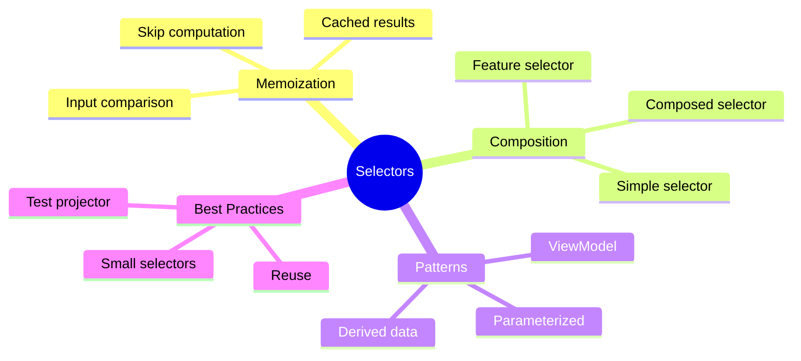

# 🔍 Selectors Deep Dive

> **💡 Lightbulb Moment**: Selectors are like **computed properties** for your store. They're memoized (cached), composable, and keep your components decoupled from state structure.


## 📋 Table of Contents
- [1. 🔍 How Memoization Works](#1--how-memoization-works)
  - [The Magic of Caching](#the-magic-of-caching)
- [2. 🚀 Selector Patterns](#2--selector-patterns)
  - [Feature Selector](#feature-selector)
  - [Simple Selector](#simple-selector)
  - [Composed Selectors](#composed-selectors)
  - [Parameterized Selector](#parameterized-selector)
- [3. ❓ Interview Questions](#3--interview-questions)
  - [Basic Questions](#basic-questions)
    - [Q1: What is selector memoization?](#q1-what-is-selector-memoization)
    - [Q2: Why compose selectors instead of one big selector?](#q2-why-compose-selectors-instead-of-one-big-selector)
    - [Q3: When does a selector recompute?](#q3-when-does-a-selector-recompute)
  - [Scenario-Based Questions](#scenario-based-questions)
    - [Scenario 1: Expensive Computation](#scenario-1-expensive-computation)
    - [Scenario 2: Multiple Filters](#scenario-2-multiple-filters)
    - [Scenario 3: Derived ViewModel](#scenario-3-derived-viewmodel)
    - [Scenario 4: Avoiding Recomputation](#scenario-4-avoiding-recomputation)
  - [Advanced Questions](#advanced-questions)
    - [Q4: How do you test selectors?](#q4-how-do-you-test-selectors)
    - [Q5: What's the difference between `createSelector` and `createFeatureSelector`?](#q5-whats-the-difference-between-createselector-and-createfeatureselector)
- [🧮 Calculator with Memory Analogy (Easy to Remember!)](#calculator-with-memory-analogy-easy-to-remember)
  - [📖 Story to Remember:](#story-to-remember)
  - [🎯 Quick Reference:](#quick-reference)
- [🧠 Mind Map](#mind-map)
- [🎯 What Problem Does This Solve?](#what-problem-does-this-solve)
  - [The Problem: Direct State Access Is Fragile & Inefficient](#the-problem-direct-state-access-is-fragile--inefficient)
  - [How Selectors Solve This](#how-selectors-solve-this)
  - [Memoization Explained](#memoization-explained)
- [📚 Key Classes & Types Explained](#key-classes--types-explained)
  - [1. `createSelector()` (from `@ngrx/store`)](#1-createselector-from-ngrxstore)
  - [2. `createFeatureSelector<T>()` (from `@ngrx/store`)](#2-createfeatureselectort-from-ngrxstore)
  - [3. `MemoizedSelector<State, Result>` Type](#3-memoizedselectorstate-result-type)
  - [4. Projector Function](#4-projector-function)
  - [5. `DefaultProjectorFn<T>` Type](#5-defaultprojectorfnt-type)
  - [6. Selector Config Options](#6-selector-config-options)
- [🌍 Real-World Use Cases](#real-world-use-cases)
  - [1. Shopping Cart Calculations](#1-shopping-cart-calculations)
  - [2. Filtered & Sorted Product List](#2-filtered--sorted-product-list)
  - [3. Dashboard ViewModel](#3-dashboard-viewmodel)
  - [4. Parameterized Selectors](#4-parameterized-selectors)
  - [5. Cross-Feature Selectors](#5-cross-feature-selectors)
- [❓ Complete Interview Questions (20+)](#complete-interview-questions-20)
  - [Basic Conceptual Questions](#basic-conceptual-questions)
  - [Memoization Questions](#memoization-questions)
  - [Composition Questions](#composition-questions)
  - [Parameterized Selector Questions](#parameterized-selector-questions)
  - [Testing Questions](#testing-questions)
  - [Scenario Questions](#scenario-questions)
  - [Advanced Questions](#advanced-questions)

---
---

## 1. 🔍 How Memoization Works

### The Magic of Caching

```typescript
// This selector
export const selectSubtotal = createSelector(
  selectCartItems,
  items => items.reduce((sum, i) => sum + i.price, 0)  // Expensive!
);

// First call: Computes result, caches it
store.select(selectSubtotal);  // ⚙️ Computed

// Second call: State unchanged, returns cached value
store.select(selectSubtotal);  // ⚡ Cached (no computation!)

// Third call: State changed, recomputes
store.dispatch(addItem(...));
store.select(selectSubtotal);  // ⚙️ Recomputed
```

---

## 2. 🚀 Selector Patterns

### Feature Selector

```typescript
// Gets a slice of root state
export const selectUserState = createFeatureSelector<UserState>('users');
```

### Simple Selector

```typescript
export const selectLoading = createSelector(
  selectUserState,
  state => state.loading
);
```

### Composed Selectors

```typescript
// Build on other selectors
export const selectSubtotal = createSelector(
  selectItems,
  items => items.reduce((sum, i) => sum + (i.price * i.qty), 0)
);

export const selectTax = createSelector(
  selectSubtotal,
  subtotal => subtotal * 0.1  // Uses selectSubtotal!
);

export const selectTotal = createSelector(
  selectSubtotal,
  selectTax,
  (subtotal, tax) => subtotal + tax  // Uses both!
);
```

### Parameterized Selector

```typescript
// Factory function pattern
export const selectUserById = (id: number) => createSelector(
  selectUserEntities,
  entities => entities[id]
);

// Usage
this.store.select(selectUserById(5));
```

---

## 3. ❓ Interview Questions

### Basic Questions

#### Q1: What is selector memoization?
**Answer:** Memoization is caching. Selectors remember their last inputs and output. If inputs haven't changed, they return the cached result without recomputing.

#### Q2: Why compose selectors instead of one big selector?
**Answer:**
1. **Reusability** - Smaller selectors can be reused
2. **Better caching** - If only one part changes, only that selector recomputes
3. **Readability** - Easier to understand and test
4. **Maintainability** - Change in one place

#### Q3: When does a selector recompute?
**Answer:** Only when ANY of its input selectors return a different value (by reference for objects/arrays).

---

### Scenario-Based Questions

#### Scenario 1: Expensive Computation
**Question:** You have 10,000 products and need to filter and sort them. How do you optimize?

**Answer:**
```typescript
// Compose multiple selectors for optimal caching
export const selectAllProducts = createSelector(
  selectProductState,
  state => state.products
);

export const selectActiveProducts = createSelector(
  selectAllProducts,
  products => products.filter(p => p.isActive)  // Only recomputes if products change
);

export const selectSortedActiveProducts = createSelector(
  selectActiveProducts,
  products => [...products].sort((a, b) => a.name.localeCompare(b.name))
);
```

---

#### Scenario 2: Multiple Filters
**Question:** User can filter products by category, price range, and search text. How do you structure selectors?

**Answer:**
```typescript
// State stores filter values
interface ProductState {
  products: Product[];
  filters: {
    category: string | null;
    minPrice: number;
    maxPrice: number;
    searchText: string;
  };
}

export const selectFilters = createSelector(selectProductState, s => s.filters);

export const selectFilteredProducts = createSelector(
  selectAllProducts,
  selectFilters,
  (products, filters) => {
    return products.filter(p => {
      if (filters.category && p.category !== filters.category) return false;
      if (p.price < filters.minPrice || p.price > filters.maxPrice) return false;
      if (filters.searchText && !p.name.includes(filters.searchText)) return false;
      return true;
    });
  }
);
```

---

#### Scenario 3: Derived ViewModel
**Question:** Component needs { user, orders, totalSpent }. How do you create a ViewModel selector?

**Answer:**
```typescript
export const selectUserViewModel = createSelector(
  selectCurrentUser,
  selectUserOrders,
  selectOrderTotal,
  (user, orders, totalSpent) => ({
    user,
    orders,
    totalSpent,
    orderCount: orders.length,
    averageOrder: orders.length ? totalSpent / orders.length : 0
  })
);
```

---

#### Scenario 4: Avoiding Recomputation
**Question:** Your selector returns a new array every time, causing component re-renders. How do you fix it?

**Answer:**
```typescript
// ❌ BAD - Always creates new array reference
export const selectActiveUsers = createSelector(
  selectUsers,
  users => users.filter(u => u.isActive)
);

// ✅ GOOD - Return same reference if content is same
import { createSelectorFactory, defaultMemoize } from '@ngrx/store';

// Or simpler: Use resultEqualityCheck
export const selectActiveUsers = createSelector(
  selectUsers,
  users => users.filter(u => u.isActive),
  { memoize: defaultMemoize, memoizeOptions: { resultEqualityCheck: arraysEqual } }
);
```

---

### Advanced Questions

#### Q4: How do you test selectors?
**Answer:**
```typescript
describe('selectSubtotal', () => {
  it('should calculate subtotal', () => {
    const state = {
      cart: {
        items: [
          { price: 10, quantity: 2 },
          { price: 20, quantity: 1 }
        ]
      }
    };
    
    const result = selectSubtotal.projector(state.cart.items);
    expect(result).toBe(40);  // 10*2 + 20*1
  });
});
```

#### Q5: What's the difference between `createSelector` and `createFeatureSelector`?
**Answer:**
- `createFeatureSelector` - Gets top-level feature slice from root state
- `createSelector` - Derives data from one or more input selectors

```typescript
// Feature selector - accesses root state
createFeatureSelector<UserState>('users');  // AppState['users']

// Regular selector - derives from inputs
createSelector(selectUserState, state => state.loading);
```

---

## 🧮 Calculator with Memory Analogy (Easy to Remember!)

Think of selectors like a **calculator with memory feature**:

| Concept | Calculator Analogy | Memory Trick |
|---------|-------------------|--------------| 
| **Selector** | 🧮 **M+ button**: Store computed result | **"Cache result"** |
| **Memoization** | 💾 **Memory recall**: If same inputs, recall stored answer | **"Skip computation"** |
| **Input selectors** | 🔢 **Numbers entered**: What's being calculated | **"Dependencies"** |
| **Composed** | ➕ **Chain operations**: Subtotal → Tax → Total | **"Build on others"** |
| **Recompute** | 🔄 **New inputs**: Different numbers = recalculate | **"When state changes"** |

### 📖 Story to Remember:

> 🧮 **The Smart Calculator**
>
> You're computing shopping totals:
>
> **First calculation:**
> ```typescript
> selectSubtotal: 10 + 20 + 15 = 45  // ⚙️ Computed
> store._memoized = 45;              // 💾 Stored!
> ```
>
> **Same inputs? Memory recall:**
> ```typescript
> selectSubtotal again?  // 💾 Recall: 45 (no math!)
> ```
>
> **Composed calculations:**
> ```typescript
> selectSubtotal = 45      // Already in memory
> selectTax = 45 * 0.1 = 4.5
> selectTotal = 45 + 4.5 = 49.5
> // Each level uses previous memory!
> ```

### 🎯 Quick Reference:
```
🧮 Selector       = Calculator with memory
💾 Memoization    = Store result (M+)
🔢 Inputs         = Dependencies
➕ Composed       = Chain calculations
🔄 Recompute      = New numbers entered
```

---

## 🧠 Mind Map



---

## 🎯 What Problem Does This Solve?

### The Problem: Direct State Access Is Fragile & Inefficient

**Without Selectors (BAD):**
```typescript
// Component directly accessing state structure
this.store.pipe(
    map(state => state.users.entities[state.users.selectedId])
);

// Another component doing same thing differently
this.store.pipe(
    map(state => {
        const id = state.users.selectedId;
        return state.users.list.find(u => u.id === id);
    })
);
```

**Problems:**
1. **Tight coupling**: Components know state structure
2. **Duplication**: Same logic in multiple places
3. **No caching**: Expensive operations recompute on every state change
4. **Refactoring nightmare**: Change state shape = update every component
5. **Hard to test**: Logic scattered across components

### How Selectors Solve This

**With Selectors (GOOD):**
```typescript
// Centralized, cached, reusable
export const selectCurrentUser = createSelector(
    selectUserEntities,
    selectSelectedUserId,
    (entities, id) => id ? entities[id] : null
);

// Components just use селектор
this.store.select(selectCurrentUser);  // Clean!
```

| Problem | Selector Solution |
|---------|------------------|
| Repeated computations | **Memoization** - cached results |
| State structure coupling | **Abstraction** - single point of access |
| Duplicated logic | **Reusability** - compose smaller selectors |
| Expensive derives | **Lazy evaluation** - only computes when needed |
| Testing complexity | **Pure functions** - easy to unit test |

### Memoization Explained

```
State Change → Selector Input Check → Same? → Return Cached
                                    ↓
                                Different? → Recompute → Cache New Result
```

**Example:**
```typescript
// First call: items = [A, B, C]
selectTotal()  // Computes: 100 + 200 + 150 = 450 ⚙️
               // Caches: 450

// Second call: items still [A, B, C] (same reference)
selectTotal()  // Returns: 450 ⚡ (no computation!)

// Third call: items = [A, B, C, D] (new reference)
selectTotal()  // Computes: 100 + 200 + 150 + 50 = 500 ⚙️
               // Caches: 500
```

---

## 📚 Key Classes & Types Explained

### 1. `createSelector()` (from `@ngrx/store`)

```typescript
export const selectSubtotal = createSelector(
    selectItems,              // Input selector 1
    selectDiscount,           // Input selector 2
    (items, discount) => {    // Projector function
        const subtotal = items.reduce((sum, i) => sum + i.price, 0);
        return subtotal - discount;
    }
);
```

**Parameters:**
- **Input selectors** (1-8): Selectors whose results are passed to projector
- **Projector function**: Derives final value from inputs

**How memoization works:**
1. Input selectors are called with state
2. Results compared to previous results (by reference)
3. If ALL same → return cached output
4. If ANY different → call projector with new values

---

### 2. `createFeatureSelector<T>()` (from `@ngrx/store`)

```typescript
export const selectUserState = createFeatureSelector<UserState>('users');
// Equivalent to: state => state['users']
```

**What it is:** Gets a top-level slice of the root state.

**When to use:**
- Entry point for feature-specific selectors
- Registered feature name must match `provideState('users', reducer)`

**Type safety:**
```typescript
// AppState = { users: UserState, products: ProductState }
createFeatureSelector<UserState>('users');  // Returns UserState
```

---

### 3. `MemoizedSelector<State, Result>` Type

```typescript
const selectCount: MemoizedSelector<AppState, number> = createSelector(
    selectUserState,
    state => state.users.length
);
```

**What it is:** The return type of `createSelector`.

**Properties:**
- `.projector` - The projection function (useful for testing)
- `.release()` - Clears memoized value (rarely used)
- `.setResult()` - Manually set cached value (advanced)

---

### 4. Projector Function

```typescript
createSelector(
    selectA,
    selectB,
    selectC,
    (a, b, c) => { /* This is the projector */ }
    //  ↑ Receives outputs from input selectors
);
```

**Rules:**
- Must be a PURE function (no side effects)
- Receives values from input selectors in order
- Return value is memoized

**Testing projectors directly:**
```typescript
const result = selectTotal.projector(items, tax, discount);
// Calls projector directly without needing store
```

---

### 5. `DefaultProjectorFn<T>` Type

```typescript
type DefaultProjectorFn<T> = (...args: any[]) => T;
```

**What it is:** Type definition for projector functions.

**Usage in custom selectors:**
```typescript
function createCustomSelector<R>(
    projector: DefaultProjectorFn<R>
): MemoizedSelector<AppState, R>;
```

---

### 6. Selector Config Options

```typescript
createSelector(
    selectItems,
    items => items.filter(i => i.active),
    {
        memoize: customMemoize,
        memoizeOptions: {
            maxSize: 10,
            resultEqualityCheck: deepEqual
        }
    }
);
```

| Option | Purpose |
|--------|---------|
| `memoize` | Custom memoization function |
| `memoizeOptions.maxSize` | Cache size for parameterized selectors |
| `memoizeOptions.resultEqualityCheck` | Compare results (not just inputs) |
| `memoizeOptions.equalityCheck` | Custom input comparison |

---

## 🌍 Real-World Use Cases

### 1. Shopping Cart Calculations
```typescript
export const selectCartItems = createSelector(
    selectCartState,
    state => state.items
);

export const selectSubtotal = createSelector(
    selectCartItems,
    items => items.reduce((sum, i) => sum + (i.price * i.quantity), 0)
);

export const selectTax = createSelector(
    selectSubtotal,
    subtotal => subtotal * 0.1
);

export const selectShipping = createSelector(
    selectSubtotal,
    subtotal => subtotal > 100 ? 0 : 9.99
);

export const selectTotal = createSelector(
    selectSubtotal,
    selectTax,
    selectShipping,
    (subtotal, tax, shipping) => subtotal + tax + shipping
);
```

### 2. Filtered & Sorted Product List
```typescript
export const selectProducts = createSelector(
    selectProductState,
    state => state.products
);

export const selectFilters = createSelector(
    selectProductState,
    state => state.filters
);

export const selectFilteredProducts = createSelector(
    selectProducts,
    selectFilters,
    (products, { category, minPrice, maxPrice, inStock }) => {
        return products.filter(p => {
            if (category && p.category !== category) return false;
            if (p.price < minPrice || p.price > maxPrice) return false;
            if (inStock && p.stock === 0) return false;
            return true;
        });
    }
);

export const selectSortedProducts = createSelector(
    selectFilteredProducts,
    selectSortBy,
    (products, sortBy) => {
        const sorted = [...products];
        switch (sortBy) {
            case 'price-asc': return sorted.sort((a, b) => a.price - b.price);
            case 'price-desc': return sorted.sort((a, b) => b.price - a.price);
            case 'name': return sorted.sort((a, b) => a.name.localeCompare(b.name));
            default: return sorted;
        }
    }
);
```

### 3. Dashboard ViewModel
```typescript
export const selectDashboardVM = createSelector(
    selectCurrentUser,
    selectRecentOrders,
    selectNotifications,
    selectAnalytics,
    (user, orders, notifications, analytics) => ({
        userName: user?.name ?? 'Guest',
        orderCount: orders.length,
        unreadNotifications: notifications.filter(n => !n.read).length,
        totalRevenue: analytics.totalRevenue,
        isLoading: !user || !orders.length
    })
);
```

### 4. Parameterized Selectors
```typescript
// By ID
export const selectProductById = (id: string) => createSelector(
    selectProductEntities,
    entities => entities[id]
);

// By category
export const selectProductsByCategory = (category: string) => createSelector(
    selectAllProducts,
    products => products.filter(p => p.category === category)
);

// Usage
this.store.select(selectProductById('sku-123'));
this.store.select(selectProductsByCategory('electronics'));
```

### 5. Cross-Feature Selectors
```typescript
// Combine data from multiple features
export const selectOrderWithProducts = (orderId: string) => createSelector(
    selectOrderById(orderId),
    selectProductEntities,
    (order, products) => ({
        ...order,
        items: order.itemIds.map(id => products[id])
    })
);
```

---

## ❓ Complete Interview Questions (20+)

### Basic Conceptual Questions

**Q1: What is selector memoization?**
> A: Caching mechanism that stores selector results. If input selectors return same values (by reference), the cached result is returned without recomputing.

**Q2: Why use selectors instead of direct state access?**
> A: Decoupling (components don't know state structure), reusability (single source of truth), memoization (performance), testability (pure functions).

**Q3: When does a selector recompute?**
> A: When ANY input selector returns a different value (compared by reference). If all inputs are same, cached result is returned.

**Q4: What's the difference between `createSelector` and `createFeatureSelector`?**
> A: `createFeatureSelector` accesses root state slices by key, `createSelector` derives data from other selectors.

**Q5: How many input selectors can `createSelector` accept?**
> A: Up to 8 input selectors in the overloaded signatures, but you can compose selectors to work around this.

---

### Memoization Questions

**Q6: How does memoization improve performance?**
> A: Expensive computations (filtering, sorting, aggregating) only run when inputs actually change. Unchanged inputs return cached result instantly.

**Q7: What comparison does memoization use by default?**
> A: Reference equality (`===`). Objects/arrays must be different references to trigger recomputation.

**Q8: A selector returns a new array every time. Why is this a problem?**
> A: Even if array contents are identical, new reference triggers downstream selectors and component re-renders. Use `resultEqualityCheck` for deep comparison.

**Q9: How do you clear memoized values?**
> A: Call `selector.release()`, but this is rarely needed. Memoization is usually beneficial.

---

### Composition Questions

**Q10: Why compose small selectors instead of one large selector?**
> A: 
> - Better caching (each level cached independently)
> - Reusability (combine in different ways)
> - Testability (test small units)
> - Maintainability (single responsibility)

**Q11: How do you share selectors between features?**
> A: Create a `shared/selectors` module or access other feature's selectors via root state:
> ```typescript
> export const selectUserFromProducts = createSelector(
>     (state: AppState) => state.users.currentUser,
>     user => user
> );
> ```

**Q12: Can selectors call HTTP services?**
> A: NO! Selectors must be PURE functions. No side effects. Use Effects for async operations.

---

### Parameterized Selector Questions

**Q13: How do you create a selector that takes parameters?**
> A: Factory function pattern:
> ```typescript
> export const selectById = (id: number) => createSelector(
>     selectEntities,
>     entities => entities[id]
> );
> ```

**Q14: What's the memoization caveat with factory selectors?**
> A: Each call to factory creates NEW selector instance with own cache. For performance, store selector instances:
> ```typescript
> // Cache instances
> const selectorCache = new Map();
> export const selectById = (id: number) => {
>     if (!selectorCache.has(id)) {
>         selectorCache.set(id, createSelector(...));
>     }
>     return selectorCache.get(id);
> };
> ```

---

### Testing Questions

**Q15: How do you unit test a selector?**
> A: Test the projector directly:
> ```typescript
> it('should calculate total', () => {
>     const items = [{ price: 10 }, { price: 20 }];
>     const result = selectTotal.projector(items);
>     expect(result).toBe(30);
> });
> ```

**Q16: How do you test selector with full state?**
> A: Create mock state and call selector:
> ```typescript
> const state = { cart: { items: [...] } };
> const result = selectTotal(state);
> ```

---

### Scenario Questions

**Q17: Component re-renders on every state change even though its data didn't change. How to debug?**
> A: Check if selector returns new object/array reference every time. Use `distinctUntilChanged()` or fix selector to return stable references.

**Q18: You have 10,000 items to filter and sort. How do you optimize?**
> A: Compose selectors so filtering and sorting are separate:
> ```typescript
> selectFiltered → selectSorted
> ```
> If filter changes, sort recomputes. If only sort changes, filter uses cache.

**Q19: How do you select data from multiple feature states?**
> A: Use root state as input:
> ```typescript
> export const selectCombined = createSelector(
>     (state: AppState) => state.feature1,
>     (state: AppState) => state.feature2,
>     (f1, f2) => ({ ...f1, ...f2 })
> );
> ```

**Q20: Selector result needs transformation based on user locale. How?**
> A: Include locale in selector inputs:
> ```typescript
> export const selectFormattedPrices = createSelector(
>     selectProducts,
>     selectUserLocale,
>     (products, locale) => products.map(p => ({
>         ...p,
>         formattedPrice: new Intl.NumberFormat(locale).format(p.price)
>     }))
> );
> ```

---

### Advanced Questions

**Q21: What is `createSelectorFactory`?**
> A: Lower-level API for custom memoization strategies:
> ```typescript
> const customSelector = createSelectorFactory(customMemoize);
> ```

**Q22: How do you implement "result equality check"?**
> A: Use selector options to compare output values:
> ```typescript
> createSelector(
>     selectItems,
>     items => items.filter(i => i.active),
>     { memoizeOptions: { resultEqualityCheck: deepEqual } }
> );
> ```

**Q23: Can you use signals with selectors?**
> A: Yes! Use `selectSignal` or `toSignal`:
> ```typescript
> readonly count = this.store.selectSignal(selectCount);
> // Or
> readonly count = toSignal(this.store.select(selectCount));
> ```

**Q24: What happens if projector throws an error?**
> A: Error propagates to subscriber. The selector doesn't cache the error - it will retry on next state change.

**Q25: How do NgRx selectors compare to Vue computed or React useMemo?**
> A: Similar concept (derived state with caching), but NgRx selectors are:
> - Defined outside components (reusable)
> - Compose with other selectors
> - Type-safe with TypeScript

