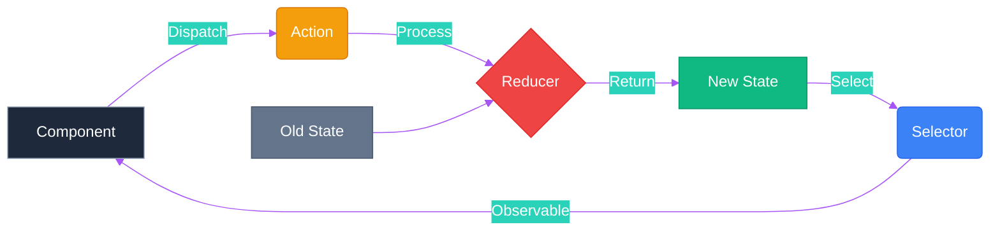

# 🏬 NgRx Store Basics


## 📋 Table of Contents
- [📑 Index](#index)
- [🎯 What Problem Does This Solve?](#what-problem-does-this-solve)
  - [The Problem: State Management Chaos 🌪️](#the-problem-state-management-chaos)
  - [The Solution: NgRx Store 🏛️](#the-solution-ngrx-store)
  - [Comparison: Component State vs NgRx Store](#comparison-component-state-vs-ngrx-store)
- [🔍 How It Works](#how-it-works)
  - [The Redux Flow](#the-redux-flow)
  - [Data Flow Diagram](#data-flow-diagram)
  - [🎬 Behind the Scenes: `createReducer` Flow](#behind-the-scenes-createreducer-flow)
- [🚀 Implementation](#implementation)
  - [Step 0: Configure NgRx in `main.ts` ⚙️](#step-0-configure-ngrx-in-maints)
    - [Provider Functions Explained](#provider-functions-explained)
  - [Step 1: Define Actions](#step-1-define-actions)
  - [Step 2: Create Reducer](#step-2-create-reducer)
  - [Step 3: Create Selectors](#step-3-create-selectors)
  - [Step 4: Component Integration](#step-4-component-integration)
  - [🔬 Deep Dive: Factory Functions 🏭](#deep-dive-factory-functions)
- [🗄️ The Restaurant Analogy](#the-restaurant-analogy)
- [🧠 Mind Map](#mind-map)
- [📚 Key Classes & Types](#key-classes--types)
  - [1. `Store<T>`](#1-storet)
  - [2. `createAction` & `props<T>`](#2-createaction--propst)
  - [3. `createReducer` & `on`](#3-createreducer--on)
  - [4. `createSelector` & `createFeatureSelector`](#4-createselector--createfeatureselector)
- [🌍 Real-World Use Cases](#real-world-use-cases)
  - [1. **Authentication Flow**](#1-authentication-flow)
  - [2. **Shopping Cart**](#2-shopping-cart)
  - [3. **Theming & Preferences**](#3-theming--preferences)
  - [4. **Complex Dashboards**](#4-complex-dashboards)
  - [5. **Navigation History**](#5-navigation-history)
- [❓ Interview Questions](#interview-questions)
  - [Basic (1-8)](#basic-1-8)
  - [Intermediate (9-16)](#intermediate-9-16)
  - [Advanced (17-25)](#advanced-17-25)

---
## 📑 Index
1. [🎯 What Problem Does This Solve?](#-what-problem-does-this-solve)
2. [🔍 How It Works](#-how-it-works)
3. [🚀 Implementation](#-implementation)
4. [🗄️ The Restaurant Analogy](#-the-restaurant-analogy)
5. [🧠 Mind Map](#-mind-map)
6. [📚 Key Classes & Types](#-key-classes--types)
7. [🌍 Real-World Use Cases](#-real-world-use-cases)
8. [❓ Interview Questions](#-interview-questions)

---

## 🎯 What Problem Does This Solve?

### The Problem: State Management Chaos 🌪️
In large-scale Angular applications, managing state across multiple components becomes difficult:
- **Prop Drilling**: Passing data down multiple levels of components.
- **Inconsistent State**: Two components showing different data for the same entity.
- **Complex Debugging**: Difficult to track why and when the state changed.
- **Tight Coupling**: Components depending directly on each other's state.
- **Boilerplate**: Repetitive logic in services for state updates.

### The Solution: NgRx Store 🏛️
NgRx provides a **Single Source of Truth** and a predictable state container:
- ✅ **Centralized State**: All shared data lives in one place.
- ✅ **Predictability**: State changes only through explicit Actions and pure Reducers.
- ✅ **Decoupling**: Components don't know about each other; they only talk to the Store.
- ✅ **Performance**: Built-in memoization and OnPush change detection friendliness.
- ✅ **Tooling**: Powerful debugging with Redux DevTools.

### Comparison: Component State vs NgRx Store

| Aspect | Component State | NgRx Store |
|--------|----------------|------------|
| **Scope** | Local to component | Global / Feature-wide |
| **Communication** | @Input / @Output | Selectors / Actions |
| **Predictability** | Low (any method can change) | High (Strict Reducer flow) |
| **Debugging** | Manual console logs | Redux DevTools Time Travel |
| **Persistence** | Lost on navigation | Centralized (Can be synced) |

---

## 🔍 How It Works

### The Redux Flow
NgRx follows the Redux pattern:
1. **Action**: Describes what happened ("What").
2. **Reducer**: Pure function that updates state ("How").
3. **Selector**: Queries data from store ("Query").
4. **Store**: The database in memory ("Storage").

### Data Flow Diagram



### 🎬 Behind the Scenes: `createReducer` Flow
1. **Initialization**: When app loads, `createReducer` maps Action Types to Handlers.
2. **Registration**: Reducer is registered with `provideStore()`.
3. **Execution**: When an action is dispatched, the Store calls the Reducer with Current State + Action, which returns a **New State** object.

---

## 🚀 Implementation

### Step 0: Configure NgRx in `main.ts` ⚙️

Before using NgRx in any component, you must configure the Store providers in your application's bootstrap configuration. This is done in `main.ts`:

```typescript
// main.ts
import { bootstrapApplication } from '@angular/platform-browser';
import { provideStore } from '@ngrx/store';
import { provideEffects } from '@ngrx/effects';
import { provideStoreDevtools } from '@ngrx/store-devtools';
import { AppComponent } from './app/app.component';

bootstrapApplication(AppComponent, {
    providers: [
        // ✅ Step 1: Initialize NgRx Store with your reducers
        provideStore({
            counter: counterReducer,    // Register feature reducers
            products: productReducer,
            cart: cartReducer
        }),
        
        // ✅ Step 2: Initialize NgRx Effects (for async operations)
        provideEffects(),  // Add effect classes inside array when needed
        
        // ✅ Step 3: Enable Redux DevTools for debugging
        provideStoreDevtools({
            maxAge: 25,        // Retains last 25 states
            logOnly: false,    // Log actions in production
            autoPause: true    // Pause when window is not focused
        })
    ]
});
```

> **⚠️ Key Point**: The `provideStore()` function is **required** for NgRx to work. Without it, the `Store` service will not be available for injection. The `provideEffects()` and `provideStoreDevtools()` are optional but highly recommended.

#### Provider Functions Explained

| Provider | Purpose | Required? |
|----------|---------|-----------|
| `provideStore({...})` | Registers reducers and creates the Store singleton | ✅ **Yes** |
| `provideEffects([...])` | Enables side-effect handling (API calls, etc.) | Optional |
| `provideStoreDevtools({...})` | Connects to Redux DevTools browser extension | Optional |

---

### Step 1: Define Actions
```typescript
// store/counter.actions.ts
import { createAction, props } from '@ngrx/store';

export const increment = createAction('[Counter Page] Increment');
export const decrement = createAction('[Counter Page] Decrement');
export const reset = createAction('[Counter Page] Reset');

// Action with payload
export const setCustomValue = createAction(
    '[Counter Page] Set Custom Value',
    props<{ value: number }>()
);
```

### Step 2: Create Reducer
```typescript
// store/counter.reducer.ts
import { createReducer, on } from '@ngrx/store';
import { increment, decrement, reset, setCustomValue } from './counter.actions';

export interface CounterState {
    count: number;
}

export const initialState: CounterState = { count: 0 };

export const counterReducer = createReducer(
    initialState,
    on(increment, state => ({ ...state, count: state.count + 1 })),
    on(decrement, state => ({ ...state, count: state.count - 1 })),
    on(reset, state => ({ ...state, count: 0 })),
    on(setCustomValue, (state, { value }) => ({ ...state, count: value }))
);
```

### Step 3: Create Selectors
```typescript
// store/counter.selectors.ts
import { createSelector, createFeatureSelector } from '@ngrx/store';
import { CounterState } from './counter.reducer';

export const selectCounterState = createFeatureSelector<CounterState>('counter');

export const selectCount = createSelector(
    selectCounterState,
    (state) => state.count
);
```

### Step 4: Component Integration
```typescript
// counter.component.ts
@Component({ ... })
export class CounterComponent {
    private store = inject(Store);
    count$ = this.store.select(selectCount);
    
    increment() {
        this.store.dispatch(increment());
    }
}
```

### 🔬 Deep Dive: Factory Functions 🏭
NgRx uses **Factory Functions** (functions that return other functions/objects).
- `createAction()`: Returns an **Action Creator**.
- `createReducer()`: Returns a **Reducer Function**.
- `createSelector()`: Returns a **Memoized Selector**.

---

## 🗄️ The Restaurant Analogy

Thinking of NgRx as a **Restaurant Operation** makes it easy to remember:

| NgRx Concept | Restaurant Part | Role |
|--------------|-----------------|------|
| **Store** | 🏭 **Kitchen** | The central place where state/food lives. |
| **Action** | 📝 **Order Ticket** | A message saying "Customer wants Pizza" (Source + Event). |
| **Reducer** | 👨‍🍳 **Chef** | Takes ingredients (old state) + order (action) and produces a new dish (new state). |
| **Selector** | 🧑‍🍳 **Waiter** | Fetches the finished dish from the kitchen for the customer. |
| **Effect** | 🚨 **Supplier Run** | If the kitchen is out of cheese, call the supplier (API call). |

> **Key Rule**: The Chef (Reducer) **NEVER** leaves the kitchen and **NEVER** calls suppliers. They only cook (pure functions)!

---

## 🧠 Mind Map

```mermaid
mindmap
  root((NgRx Basics))
    Action
      Source: [Counter Page]
      Event: Increment
      Props: { value: 5 }
    Reducer
      Pure Function
      Immutable State
      Initial State
    Selector
      Queries
      Memoization
      Feature Selector
    Store
      Dispatch Actions
      Select State
      Single Instance
```

---

## 📚 Key Classes & Types

### 1. `Store<T>`
The central service used for dispatching actions and selecting state.
- `dispatch(action)`: Triggers a state change.
- `select(selector)`: Returns an Observable of the requested data.

### 2. `createAction` & `props<T>`
Used to define type-safe action creators. The string must be unique and follows the `[Source] Event` pattern.

### 3. `createReducer` & `on`
Defines how state transitions happen. `on(action, handler)` maps a specific action to a logic block.

### 4. `createSelector` & `createFeatureSelector`
- `createFeatureSelector`: Grabs a slice of top-level state (e.g., 'auth', 'cart').
- `createSelector`: Combines and transforms state slices with memoization.

---

## 🌍 Real-World Use Cases

### 1. **Authentication Flow**
Storing the current user, permissions, and tokens. Any component can "Select" the user to show a profile name or check roles.

### 2. **Shopping Cart**
A product page dispatches `addToCart`. The header component selects `cartItems.count` to update the icon badge immediately.

### 3. **Theming & Preferences**
User changes font size or Dark Mode. The update is dispatched to the store and applied globally across all layouts.

### 4. **Complex Dashboards**
Multiple widgets (charts, tables) listening to the same "FinancialData" state slice. When data refills, all widgets update simultaneously.

### 5. **Navigation History**
Storing breadcrumbs or "Recently Viewed Items" into a store slice as the user navigates through the app.

---

## ❓ Interview Questions

### Basic (1-8)
1. **What is NgRx and why do we use it?**
2. **Explain the One-Way Data Flow in NgRx.**
3. **What is the "Single Source of Truth"?**
4. **What is an Action and what should be its naming convention?**
5. **What is a Reducer and why must it be a "Pure Function"?**
6. **What is a Selector and what is memoization?**
7. **How do you dispatch an Action from a component?**
8. **What are the benefits of using Redux DevTools?**

### Intermediate (9-16)
9. **How does NgRx handle Immutable updates?**
10. **What happens if you mutate state directly in a Reducer?**
11. **Explain `createFeatureSelector` vs `createSelector`.**
12. **What are `props` in an Action?**
13. **How do you handle multiple entities in one state slice?**
14. **Explain the benefits of `OnPush` change detection with NgRx.**
15. **What is a "Smart Component" vs a "Dumb Component" in NgRx architecture?**
16. **How do you define the `initialState`?**

### Advanced (17-25)
17. **What is the "Action-Reducer-Selector" lifecycle in detail?**
18. **How does memoization improve performance for expensive computations in Selectors?**
19. **Explain the Higher-Order Function used in `createReducer`.**
20. **How would you debug a circular dependency in NgRx selectors?**
21. **What is the difference between `@ngrx/store` and `@ngrx/component-store`?**
22. **Explain the role of `ActionReducerMap`.**
23. **How do you handle "Optimistic Updates" in basic Store logic?**
24. **When should state stay in a Service/Component instead of the Store?**
25. **How would you test a Reducer?**

---

> **Pro Tip**: Use the **Redux DevTools** to "Time Travel" through your actions. It's the best way to see how your state transitions over time!
