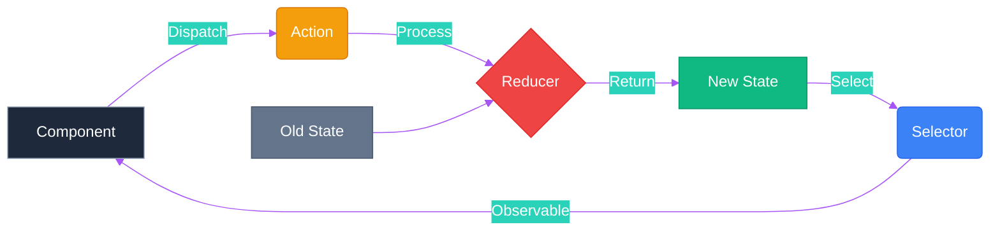
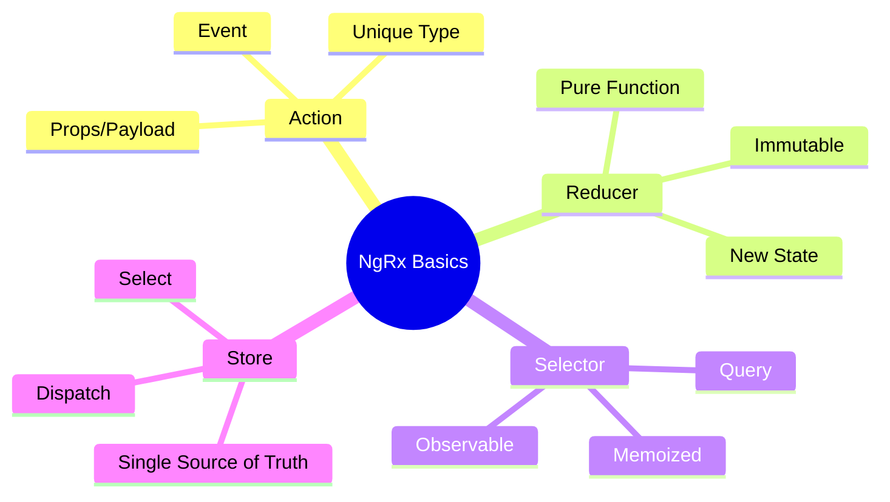

# 🏬 Use Case 1: Store Basics

> **💡 Lightbulb Moment**: The Store is just a **client-side database**. Actions are "transactions", Reducers are "database updates", and Selectors are "SQL queries".

## 📊 NgRx Store Basics - Visual Flow


---

## 1. 🔍 How It Works (The Concept)

### The Redux Pattern
Instead of components managing their own state (chaos 🌪️), a central store manages specific slices of state (order 🏛️).

1.  **Action**: Describes an event (e.g., "Login Button Clicked").
2.  **Reducer**: Pure function that takes current state + action and returns **new state**.
3.  **Selector**: Pure function that grabs a slice of state to give to components.
4.  **Store**: The container that holds the state.

### 📊 Data Flow Diagram



---

## 2. 🚀 Step-by-Step Implementation Guide

### Step 1: Define Actions
Think of these as the **commands** your app can understand.

```typescript
// store/counter.actions.ts
import { createAction, props } from '@ngrx/store';

// 🛡️ CRITICAL: Naming convention '[Source] Event' for debugging
export const increment = createAction('[Counter] Increment');
export const decrement = createAction('[Counter] Decrement');
export const reset = createAction('[Counter] Reset');

// Action WITH payload
export const setCustomValue = createAction(
    '[Counter Page] Set Custom Value',
    props<{ value: number }>()
);
```

---

### 🔬 Deep Dive: `createAction` with `props` Explained

Let's break down this action syntax in detail:

```typescript
export const setCustomValue = createAction(
    '[Counter Page] Set Custom Value',
    props<{ value: number }>()
);
```

#### **Breaking it down:**

| Part | Purpose |
|------|---------|
| `createAction()` | NgRx factory function to create type-safe actions |
| `'[Counter Page] Set Custom Value'` | **Action Type** - unique string identifier |
| `props<{ value: number }>()` | **Payload definition** - data the action carries |

---

#### **1️⃣ Action Type String: `'[Counter Page] Set Custom Value'`**

This follows the NgRx naming convention:
```
[Source] Event Description
```

- **`[Counter Page]`** → Where the action originates (component/page)
- **`Set Custom Value`** → What happened (the event)

This makes debugging easy in Redux DevTools - you can see exactly where each action came from!

**Examples of good action type names:**
```typescript
'[Login Page] Submit Credentials'      // Login form submitted
'[Product API] Load Products Success'  // API call succeeded
'[Cart Sidebar] Remove Item'           // User removed item
'[Auth Guard] Redirect To Login'       // Guard triggered redirect
```

---

#### **2️⃣ Props Function: `props<{ value: number }>()`**

This defines the **payload** - the data that travels with the action:

```typescript
props<{ value: number }>()
//     ↑ TypeScript interface defining the payload shape
```

When you dispatch this action, you **MUST** provide a `value`:

```typescript
// ✅ Correct - providing the required value
this.store.dispatch(setCustomValue({ value: 42 }));

// ❌ Error - TypeScript will complain!
this.store.dispatch(setCustomValue()); // Missing 'value'
this.store.dispatch(setCustomValue({ value: 'hello' })); // Wrong type (string instead of number)
this.store.dispatch(setCustomValue({ count: 42 })); // Wrong property name
```

---

#### **3️⃣ How It Works (Complete Flow)**

```
┌─────────────────────────────────────────────────────────────┐
│  Component                                                  │
│  ─────────                                                  │
│  this.store.dispatch(setCustomValue({ value: 100 }))        │
└──────────────────────────┬──────────────────────────────────┘
                           │
                           ▼
┌─────────────────────────────────────────────────────────────┐
│  Action Created (Object)                                    │
│  ──────────────────────                                     │
│  {                                                          │
│    type: '[Counter Page] Set Custom Value',                 │
│    value: 100                                               │
│  }                                                          │
└──────────────────────────┬──────────────────────────────────┘
                           │
                           ▼
┌─────────────────────────────────────────────────────────────┐
│  Reducer Handles Action                                     │
│  ──────────────────────                                     │
│  on(setCustomValue, (state, { value }) => ({                │
│    ...state,                                                │
│    count: value  // Sets count to 100                       │
│  }))                                                        │
└──────────────────────────┬──────────────────────────────────┘
                           │
                           ▼
┌─────────────────────────────────────────────────────────────┐
│  New State                                                  │
│  ─────────                                                  │
│  { count: 100 }                                             │
└─────────────────────────────────────────────────────────────┘
```

---

#### **4️⃣ Comparison: Actions With vs Without Props**

```typescript
// ━━━━━━━━━━━━━━━━━━━━━━━━━━━━━━━━━━━━━━━━━━━━━━━━━━━━━━━━━━━
// Action WITHOUT payload (no data needed)
// ━━━━━━━━━━━━━━━━━━━━━━━━━━━━━━━━━━━━━━━━━━━━━━━━━━━━━━━━━━━
export const increment = createAction('[Counter] Increment');

// Usage: Just call it
store.dispatch(increment());
// Resulting action: { type: '[Counter] Increment' }


// ━━━━━━━━━━━━━━━━━━━━━━━━━━━━━━━━━━━━━━━━━━━━━━━━━━━━━━━━━━━
// Action WITH single prop
// ━━━━━━━━━━━━━━━━━━━━━━━━━━━━━━━━━━━━━━━━━━━━━━━━━━━━━━━━━━━
export const setCustomValue = createAction(
    '[Counter] Set Value',
    props<{ value: number }>()
);

// Usage: Must provide value
store.dispatch(setCustomValue({ value: 42 }));
// Resulting action: { type: '[Counter] Set Value', value: 42 }


// ━━━━━━━━━━━━━━━━━━━━━━━━━━━━━━━━━━━━━━━━━━━━━━━━━━━━━━━━━━━
// Action WITH multiple props
// ━━━━━━━━━━━━━━━━━━━━━━━━━━━━━━━━━━━━━━━━━━━━━━━━━━━━━━━━━━━
export const addProduct = createAction(
    '[Cart] Add Product',
    props<{ productId: string; quantity: number; price: number }>()
);

// Usage: Provide all required properties
store.dispatch(addProduct({ 
    productId: 'abc123', 
    quantity: 2, 
    price: 29.99 
}));
// Resulting action: { 
//   type: '[Cart] Add Product', 
//   productId: 'abc123', 
//   quantity: 2, 
//   price: 29.99 
// }


// ━━━━━━━━━━━━━━━━━━━━━━━━━━━━━━━━━━━━━━━━━━━━━━━━━━━━━━━━━━━
// Action WITH complex object prop
// ━━━━━━━━━━━━━━━━━━━━━━━━━━━━━━━━━━━━━━━━━━━━━━━━━━━━━━━━━━━
interface User {
    id: string;
    name: string;
    email: string;
}

export const loginSuccess = createAction(
    '[Auth API] Login Success',
    props<{ user: User; token: string }>()
);

// Usage: Provide full user object
store.dispatch(loginSuccess({ 
    user: { id: '1', name: 'John', email: 'john@example.com' },
    token: 'jwt-token-here'
}));
```

---

#### **5️⃣ Why Use `props<T>()` Instead of Just an Object?**

The `props()` function provides several benefits:

| Benefit | Description |
|---------|-------------|
| ✅ **Type Safety** | TypeScript checks payload shape at compile time |
| ✅ **Autocomplete** | IDE knows what properties are required |
| ✅ **Immutability** | Props are treated as readonly |
| ✅ **Consistency** | Standard pattern across your codebase |
| ✅ **Better DevTools** | Props are clearly visible in Redux DevTools |

**Without props (NOT recommended):**
```typescript
// ❌ No type safety, easy to make mistakes
store.dispatch({ type: '[Counter] Set', val: 42 }); // typo: 'val' instead of 'value'
```

**With props (RECOMMENDED):**
```typescript
// ✅ TypeScript will catch errors immediately
store.dispatch(setCustomValue({ val: 42 })); // Error: 'val' doesn't exist, did you mean 'value'?
```

---

#### **6️⃣ Accessing Props in Reducers**

When you handle an action with props in a reducer, you can destructure the props:

```typescript
// In reducer
on(setCustomValue, (state, action) => ({
    ...state,
    count: action.value  // Access via action object
}))

// OR with destructuring (cleaner)
on(setCustomValue, (state, { value }) => ({
    ...state,
    count: value  // Directly destructure value
}))

// Multiple props destructuring
on(addProduct, (state, { productId, quantity, price }) => ({
    ...state,
    items: [...state.items, { productId, quantity, price }]
}))
```

---

#### **💡 Real-World Analogy: Labeled Envelope**

Think of `createAction` with `props` like a **labeled envelope** in an office:

| Concept | Analogy |
|---------|---------|
| `createAction()` | Creating an envelope |
| `'[Counter Page] Set Value'` | Label on envelope (who sent it, what's it about) |
| `props<{ value: number }>()` | What's INSIDE the envelope (the payload) |
| `dispatch()` | Sending the envelope to the mailroom (store) |
| `reducer` | Clerk who opens envelope and takes action |

```
📝 Order Form (Action with Props)
┌────────────────────────────────────────┐
│  FROM: [Counter Page]                  │  ← Source
│  RE: Set Custom Value                  │  ← Event
│                                        │
│  ┌────────────────────────────────┐    │
│  │  CONTENTS:                     │    │
│  │  • value: 100                  │    │  ← Props (payload)
│  └────────────────────────────────┘    │
└────────────────────────────────────────┘
```

---

### 🏭 Deep Dive: What Is a Factory Function?

NgRx uses **Factory Functions** extensively. Understanding this pattern is key to mastering NgRx!

#### **Definition**

A **Factory Function** is a function that **creates and returns** other values (objects or functions) instead of using a `class` with `new`.

```typescript
// Factory function that creates User objects
function createUser(name: string, age: number) {
    return {
        name,
        age,
        greet() {
            return `Hi, I'm ${this.name}`;
        }
    };
}

// Usage - the factory "manufactures" objects
const user1 = createUser('John', 25);
const user2 = createUser('Jane', 30);
```

---

#### **Why Called "Factory"? 🏭**

Think of a **real factory**:
- You give it **raw materials** (parameters)
- It **manufactures** something (object/function)
- You get back a **finished product**

```
Input (params)  →  Factory Function  →  Output (object/function)
     ↓                    ↓                      ↓
   name, age        createUser()            { name, age, greet() }
```

---

#### **NgRx Factory Functions**

| Factory | Input | Output |
|---------|-------|--------|
| `createAction()` | Action type string + props | Action creator function |
| `createReducer()` | Initial state + `on()` handlers | Reducer function |
| `createSelector()` | Input selectors + projector | Memoized selector function |
| `createEffect()` | Source function | Effect Observable |
| `createEntityAdapter()` | Config options | Adapter with CRUD methods |

**Example with `createAction`:**
```typescript
// Factory creates an ACTION CREATOR function
const increment = createAction('[Counter] Increment');
//  ↑ increment is now a FUNCTION (not an action yet!)

// Calling the action creator MANUFACTURES an action object
const action = increment();
// action = { type: '[Counter] Increment' }

// With props:
const setValue = createAction('[Counter] Set', props<{ value: number }>());
const action2 = setValue({ value: 42 });
// action2 = { type: '[Counter] Set', value: 42 }
```

---

#### **Factory vs Class vs Regular Function**

```typescript
// 1. CLASS - uses `new` keyword
class User {
    constructor(public name: string) {}
}
const user = new User('John');  // requires `new` keyword!

// 2. FACTORY FUNCTION - returns created value
function createUser(name: string) {
    return { name };  // no `new` needed
}
const user = createUser('John');  // just call it!

// 3. REGULAR FUNCTION - does work, returns simple data
function greet(name: string): string {
    return `Hello ${name}`;  // returns data, not a "thing"
}
```

---

#### **Why Factories in NgRx?**

| Benefit | Description |
|---------|-------------|
| ✅ **Configuration** | Pass options, get configured object back |
| ✅ **Type Inference** | TypeScript infers types from factory params |
| ✅ **Encapsulation** | Hide internal complexity |
| ✅ **Composability** | Factories can use other factories |
| ✅ **No `new` keyword** | Cleaner syntax, easier testing |

---

#### **Memory Trick: The Pizza Factory 🍕**

```
┌─────────────────────────────────────────────────────────────┐
│                    🏭 PIZZA FACTORY                         │
│                                                             │
│   INPUT: createPizza('pepperoni', 'large')                  │
│                         ↓                                   │
│   MANUFACTURING:  - Start with dough                        │
│                   - Add sauce                               │
│                   - Add pepperoni                           │
│                   - Make it large                           │
│                         ↓                                   │
│   OUTPUT: { type: 'pepperoni', size: 'large', slices: 8 }   │
│                                                             │
│   You don't make the pizza yourself!                        │
│   You tell the factory what you want, it manufactures it.   │
└─────────────────────────────────────────────────────────────┘

Same for NgRx:
┌─────────────────────────────────────────────────────────────┐
│                    🏭 ACTION FACTORY                        │
│                                                             │
│   INPUT: createAction('[Counter] Increment')                │
│                         ↓                                   │
│   MANUFACTURING:  - Create action creator function          │
│                   - Configure type property                 │
│                   - Add type safety                         │
│                         ↓                                   │
│   OUTPUT: increment() → { type: '[Counter] Increment' }     │
└─────────────────────────────────────────────────────────────┘
```

---

### Step 2: Create Reducer
The **logic** that handles the commands.

```typescript
// store/counter.reducer.ts
import { createReducer, on } from '@ngrx/store';
import { increment, decrement, reset } from './counter.actions';

export const initialState = { count: 0 };

export const counterReducer = createReducer(
    initialState,
    // 🛡️ CRITICAL: IMMUTABLE updates (never modify state directly)
    on(increment, state => ({ ...state, count: state.count + 1 })),
    on(decrement, state => ({ ...state, count: state.count - 1 })),
    on(reset, state => ({ ...state, count: 0 }))
);
```

### Step 3: Create Selectors
The **queries** to get data back out.

```typescript
// store/counter.selectors.ts
import { createSelector, createFeatureSelector } from '@ngrx/store';

export const selectFeature = createFeatureSelector<{count: number}>('counter');

export const selectCount = createSelector(
    selectFeature,
    (state) => state.count
);
```

### Step 4: Component Integration
Connecting the UI to the Store.

```typescript
// components/store-basics.component.ts
@Component({ ... })
export class StoreBasicsComponent {
    private store = inject(Store);
    
    // Select data (Observable stream)
    count$ = this.store.select(selectCount);
    
    increment() {
        // Dispatch action
        this.store.dispatch(increment());
    }
}
```

---

## 3. 🐛 Common Pitfalls & Debugging

### ❌ Bad Example: Mutating State

```typescript
on(increment, state => {
    // ☠️ ERROR: Modifying state directly!
    state.count = state.count + 1;
    return state;
})
```

### ✅ Good Example: Returning New State

```typescript
on(increment, state => ({
    // ✅ Spread operator creates shallow copy
    ...state,
    count: state.count + 1
}))
```

**Why it fails?** Angular and NgRx rely on reference changes (`===` check) to know if data changed. If you mutate the object in place, the reference stays the same, and your **UI will not update**.

---

## 4. ⚡ Performance & Architecture

### Performance Benefits
1.  **OnPush Change Detection**: Since Observables and async pipe handle updates, you can use `ChangeDetectionStrategy.OnPush` everywhere.
2.  **Memoization**: Selectors are **memoized**. If the state hasn't changed, the selector returns the *cached* result instantly without recomputing logic.

### Architecture Place
- **Smart Components**: Connect to Store (dispatch/select).
- **Dumb Components**: Receive `@Input` data and emit `@Output` events (no store dependency).

```
[Store] <==> [Smart Component] ==> [Dumb Component]
```

---

## 5. 🌍 Real World Use Cases

1.  **User Session State**: `user`, `role`, `token`, `isLoggedIn` accessible everywhere.
2.  **Shopping Cart**: Items added from product page, visible in header cart count, manageable in checkout page.
3.  **App Configuration**: Theme settings, language preferences, sidebar collapse state.

---

## 🍝 Restaurant Analogy (Easy to Remember!)

Think of NgRx like a **restaurant operation**:

| Concept | Restaurant Analogy | Memory Trick |
|---------|--------------------|---------------|
| **Store** | 🏭 **Kitchen**: Central place where all food/state lives | **"The hub"** |
| **Action** | 📝 **Order ticket**: "Table 5 wants pizza" | **"What happened"** |
| **Reducer** | 👨‍🍳 **Chef**: Takes order + ingredients, creates dish | **"State updater"** |
| **Selector** | 🧑‍🍳 **Waiter**: Brings finished dish to table | **"Data query"** |
| **Effect** | 🚨 **Supplier run**: "We're out of cheese, call supplier" | **"Side effects"** |

### 📖 Story to Remember:

> 🍝 **A Night at Restaurant Angular**
>
> You're a customer (component) ordering food:
>
> **The Flow:**
> ```
> 1. You (Component) → "I want a pizza!" (dispatch Action)
>    
> 2. Waiter takes order to Kitchen (Store receives Action)
>    
> 3. Chef (Reducer) looks at:
>    - Current ingredients (current state)
>    - Order ticket (action)
>    - Creates new dish (returns new state)
>    
> 4. Waiter (Selector) brings pizza to your table
>    - store.select(selectPizza) → Observable<Pizza>
>    
> 5. Side tasks (Effects):
>    - "Cheese ran out? Order more from supplier (API call)"
> ```
>
> **Chef NEVER leaves kitchen. Chef NEVER calls suppliers. Pure cooking only!**

### 🎯 Quick Reference:
```
🏭 Store    = Kitchen (central state container)
📝 Action   = Order ticket ("what happened")
👨‍🍳 Reducer  = Chef (pure state updates)
🧑‍🍳 Selector = Waiter (queries state for component)
🚨 Effect   = Supplier calls (side effects, API calls)
```

---

## 7. ❓ Interview & Concept Questions

### Basic Questions

**Q1: Why use NgRx instead of a simple Service with BehaviorSubject?**
> A: Services are great for simple state. NgRx provides structure, debugging (Redux DevTools), strict one-way data flow, and separation of concerns (side effects vs state updates) crucial for large enterprise apps.

**Q2: What is a "Pure Function" in the context of Reducers?**
> A: A function that given the same input (state + action) always returns the same output, without any side effects (API calls, changing global vars).

**Q3: The UI isn't updating but the action is dispatched. Why?**
> A: Likely state mutation in the reducer. Ensure you return a **new object** (`...state`) instead of modifying `state`. Also check if the selector is correctly looking at the right feature slice.

**Q4: Can I handle API calls in Reducers?**
> A: **NO!** Reducers must be synchronous and pure. API calls belong in **Effects**.

**Q5: What is Selector Memoization?**
> A: It's a caching mechanism. If the inputs to a selector haven't changed, it returns the last calculated value without re-running the function, saving CPU cycles.

---

### Scenario-Based Questions

#### Scenario 1: Shopping Cart
**Question:** Design the actions and state for a shopping cart that can add items, remove items, update quantity, and clear cart.

**Answer:**
```typescript
// Actions
export const addToCart = createAction('[Cart] Add Item', props<{ product: Product, quantity: number }>());
export const removeFromCart = createAction('[Cart] Remove Item', props<{ productId: string }>());
export const updateQuantity = createAction('[Cart] Update Quantity', props<{ productId: string, quantity: number }>());
export const clearCart = createAction('[Cart] Clear');

// State
interface CartState {
    items: CartItem[];
    totalQuantity: number;
    totalPrice: number;
}

// Reducer
on(addToCart, (state, { product, quantity }) => {
    const existing = state.items.find(i => i.productId === product.id);
    if (existing) {
        return {
            ...state,
            items: state.items.map(i => 
                i.productId === product.id 
                    ? { ...i, quantity: i.quantity + quantity }
                    : i
            )
        };
    }
    return {
        ...state,
        items: [...state.items, { productId: product.id, name: product.name, price: product.price, quantity }]
    };
})
```

---

#### Scenario 2: Optimistic Updates
**Question:** User clicks "Like" button. Update UI immediately, but if API fails, rollback.

**Answer:**
```typescript
// Actions
export const likePost = createAction('[Post] Like', props<{ postId: string }>());
export const likePostSuccess = createAction('[Post] Like Success', props<{ postId: string }>());
export const likePostFailure = createAction('[Post] Like Failure', props<{ postId: string, previousLikes: number }>());

// Reducer - Optimistically increment
on(likePost, (state, { postId }) => ({
    ...state,
    posts: state.posts.map(p => 
        p.id === postId ? { ...p, likes: p.likes + 1 } : p
    )
}))

// Reducer - Rollback on failure
on(likePostFailure, (state, { postId, previousLikes }) => ({
    ...state,
    posts: state.posts.map(p => 
        p.id === postId ? { ...p, likes: previousLikes } : p
    )
}))
```

---

#### Scenario 3: Loading Multiple Entities
**Question:** Dashboard needs to load users, products, and orders. How do you track loading state for each?

**Answer:**
```typescript
interface AppState {
    users: { data: User[], loading: boolean, error: string | null };
    products: { data: Product[], loading: boolean, error: string | null };
    orders: { data: Order[], loading: boolean, error: string | null };
}

// Selectors
export const selectUsersLoading = createSelector(selectUserState, state => state.loading);
export const selectProductsLoading = createSelector(selectProductState, state => state.loading);

// Combined loading selector
export const selectDashboardLoading = createSelector(
    selectUsersLoading,
    selectProductsLoading,
    selectOrdersLoading,
    (u, p, o) => u || p || o  // True if ANY is loading
);
```

---

#### Scenario 4: Derived State
**Question:** You have a list of items with prices. Create a selector that computes total, tax, and grand total.

**Answer:**
```typescript
export const selectCartItems = createSelector(selectCartState, state => state.items);

export const selectSubtotal = createSelector(
    selectCartItems,
    items => items.reduce((sum, item) => sum + (item.price * item.quantity), 0)
);

export const selectTax = createSelector(
    selectSubtotal,
    subtotal => subtotal * 0.1  // 10% tax
);

export const selectGrandTotal = createSelector(
    selectSubtotal,
    selectTax,
    (subtotal, tax) => subtotal + tax
);
```
**Why selectors?** Memoization! If items haven't changed, tax doesn't recompute.

---

### Advanced Questions

**Q6: When would you use `createFeatureSelector` vs direct selector?**
> A: `createFeatureSelector` is for top-level feature slices registered with `StoreModule.forFeature()`. It provides type safety and simplifies accessing nested state.

**Q7: How do you combine multiple reducers?**
> A: Use `ActionReducerMap` for root state:
```typescript
export const reducers: ActionReducerMap<AppState> = {
    counter: counterReducer,
    users: userReducer
};
```

**Q8: What's the difference between State and ViewModel?**
> A: State is the raw data in store. ViewModel is derived/computed data for the UI (from selectors). Keep state normalized, derive complex structures via selectors.

---

## 🧠 Mind Map



---

## 8. 🔄 How `createReducer` Executes (In Detail)

Understanding the execution flow helps debug issues and understand the NgRx lifecycle.

### Phase 1: INITIALIZATION (When App Loads)

```typescript
// This runs ONCE when the app bootstraps
export const counterReducer = createReducer(
    initialState,           // { count: 0, updatedAt: null }
    on(increment, ...),
    on(decrement, ...),
    on(reset, ...),
    on(setCustomValue, ...)
);
```

**What happens:**

```
┌─────────────────────────────────────────────────────────────────┐
│ 1. createReducer() is CALLED                                   │
│    ↓                                                            │
│ 2. Each on() creates a mapping: { type → handler }             │
│    • 'on(increment, fn)' → { type: '[Counter Page] Increment', │
│                               handler: fn }                     │
│    ↓                                                            │
│ 3. createReducer RETURNS a new function:                       │
│    counterReducer = (state, action) => { ... }                 │
│                                                                 │
│ 4. counterReducer is stored (not yet executed!)                │
└─────────────────────────────────────────────────────────────────┘
```

---

### Phase 2: REGISTRATION (Store Setup)

```typescript
// In app.config.ts
provideStore({ counter: counterReducer })
//            ^^^^^^^^^^^^^^^^^^^^^^^^
// Store now knows: "for 'counter' slice, use counterReducer function"
```

---

### Phase 3: EXECUTION (When Action is Dispatched)

```typescript
// User clicks button → component dispatches
this.store.dispatch(increment());
```

**What happens:**

```
┌─────────────────────────────────────────────────────────────────┐
│ STEP 1: Component dispatches action                            │
│         increment() returns: { type: '[Counter Page] Increment'}│
│                                                                 │
│ STEP 2: Store receives the action                              │
│         ↓                                                        │
│ STEP 3: Store calls counterReducer(currentState, action)       │
│         • currentState = { count: 5, updatedAt: ... }          │
│         • action = { type: '[Counter Page] Increment' }         │
│         ↓                                                        │
│ STEP 4: Inside counterReducer:                                 │
│         • Checks action.type against all registered handlers   │
│         • Finds match: '[Counter Page] Increment'              │
│         • Calls the matching handler function                  │
│         ↓                                                        │
│ STEP 5: Handler executes:                                      │
│         function(state) {                                       │
│             return {                                            │
│                 ...state,               // { count: 5, ... }    │
│                 count: state.count + 1, // count: 6             │
│                 updatedAt: new Date()   // new timestamp        │
│             };                                                  │
│         }                                                       │
│         ↓                                                        │
│ STEP 6: Handler returns NEW state: { count: 6, updatedAt: ... }│
│         ↓                                                        │
│ STEP 7: Store updates its state with the new state             │
│         ↓                                                        │
│ STEP 8: All selectors re-evaluate                              │
│         selectCount now returns 6                               │
│         ↓                                                        │
│ STEP 9: Components using count$ | async get new value          │
│         UI updates to show "6"                                 │
└─────────────────────────────────────────────────────────────────┘
```

---

### Simplified Internal Code of `createReducer`

```typescript
// What createReducer ESSENTIALLY does internally:
function createReducer<S>(initialState: S, ...handlers: Handler<S>[]) {
    
    // Build a map of action types to handler functions
    const handlerMap = new Map<string, Function>();
    for (const handler of handlers) {
        handlerMap.set(handler.actionType, handler.fn);
    }
    
    // RETURN the actual reducer function (this is Phase 1)
    return function reducer(state: S = initialState, action: Action): S {
        
        // Look up handler for this action type (this runs in Phase 3)
        const handler = handlerMap.get(action.type);
        
        if (handler) {
            // Found matching handler - call it and return new state
            return handler(state, action);
        }
        
        // No matching handler - return unchanged state
        return state;
    };
}
```

---

### Key TypeScript Concepts Used

| Concept | Where Used | Purpose |
|---------|------------|---------|
| **Higher-Order Function** | `createReducer()` | Returns another function |
| **Generic Types** | `createReducer<S>` | Type-safe state |
| **Rest Parameters** | `...handlers` | Accept multiple `on()` calls |
| **Arrow Functions** | `(state) => ({...})` | Concise handlers |
| **Spread Operator** | `{ ...state, count: 1 }` | Immutable updates |
| **Destructuring** | `(state, { value })` | Extract payload props |

---

### Quick Reference Table

| Phase | When | What Happens |
|-------|------|--------------|
| **Initialization** | App load | `createReducer` runs, returns reducer function |
| **Registration** | Store setup | Reducer registered with `provideStore()` |
| **Execution** | Action dispatch | Reducer called, handler runs, state updates |

