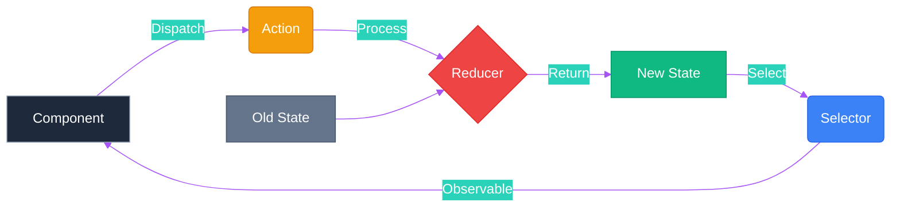
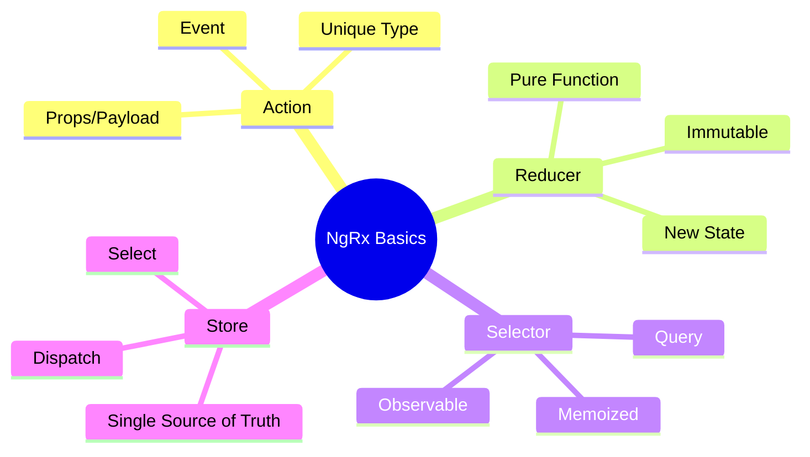

# 🏬 Use Case 1: Store Basics

> **💡 Lightbulb Moment**: The Store is just a **client-side database**. Actions are "transactions", Reducers are "database updates", and Selectors are "SQL queries".

---

## 1. 🔍 How It Works (The Concept)

### The Redux Pattern
Instead of components managing their own state (chaos 🌪️), a central store manages specific slices of state (order 🏛️).

1.  **Action**: Describes an event (e.g., "Login Button Clicked").
2.  **Reducer**: Pure function that takes current state + action and returns **new state**.
3.  **Selector**: Pure function that grabs a slice of state to give to components.
4.  **Store**: The container that holds the state.

### 📊 Data Flow Diagram



---

## 2. 🚀 Step-by-Step Implementation Guide

### Step 1: Define Actions
Think of these as the **commands** your app can understand.

```typescript
// store/counter.actions.ts
import { createAction, props } from '@ngrx/store';

// 🛡️ CRITICAL: Naming convention '[Source] Event' for debugging
export const increment = createAction('[Counter] Increment');
export const decrement = createAction('[Counter] Decrement');
export const reset = createAction('[Counter] Reset');
```

### Step 2: Create Reducer
The **logic** that handles the commands.

```typescript
// store/counter.reducer.ts
import { createReducer, on } from '@ngrx/store';
import { increment, decrement, reset } from './counter.actions';

export const initialState = { count: 0 };

export const counterReducer = createReducer(
    initialState,
    // 🛡️ CRITICAL: IMMUTABLE updates (never modify state directly)
    on(increment, state => ({ ...state, count: state.count + 1 })),
    on(decrement, state => ({ ...state, count: state.count - 1 })),
    on(reset, state => ({ ...state, count: 0 }))
);
```

### Step 3: Create Selectors
The **queries** to get data back out.

```typescript
// store/counter.selectors.ts
import { createSelector, createFeatureSelector } from '@ngrx/store';

export const selectFeature = createFeatureSelector<{count: number}>('counter');

export const selectCount = createSelector(
    selectFeature,
    (state) => state.count
);
```

### Step 4: Component Integration
Connecting the UI to the Store.

```typescript
// components/store-basics.component.ts
@Component({ ... })
export class StoreBasicsComponent {
    private store = inject(Store);
    
    // Select data (Observable stream)
    count$ = this.store.select(selectCount);
    
    increment() {
        // Dispatch action
        this.store.dispatch(increment());
    }
}
```

---

## 3. 🐛 Common Pitfalls & Debugging

### ❌ Bad Example: Mutating State

```typescript
on(increment, state => {
    // ☠️ ERROR: Modifying state directly!
    state.count = state.count + 1;
    return state;
})
```

### ✅ Good Example: Returning New State

```typescript
on(increment, state => ({
    // ✅ Spread operator creates shallow copy
    ...state,
    count: state.count + 1
}))
```

**Why it fails?** Angular and NgRx rely on reference changes (`===` check) to know if data changed. If you mutate the object in place, the reference stays the same, and your **UI will not update**.

---

## 4. ⚡ Performance & Architecture

### Performance Benefits
1.  **OnPush Change Detection**: Since Observables and async pipe handle updates, you can use `ChangeDetectionStrategy.OnPush` everywhere.
2.  **Memoization**: Selectors are **memoized**. If the state hasn't changed, the selector returns the *cached* result instantly without recomputing logic.

### Architecture Place
- **Smart Components**: Connect to Store (dispatch/select).
- **Dumb Components**: Receive `@Input` data and emit `@Output` events (no store dependency).

```
[Store] <==> [Smart Component] ==> [Dumb Component]
```

---

## 5. 🌍 Real World Use Cases

1.  **User Session State**: `user`, `role`, `token`, `isLoggedIn` accessible everywhere.
2.  **Shopping Cart**: Items added from product page, visible in header cart count, manageable in checkout page.
3.  **App Configuration**: Theme settings, language preferences, sidebar collapse state.

---

## 🍝 Restaurant Analogy (Easy to Remember!)

Think of NgRx like a **restaurant operation**:

| Concept | Restaurant Analogy | Memory Trick |
|---------|--------------------|---------------|
| **Store** | 🏭 **Kitchen**: Central place where all food/state lives | **"The hub"** |
| **Action** | 📝 **Order ticket**: "Table 5 wants pizza" | **"What happened"** |
| **Reducer** | 👨‍🍳 **Chef**: Takes order + ingredients, creates dish | **"State updater"** |
| **Selector** | 🧑‍🍳 **Waiter**: Brings finished dish to table | **"Data query"** |
| **Effect** | 🚨 **Supplier run**: "We're out of cheese, call supplier" | **"Side effects"** |

### 📖 Story to Remember:

> 🍝 **A Night at Restaurant Angular**
>
> You're a customer (component) ordering food:
>
> **The Flow:**
> ```
> 1. You (Component) → "I want a pizza!" (dispatch Action)
>    
> 2. Waiter takes order to Kitchen (Store receives Action)
>    
> 3. Chef (Reducer) looks at:
>    - Current ingredients (current state)
>    - Order ticket (action)
>    - Creates new dish (returns new state)
>    
> 4. Waiter (Selector) brings pizza to your table
>    - store.select(selectPizza) → Observable<Pizza>
>    
> 5. Side tasks (Effects):
>    - "Cheese ran out? Order more from supplier (API call)"
> ```
>
> **Chef NEVER leaves kitchen. Chef NEVER calls suppliers. Pure cooking only!**

### 🎯 Quick Reference:
```
🏭 Store    = Kitchen (central state container)
📝 Action   = Order ticket ("what happened")
👨‍🍳 Reducer  = Chef (pure state updates)
🧑‍🍳 Selector = Waiter (queries state for component)
🚨 Effect   = Supplier calls (side effects, API calls)
```

---

## 7. ❓ Interview & Concept Questions

### Basic Questions

**Q1: Why use NgRx instead of a simple Service with BehaviorSubject?**
> A: Services are great for simple state. NgRx provides structure, debugging (Redux DevTools), strict one-way data flow, and separation of concerns (side effects vs state updates) crucial for large enterprise apps.

**Q2: What is a "Pure Function" in the context of Reducers?**
> A: A function that given the same input (state + action) always returns the same output, without any side effects (API calls, changing global vars).

**Q3: The UI isn't updating but the action is dispatched. Why?**
> A: Likely state mutation in the reducer. Ensure you return a **new object** (`...state`) instead of modifying `state`. Also check if the selector is correctly looking at the right feature slice.

**Q4: Can I handle API calls in Reducers?**
> A: **NO!** Reducers must be synchronous and pure. API calls belong in **Effects**.

**Q5: What is Selector Memoization?**
> A: It's a caching mechanism. If the inputs to a selector haven't changed, it returns the last calculated value without re-running the function, saving CPU cycles.

---

### Scenario-Based Questions

#### Scenario 1: Shopping Cart
**Question:** Design the actions and state for a shopping cart that can add items, remove items, update quantity, and clear cart.

**Answer:**
```typescript
// Actions
export const addToCart = createAction('[Cart] Add Item', props<{ product: Product, quantity: number }>());
export const removeFromCart = createAction('[Cart] Remove Item', props<{ productId: string }>());
export const updateQuantity = createAction('[Cart] Update Quantity', props<{ productId: string, quantity: number }>());
export const clearCart = createAction('[Cart] Clear');

// State
interface CartState {
    items: CartItem[];
    totalQuantity: number;
    totalPrice: number;
}

// Reducer
on(addToCart, (state, { product, quantity }) => {
    const existing = state.items.find(i => i.productId === product.id);
    if (existing) {
        return {
            ...state,
            items: state.items.map(i => 
                i.productId === product.id 
                    ? { ...i, quantity: i.quantity + quantity }
                    : i
            )
        };
    }
    return {
        ...state,
        items: [...state.items, { productId: product.id, name: product.name, price: product.price, quantity }]
    };
})
```

---

#### Scenario 2: Optimistic Updates
**Question:** User clicks "Like" button. Update UI immediately, but if API fails, rollback.

**Answer:**
```typescript
// Actions
export const likePost = createAction('[Post] Like', props<{ postId: string }>());
export const likePostSuccess = createAction('[Post] Like Success', props<{ postId: string }>());
export const likePostFailure = createAction('[Post] Like Failure', props<{ postId: string, previousLikes: number }>());

// Reducer - Optimistically increment
on(likePost, (state, { postId }) => ({
    ...state,
    posts: state.posts.map(p => 
        p.id === postId ? { ...p, likes: p.likes + 1 } : p
    )
}))

// Reducer - Rollback on failure
on(likePostFailure, (state, { postId, previousLikes }) => ({
    ...state,
    posts: state.posts.map(p => 
        p.id === postId ? { ...p, likes: previousLikes } : p
    )
}))
```

---

#### Scenario 3: Loading Multiple Entities
**Question:** Dashboard needs to load users, products, and orders. How do you track loading state for each?

**Answer:**
```typescript
interface AppState {
    users: { data: User[], loading: boolean, error: string | null };
    products: { data: Product[], loading: boolean, error: string | null };
    orders: { data: Order[], loading: boolean, error: string | null };
}

// Selectors
export const selectUsersLoading = createSelector(selectUserState, state => state.loading);
export const selectProductsLoading = createSelector(selectProductState, state => state.loading);

// Combined loading selector
export const selectDashboardLoading = createSelector(
    selectUsersLoading,
    selectProductsLoading,
    selectOrdersLoading,
    (u, p, o) => u || p || o  // True if ANY is loading
);
```

---

#### Scenario 4: Derived State
**Question:** You have a list of items with prices. Create a selector that computes total, tax, and grand total.

**Answer:**
```typescript
export const selectCartItems = createSelector(selectCartState, state => state.items);

export const selectSubtotal = createSelector(
    selectCartItems,
    items => items.reduce((sum, item) => sum + (item.price * item.quantity), 0)
);

export const selectTax = createSelector(
    selectSubtotal,
    subtotal => subtotal * 0.1  // 10% tax
);

export const selectGrandTotal = createSelector(
    selectSubtotal,
    selectTax,
    (subtotal, tax) => subtotal + tax
);
```
**Why selectors?** Memoization! If items haven't changed, tax doesn't recompute.

---

### Advanced Questions

**Q6: When would you use `createFeatureSelector` vs direct selector?**
> A: `createFeatureSelector` is for top-level feature slices registered with `StoreModule.forFeature()`. It provides type safety and simplifies accessing nested state.

**Q7: How do you combine multiple reducers?**
> A: Use `ActionReducerMap` for root state:
```typescript
export const reducers: ActionReducerMap<AppState> = {
    counter: counterReducer,
    users: userReducer
};
```

**Q8: What's the difference between State and ViewModel?**
> A: State is the raw data in store. ViewModel is derived/computed data for the UI (from selectors). Keep state normalized, derive complex structures via selectors.

---

## 🧠 Mind Map



