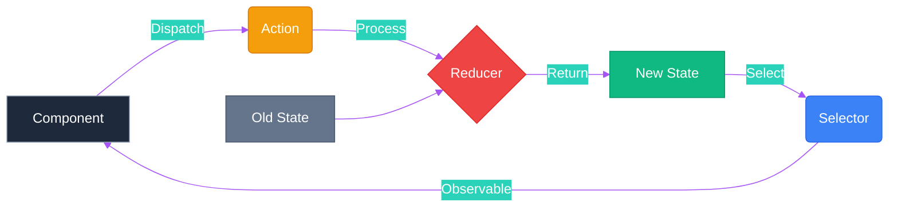
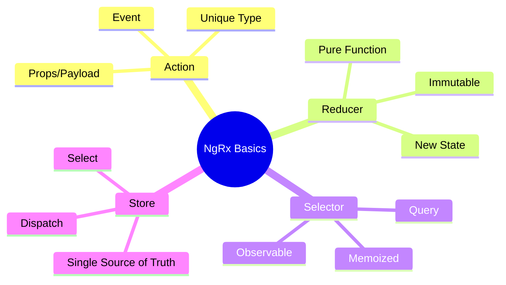

# 🏬 Use Case 1: Store Basics

> **💡 Lightbulb Moment**: The Store is just a **client-side database**. Actions are "transactions", Reducers are "database updates", and Selectors are "SQL queries".

---

## 1. 🔍 How It Works (The Concept)

### The Redux Pattern
Instead of components managing their own state (chaos 🌪️), a central store manages specific slices of state (order 🏛️).

1.  **Action**: Describes an event (e.g., "Login Button Clicked").
2.  **Reducer**: Pure function that takes current state + action and returns **new state**.
3.  **Selector**: Pure function that grabs a slice of state to give to components.
4.  **Store**: The container that holds the state.

### 📊 Data Flow Diagram



---

## 2. 🚀 Step-by-Step Implementation Guide

### Step 1: Define Actions
Think of these as the **commands** your app can understand.

```typescript
// store/counter.actions.ts
import { createAction, props } from '@ngrx/store';

// 🛡️ CRITICAL: Naming convention '[Source] Event' for debugging
export const increment = createAction('[Counter] Increment');
export const decrement = createAction('[Counter] Decrement');
export const reset = createAction('[Counter] Reset');
```

### Step 2: Create Reducer
The **logic** that handles the commands.

```typescript
// store/counter.reducer.ts
import { createReducer, on } from '@ngrx/store';
import { increment, decrement, reset } from './counter.actions';

export const initialState = { count: 0 };

export const counterReducer = createReducer(
    initialState,
    // 🛡️ CRITICAL: IMMUTABLE updates (never modify state directly)
    on(increment, state => ({ ...state, count: state.count + 1 })),
    on(decrement, state => ({ ...state, count: state.count - 1 })),
    on(reset, state => ({ ...state, count: 0 }))
);
```

### Step 3: Create Selectors
The **queries** to get data back out.

```typescript
// store/counter.selectors.ts
import { createSelector, createFeatureSelector } from '@ngrx/store';

export const selectFeature = createFeatureSelector<{count: number}>('counter');

export const selectCount = createSelector(
    selectFeature,
    (state) => state.count
);
```

### Step 4: Component Integration
Connecting the UI to the Store.

```typescript
// components/store-basics.component.ts
@Component({ ... })
export class StoreBasicsComponent {
    private store = inject(Store);
    
    // Select data (Observable stream)
    count$ = this.store.select(selectCount);
    
    increment() {
        // Dispatch action
        this.store.dispatch(increment());
    }
}
```

---

## 3. 🐛 Common Pitfalls & Debugging

### ❌ Bad Example: Mutating State

```typescript
on(increment, state => {
    // ☠️ ERROR: Modifying state directly!
    state.count = state.count + 1;
    return state;
})
```

### ✅ Good Example: Returning New State

```typescript
on(increment, state => ({
    // ✅ Spread operator creates shallow copy
    ...state,
    count: state.count + 1
}))
```

**Why it fails?** Angular and NgRx rely on reference changes (`===` check) to know if data changed. If you mutate the object in place, the reference stays the same, and your **UI will not update**.

---

## 4. ⚡ Performance & Architecture

### Performance Benefits
1.  **OnPush Change Detection**: Since Observables and async pipe handle updates, you can use `ChangeDetectionStrategy.OnPush` everywhere.
2.  **Memoization**: Selectors are **memoized**. If the state hasn't changed, the selector returns the *cached* result instantly without recomputing logic.

### Architecture Place
- **Smart Components**: Connect to Store (dispatch/select).
- **Dumb Components**: Receive `@Input` data and emit `@Output` events (no store dependency).

```
[Store] <==> [Smart Component] ==> [Dumb Component]
```

---

## 5. 🌍 Real World Use Cases

1.  **User Session State**: `user`, `role`, `token`, `isLoggedIn` accessible everywhere.
2.  **Shopping Cart**: Items added from product page, visible in header cart count, manageable in checkout page.
3.  **App Configuration**: Theme settings, language preferences, sidebar collapse state.

---

## 6. 📝 The Analogy

> **The "Restaurant" Analogy 🍽️**
>
> - **Component (You)**: You are a customer. You don't cook the food yourself.
> - **Action (Order)**: You place an order (`dispatch(orderPizza())`).
> - **Reducer (Chef)**: The chef takes the order and existing ingredients (state) and prepares a new dish (new state).
> - **Store (Kitchen)**: The place where all ingredients and chefs live.
> - **Selector (Waiter)**: Brings the finished dish back to your table.

---

## 7. ❓ Interview & Concept Questions

### Core Concepts

**Q1: Why use NgRx instead of a simple Service with BehaviorSubject?**
> A: Services are great for simple state. NgRx provides structure, debugging (Redux DevTools), strict one-way data flow, and separation of concerns (side effects vs state updates) crucial for large enterprise apps.

**Q2: What is a "Pure Function" in the context of Reducers?**
> A: A function that given the same input (state + action) always returns the same output, without any side effects (API calls, changing global vars).

### Debugging

**Q3: The UI isn't updating but the action is dispatched. Why?**
> A: Likely state mutation in the reducer. Ensure you return a **new object** (`...state`) instead of modifying `state`. Also check if the selector is correctly looking at the right feature slice.

### Implementation

**Q4: Can I handle API calls in Reducers?**
> A: **NO!** Reducers must be synchronous and pure. API calls belong in **Effects**.

### Performance

**Q5: What is Selector Memoization?**
> A: It's a caching mechanism. If the inputs to a selector haven't changed, it returns the last calculated value without re-running the function, saving CPU cycles.

---

## 🧠 Mind Map


