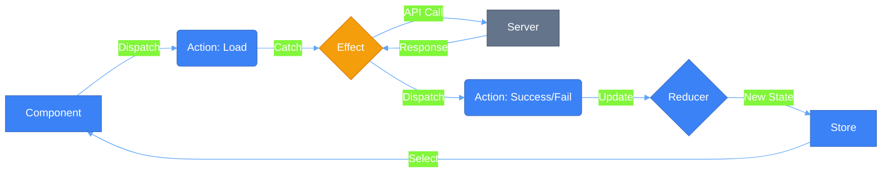
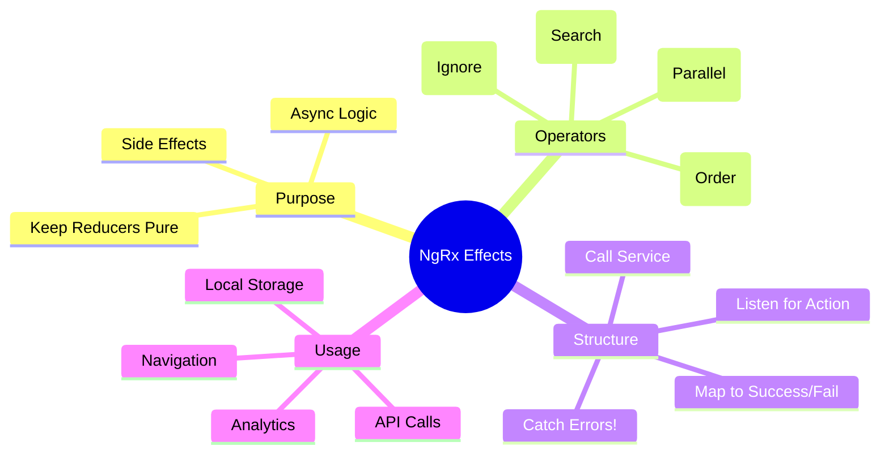

# ⚡ Use Case 2: Effects (Async Operations)

> **💡 Lightbulb Moment**: Reducers are for **State**, Effects are for **Side Effects**. If it involves an API call, a timer, or local storage, it belongs in an Effect!

---

## 1. 🔍 How It Works (The Concept)

### The Effects Loop
Effects provide a way to interact with services and isolate them from your components.

1.  **Component** dispatches `Load Users`.
2.  **Effect** listens for `Load Users`, calls API.
3.  **API** returns data.
4.  **Effect** dispatches `Load Success` (with data) or `Load Failure` (with error).
5.  **Reducer** listens for `Success`/`Failure` and updates state.

### 📊 Data Flow Diagram



---

## 2. 🚀 Step-by-Step Implementation Guide

### Step 1: Define 3 Actions (The Triad)
For every API call, you need three actions: Trigger, Success, Failure.

```typescript
// store/user.actions.ts
export const loadUsers = createAction('[User] Load');
export const loadSuccess = createAction('[User] Success', props<{ users: User[] }>());
export const loadFailure = createAction('[User] Failure', props<{ error: string }>());
```

### Step 2: Create the Effect
Isolate the side effect.

```typescript
// store/user.effects.ts
@Injectable()
export class UserEffects {
    private actions$ = inject(Actions);
    private service = inject(UserService);

    loadUsers$ = createEffect(() => 
        this.actions$.pipe(
            // 1. Listen for specific action
            ofType(loadUsers),
            // 2. Switch/Merge Map to Service
            mergeMap(() => this.service.getUsers().pipe(
                // 3. Map success to Action
                map(users => loadSuccess({ users })),
                // 4. Catch error to Action
                catchError(error => of(loadFailure({ error: error.message })))
            ))
        )
    );
}
```

### Step 3: Handle in Reducer
Update state based on the result.

```typescript
// store/user.reducer.ts
on(loadUsers, state => ({ ...state, loading: true, error: null })),
on(loadSuccess, (state, { users }) => ({ ...state, loading: false, users })),
on(loadFailure, (state, { error }) => ({ ...state, loading: false, error }))
```

---

## 3. 🐛 Common Pitfalls & Debugging

### ❌ Bad Example: No Error Handling
```typescript
mergeMap(() => this.service.getUsers().pipe(
    map(users => loadSuccess({ users }))
    // ☠️ MISSING CATCHERROR
))
```
**Why it fails?** If the HTTP request fails, the Observable stream **completes/dies**. Your effect will stop working for future actions. Always `catchError` inside the inner pipe!

### ✅ Good Example: Nested Pipe
```typescript
mergeMap(() => this.service.getUsers().pipe(
    map(...),
    catchError(...) // ✅ Returns a new Observable (Action), doesn't kill the stream
))
```

---

## 4. ⚡ Performance & Architecture

### SwitchMap vs MergeMap
*   **switchMap**: Cancels previous request if a new one comes in. Great for Search!
*   **mergeMap**: Handles all requests in parallel. Good for "Delete" or independent loads.
*   **concatMap**: Handles requests one by one. Good for ordering (Save, then Load).
*   **exhaustMap**: Ignores new requests while one is running. Good for "Refresh" buttons.

### Architecture
Effects keep your components **pure**. Your component handles user input (`dispatch`) and rendering (`select`). It doesn't know about HTTP, local storage, or web sockets.

---

## 5. 🌍 Real World Use Cases

1.  **API Data Loading**: Fetching products, user profile, dashboards.
2.  **Auto-Save**: Listen for `[Form] Update`, debounce 1s, call API save.
3.  **Analytics**: Listen for *any* action (e.g., `Navigation`), send data to Google Analytics (fire-and-forget).

---

## 6. 📝 The Analogy

> **The "Butler" Analogy 🤵**
>
> - **Component (You)**: "Jeeves, I'm hungry." (Dispatch `Hungry` action).
> - **Effect (Jeeves)**: You don't know *how* Jeeves gets food. He might cook, call pizza, or go to the store. You just wait.
> - **Jeeves**: Goes out, handles the complexities (traffic, payment).
> - **Result**: Jeeves dispatches `Food Arrived` action with the pizza.
> - **Reducer**: Puts the pizza on the table (State).

---

## 7. ❓ Interview & Concept Questions

### Basic Questions

**Q1: Why not call the service directly in the Component?**
> A: Separation of concerns. Components should be about UI. Moving logic to Effects makes components easier to test and reuse, and centralizes side effects management.

**Q2: What happens if I forget `catchError` in an Effect?**
> A: The effect stream will error out and complete. It will stop listening for new actions until the application is reloaded.

**Q3: Can an Effect dispatch multiple actions?**
> A: Yes! return `switchMap(() => [action1(), action2()])` or use `switchMap` returning an array of actions.

**Q4: Do Effects always handle Observables?**
> A: Mostly, but you can create "Non-dispatching" effects (`{ dispatch: false }`) for things that don't return an action, like `localStorage.setItem` or `console.log`.

---

### Scenario-Based Questions

#### Scenario 1: Type-ahead Search
**Question:** Implement a search feature that: waits 300ms after typing, doesn't search for same query twice, cancels pending requests when new search starts.

**Answer:**
```typescript
search$ = createEffect(() => 
    this.actions$.pipe(
        ofType(searchProducts),
        debounceTime(300),              // Wait 300ms
        distinctUntilChanged((prev, curr) => 
            prev.query === curr.query    // Skip if same query
        ),
        switchMap(({ query }) =>        // Cancel previous
            this.productService.search(query).pipe(
                map(results => searchSuccess({ results })),
                catchError(error => of(searchFailure({ error: error.message })))
            )
        )
    )
);
```

---

#### Scenario 2: Retry with Backoff
**Question:** API is flaky. Retry 3 times with exponential backoff before failing.

**Answer:**
```typescript
loadData$ = createEffect(() =>
    this.actions$.pipe(
        ofType(loadData),
        mergeMap(() =>
            this.api.getData().pipe(
                retry({
                    count: 3,
                    delay: (error, retryCount) => timer(Math.pow(2, retryCount) * 1000)
                }),
                map(data => loadDataSuccess({ data })),
                catchError(error => of(loadDataFailure({ error: error.message })))
            )
        )
    )
);
```

---

#### Scenario 3: Chain of API Calls
**Question:** After creating a user, automatically load their profile and permissions.

**Answer:**
```typescript
// Effect that chains multiple API calls
createUser$ = createEffect(() =>
    this.actions$.pipe(
        ofType(createUser),
        mergeMap(({ userData }) =>
            this.userService.create(userData).pipe(
                switchMap(user => forkJoin({
                    profile: this.profileService.load(user.id),
                    permissions: this.permService.load(user.id)
                }).pipe(
                    map(({ profile, permissions }) => 
                        createUserComplete({ user, profile, permissions })
                    )
                )),
                catchError(error => of(createUserFailure({ error })))
            )
        )
    )
);
```

---

#### Scenario 4: Prevent Double Submit
**Question:** Prevent user from clicking "Save" multiple times while request is in progress.

**Answer:**
```typescript
saveForm$ = createEffect(() =>
    this.actions$.pipe(
        ofType(saveForm),
        exhaustMap(({ formData }) =>  // Ignores new clicks while busy
            this.formService.save(formData).pipe(
                map(result => saveFormSuccess({ result })),
                catchError(error => of(saveFormFailure({ error })))
            )
        )
    )
);
```
**Why exhaustMap?** It ignores new emissions while the inner Observable is still running.

---

#### Scenario 5: Navigation After Success
**Question:** After successful login, redirect to dashboard.

**Answer:**
```typescript
loginSuccess$ = createEffect(() =>
    this.actions$.pipe(
        ofType(loginSuccess),
        tap(() => this.router.navigate(['/dashboard']))
    ),
    { dispatch: false }  // No action dispatched
);
```

---

#### Scenario 6: Polling
**Question:** Poll API every 30 seconds for updates while user is on dashboard.

**Answer:**
```typescript
startPolling$ = createEffect(() =>
    this.actions$.pipe(
        ofType(startDashboardPolling),
        switchMap(() => 
            interval(30000).pipe(
                takeUntil(this.actions$.pipe(ofType(stopDashboardPolling))),
                mergeMap(() => this.api.getUpdates().pipe(
                    map(updates => pollingSuccess({ updates })),
                    catchError(() => EMPTY)  // Silently ignore polling errors
                ))
            )
        )
    )
);
```

---

### Advanced Questions

**Q5: What's the difference between switchMap, mergeMap, concatMap, exhaustMap?**
> A:
| Operator | Behavior | Use Case |
|----------|----------|----------|
| `switchMap` | Cancels previous | Search, autocomplete |
| `mergeMap` | Runs all in parallel | Independent loads |
| `concatMap` | Queues in order | Sequential saves |
| `exhaustMap` | Ignores while busy | Prevent double-click |

**Q6: How do you unit test an Effect?**
> A: Use `provideMockActions()` and marble testing:
```typescript
it('should load users', () => {
    actions$ = hot('-a', { a: loadUsers() });
    const expected = cold('-b', { b: loadUsersSuccess({ users: mockUsers }) });
    
    expect(effects.loadUsers$).toBeObservable(expected);
});
```

**Q7: Can Effects listen to multiple actions?**
> A: Yes! Use `ofType(action1, action2, action3)` to listen for any of them.

---

## 🧠 Mind Map



