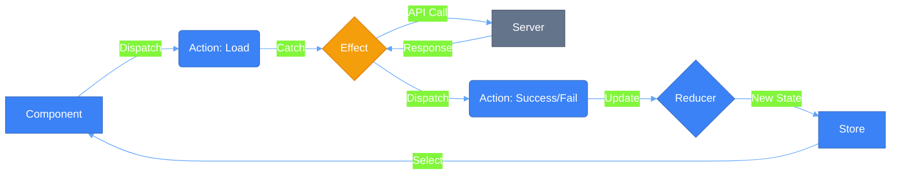
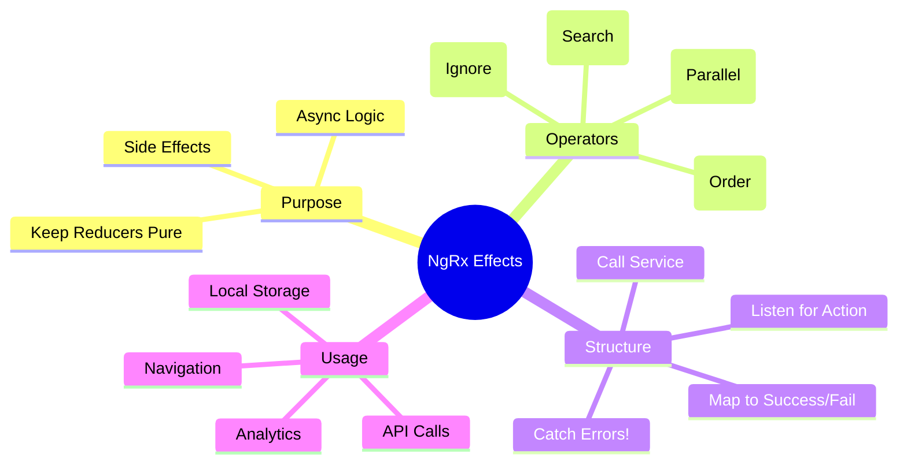

# ⚡ Use Case 2: Effects (Async Operations)

> **💡 Lightbulb Moment**: Reducers are for **State**, Effects are for **Side Effects**. If it involves an API call, a timer, or local storage, it belongs in an Effect!

## 📊 NgRx Effects - Visual Flow


---

## 1. 🔍 How It Works (The Concept)

### The Effects Loop
Effects provide a way to interact with services and isolate them from your components.

1.  **Component** dispatches `Load Users`.
2.  **Effect** listens for `Load Users`, calls API.
3.  **API** returns data.
4.  **Effect** dispatches `Load Success` (with data) or `Load Failure` (with error).
5.  **Reducer** listens for `Success`/`Failure` and updates state.

### 📊 Data Flow Diagram



---

## 2. 🚀 Step-by-Step Implementation Guide

### Step 1: Define 3 Actions (The Triad)
For every API call, you need three actions: Trigger, Success, Failure.

```typescript
// store/user.actions.ts
export const loadUsers = createAction('[User] Load');
export const loadSuccess = createAction('[User] Success', props<{ users: User[] }>());
export const loadFailure = createAction('[User] Failure', props<{ error: string }>());
```

### Step 2: Create the Effect
Isolate the side effect.

```typescript
// store/user.effects.ts
@Injectable()
export class UserEffects {
    private actions$ = inject(Actions);
    private service = inject(UserService);

    loadUsers$ = createEffect(() => 
        this.actions$.pipe(
            // 1. Listen for specific action
            ofType(loadUsers),
            // 2. Switch/Merge Map to Service
            mergeMap(() => this.service.getUsers().pipe(
                // 3. Map success to Action
                map(users => loadSuccess({ users })),
                // 4. Catch error to Action
                catchError(error => of(loadFailure({ error: error.message })))
            ))
        )
    );
}
```

### Step 3: Handle in Reducer
Update state based on the result.

```typescript
// store/user.reducer.ts
on(loadUsers, state => ({ ...state, loading: true, error: null })),
on(loadSuccess, (state, { users }) => ({ ...state, loading: false, users })),
on(loadFailure, (state, { error }) => ({ ...state, loading: false, error }))
```

---

## 3. 🐛 Common Pitfalls & Debugging

### ❌ Bad Example: No Error Handling
```typescript
mergeMap(() => this.service.getUsers().pipe(
    map(users => loadSuccess({ users }))
    // ☠️ MISSING CATCHERROR
))
```
**Why it fails?** If the HTTP request fails, the Observable stream **completes/dies**. Your effect will stop working for future actions. Always `catchError` inside the inner pipe!

### ✅ Good Example: Nested Pipe
```typescript
mergeMap(() => this.service.getUsers().pipe(
    map(...),
    catchError(...) // ✅ Returns a new Observable (Action), doesn't kill the stream
))
```

---

## 4. ⚡ Performance & Architecture

### SwitchMap vs MergeMap
*   **switchMap**: Cancels previous request if a new one comes in. Great for Search!
*   **mergeMap**: Handles all requests in parallel. Good for "Delete" or independent loads.
*   **concatMap**: Handles requests one by one. Good for ordering (Save, then Load).
*   **exhaustMap**: Ignores new requests while one is running. Good for "Refresh" buttons.

### Architecture
Effects keep your components **pure**. Your component handles user input (`dispatch`) and rendering (`select`). It doesn't know about HTTP, local storage, or web sockets.

---

## 5. 🌍 Real World Use Cases

1.  **API Data Loading**: Fetching products, user profile, dashboards.
2.  **Auto-Save**: Listen for `[Form] Update`, debounce 1s, call API save.
3.  **Analytics**: Listen for *any* action (e.g., `Navigation`), send data to Google Analytics (fire-and-forget).

---

## 🤵 Butler Analogy (Easy to Remember!)

Think of NgRx Effects like your **personal butler Jeeves**:

| Concept | Butler Analogy | Memory Trick |
|---------|-----------------|--------------|
| **Component** | 👤 **You (the master)**: "Jeeves, I'm hungry" | **"Make requests"** |
| **Effect** | 🤵 **Jeeves (butler)**: Handles all the complex work | **"Does the dirty work"** |
| **Service call** | 🏭 **Kitchen/Delivery**: Where food actually comes from | **"External service"** |
| **Success action** | 🍕 **"Food arrived"**: Jeeves returns with pizza | **"Good result"** |
| **Failure action** | ❌ **"Sorry, kitchen closed"**: Jeeves reports problem | **"Error result"** |

### 📖 Story to Remember:

> 🤵 **A Day with Jeeves the Butler**
>
> You're the master (component). You don't cook. You don't shop. You just ask:
>
> **The Request:**
> ```typescript
> // You: "Jeeves, I'm hungry!"
> this.store.dispatch(loadFood());
> 
> // You don't know if Jeeves will:
> // - Cook himself
> // - Order delivery
> // - Go to restaurant
> // You just wait...
> ```
>
> **Jeeves Handles Everything:**
> ```typescript
> // Effect = Jeeves
> loadFood$ = createEffect(() =>
>   this.actions$.pipe(
>     ofType(loadFood),           // "Master is hungry"
>     mergeMap(() =>
>       this.kitchen.orderPizza() // Go get food (API call)
>         .pipe(
>           map(pizza => foodArrived({ pizza })),  // Success!
>           catchError(err => of(kitchenClosed())) // Failed!
>         )
>     )
>   )
> );
> ```
>
> **You never leave your chair. Jeeves does all the work!**

### 🎯 Quick Reference:
```
👤 Component   = Master (makes requests)
🤵 Effect      = Butler (handles async)
🏭 Service     = Kitchen (external resource)
🍕 Success     = Food arrived
❌ Failure     = Kitchen closed
```

---

## 7. ❓ Interview & Concept Questions

### Basic Questions

**Q1: Why not call the service directly in the Component?**
> A: Separation of concerns. Components should be about UI. Moving logic to Effects makes components easier to test and reuse, and centralizes side effects management.

**Q2: What happens if I forget `catchError` in an Effect?**
> A: The effect stream will error out and complete. It will stop listening for new actions until the application is reloaded.

**Q3: Can an Effect dispatch multiple actions?**
> A: Yes! return `switchMap(() => [action1(), action2()])` or use `switchMap` returning an array of actions.

**Q4: Do Effects always handle Observables?**
> A: Mostly, but you can create "Non-dispatching" effects (`{ dispatch: false }`) for things that don't return an action, like `localStorage.setItem` or `console.log`.

---

### Scenario-Based Questions

#### Scenario 1: Type-ahead Search
**Question:** Implement a search feature that: waits 300ms after typing, doesn't search for same query twice, cancels pending requests when new search starts.

**Answer:**
```typescript
search$ = createEffect(() => 
    this.actions$.pipe(
        ofType(searchProducts),
        debounceTime(300),              // Wait 300ms
        distinctUntilChanged((prev, curr) => 
            prev.query === curr.query    // Skip if same query
        ),
        switchMap(({ query }) =>        // Cancel previous
            this.productService.search(query).pipe(
                map(results => searchSuccess({ results })),
                catchError(error => of(searchFailure({ error: error.message })))
            )
        )
    )
);
```

---

#### Scenario 2: Retry with Backoff
**Question:** API is flaky. Retry 3 times with exponential backoff before failing.

**Answer:**
```typescript
loadData$ = createEffect(() =>
    this.actions$.pipe(
        ofType(loadData),
        mergeMap(() =>
            this.api.getData().pipe(
                retry({
                    count: 3,
                    delay: (error, retryCount) => timer(Math.pow(2, retryCount) * 1000)
                }),
                map(data => loadDataSuccess({ data })),
                catchError(error => of(loadDataFailure({ error: error.message })))
            )
        )
    )
);
```

---

#### Scenario 3: Chain of API Calls
**Question:** After creating a user, automatically load their profile and permissions.

**Answer:**
```typescript
// Effect that chains multiple API calls
createUser$ = createEffect(() =>
    this.actions$.pipe(
        ofType(createUser),
        mergeMap(({ userData }) =>
            this.userService.create(userData).pipe(
                switchMap(user => forkJoin({
                    profile: this.profileService.load(user.id),
                    permissions: this.permService.load(user.id)
                }).pipe(
                    map(({ profile, permissions }) => 
                        createUserComplete({ user, profile, permissions })
                    )
                )),
                catchError(error => of(createUserFailure({ error })))
            )
        )
    )
);
```

---

#### Scenario 4: Prevent Double Submit
**Question:** Prevent user from clicking "Save" multiple times while request is in progress.

**Answer:**
```typescript
saveForm$ = createEffect(() =>
    this.actions$.pipe(
        ofType(saveForm),
        exhaustMap(({ formData }) =>  // Ignores new clicks while busy
            this.formService.save(formData).pipe(
                map(result => saveFormSuccess({ result })),
                catchError(error => of(saveFormFailure({ error })))
            )
        )
    )
);
```
**Why exhaustMap?** It ignores new emissions while the inner Observable is still running.

---

#### Scenario 5: Navigation After Success
**Question:** After successful login, redirect to dashboard.

**Answer:**
```typescript
loginSuccess$ = createEffect(() =>
    this.actions$.pipe(
        ofType(loginSuccess),
        tap(() => this.router.navigate(['/dashboard']))
    ),
    { dispatch: false }  // No action dispatched
);
```

---

#### Scenario 6: Polling
**Question:** Poll API every 30 seconds for updates while user is on dashboard.

**Answer:**
```typescript
startPolling$ = createEffect(() =>
    this.actions$.pipe(
        ofType(startDashboardPolling),
        switchMap(() => 
            interval(30000).pipe(
                takeUntil(this.actions$.pipe(ofType(stopDashboardPolling))),
                mergeMap(() => this.api.getUpdates().pipe(
                    map(updates => pollingSuccess({ updates })),
                    catchError(() => EMPTY)  // Silently ignore polling errors
                ))
            )
        )
    )
);
```

---

### Advanced Questions

**Q5: What's the difference between switchMap, mergeMap, concatMap, exhaustMap?**
> A:
| Operator | Behavior | Use Case |
|----------|----------|----------|
| `switchMap` | Cancels previous | Search, autocomplete |
| `mergeMap` | Runs all in parallel | Independent loads |
| `concatMap` | Queues in order | Sequential saves |
| `exhaustMap` | Ignores while busy | Prevent double-click |

**Q6: How do you unit test an Effect?**
> A: Use `provideMockActions()` and marble testing:
```typescript
it('should load users', () => {
    actions$ = hot('-a', { a: loadUsers() });
    const expected = cold('-b', { b: loadUsersSuccess({ users: mockUsers }) });
    
    expect(effects.loadUsers$).toBeObservable(expected);
});
```

**Q7: Can Effects listen to multiple actions?**
> A: Yes! Use `ofType(action1, action2, action3)` to listen for any of them.

---

## 🧠 Mind Map



---

## 🎯 What Problem Does This Solve?

### The Problem: Side Effects Break the Redux Pattern

In pure Redux, reducers must be:
- **Pure functions**: Same input = same output
- **Synchronous**: No async operations
- **No side effects**: No API calls, localStorage, logging

But real apps NEED side effects:
- Fetching data from APIs
- Saving to localStorage
- Redirecting after login
- Sending analytics events

**❌ Without Effects (BAD):**
```typescript
// Component - doing too much!
async loadUsers() {
    this.loading = true;
    try {
        const users = await this.userService.getUsers();
        this.store.dispatch(setUsers({ users }));
    } catch (e) {
        this.store.dispatch(setError({ error: e.message }));
    } finally {
        this.loading = false;
    }
}
```
**Problems:**
- Component knows about HTTP, error handling, loading state
- Logic duplicated across components
- Hard to test
- No centralized error handling

**✅ With Effects (GOOD):**
```typescript
// Component - simple and clean!
loadUsers() {
    this.store.dispatch(loadUsers());  // That's it!
}

// Effect handles ALL the complexity
loadUsers$ = createEffect(() => 
    this.actions$.pipe(
        ofType(loadUsers),
        mergeMap(() => this.service.getUsers().pipe(
            map(users => loadUsersSuccess({ users })),
            catchError(error => of(loadUsersFailure({ error })))
        ))
    )
);
```

### How Effects Solve This

| Problem | Effect Solution |
|---------|----------------|
| Async in reducers | Effects handle async, dispatch sync actions |
| Complex component logic | Move to Effects, components just dispatch |
| Error handling everywhere | Centralized in Effects |
| Testing async code | Mock actions, test Effect logic |
| Code duplication | One Effect, many components can trigger |

---

## 📚 Key Classes & Types Explained

### 1. `Actions` (from `@ngrx/effects`)

```typescript
private actions$ = inject(Actions);
```

**What it is:** An Observable stream of ALL dispatched actions in the app.

**How it works:**
- Every time ANY action is dispatched, it flows through `actions$`
- Effects use `ofType()` to filter for specific actions
- Think of it as a "firehose" of events

**Type:** `Actions` is `Observable<Action>`

---

### 2. `createEffect()` (from `@ngrx/effects`)

```typescript
loadUsers$ = createEffect(() => this.actions$.pipe(...));
```

**What it is:** Factory function that creates an Effect.

**Parameters:**
- **First arg:** Function returning `Observable<Action>`
- **Second arg (optional):** Config object `{ dispatch: false }`

**How it works:**
1. NgRx subscribes to the returned Observable
2. Every value emitted is dispatched as an action
3. Non-dispatching effects use `{ dispatch: false }`

---

### 3. `ofType()` (from `@ngrx/effects`)

```typescript
ofType(loadUsers)
ofType(loadUsers, refreshUsers, retryLoad)  // Multiple
```

**What it is:** RxJS operator that filters actions by type.

**How it works:**
- Filters `actions$` stream to only matching action types
- Passes matching actions to next operator
- Ignores all other actions

**Under the hood:**
```typescript
// Equivalent to:
filter(action => action.type === '[User Page] Load Users')
```

---

### 4. `mergeMap` / `switchMap` / `concatMap` / `exhaustMap`

**Critical choice for async handling:**

| Operator | What It Does | When To Use |
|----------|--------------|-------------|
| `mergeMap` | Runs ALL in parallel | Independent operations (load this, load that) |
| `switchMap` | CANCELS previous, runs new | Search/autocomplete (only care about latest) |
| `concatMap` | Queues, runs one at a time | Order matters (save then load) |
| `exhaustMap` | IGNORES new while busy | Prevent double-submit buttons |

**Visual:**
```
User clicks: [A] [B] [C] quickly

mergeMap:    A─────→ result
             B───────→ result
             C─────────→ result  (All run)

switchMap:   A──✗ (cancelled)
             B────✗ (cancelled)
             C───────→ result   (Only last)

exhaustMap:  A─────────→ result
             B──✗ (ignored)
             C──✗ (ignored)    (Only first)
```

---

### 5. `catchError()` (from `rxjs/operators`)

```typescript
catchError(error => of(loadUsersFailure({ error: error.message })))
```

**CRITICAL:** Must be INSIDE the inner pipe, not outside!

**Why it matters:**
- Inside inner pipe: Effect stream survives, keeps working
- Outside inner pipe: Effect stream DIES, stops working forever

**Correct placement:**
```typescript
mergeMap(() => this.service.getUsers().pipe(
    map(...),
    catchError(...)  // ✅ Inside inner pipe
))
```

---

### 6. `of()` (from `rxjs`)

```typescript
catchError(error => of(loadUsersFailure({ error })))
```

**What it is:** Creates an Observable that emits one value and completes.

**Why used in catchError:**
- `catchError` must return an Observable
- `of(action)` creates Observable<Action>
- That action gets dispatched (the failure action)

---

## 🌍 Real-World Use Cases

### 1. E-commerce Product Loading
```typescript
loadProducts$ = createEffect(() =>
    this.actions$.pipe(
        ofType(loadProducts),
        switchMap(({ categoryId }) =>
            this.productApi.getByCategory(categoryId).pipe(
                map(products => loadProductsSuccess({ products })),
                catchError(error => of(loadProductsFailure({ error })))
            )
        )
    )
);
```

### 2. Authentication Flow
```typescript
login$ = createEffect(() =>
    this.actions$.pipe(
        ofType(login),
        exhaustMap(({ credentials }) =>
            this.authService.login(credentials).pipe(
                map(user => loginSuccess({ user })),
                catchError(error => of(loginFailure({ error })))
            )
        )
    )
);

// Redirect after login
loginSuccessRedirect$ = createEffect(() =>
    this.actions$.pipe(
        ofType(loginSuccess),
        tap(() => this.router.navigate(['/dashboard']))
    ),
    { dispatch: false }
);
```

### 3. Auto-Save Form
```typescript
autoSave$ = createEffect(() =>
    this.actions$.pipe(
        ofType(formValueChanged),
        debounceTime(1000),
        switchMap(({ formData }) =>
            this.formService.save(formData).pipe(
                map(() => autoSaveSuccess()),
                catchError(() => of(autoSaveFailure()))
            )
        )
    )
);
```

### 4. Real-Time Polling
```typescript
startPolling$ = createEffect(() =>
    this.actions$.pipe(
        ofType(startDashboardPolling),
        switchMap(() =>
            interval(30000).pipe(
                takeUntil(this.actions$.pipe(ofType(stopPolling))),
                exhaustMap(() => this.api.getUpdates().pipe(
                    map(data => pollSuccess({ data })),
                    catchError(() => EMPTY)
                ))
            )
        )
    )
);
```

### 5. Analytics Tracking
```typescript
trackPageView$ = createEffect(() =>
    this.actions$.pipe(
        ofType(ROUTER_NAVIGATED),
        tap(({ payload }) => {
            this.analytics.trackPageView(payload.routerState.url);
        })
    ),
    { dispatch: false }
);
```

---

## ❓ Complete Interview Questions (20+)

### Basic Conceptual Questions

**Q1: What is an NgRx Effect?**
> A: An Effect is a class that listens to dispatched actions, performs side effects (API calls, navigation, storage), and dispatches new actions based on results.

**Q2: Why can't we do API calls in Reducers?**
> A: Reducers must be pure functions - same input always equals same output. API calls are async and unpredictable, violating purity.

**Q3: What is the "Action Triad" pattern?**
> A: For every async operation, create 3 actions:
> - `Load` (trigger)
> - `LoadSuccess` (happy path)
> - `LoadFailure` (error path)

**Q4: What does `{ dispatch: false }` do?**
> A: Tells NgRx the Effect doesn't dispatch an action. Used for side effects only like navigation, logging, or analytics.

**Q5: Why inject `Actions` instead of `Store`?**
> A: `Actions` is an Observable of all dispatched actions. Effects LISTEN to actions, not to state. Store is for state, Actions is for events.

---

### Operator-Specific Questions

**Q6: When would you use `switchMap` over `mergeMap`?**
> A: `switchMap` for search/autocomplete where only the latest request matters. It cancels previous in-flight requests.

**Q7: When would you use `exhaustMap`?**
> A: For button clicks where you want to prevent double-submission. It ignores new clicks while a request is in progress.

**Q8: Why is `concatMap` useful for save operations?**
> A: It queues operations and runs them sequentially. For saves, order matters - you don't want concurrent writes.

**Q9: What happens if you use `switchMap` for delete operations?**
> A: Previous deletes would be cancelled! User clicks delete on items A, B, C quickly - only C would actually delete. Use `mergeMap` instead.

---

### Error Handling Questions

**Q10: What happens if you forget `catchError` in an Effect?**
> A: If the API call fails, the entire Effect stream errors out and DIES. The Effect stops listening for future actions until app restart.

**Q11: Why must `catchError` be inside the inner pipe?**
> A: 
> - **Inside:** Only the inner Observable fails, outer stream survives
> - **Outside:** Entire Effect stream fails and stops working

**Q12: How do you retry a failed API call?**
> A: Use the `retry` operator:
> ```typescript
> this.api.getData().pipe(
>     retry(3),
>     map(...),
>     catchError(...)
> )
> ```

---

### Testing Questions

**Q13: How do you unit test an Effect?**
> A: Use `provideMockActions()` to inject mock actions stream, use marble testing:
> ```typescript
> actions$ = hot('-a', { a: loadUsers() });
> const expected = cold('-b', { b: loadUsersSuccess({ users }) });
> expect(effects.loadUsers$).toBeObservable(expected);
> ```

**Q14: How do you mock the service in Effect tests?**
> A: Use `jasmine.createSpyObj` or provide a mock in TestBed:
> ```typescript
> const mockService = { getUsers: () => of(mockUsers) };
> providers: [{ provide: UserService, useValue: mockService }]
> ```

---

### Scenario Questions

**Q15: User types in search box. How do you implement debounced search with Effects?**
> A:
> ```typescript
> search$ = createEffect(() =>
>     this.actions$.pipe(
>         ofType(searchQueryChanged),
>         debounceTime(300),
>         distinctUntilKeyChanged('query'),
>         switchMap(({ query }) => 
>             this.searchService.search(query).pipe(...)
>         )
>     )
> );
> ```

**Q16: After successful order placement, redirect to confirmation page. How?**
> A:
> ```typescript
> orderSuccessRedirect$ = createEffect(() =>
>     this.actions$.pipe(
>         ofType(placeOrderSuccess),
>         tap(({ orderId }) => 
>             this.router.navigate(['/order-confirmation', orderId])
>         )
>     ),
>     { dispatch: false }
> );
> ```

**Q17: How do you chain API calls (create user, then load profile)?**
> A:
> ```typescript
> createAndLoad$ = createEffect(() =>
>     this.actions$.pipe(
>         ofType(createUser),
>         mergeMap(({ userData }) =>
>             this.userApi.create(userData).pipe(
>                 switchMap(user => this.profileApi.load(user.id)),
>                 map(profile => createUserComplete({ profile })),
>                 catchError(...)
>             )
>         )
>     )
> );
> ```

**Q18: How do you implement optimistic updates with rollback?**
> A:
> 1. Reducer immediately updates state on trigger action
> 2. Effect calls API
> 3. On failure, Effect dispatches rollback action with previous value
> ```typescript
> on(likePost, (state, { postId }) => ({
>     ...state,
>     posts: state.posts.map(p => 
>         p.id === postId ? { ...p, likes: p.likes + 1 } : p
>     )
> }))
> 
> on(likePostFailure, (state, { postId, previousLikes }) => ({
>     ...state,
>     posts: state.posts.map(p => 
>         p.id === postId ? { ...p, likes: previousLikes } : p
>     )
> }))
> ```

**Q19: How do you cancel an in-progress Effect?**
> A: Use `takeUntil` with a cancel action:
> ```typescript
> upload$ = createEffect(() =>
>     this.actions$.pipe(
>         ofType(startUpload),
>         switchMap(({ file }) =>
>             this.uploadService.upload(file).pipe(
>                 takeUntil(this.actions$.pipe(ofType(cancelUpload))),
>                 map(result => uploadSuccess({ result })),
>                 catchError(...)
>             )
>         )
>     )
> );
> ```

**Q20: How do you dispatch multiple actions from one Effect?**
> A: Return an array or use `switchMap` to multiple:
> ```typescript
> multi$ = createEffect(() =>
>     this.actions$.pipe(
>         ofType(trigger),
>         switchMap(() => [
>             action1(),
>             action2(),
>             action3()
>         ])
>     )
> );
> ```

---

### Advanced Architecture Questions

**Q21: Should Effects call other Effects?**
> A: No! Effects should dispatch actions. If you need chaining, dispatch an action that another Effect listens to.

**Q22: Where do you register Effects?**
> A: In `app.config.ts` (standalone) or feature module:
> ```typescript
> provideEffects(UserEffects, ProductEffects)
> ```

**Q23: Can an Effect listen to non-NgRx events?**
> A: Yes! Effects can listen to any Observable:
> ```typescript
> windowScroll$ = createEffect(() =>
>     fromEvent(window, 'scroll').pipe(
>         throttleTime(200),
>         map(() => pageScrolled())
>     )
> );
> ```

**Q24: How do you share data between multiple Effects?**
> A: Use the Store! Select state in Effects:
> ```typescript
> withLatestFrom(this.store.select(selectCurrentUser))
> ```

**Q25: What's the difference between Effect and Resolver?**
> A: 
> - **Resolver:** Runs before route loads, blocks navigation
> - **Effect:** Runs when action dispatched, doesn't block
> Use Resolver for required data, Effect for optional/background loads.

