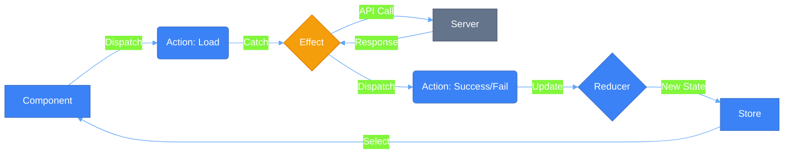
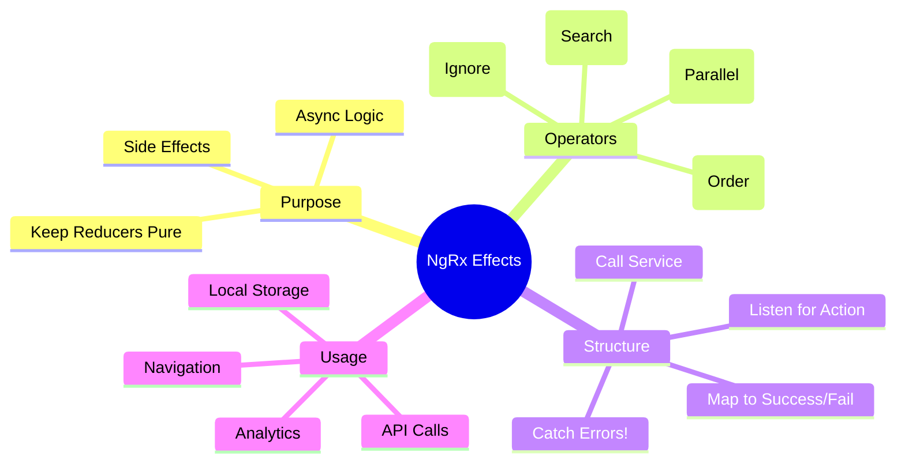

# ⚡ Use Case 2: Effects (Async Operations)

> **💡 Lightbulb Moment**: Reducers are for **State**, Effects are for **Side Effects**. If it involves an API call, a timer, or local storage, it belongs in an Effect!

---

## 1. 🔍 How It Works (The Concept)

### The Effects Loop
Effects provide a way to interact with services and isolate them from your components.

1.  **Component** dispatches `Load Users`.
2.  **Effect** listens for `Load Users`, calls API.
3.  **API** returns data.
4.  **Effect** dispatches `Load Success` (with data) or `Load Failure` (with error).
5.  **Reducer** listens for `Success`/`Failure` and updates state.

### 📊 Data Flow Diagram



---

## 2. 🚀 Step-by-Step Implementation Guide

### Step 1: Define 3 Actions (The Triad)
For every API call, you need three actions: Trigger, Success, Failure.

```typescript
// store/user.actions.ts
export const loadUsers = createAction('[User] Load');
export const loadSuccess = createAction('[User] Success', props<{ users: User[] }>());
export const loadFailure = createAction('[User] Failure', props<{ error: string }>());
```

### Step 2: Create the Effect
Isolate the side effect.

```typescript
// store/user.effects.ts
@Injectable()
export class UserEffects {
    private actions$ = inject(Actions);
    private service = inject(UserService);

    loadUsers$ = createEffect(() => 
        this.actions$.pipe(
            // 1. Listen for specific action
            ofType(loadUsers),
            // 2. Switch/Merge Map to Service
            mergeMap(() => this.service.getUsers().pipe(
                // 3. Map success to Action
                map(users => loadSuccess({ users })),
                // 4. Catch error to Action
                catchError(error => of(loadFailure({ error: error.message })))
            ))
        )
    );
}
```

### Step 3: Handle in Reducer
Update state based on the result.

```typescript
// store/user.reducer.ts
on(loadUsers, state => ({ ...state, loading: true, error: null })),
on(loadSuccess, (state, { users }) => ({ ...state, loading: false, users })),
on(loadFailure, (state, { error }) => ({ ...state, loading: false, error }))
```

---

## 3. 🐛 Common Pitfalls & Debugging

### ❌ Bad Example: No Error Handling
```typescript
mergeMap(() => this.service.getUsers().pipe(
    map(users => loadSuccess({ users }))
    // ☠️ MISSING CATCHERROR
))
```
**Why it fails?** If the HTTP request fails, the Observable stream **completes/dies**. Your effect will stop working for future actions. Always `catchError` inside the inner pipe!

### ✅ Good Example: Nested Pipe
```typescript
mergeMap(() => this.service.getUsers().pipe(
    map(...),
    catchError(...) // ✅ Returns a new Observable (Action), doesn't kill the stream
))
```

---

## 4. ⚡ Performance & Architecture

### SwitchMap vs MergeMap
*   **switchMap**: Cancels previous request if a new one comes in. Great for Search!
*   **mergeMap**: Handles all requests in parallel. Good for "Delete" or independent loads.
*   **concatMap**: Handles requests one by one. Good for ordering (Save, then Load).
*   **exhaustMap**: Ignores new requests while one is running. Good for "Refresh" buttons.

### Architecture
Effects keep your components **pure**. Your component handles user input (`dispatch`) and rendering (`select`). It doesn't know about HTTP, local storage, or web sockets.

---

## 5. 🌍 Real World Use Cases

1.  **API Data Loading**: Fetching products, user profile, dashboards.
2.  **Auto-Save**: Listen for `[Form] Update`, debounce 1s, call API save.
3.  **Analytics**: Listen for *any* action (e.g., `Navigation`), send data to Google Analytics (fire-and-forget).

---

## 6. 📝 The Analogy

> **The "Butler" Analogy 🤵**
>
> - **Component (You)**: "Jeeves, I'm hungry." (Dispatch `Hungry` action).
> - **Effect (Jeeves)**: You don't know *how* Jeeves gets food. He might cook, call pizza, or go to the store. You just wait.
> - **Jeeves**: Goes out, handles the complexities (traffic, payment).
> - **Result**: Jeeves dispatches `Food Arrived` action with the pizza.
> - **Reducer**: Puts the pizza on the table (State).

---

## 7. ❓ Interview & Concept Questions

### Core Concepts

**Q1: Why not call the service directly in the Component?**
> A: Separation of concerns. Components should be about UI. Moving logic to Effects makes components easier to test and reuse, and centralizes side effects management.

**Q2: What happens if I forget `catchError` in an Effect?**
> A: The effect stream will error out and complete. It will stop listening for new actions until the application is reloaded.

### Architecture

**Q3: Can an Effect dispatch multiple actions?**
> A: Yes! return `switchMap(() => [action1(), action2()])` or use `switchMap` returning an array of actions.

**Q4: Do Effects always handle Observables?**
> A: Mostly, but you can create "Non-dispatching" effects (`{ dispatch: false }`) for things that don't return an action, like `localStorage.setItem` or `console.log`.

### Scenario Based

**Q5: Implement a "Search" feature.**
> A: Listen for `[Search] Input`, use `debounceTime(300)`, `distinctUntilChanged()`, then `switchMap` to API. This prevents spamming the server and ensures out-of-order responses don't overwrite newer ones.

---

## 🧠 Mind Map


