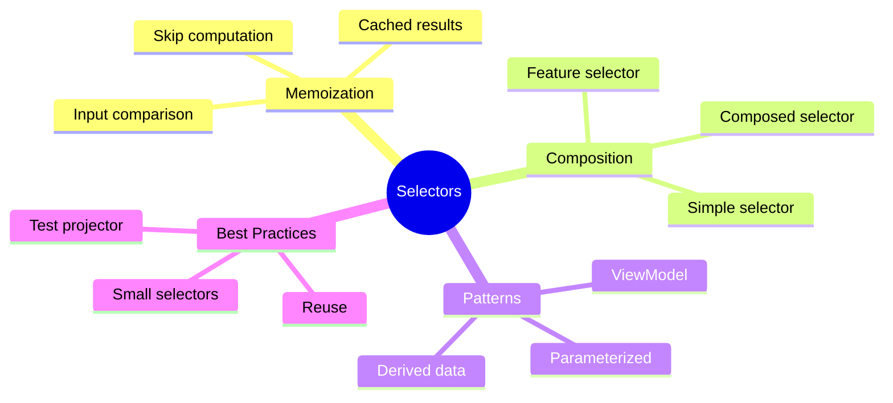

# 🔍 Use Case 4: Selectors Deep Dive

> **💡 Lightbulb Moment**: Selectors are like **computed properties** for your store. They're memoized (cached), composable, and keep your components decoupled from state structure.

---

## 1. 🔍 How Memoization Works

### The Magic of Caching

```typescript
// This selector
export const selectSubtotal = createSelector(
  selectCartItems,
  items => items.reduce((sum, i) => sum + i.price, 0)  // Expensive!
);

// First call: Computes result, caches it
store.select(selectSubtotal);  // ⚙️ Computed

// Second call: State unchanged, returns cached value
store.select(selectSubtotal);  // ⚡ Cached (no computation!)

// Third call: State changed, recomputes
store.dispatch(addItem(...));
store.select(selectSubtotal);  // ⚙️ Recomputed
```

---

## 2. 🚀 Selector Patterns

### Feature Selector

```typescript
// Gets a slice of root state
export const selectUserState = createFeatureSelector<UserState>('users');
```

### Simple Selector

```typescript
export const selectLoading = createSelector(
  selectUserState,
  state => state.loading
);
```

### Composed Selectors

```typescript
// Build on other selectors
export const selectSubtotal = createSelector(
  selectItems,
  items => items.reduce((sum, i) => sum + (i.price * i.qty), 0)
);

export const selectTax = createSelector(
  selectSubtotal,
  subtotal => subtotal * 0.1  // Uses selectSubtotal!
);

export const selectTotal = createSelector(
  selectSubtotal,
  selectTax,
  (subtotal, tax) => subtotal + tax  // Uses both!
);
```

### Parameterized Selector

```typescript
// Factory function pattern
export const selectUserById = (id: number) => createSelector(
  selectUserEntities,
  entities => entities[id]
);

// Usage
this.store.select(selectUserById(5));
```

---

## 3. ❓ Interview Questions

### Basic Questions

#### Q1: What is selector memoization?
**Answer:** Memoization is caching. Selectors remember their last inputs and output. If inputs haven't changed, they return the cached result without recomputing.

#### Q2: Why compose selectors instead of one big selector?
**Answer:**
1. **Reusability** - Smaller selectors can be reused
2. **Better caching** - If only one part changes, only that selector recomputes
3. **Readability** - Easier to understand and test
4. **Maintainability** - Change in one place

#### Q3: When does a selector recompute?
**Answer:** Only when ANY of its input selectors return a different value (by reference for objects/arrays).

---

### Scenario-Based Questions

#### Scenario 1: Expensive Computation
**Question:** You have 10,000 products and need to filter and sort them. How do you optimize?

**Answer:**
```typescript
// Compose multiple selectors for optimal caching
export const selectAllProducts = createSelector(
  selectProductState,
  state => state.products
);

export const selectActiveProducts = createSelector(
  selectAllProducts,
  products => products.filter(p => p.isActive)  // Only recomputes if products change
);

export const selectSortedActiveProducts = createSelector(
  selectActiveProducts,
  products => [...products].sort((a, b) => a.name.localeCompare(b.name))
);
```

---

#### Scenario 2: Multiple Filters
**Question:** User can filter products by category, price range, and search text. How do you structure selectors?

**Answer:**
```typescript
// State stores filter values
interface ProductState {
  products: Product[];
  filters: {
    category: string | null;
    minPrice: number;
    maxPrice: number;
    searchText: string;
  };
}

export const selectFilters = createSelector(selectProductState, s => s.filters);

export const selectFilteredProducts = createSelector(
  selectAllProducts,
  selectFilters,
  (products, filters) => {
    return products.filter(p => {
      if (filters.category && p.category !== filters.category) return false;
      if (p.price < filters.minPrice || p.price > filters.maxPrice) return false;
      if (filters.searchText && !p.name.includes(filters.searchText)) return false;
      return true;
    });
  }
);
```

---

#### Scenario 3: Derived ViewModel
**Question:** Component needs { user, orders, totalSpent }. How do you create a ViewModel selector?

**Answer:**
```typescript
export const selectUserViewModel = createSelector(
  selectCurrentUser,
  selectUserOrders,
  selectOrderTotal,
  (user, orders, totalSpent) => ({
    user,
    orders,
    totalSpent,
    orderCount: orders.length,
    averageOrder: orders.length ? totalSpent / orders.length : 0
  })
);
```

---

#### Scenario 4: Avoiding Recomputation
**Question:** Your selector returns a new array every time, causing component re-renders. How do you fix it?

**Answer:**
```typescript
// ❌ BAD - Always creates new array reference
export const selectActiveUsers = createSelector(
  selectUsers,
  users => users.filter(u => u.isActive)
);

// ✅ GOOD - Return same reference if content is same
import { createSelectorFactory, defaultMemoize } from '@ngrx/store';

// Or simpler: Use resultEqualityCheck
export const selectActiveUsers = createSelector(
  selectUsers,
  users => users.filter(u => u.isActive),
  { memoize: defaultMemoize, memoizeOptions: { resultEqualityCheck: arraysEqual } }
);
```

---

### Advanced Questions

#### Q4: How do you test selectors?
**Answer:**
```typescript
describe('selectSubtotal', () => {
  it('should calculate subtotal', () => {
    const state = {
      cart: {
        items: [
          { price: 10, quantity: 2 },
          { price: 20, quantity: 1 }
        ]
      }
    };
    
    const result = selectSubtotal.projector(state.cart.items);
    expect(result).toBe(40);  // 10*2 + 20*1
  });
});
```

#### Q5: What's the difference between `createSelector` and `createFeatureSelector`?
**Answer:**
- `createFeatureSelector` - Gets top-level feature slice from root state
- `createSelector` - Derives data from one or more input selectors

```typescript
// Feature selector - accesses root state
createFeatureSelector<UserState>('users');  // AppState['users']

// Regular selector - derives from inputs
createSelector(selectUserState, state => state.loading);
```

---

## 🧠 Mind Map


