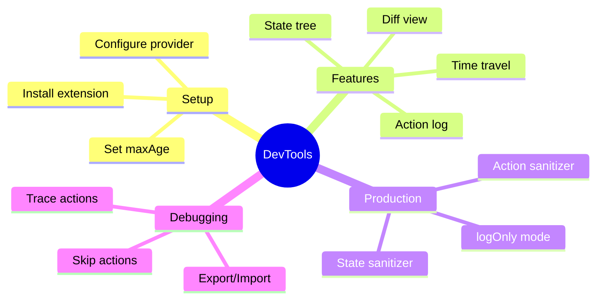

# 🛠️ Use Case 5: DevTools Integration

> **💡 Lightbulb Moment**: Redux DevTools is like having a **flight recorder** for your application. Every action, every state change, completely traceable and replayable.


---

## 1. 🔍 What DevTools Provides

### Core Features

| Feature | Description | Use Case |
|---------|-------------|----------|
| **Action Log** | Every dispatched action with timestamp | Trace what happened |
| **State Tree** | Full state structure view | Understand current state |
| **Time Travel** | Jump to any previous state | Debug issues |
| **State Diff** | See exactly what changed | Identify mutations |
| **Export/Import** | Save/load state snapshots | Share bug reports |
| **Action Skip** | Disable specific actions | What-if analysis |

---

## 2. 🚀 Setup

### Installation

```bash
npm install @ngrx/store-devtools
```

### Configuration

```typescript
// app.config.ts
import { isDevMode } from '@angular/core';
import { provideStoreDevtools } from '@ngrx/store-devtools';

export const appConfig: ApplicationConfig = {
  providers: [
    provideStore(reducers),
    provideStoreDevtools({
      maxAge: 25,              // Store last 25 states
      logOnly: !isDevMode(),   // Restrict in production
      autoPause: true,         // Pause on window blur
      trace: false,            // Log stack trace (expensive)
      traceLimit: 75           // Max stack frames
    })
  ]
};
```

---

## 3. ❓ Interview Questions

### Basic Questions

#### Q1: What is Redux DevTools?
**Answer:** A browser extension that provides debugging capabilities for Redux/NgRx applications, including action logging, state inspection, time-travel debugging, and state export/import.

#### Q2: Why use logOnly in production?
**Answer:** 
- **Security**: Users can't modify state via DevTools
- **Performance**: Less overhead
- **Safety**: Prevents accidental state manipulation
- Still allows viewing state for debugging if needed

#### Q3: What does maxAge control?
**Answer:** The maximum number of past states to keep in history. Lower values use less memory but limit time-travel range. Typically 25-50 is sufficient.

---

### Scenario-Based Questions

#### Scenario 1: Debugging a Bug
**Question:** User reports "my cart items disappeared". How do you use DevTools to investigate?

**Answer:**
1. **Export state** from user's browser (if they have DevTools)
2. **Import state** into your development environment
3. **View action log** - look for actions like `[Cart] Clear`, `[Cart] Remove All`
4. **Time travel** - step back to see when cart was full
5. **State diff** - identify exactly which action caused the issue

---

#### Scenario 2: Reproduce Production Issue
**Question:** QA reports a complex bug that's hard to reproduce. How do you create a reproducible test case?

**Answer:**
```typescript
// Export state and actions from DevTools
// In DevTools: Download → Actions + State

// Import in test
it('should reproduce bug', () => {
  const savedState = require('./exported-state.json');
  const savedActions = require('./exported-actions.json');
  
  // Replay actions
  savedActions.forEach(action => store.dispatch(action));
  
  // Assert final state matches
  expect(store.getState()).toEqual(savedState);
});
```

---

#### Scenario 3: Performance Investigation
**Question:** App feels slow. How do you use DevTools to identify the cause?

**Answer:**
1. Open DevTools → Watch action dispatch rate
2. Look for **action spam** (same action dispatched many times)
3. Check **state size** - is it growing unbounded?
4. Use **Trace** option to see where actions are dispatched from
5. Look for **unnecessary re-renders** by correlating actions with UI updates

---

#### Scenario 4: State Sanitization
**Question:** Your state contains sensitive data (tokens, passwords). How do you use DevTools safely?

**Answer:**
```typescript
provideStoreDevtools({
  maxAge: 25,
  logOnly: !isDevMode(),
  // Hide sensitive state
  stateSanitizer: (state) => ({
    ...state,
    auth: { ...state.auth, token: '***REDACTED***' }
  }),
  // Hide sensitive action payloads
  actionSanitizer: (action) => {
    if (action.type === '[Auth] Login Success') {
      return { ...action, token: '***REDACTED***' };
    }
    return action;
  }
})
```

---

### Advanced Questions

#### Q4: How does time-travel work technically?
**Answer:** DevTools stores a history of states. When you "time travel", it doesn't replay actions - it simply sets the store to a previously stored state snapshot. That's why `maxAge` controls how far back you can go.

#### Q5: Can you dispatch actions from DevTools?
**Answer:** Yes! In the DevTools panel, you can:
- Use the "Dispatcher" tab to dispatch custom actions
- Modify action payloads before dispatch
- Useful for testing edge cases

```json
// Dispatch from DevTools
{ "type": "[User] Force Logout" }
```

---

## 🧠 Mind Map



---

## 🎯 What Problem Does This Solve?

### The Problem: Debugging State is Nearly Impossible

**Without DevTools (BAD):**
```typescript
// Scattered console.logs
on(addItem, (state, { item }) => {
    console.log('Current state:', state);
    console.log('Adding item:', item);
    const newState = { ...state, items: [...state.items, item] };
    console.log('New state:', newState);
    return newState;
});

// Questions you can't easily answer:
// - What action caused this bug?
// - What was the state BEFORE the bug?
// - Can I reproduce the exact sequence?
// - What changed between state A and state B?
```

**Problems:**
1. **No history**: Can't see what happened before
2. **No comparison**: Hard to spot what changed
3. **No replay**: Can't reproduce issues
4. **Scattered logs**: Pollution everywhere
5. **Production debugging**: Logs stripped in prod

### How DevTools Solve This

**With DevTools (GOOD):**
- See EVERY action dispatched (with timestamp and payload)
- View FULL state tree at any point
- DIFF view shows exactly what changed
- TIME TRAVEL to any previous state
- EXPORT/IMPORT state for bug reports
- SANITIZE sensitive data

| Problem | DevTools Solution |
|---------|------------------|
| "What happened?" | Action log with full history |
| "What changed?" | State diff view |
| "Can I reproduce?" | Export/Import state |
| "When did it break?" | Time travel to find |
| "Is it my action?" | Skip/disable specific actions |

---

## 📚 Key Classes & Types Explained

### 1. `provideStoreDevtools()` (from `@ngrx/store-devtools`)

```typescript
provideStoreDevtools({
    maxAge: 25,
    logOnly: !isDevMode(),
    autoPause: true,
    trace: false,
    traceLimit: 75,
    connectInZone: true
})
```

**Configuration Options:**

| Option | Type | Default | Purpose |
|--------|------|---------|---------|
| `maxAge` | number | 25 | States to keep in history |
| `logOnly` | boolean | false | Read-only mode (no time travel) |
| `autoPause` | boolean | false | Pause when window loses focus |
| `trace` | boolean | false | Log stack traces (expensive!) |
| `traceLimit` | number | 75 | Max stack frames to store |
| `connectInZone` | boolean | false | Run in Angular zone |

---

### 2. `stateSanitizer` Function

```typescript
provideStoreDevtools({
    stateSanitizer: (state, index) => {
        // state = current state object
        // index = position in history
        return {
            ...state,
            auth: {
                ...state.auth,
                token: '***HIDDEN***',
                password: '***HIDDEN***'
            }
        };
    }
})
```

**What it does:** Transforms state before it appears in DevTools.

**Use cases:**
- Hide passwords, tokens, API keys
- Redact personal information (GDPR)
- Simplify deeply nested state for readability

---

### 3. `actionSanitizer` Function

```typescript
provideStoreDevtools({
    actionSanitizer: (action, id) => {
        // action = the dispatched action
        // id = action index
        if (action.type === '[Auth] Login') {
            return {
                ...action,
                password: '***HIDDEN***'
            };
        }
        return action;
    }
})
```

**What it does:** Transforms actions before they appear in DevTools.

**Use cases:**
- Hide sensitive payloads
- Add debugging info to actions
- Simplify large payloads

---

### 4. `serialize` Option

```typescript
provideStoreDevtools({
    serialize: {
        options: {
            date: true,       // Serialize Date objects
            regex: true,      // Serialize RegExp
            undefined: true,  // Include undefined values
            error: true,      // Serialize Error objects
            symbol: true,     // Serialize Symbols
            map: true,        // Serialize Map
            set: true         // Serialize Set
        }
    }
})
```

**What it does:** Controls how non-JSON values are displayed.

---

### 5. DevTools Extension API

```typescript
// Check if DevTools is available
declare global {
    interface Window {
        __REDUX_DEVTOOLS_EXTENSION__?: any;
    }
}

if (window.__REDUX_DEVTOOLS_EXTENSION__) {
    // DevTools is installed
}
```

**DevTools provides:**
- `connect()` - Manual connection
- `disconnect()` - Manual disconnect
- `send()` - Send custom data

---

## 🌍 Real-World Use Cases

### 1. Bug Investigation Workflow
```
1. User reports: "My cart emptied unexpectedly"

2. Ask user to:
   - Open DevTools extension
   - Click "Export" → "State"
   - Send you the JSON file

3. On your machine:
   - Import the state JSON
   - Time travel through history
   - Find the action that cleared cart
   - See the payload/source

4. Root cause: Found "[Cart API] Sync Failed" 
   was dispatching clearCart instead of error action
```

### 2. QA Reproducible Test Cases
```typescript
// qa-tests/cart-clear-bug.spec.ts
describe('Cart Clear Bug (Ticket #1234)', () => {
    it('should reproduce using exported state', () => {
        // State exported from DevTools
        const bugState = require('./exported-bug-state.json');
        
        store.dispatch(restoreState(bugState));
        store.dispatch(syncCart());
        
        // Verify the bug manifestation
        expect(store.select(selectCartItems).length).toBe(0);
    });
});
```

### 3. Performance Monitoring
```typescript
// DevTools shows:
// 
// Action Log (last 5 seconds):
// [Search] Query Changed     x 47 times!  ⚠️
// [API] Search Started       x 47 times!  ⚠️
// 
// Problem: No debounce on search input!

// Fix: Add debounceTime in effect
search$ = createEffect(() =>
    this.actions$.pipe(
        ofType(searchQueryChanged),
        debounceTime(300),  // ← Fix!
        switchMap(...)
    )
);
```

### 4. State Size Monitoring
```typescript
// DevTools State tab shows:
// 
// products: { entities: { ... }, ids: [...] }  // 15 KB
// users: { ... }                                // 2 KB
// chat: { messages: [...] }                     // 2.5 MB ⚠️
//
// Problem: Chat messages never cleared!
//
// Fix: Limit message history
on(newMessage, (state, { message }) => ({
    ...state,
    messages: [...state.messages.slice(-100), message]  // Keep last 100
}))
```

### 5. Cross-Browser Debugging
```typescript
// DevTools Extension allows:
// 
// 1. Export state from Safari (user's browser)
// 2. Import into Chrome (developer's browser)
// 3. Full debugging even without user's browser
//
// Command: DevTools → Export → Actions + State
```

---

## ❓ Complete Interview Questions (20+)

### Basic Conceptual Questions

**Q1: What is Redux DevTools?**
> A: Browser extension that provides debugging for Redux/NgRx apps, including action logging, state inspection, time-travel, and state export/import.

**Q2: What does `maxAge` control?**
> A: Number of past states to keep in history. Higher = more time-travel range but more memory. Typically 25-50.

**Q3: What does `logOnly: true` do?**
> A: Restricts to read-only mode - can view actions/state but can't time-travel or dispatch actions. Use in production.

**Q4: Why is time-travel possible in NgRx?**
> A: Because state is immutable and actions are serializable. Old states are stored as snapshots, not reconstructed from actions.

**Q5: What browser extensions are needed?**
> A: "Redux DevTools" extension for Chrome, Firefox, or Edge. No special NgRx extension needed.

---

### Security Questions

**Q6: Should DevTools be enabled in production?**
> A: Yes, but with `logOnly: true`. Users can benefit from debugging, but can't modify state or time-travel.

**Q7: How do you hide sensitive data in DevTools?**
> A: Use `stateSanitizer` and `actionSanitizer` to redact tokens, passwords, PII:
> ```typescript
> stateSanitizer: (state) => ({
>     ...state,
>     auth: { ...state.auth, token: '***' }
> })
> ```

**Q8: Can users modify application state via DevTools?**
> A: Yes, unless `logOnly: true`. They can dispatch actions and time-travel. Security-critical apps should use `logOnly` in prod.

---

### Debugging Questions

**Q9: How do you debug "state not updating" issues?**
> A: 
> 1. Check DevTools action log - was action dispatched?
> 2. Check state diff - did state change?
> 3. If action exists but no diff, reducer isn't handling it
> 4. If state changed, check selector isn't filtering it out

**Q10: How do you find which action caused a bug?**
> A: 
> 1. Reproduce the bug
> 2. Open DevTools action log
> 3. Time-travel backward until bug disappears
> 4. The action that made bug appear is the culprit

**Q11: How do you share a bug report with state?**
> A: Click Export → State (or State + Actions). Share the JSON file. Recipient imports to reproduce exact state.

---

### Performance Questions

**Q12: Does DevTools impact performance?**
> A: Yes, especially with:
> - `trace: true` (captures stack traces)
> - Large `maxAge` (stores more history)
> - Large state objects (serialization cost)
> Use `logOnly` in prod to minimize impact.

**Q13: How do you detect action spam in DevTools?**
> A: Look for rapid repeated actions in the log. If same action dispatches 100+ times/second, there's a missing debounce or guard.

**Q14: State keeps growing, how to debug?**
> A: 
> 1. DevTools State tab shows size
> 2. Look for unbounded arrays (messages, logs)
> 3. Check for missing cleanup on route change
> 4. Implement windowing/pagination

---

### Scenario Questions

**Q15: User in production reports bug. How to get their state?**
> A: 
> 1. Ask them to open DevTools extension
> 2. Click "Export" → "State"
> 3. They send you the JSON file
> 4. You import it to reproduce

**Q16: Multiple developers debugging same issue. How to share debuggable state?**
> A: 
> - Export state to JSON file
> - Commit to repo as test fixture
> - Other devs import to get exact same state

**Q17: You want to test what happens if an action fails. How?**
> A: 
> 1. Open DevTools Dispatcher
> 2. Manually dispatch failure action:
>    `{ type: '[API] Load Failure', error: 'Test error' }`
> 3. Observe app behavior

**Q18: App state is 5MB. DevTools is slow. How to improve?**
> A: 
> - Reduce `maxAge` (fewer snapshots)
> - Use `stateSanitizer` to exclude large arrays
> - Consider `serialize` options to exclude blob data
> - Use `logOnly` if time-travel not needed

---

### Configuration Questions

**Q19: How do you configure DevTools differently per environment?**
> A:
> ```typescript
> provideStoreDevtools({
>     maxAge: environment.production ? 10 : 50,
>     logOnly: environment.production,
>     trace: !environment.production
> })
> ```

**Q20: How do you completely disable DevTools in production?**
> A:
> ```typescript
> // Only provide in dev
> ...(isDevMode() ? [provideStoreDevtools()] : [])
> ```

---

### Advanced Questions

**Q21: How does time travel work internally?**
> A: DevTools stores snapshots of each state. Time travel simply sets current state to a stored snapshot. It doesn't replay actions.

**Q22: Can you dispatch actions from DevTools?**
> A: Yes! Use the Dispatcher tab. Useful for:
> - Testing edge cases
> - Simulating API failures
> - Triggering rarely-used flows

**Q23: What is the `trace` option?**
> A: Captures JavaScript stack traces for each action. Expensive but shows exactly where dispatch was called from.

**Q24: Can DevTools be used with lazy-loaded features?**
> A: Yes! Feature states appear in DevTools as they're loaded. No extra configuration needed.

**Q25: How do you test with DevTools in CI/CD?**
> A: Don't! DevTools is for interactive debugging. For automated testing, use `MockStore` or direct reducer testing.

