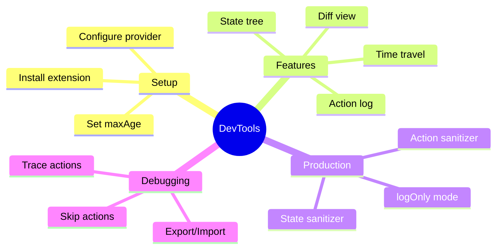

# 🛠️ Use Case 5: DevTools Integration

> **💡 Lightbulb Moment**: Redux DevTools is like having a **flight recorder** for your application. Every action, every state change, completely traceable and replayable.

---

## 1. 🔍 What DevTools Provides

### Core Features

| Feature | Description | Use Case |
|---------|-------------|----------|
| **Action Log** | Every dispatched action with timestamp | Trace what happened |
| **State Tree** | Full state structure view | Understand current state |
| **Time Travel** | Jump to any previous state | Debug issues |
| **State Diff** | See exactly what changed | Identify mutations |
| **Export/Import** | Save/load state snapshots | Share bug reports |
| **Action Skip** | Disable specific actions | What-if analysis |

---

## 2. 🚀 Setup

### Installation

```bash
npm install @ngrx/store-devtools
```

### Configuration

```typescript
// app.config.ts
import { isDevMode } from '@angular/core';
import { provideStoreDevtools } from '@ngrx/store-devtools';

export const appConfig: ApplicationConfig = {
  providers: [
    provideStore(reducers),
    provideStoreDevtools({
      maxAge: 25,              // Store last 25 states
      logOnly: !isDevMode(),   // Restrict in production
      autoPause: true,         // Pause on window blur
      trace: false,            // Log stack trace (expensive)
      traceLimit: 75           // Max stack frames
    })
  ]
};
```

---

## 3. ❓ Interview Questions

### Basic Questions

#### Q1: What is Redux DevTools?
**Answer:** A browser extension that provides debugging capabilities for Redux/NgRx applications, including action logging, state inspection, time-travel debugging, and state export/import.

#### Q2: Why use logOnly in production?
**Answer:** 
- **Security**: Users can't modify state via DevTools
- **Performance**: Less overhead
- **Safety**: Prevents accidental state manipulation
- Still allows viewing state for debugging if needed

#### Q3: What does maxAge control?
**Answer:** The maximum number of past states to keep in history. Lower values use less memory but limit time-travel range. Typically 25-50 is sufficient.

---

### Scenario-Based Questions

#### Scenario 1: Debugging a Bug
**Question:** User reports "my cart items disappeared". How do you use DevTools to investigate?

**Answer:**
1. **Export state** from user's browser (if they have DevTools)
2. **Import state** into your development environment
3. **View action log** - look for actions like `[Cart] Clear`, `[Cart] Remove All`
4. **Time travel** - step back to see when cart was full
5. **State diff** - identify exactly which action caused the issue

---

#### Scenario 2: Reproduce Production Issue
**Question:** QA reports a complex bug that's hard to reproduce. How do you create a reproducible test case?

**Answer:**
```typescript
// Export state and actions from DevTools
// In DevTools: Download → Actions + State

// Import in test
it('should reproduce bug', () => {
  const savedState = require('./exported-state.json');
  const savedActions = require('./exported-actions.json');
  
  // Replay actions
  savedActions.forEach(action => store.dispatch(action));
  
  // Assert final state matches
  expect(store.getState()).toEqual(savedState);
});
```

---

#### Scenario 3: Performance Investigation
**Question:** App feels slow. How do you use DevTools to identify the cause?

**Answer:**
1. Open DevTools → Watch action dispatch rate
2. Look for **action spam** (same action dispatched many times)
3. Check **state size** - is it growing unbounded?
4. Use **Trace** option to see where actions are dispatched from
5. Look for **unnecessary re-renders** by correlating actions with UI updates

---

#### Scenario 4: State Sanitization
**Question:** Your state contains sensitive data (tokens, passwords). How do you use DevTools safely?

**Answer:**
```typescript
provideStoreDevtools({
  maxAge: 25,
  logOnly: !isDevMode(),
  // Hide sensitive state
  stateSanitizer: (state) => ({
    ...state,
    auth: { ...state.auth, token: '***REDACTED***' }
  }),
  // Hide sensitive action payloads
  actionSanitizer: (action) => {
    if (action.type === '[Auth] Login Success') {
      return { ...action, token: '***REDACTED***' };
    }
    return action;
  }
})
```

---

### Advanced Questions

#### Q4: How does time-travel work technically?
**Answer:** DevTools stores a history of states. When you "time travel", it doesn't replay actions - it simply sets the store to a previously stored state snapshot. That's why `maxAge` controls how far back you can go.

#### Q5: Can you dispatch actions from DevTools?
**Answer:** Yes! In the DevTools panel, you can:
- Use the "Dispatcher" tab to dispatch custom actions
- Modify action payloads before dispatch
- Useful for testing edge cases

```json
// Dispatch from DevTools
{ "type": "[User] Force Logout" }
```

---

## 🧠 Mind Map


