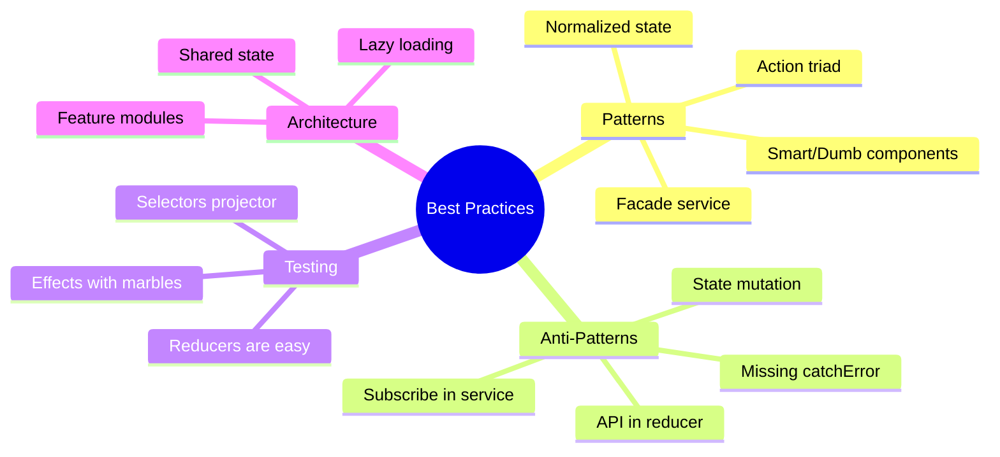

# 📋 Use Case 6: Best Practices & Common Patterns

> **💡 Lightbulb Moment**: NgRx success depends on following patterns consistently. These aren't just style preferences - they prevent real bugs and make debugging possible.

---

## 1. 🔍 Core Patterns

### Pattern 1: Action Triad

Every async operation should have three actions:

```typescript
// 1. TRIGGER - Component dispatches this
export const loadUsers = createAction('[Users Page] Load Users');

// 2. SUCCESS - Effect dispatches on success
export const loadUsersSuccess = createAction(
  '[Users API] Load Users Success',
  props<{ users: User[] }>()
);

// 3. FAILURE - Effect dispatches on error
export const loadUsersFailure = createAction(
  '[Users API] Load Users Failure',
  props<{ error: string }>()
);
```

### Pattern 2: Facade Service

Encapsulate store access for a feature:

```typescript
@Injectable({ providedIn: 'root' })
export class UsersFacade {
  // Selectors
  users$ = this.store.select(selectAllUsers);
  loading$ = this.store.select(selectLoading);
  error$ = this.store.select(selectError);
  
  constructor(private store: Store) {}
  
  // Actions
  loadUsers(): void { this.store.dispatch(loadUsers()); }
  createUser(user: User): void { this.store.dispatch(createUser({ user })); }
  deleteUser(id: number): void { this.store.dispatch(deleteUser({ id })); }
}

// Component is now clean
@Component({...})
export class UsersComponent {
  users$ = this.facade.users$;
  
  constructor(private facade: UsersFacade) {
    this.facade.loadUsers();
  }
}
```

### Pattern 3: Smart & Dumb Components

```
┌─────────────────────────────────────────────────┐
│  SMART COMPONENT (Container)                    │
│  - Connects to Store (inject Store)             │
│  - Dispatches actions                           │
│  - Selects state via selectors                  │
│  - Passes data down via @Input                  │
└─────────────────────────────────────────────────┘
         │
         ▼
┌─────────────────────────────────────────────────┐
│  DUMB COMPONENT (Presentational)                │
│  - No Store dependency                          │
│  - Receives data via @Input                     │
│  - Emits events via @Output                     │
│  - Pure rendering, easy to test                 │
└─────────────────────────────────────────────────┘
```

---

## 2. ❌ Anti-Patterns to Avoid

### Anti-Pattern 1: State Mutation

```typescript
// ❌ BAD - Mutates state
on(addItem, (state, { item }) => {
  state.items.push(item);  // MUTATION!
  return state;
})

// ✅ GOOD - Returns new state
on(addItem, (state, { item }) => ({
  ...state,
  items: [...state.items, item]
}))
```

### Anti-Pattern 2: Missing catchError

```typescript
// ❌ BAD - Effect stream dies on error
loadUsers$ = createEffect(() =>
  this.actions$.pipe(
    ofType(loadUsers),
    mergeMap(() => this.api.getUsers().pipe(
      map(users => loadUsersSuccess({ users }))
      // No catchError = STREAM DIES
    ))
  )
);

// ✅ GOOD - Handles errors gracefully
loadUsers$ = createEffect(() =>
  this.actions$.pipe(
    ofType(loadUsers),
    mergeMap(() => this.api.getUsers().pipe(
      map(users => loadUsersSuccess({ users })),
      catchError(error => of(loadUsersFailure({ error: error.message })))
    ))
  )
);
```

---

## 3. ❓ Interview Questions

### Basic Questions

#### Q1: What are the three principles of Redux/NgRx?
**Answer:**
1. **Single Source of Truth** - One store for all state
2. **State is Read-Only** - Only actions can change state
3. **Pure Functions for Changes** - Reducers are pure

#### Q2: When should you NOT use NgRx?
**Answer:**
- Small apps with simple state
- Local component state (form inputs)
- Data that doesn't need to be shared
- When learning curve outweighs benefits

---

### Scenario-Based Questions

#### Scenario 1: Large Feature Module
**Question:** Your feature has 50+ actions. How do you organize them?

**Answer:**
```typescript
// Organize by domain or user flow
actions/
├── user.actions.ts      // User CRUD
├── user-list.actions.ts // List filtering, sorting
├── user-form.actions.ts // Form interactions
├── user-api.actions.ts  // API response actions
```

---

#### Scenario 2: Optimistic Updates
**Question:** Implement optimistic update for "Like" button.

**Answer:**
```typescript
// Actions
export const likePost = createAction('[Post] Like', props<{ postId: string }>());
export const likePostConfirm = createAction('[Post] Like Confirm', props<{ postId: string }>());
export const likePostRevert = createAction('[Post] Like Revert', props<{ postId: string }>());

// Reducer - Optimistically update
on(likePost, (state, { postId }) => ({
  ...state,
  posts: state.posts.map(p => 
    p.id === postId ? { ...p, likes: p.likes + 1 } : p
  )
}))

// Reducer - Revert on failure
on(likePostRevert, (state, { postId }) => ({
  ...state,
  posts: state.posts.map(p => 
    p.id === postId ? { ...p, likes: p.likes - 1 } : p
  )
}))
```

---

#### Scenario 3: Testing Strategy
**Question:** What's your testing strategy for NgRx?

**Answer:**
```typescript
// 1. Test Reducers (pure functions, easy!)
describe('counterReducer', () => {
  it('should increment', () => {
    const state = { count: 5 };
    const result = counterReducer(state, increment());
    expect(result.count).toBe(6);
  });
});

// 2. Test Selectors (also pure functions)
describe('selectTotal', () => {
  it('should sum items', () => {
    const items = [{ price: 10 }, { price: 20 }];
    expect(selectTotal.projector(items)).toBe(30);
  });
});

// 3. Test Effects (marble testing)
describe('loadUsers$', () => {
  it('should load users', () => {
    actions$ = hot('-a', { a: loadUsers() });
    const expected = cold('-b', { b: loadUsersSuccess({ users: mockUsers }) });
    expect(effects.loadUsers$).toBeObservable(expected);
  });
});
```

---

## 🧠 Mind Map


