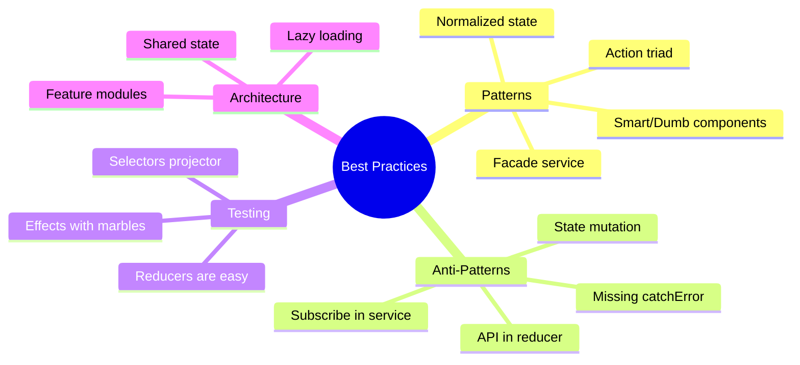

# 📋 Use Case 6: Best Practices & Common Patterns

> **💡 Lightbulb Moment**: NgRx success depends on following patterns consistently. These aren't just style preferences - they prevent real bugs and make debugging possible.

---

## 1. 🔍 Core Patterns

### Pattern 1: Action Triad

Every async operation should have three actions:

```typescript
// 1. TRIGGER - Component dispatches this
export const loadUsers = createAction('[Users Page] Load Users');

// 2. SUCCESS - Effect dispatches on success
export const loadUsersSuccess = createAction(
  '[Users API] Load Users Success',
  props<{ users: User[] }>()
);

// 3. FAILURE - Effect dispatches on error
export const loadUsersFailure = createAction(
  '[Users API] Load Users Failure',
  props<{ error: string }>()
);
```

### Pattern 2: Facade Service

Encapsulate store access for a feature:

```typescript
@Injectable({ providedIn: 'root' })
export class UsersFacade {
  // Selectors
  users$ = this.store.select(selectAllUsers);
  loading$ = this.store.select(selectLoading);
  error$ = this.store.select(selectError);
  
  constructor(private store: Store) {}
  
  // Actions
  loadUsers(): void { this.store.dispatch(loadUsers()); }
  createUser(user: User): void { this.store.dispatch(createUser({ user })); }
  deleteUser(id: number): void { this.store.dispatch(deleteUser({ id })); }
}

// Component is now clean
@Component({...})
export class UsersComponent {
  users$ = this.facade.users$;
  
  constructor(private facade: UsersFacade) {
    this.facade.loadUsers();
  }
}
```

### Pattern 3: Smart & Dumb Components

```
┌─────────────────────────────────────────────────┐
│  SMART COMPONENT (Container)                    │
│  - Connects to Store (inject Store)             │
│  - Dispatches actions                           │
│  - Selects state via selectors                  │
│  - Passes data down via @Input                  │
└─────────────────────────────────────────────────┘
         │
         ▼
┌─────────────────────────────────────────────────┐
│  DUMB COMPONENT (Presentational)                │
│  - No Store dependency                          │
│  - Receives data via @Input                     │
│  - Emits events via @Output                     │
│  - Pure rendering, easy to test                 │
└─────────────────────────────────────────────────┘
```

---

## 2. ❌ Anti-Patterns to Avoid

### Anti-Pattern 1: State Mutation

```typescript
// ❌ BAD - Mutates state
on(addItem, (state, { item }) => {
  state.items.push(item);  // MUTATION!
  return state;
})

// ✅ GOOD - Returns new state
on(addItem, (state, { item }) => ({
  ...state,
  items: [...state.items, item]
}))
```

### Anti-Pattern 2: Missing catchError

```typescript
// ❌ BAD - Effect stream dies on error
loadUsers$ = createEffect(() =>
  this.actions$.pipe(
    ofType(loadUsers),
    mergeMap(() => this.api.getUsers().pipe(
      map(users => loadUsersSuccess({ users }))
      // No catchError = STREAM DIES
    ))
  )
);

// ✅ GOOD - Handles errors gracefully
loadUsers$ = createEffect(() =>
  this.actions$.pipe(
    ofType(loadUsers),
    mergeMap(() => this.api.getUsers().pipe(
      map(users => loadUsersSuccess({ users })),
      catchError(error => of(loadUsersFailure({ error: error.message })))
    ))
  )
);
```

---

## 3. ❓ Interview Questions

### Basic Questions

#### Q1: What are the three principles of Redux/NgRx?
**Answer:**
1. **Single Source of Truth** - One store for all state
2. **State is Read-Only** - Only actions can change state
3. **Pure Functions for Changes** - Reducers are pure

#### Q2: When should you NOT use NgRx?
**Answer:**
- Small apps with simple state
- Local component state (form inputs)
- Data that doesn't need to be shared
- When learning curve outweighs benefits

---

### Scenario-Based Questions

#### Scenario 1: Large Feature Module
**Question:** Your feature has 50+ actions. How do you organize them?

**Answer:**
```typescript
// Organize by domain or user flow
actions/
├── user.actions.ts      // User CRUD
├── user-list.actions.ts // List filtering, sorting
├── user-form.actions.ts // Form interactions
├── user-api.actions.ts  // API response actions
```

---

#### Scenario 2: Optimistic Updates
**Question:** Implement optimistic update for "Like" button.

**Answer:**
```typescript
// Actions
export const likePost = createAction('[Post] Like', props<{ postId: string }>());
export const likePostConfirm = createAction('[Post] Like Confirm', props<{ postId: string }>());
export const likePostRevert = createAction('[Post] Like Revert', props<{ postId: string }>());

// Reducer - Optimistically update
on(likePost, (state, { postId }) => ({
  ...state,
  posts: state.posts.map(p => 
    p.id === postId ? { ...p, likes: p.likes + 1 } : p
  )
}))

// Reducer - Revert on failure
on(likePostRevert, (state, { postId }) => ({
  ...state,
  posts: state.posts.map(p => 
    p.id === postId ? { ...p, likes: p.likes - 1 } : p
  )
}))
```

---

#### Scenario 3: Testing Strategy
**Question:** What's your testing strategy for NgRx?

**Answer:**
```typescript
// 1. Test Reducers (pure functions, easy!)
describe('counterReducer', () => {
  it('should increment', () => {
    const state = { count: 5 };
    const result = counterReducer(state, increment());
    expect(result.count).toBe(6);
  });
});

// 2. Test Selectors (also pure functions)
describe('selectTotal', () => {
  it('should sum items', () => {
    const items = [{ price: 10 }, { price: 20 }];
    expect(selectTotal.projector(items)).toBe(30);
  });
});

// 3. Test Effects (marble testing)
describe('loadUsers$', () => {
  it('should load users', () => {
    actions$ = hot('-a', { a: loadUsers() });
    const expected = cold('-b', { b: loadUsersSuccess({ users: mockUsers }) });
    expect(effects.loadUsers$).toBeObservable(expected);
  });
});
```

---

## 🧠 Mind Map



---

## 🎯 What Problem Does This Solve?

### The Problem: NgRx Without Conventions Is Chaos

**Without Best Practices (BAD):**
```typescript
// Random action naming
export const DO_THING = createAction('do thing');
export const USERS_LOADED = createAction('USERS_LOADED');
export const fetchProducts = createAction('fetch-products');

// Everything in component
@Component({...})
export class MessyComponent {
    users: User[] = [];
    
    ngOnInit() {
        // Direct state mutation
        this.store.select('users').subscribe(state => {
            this.users = state.users;
            this.users.push({ id: 99, name: 'Hack' }); // MUTATION!
        });
        
        // API in wrong place
        this.http.get('/api/users').subscribe(users => {
            this.store.dispatch(setUsers({ users }));
        });
    }
}
```

**Problems:**
1. Inconsistent naming → hard to debug
2. Direct mutations → UI doesn't update
3. Business logic in components → hard to test
4. No error handling → Effects die silently
5. Tight coupling → refactoring nightmare

### How Best Practices Solve This

**With Best Practices (GOOD):**
```typescript
// Consistent action naming: [Source] Event
export const loadUsers = createAction('[Users Page] Load Users');
export const loadUsersSuccess = createAction('[Users API] Load Success', props<{users: User[]}>());
export const loadUsersFailure = createAction('[Users API] Load Failure', props<{error: string}>());

// Clean component using Facade
@Component({...})
export class CleanComponent {
    users$ = this.usersFacade.users$;
    
    constructor(private usersFacade: UsersFacade) {
        this.usersFacade.loadUsers();  // Just dispatch
    }
}

// All logic in Effects
loadUsers$ = createEffect(() =>
    this.actions$.pipe(
        ofType(loadUsers),
        mergeMap(() => this.api.getUsers().pipe(
            map(users => loadUsersSuccess({ users })),
            catchError(error => of(loadUsersFailure({ error })))
        ))
    )
);
```

| Problem | Best Practice Solution |
|---------|----------------------|
| Inconsistent naming | `[Source] Event` convention |
| Logic in components | Facade pattern |
| State mutation | Immutable updates with spread |
| Missing error handling | Action triad + catchError |
| Hard to test | Pure functions everywhere |

---

## 📚 Key Patterns Explained

### 1. Action Naming Convention

```
[Source] Event Description
```

**Source** = Where the action originates:
- `[Users Page]` - Component/page
- `[Users API]` - Backend response
- `[Users Effect]` - Effect-initiated
- `[Router]` - Navigation
- `[Auth Guard]` - Guard logic

**Event Description** = What happened (past tense or present):
- `Load Users` - User initiated load
- `Load Users Success` - API responded
- `Load Users Failure` - API failed

**Examples:**
```typescript
// User initiated
'[Login Page] Submit Credentials'
'[Cart Sidebar] Remove Item'
'[Product Details] Add To Cart'

// API responses
'[Auth API] Login Success'
'[Cart API] Update Quantity Failure'

// System events
'[App Init] Bootstrap Complete'
'[Auth Guard] Redirect To Login'
```

---

### 2. Facade Pattern

```typescript
@Injectable({ providedIn: 'root' })
export class UsersFacade {
    // ===== SELECTORS =====
    readonly users$ = this.store.select(selectAllUsers);
    readonly loading$ = this.store.select(selectLoading);
    readonly error$ = this.store.select(selectError);
    readonly selectedUser$ = this.store.select(selectSelectedUser);
    
    // ===== COMPUTED =====
    readonly userCount$ = this.store.select(selectUserCount);
    readonly activeUsers$ = this.store.select(selectActiveUsers);
    
    constructor(private store: Store) {}
    
    // ===== ACTIONS =====
    loadUsers(): void {
        this.store.dispatch(loadUsers());
    }
    
    selectUser(id: number): void {
        this.store.dispatch(selectUser({ id }));
    }
    
    createUser(user: CreateUserDto): void {
        this.store.dispatch(createUser({ user }));
    }
    
    deleteUser(id: number): void {
        this.store.dispatch(deleteUser({ id }));
    }
}
```

**Benefits:**
- Components don't know about actions/selectors
- Single place for feature's store API
- Easy to mock in tests
- Encapsulates store complexity

---

### 3. Smart & Dumb Component Architecture

```
┌─────────────────────────────────────────────────────────────┐
│  SMART (Container) Component                                │
│  ════════════════════════                                   │
│  • Injects Facade or Store                                  │
│  • Subscribes to state                                      │
│  • Dispatches actions                                       │
│  • Passes data to dumb components                           │
│                                                             │
│  @Component({...})                                          │
│  export class UsersPageComponent {                          │
│      users$ = this.facade.users$;                           │
│      onDelete(id: number) { this.facade.deleteUser(id); }   │
│  }                                                          │
└───────────────────────┬─────────────────────────────────────┘
                        │ @Input() users
                        │ @Output() delete
                        ▼
┌─────────────────────────────────────────────────────────────┐
│  DUMB (Presentational) Component                            │
│  ══════════════════════════════                             │
│  • NO Store/Facade injection                                │
│  • Receives data via @Input                                 │
│  • Emits events via @Output                                 │
│  • Pure rendering only                                      │
│                                                             │
│  @Component({...})                                          │
│  export class UserListComponent {                           │
│      @Input() users: User[] = [];                           │
│      @Output() delete = new EventEmitter<number>();         │
│  }                                                          │
└─────────────────────────────────────────────────────────────┘
```

---

### 4. Normalized State (Entity Pattern)

```typescript
// ❌ BAD: Nested, denormalized
interface BadState {
    orders: {
        id: number;
        user: { id: number; name: string; };  // Duplicated!
        products: { id: number; name: string; price: number; }[];  // Duplicated!
    }[];
}

// ✅ GOOD: Flat, normalized
interface GoodState {
    users: EntityState<User>;
    products: EntityState<Product>;
    orders: {
        ids: number[];
        entities: { [id: number]: { id: number; userId: number; productIds: number[] } };
    };
}
```

**Benefits:**
- No data duplication
- O(1) lookups
- Single source of truth
- Easy updates

---

### 5. Feature Module Organization

```
feature/
├── store/
│   ├── index.ts              # Public API
│   ├── feature.actions.ts    # All actions
│   ├── feature.reducer.ts    # Reducer + state interface
│   ├── feature.selectors.ts  # All selectors
│   └── feature.effects.ts    # All effects
├── services/
│   └── feature.facade.ts     # Facade service
├── components/
│   ├── smart/                # Container components
│   └── dumb/                 # Presentational components
└── feature.routes.ts         # Routing
```

---

## 🌍 Real-World Use Cases

### 1. E-commerce Order Flow
```typescript
// Actions follow user journey
'[Product Page] Add To Cart'
'[Cart] Update Quantity'
'[Cart] Remove Item'
'[Checkout] Submit Order'
'[Checkout API] Order Submitted Success'
'[Checkout] Navigate To Confirmation'
```

### 2. Authentication Flow
```typescript
// Full auth cycle with proper naming
'[Login Page] Submit Credentials'
'[Auth API] Login Success'
'[Auth API] Login Failure'
'[Auth Effect] Store Token'
'[Auth Effect] Navigate To Dashboard'
'[Header] Logout Clicked'
'[Auth API] Logout Success'
'[Auth Guard] Redirect To Login'
```

### 3. Real-Time Dashboard
```typescript
// Polling with proper lifecycle
'[Dashboard] Start Polling'
'[Dashboard API] Poll Success'
'[Dashboard API] Poll Failure'
'[Dashboard] Stop Polling'

// In effect:
polling$ = createEffect(() =>
    this.actions$.pipe(
        ofType(startPolling),
        switchMap(() => 
            interval(30000).pipe(
                takeUntil(this.actions$.pipe(ofType(stopPolling))),
                exhaustMap(() => this.api.poll().pipe(
                    map(data => pollSuccess({ data })),
                    catchError(() => of(pollFailure()))
                ))
            )
        )
    )
);
```

### 4. Multi-Step Wizard
```typescript
// Step-by-step state management
interface WizardState {
    currentStep: number;
    steps: {
        personal: PersonalInfo | null;
        address: AddressInfo | null;
        payment: PaymentInfo | null;
    };
    validation: { [step: string]: boolean };
}

// Actions
'[Wizard] Initialize'
'[Wizard] Go To Step'
'[Wizard] Save Step Data'
'[Wizard] Validate Step'
'[Wizard] Submit All'
'[Wizard API] Submit Success'
```

### 5. Optimistic UI with Rollback
```typescript
// Immediate UI update, API sync in background
likePost$ = createEffect(() =>
    this.actions$.pipe(
        ofType(likePost),
        concatMap(({ postId }) =>
            this.api.like(postId).pipe(
                map(() => likePostConfirmed({ postId })),
                catchError(() => of(likePostRollback({ postId })))
            )
        )
    )
);

// Reducer handles both optimistic and rollback
on(likePost, (state, { postId }) => ({
    ...state,
    posts: updateLikes(state.posts, postId, +1)
})),
on(likePostRollback, (state, { postId }) => ({
    ...state,
    posts: updateLikes(state.posts, postId, -1)
}))
```

---

## ❓ Complete Interview Questions (20+)

### Core Principles

**Q1: What are the three principles of Redux?**
> A: 
> 1. **Single source of truth** - One store
> 2. **State is read-only** - Only actions change state
> 3. **Changes via pure functions** - Reducers are pure

**Q2: When should you NOT use NgRx?**
> A:
> - Small apps with simple state
> - Only local component state
> - Learning/prototype phases
> - When complexity outweighs benefits

**Q3: What's the difference between local state and global state?**
> A:
> - **Local**: Form inputs, UI toggles, component-specific data
> - **Global**: User session, shared data, cross-component state

---

### Pattern Questions

**Q4: What is the Facade pattern in NgRx?**
> A: A service that encapsulates all store interactions for a feature. Components inject Facade, not Store directly.

**Q5: Why use Smart/Dumb component architecture?**
> A:
> - Separation of concerns
> - Dumb components are reusable
> - Easier testing
> - Clear data flow

**Q6: What is normalized state?**
> A: Storing entities in `{ ids: [], entities: {} }` format instead of nested arrays. Enables O(1) lookups.

**Q7: Why use [Source] Event naming convention?**
> A:
> - Easy debugging (source visible in DevTools)
> - Prevents naming collisions
> - Documents action origin
> - Enables filtering in logs

---

### Anti-Pattern Questions

**Q8: What happens if you mutate state in a reducer?**
> A: Change detection fails. UI won't update because Angular tracks by reference, and mutated object has same reference.

**Q9: What happens if you forget catchError in an Effect?**
> A: Effect stream dies on first error. It stops listening for future actions until app restart.

**Q10: Why shouldn't you call HTTP in reducers?**
> A: Reducers must be pure and synchronous. HTTP is async and has side effects. Use Effects instead.

**Q11: Why shouldn't you subscribe in services and store results?**
> A: Creates hidden state/subscriptions, breaks single source of truth, leads to memory leaks.

---

### Architecture Questions

**Q12: How do you organize a large feature?**
> A:
> ```
> feature/store/  ← All NgRx files
> feature/services/ ← API and Facade
> feature/components/smart/ ← Containers
> feature/components/dumb/ ← Presentational
> ```

**Q13: How do you share state between lazy-loaded features?**
> A: Use shared/root state for truly global data, or cross-feature selectors that access other feature's state.

**Q14: When do you split reducers?**
> A: When a single reducer handles too many action types (>15-20) or manages unrelated domains.

---

### Testing Questions

**Q15: How do you test reducers?**
> A: Call reducer with state + action, assert result:
> ```typescript
> const result = reducer(initialState, increment());
> expect(result.count).toBe(1);
> ```

**Q16: How do you test selectors?**
> A: Test projector directly:
> ```typescript
> const result = selectTotal.projector([{price: 10}, {price: 20}]);
> expect(result).toBe(30);
> ```

**Q17: How do you test Effects?**
> A: Use `provideMockActions()` and marble testing:
> ```typescript
> actions$ = hot('-a', { a: loadUsers() });
> expect(effects.load$).toBeObservable(cold('-b', { b: loadSuccess(...) }));
> ```

---

### Scenario Questions

**Q18: User data appears in multiple features. Where should it live?**
> A: In root/shared state. Create `selectCurrentUser` in shared selectors file. Features compose on top of it.

**Q19: Form has 20 fields. All in store or keep local?**
> A: Keep local until submit. Only dispatch `saveForm` action with complete data. Store shouldn't track every keystroke.

**Q20: App has 50+ actions in one feature. How to organize?**
> A: Split by domain:
> ```
> user.actions.ts       ← CRUD
> user-api.actions.ts   ← API responses
> user-list.actions.ts  ← List filtering
> user-form.actions.ts  ← Form interactions
> ```

---

### Advanced Questions

**Q21: What is action hygiene?**
> A: Practices for clean actions:
> - Descriptive names
> - Minimal payloads
> - Past tense for events
> - Consistent naming convention

**Q22: How do you handle cross-feature communication?**
> A: Options:
> 1. Effects in feature A listen to feature B's actions
> 2. Root-level effects for cross-cutting concerns
> 3. Shared facade for common operations

**Q23: What's the difference between provideStore and provideState?**
> A:
> - `provideStore` - Root configuration
> - `provideState` - Lazy-loaded feature registration

**Q24: When should you use @ngrx/data instead of manual NgRx?**
> A: For CRUD-heavy apps with standard entity operations. It automates actions, reducers, selectors, and effects for entities.

**Q25: How do you migrate from service-based state to NgRx?**
> A:
> 1. Start with one feature
> 2. Keep existing service API (Facade pattern)
> 3. Move internal BehaviorSubjects to Store
> 4. Gradually migrate other features

