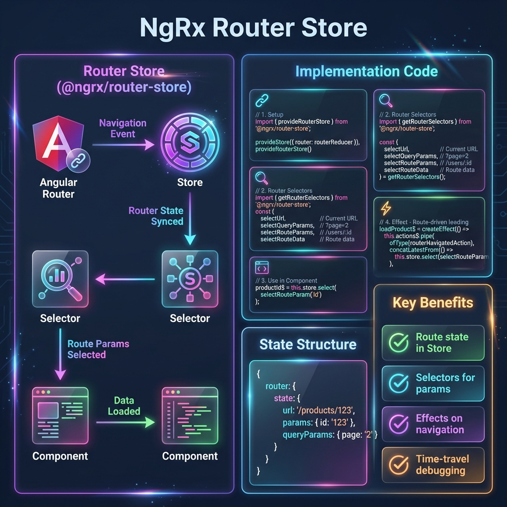

# 🔗 Use Case 7: Router Store (@ngrx/router-store)

> **💡 Lightbulb Moment**: Router Store is like having **your navigation history in the Redux DevTools**. Every route change is an action, route state is in the store, and you can time-travel through navigation!



---

## 1. 🎯 What Problem Does It Solve?

### The Problem: Router and Store are Disconnected

**Without Router Store:**
```typescript
// Component needs route params
@Component({...})
export class ProductDetailsComponent {
    constructor(
        private route: ActivatedRoute,
        private store: Store
    ) {
        // Problem 1: Two separate subscriptions
        this.route.params.subscribe(params => {
            this.productId = params['id'];
        });
        
        this.store.select(selectProducts).subscribe(products => {
            this.products = products;
        });
        
        // Problem 2: Can't trigger data load from route change in Effects
        // Problem 3: Route state not visible in Redux DevTools
        // Problem 4: Can't test navigation as easily
    }
}
```

**Problems:**
1. **Disconnected State**: Router state separate from Store state
2. **No Effects Integration**: Can't respond to route changes in Effects
3. **No DevTools Visibility**: Navigation not visible in action log
4. **Testing Complexity**: Hard to test route-driven logic
5. **No Time Travel**: Can't replay navigation in DevTools

### How Router Store Solves This

**With Router Store:**
```typescript
// Router state is IN the store
export const selectProductId = createSelector(
    selectRouteParams,
    params => params['id']
);

// Component uses store exclusively
@Component({...})
export class ProductDetailsComponent {
    productId$ = this.store.select(selectProductId);
    product$ = this.store.select(selectProductById(this.productId$));
    
    constructor(private store: Store) {}
}

// Effects respond to route changes
loadProduct$ = createEffect(() =>
    this.actions$.pipe(
        ofType(routerNavigatedAction),
        concatLatestFrom(() => this.store.select(selectProductId)),
        filter(([, id]) => !!id),
        switchMap(([, id]) => this.api.getProduct(id).pipe(
            map(product => loadProductSuccess({ product }))
        ))
    )
);
```

| Problem | Router Store Solution |
|---------|---------------------|
| Disconnected state | Route state IN the store |
| No Effects integration | `routerNavigatedAction` for Effects |
| No DevTools visibility | All navigation as actions in DevTools |
| Testing complexity | Mock router state like any other state |
| No time travel | Navigate through history in DevTools |

---

## 2. 🚀 Setup & Configuration

### Installation

```bash
npm install @ngrx/router-store
```

### Basic Configuration

```typescript
// app.config.ts
import { provideRouterStore, routerReducer } from '@ngrx/router-store';
import { provideStore } from '@ngrx/store';

export const appConfig: ApplicationConfig = {
    providers: [
        provideRouter(routes),
        provideStore({
            router: routerReducer  // Register router reducer
        }),
        provideRouterStore()  // Configure router store
    ]
};
```

### Custom Serializer (Recommended)

```typescript
import { RouterStateSerializer } from '@ngrx/router-store';
import { RouterStateSnapshot } from '@angular/router';

export interface CustomRouterState {
    url: string;
    params: Params;
    queryParams: Params;
    data: Data;
}

export class CustomSerializer implements RouterStateSerializer<CustomRouterState> {
    serialize(routerState: RouterStateSnapshot): CustomRouterState {
        let route = routerState.root;
        
        // Merge all route params
        while (route.firstChild) {
            route = route.firstChild;
        }
        
        const {
            url,
            root: { queryParams },
        } = routerState;
        const { params, data } = route;
        
        return { url, params, queryParams, data };
    }
}

// Register custom serializer
provideRouterStore({
    serializer: CustomSerializer
})
```

---

## 3. 📚 Key API & Patterns

### 1. Router Selectors

```typescript
import { getRouterSelectors } from '@ngrx/router-store';

// Get all router selectors
export const {
    selectCurrentRoute,   // Current activated route
    selectFragment,       // URL fragment (#)
    selectQueryParams,    // All query params
    selectQueryParam,     // Factory for specific query param
    selectRouteParams,    // All route params
    selectRouteParam,     // Factory for specific route param
    selectRouteData,      // Route data
    selectUrl             // Full URL string
} = getRouterSelectors();

// Usage in component
export class MyComponent {
    url$ = this.store.select(selectUrl);
    productId$ = this.store.select(selectRouteParam('id'));
    page$ = this.store.select(selectQueryParam('page'));
}
```

### 2. Router Actions

```typescript
import { 
    routerNavigationAction,  // Before navigation starts
    routerNavigatedAction,   // After navigation completes
    routerCancelAction,      // Navigation cancelled
    routerErrorAction,       // Navigation error
    routerRequestAction      // Navigation requested
} from '@ngrx/router-store';

// Use in Effects
loadData$ = createEffect(() =>
    this.actions$.pipe(
        ofType(routerNavigatedAction),  // Wait for navigation to complete
        concatLatestFrom(() => this.store.select(selectRouteParams)),
        switchMap(([, params]) => this.api.load(params))
    )
);
```

### 3. Navigation via Actions/Effects

```typescript
// Navigate by dispatching router actions
import { Router } from '@angular/router';

navigateToProduct$ = createEffect(() =>
    this.actions$.pipe(
        ofType(selectProduct),
        tap(({ productId }) => {
            this.router.navigate(['/products',productId]);
        })
    ),
    { dispatch: false }
);

// OR use @ngrx/router-store navigation actions
import { NavigationActionTiming } from '@ngrx/router-store';

navigateToProduct$ = createEffect(() =>
    this.actions$.pipe(
        ofType(selectProduct),
        map(({ productId }) => 
            // Custom navigation action
            go({ path: ['/products', productId] })
        )
    )
);
```

---

## 4. 🌍 Real-World Use Cases

### 1. Route-Driven Data Loading

```typescript
// Effect loads user based on route param
loadUserFromRoute$ = createEffect(() =>
    this.actions$.pipe(
        ofType(routerNavigatedAction),
        concatLatestFrom(() => this.store.select(selectRouteParam('userId'))),
        filter(([, userId]) => !!userId),
        switchMap(([, userId]) =>
            this.userApi.getUser(userId).pipe(
                map(user => loadUserSuccess({ user })),
                catchError(error => of(loadUserFailure({ error })))
            )
        )
    )
);

// Trigger: Navigate to /users/123
// Effect automatically loads user 123
```

### 2. Query Param Filtering

```typescript
// Selector combines products with query param filters
export const selectFilteredProducts = createSelector(
    selectAllProducts,
    selectQueryParams,
    (products, query) => {
        let filtered = products;
        
        if (query['category']) {
            filtered = filtered.filter(p => p.category === query['category']);
        }
        
        if (query['minPrice']) {
            filtered = filtered.filter(p => p.price >= +query['minPrice']);
        }
        
        if (query['search']) {
            filtered = filtered.filter(p => 
                p.name.toLowerCase().includes(query['search'].toLowerCase())
            );
        }
        
        return filtered;
    }
);

// Component just selects
products$ = this.store.select(selectFilteredProducts);

// Navigate to: /products?category=electronics&minPrice=100
// Products auto-filter!
```

### 3. Pagination State in URL

```typescript
// Selectors
export const selectPage = selectQueryParam('page');
export const selectPageSize = selectQueryParam('pageSize');

export const selectPaginatedItems = createSelector(
    selectAllItems,
    selectPage,
    selectPageSize,
    (items, page = 1, pageSize = 10) => {
        const start = (+page - 1) * +pageSize;
        return items.slice(start, start + +pageSize);
    }
);

// Component
items$ = this.store.select(selectPaginatedItems);

nextPage() {
    this.router.navigate([], {
        queryParams: { page: this.currentPage + 1 },
        queryParamsHandling: 'merge'
    });
}
```

### 4. Authentication Guard with Route Redirect

```typescript
// Guard stores intended URL, redirects to login
@Injectable()
export class AuthGuard {
    canActivate(route: ActivatedRouteSnapshot): Observable<boolean> {
        return this.store.select(selectIsAuthenticated).pipe(
            tap(isAuth => {
                if (!isAuth) {
                    // Store intended URL
                    this.store.dispatch(saveIntendedUrl({ url: route.url }));
                    this.router.navigate(['/login']);
                }
            })
        );
    }
}

// After login, redirect to intended URL
loginSuccess$ = createEffect(() =>
    this.actions$.pipe(
        ofType(loginSuccess),
        concatLatestFrom(() => this.store.select(selectIntendedUrl)),
        tap(([, intendedUrl]) => {
            this.router.navigateByUrl(intendedUrl || '/dashboard');
        })
    ),
    { dispatch: false }
);
```

### 5. Breadcrumb Navigation

```typescript
// Selector builds breadcrumbs from route hierarchy
export const selectBreadcrumbs = createSelector(
    selectCurrentRoute,
    (route) => {
        const breadcrumbs: Breadcrumb[] = [];
        let currentRoute = route;
        
        while (currentRoute) {
            if (currentRoute.data['breadcrumb']) {
                breadcrumbs.unshift({
                    label: currentRoute.data['breadcrumb'],
                    url: currentRoute.pathFromRoot
                        .map(r => r.url)
                        .join('/')
                });
            }
            currentRoute = currentRoute.firstChild;
        }
        
        return breadcrumbs;
    }
);

// Route config
{
    path: 'products/:id',
    component: ProductDetailsComponent,
    data: { breadcrumb: 'Product Details' }
}
```

### 6. Analytics Tracking

```typescript
// Track page views in Effect
trackPageView$ = createEffect(() =>
    this.actions$.pipe(
        ofType(routerNavigatedAction),
        concatLatestFrom(() => this.store.select(selectUrl)),
        tap(([, url]) => {
            this.analytics.trackPageView(url);
        })
    ),
    { dispatch: false }
);
```

---

## ❓ Complete Interview Questions (20+)

### Basic Conceptual Questions

**Q1: What is @ngrx/router-store?**
> A: Package that syncs Angular Router state with NgRx Store. Makes route info available as store state and navigation events as actions.

**Q2: Why sync router with store?**
> A: 
> - Route state accessible via selectors
> - Effects can respond to navigation
> - Navigation visible in DevTools
> - Time-travel debugging for navigation
> - Easier testing

**Q3: What actions does Router Store dispatch?**
> A:
> - `ROUTER_REQUEST` - Navigation requested
> - `ROUTER_NAVIGATION` - Before navigation
> - `ROUTER_NAVIGATED` - After navigation success
> - `ROUTER_CANCEL` - Navigation cancelled
> - `ROUTER_ERROR` - Navigation failed

**Q4: How do you access route params from Store?**
> A: Use router selectors:
> ```typescript
> const selectors = getRouterSelectors();
> productId$ = store.select(selectors.selectRouteParam('id'));
> ```

**Q5: What is a Router Serializer?**
> A: Function that transforms `RouterStateSnapshot` into the shape stored in the store. Customize to include only needed data.

---

### Configuration Questions

**Q6: How do you setup Router Store?**
> A:
> ```typescript
> provideStore({ router: routerReducer }),
> provideRouterStore()
> ```

**Q7: Why use a custom serializer?**
> A:
> - Default includes entire router state (heavy)
> - Custom serializer includes only needed fields
> - Reduces memory usage
> - Faster serialization

**Q8: How do you create a custom serializer?**
> A:
> ```typescript
> class CustomSerializer implements RouterStateSerializer<CustomState> {
>     serialize(state: RouterStateSnapshot): CustomState {
>         return { url: state.url, params: state.root.firstChild?.params };
>     }
> }
> provideRouterStore({ serializer: CustomSerializer })
> ```

---

### Integration with Effects

**Q9: How do you load data when route changes?**
> A:
> ```typescript
> loadData$ = createEffect(() =>
>     actions$.pipe(
>         ofType(routerNavigatedAction),
>         concatLatestFrom(() => store.select(selectRouteParams)),
>         switchMap(([, params]) => api.load(params))
>     )
> );
> ```

**Q10: What's the difference between `routerNavigationAction` and `routerNavigatedAction`?**
> A:
> - `routerNavigationAction`: Fires BEFORE navigation completes
> - `routerNavigatedAction`: Fires AFTER navigation succeeds
> Use `routerNavigatedAction` for data loading (params are final)

**Q11: How do you navigate from an Effect?**
> A:
> ```typescript
> redirect$ = createEffect(() =>
>     actions$.pipe(
>         ofType(loginSuccess),
>         tap(() => router.navigate(['/dashboard']))
>     ),
>     { dispatch: false }
> );
> ```

---

### Selectors Questions

**Q12: How do you select query params?**
> A:
> ```typescript
> const { selectQueryParams, selectQueryParam } = getRouterSelectors();
> allParams$ = store.select(selectQueryParams);
> page$ = store.select(selectQueryParam('page'));
> ```

**Q13: How do you combine route params with other state?**
> A:
> ```typescript
> export const selectCurrentProduct = createSelector(
>     selectProducts,
>     selectRouteParam('id'),
>     (products, id) => products.find(p => p.id === id)
> );
> ```

**Q14: Can you parameterize route selectors?**
> A: Yes, use factory selectors:
> ```typescript
> export const selectRouteParam = (param: string) => createSelector(
>     selectRouteParams,
>     params => params[param]
> );
> ```

---

### Scenario Questions

**Q15: User navigates to /products/123. How do you load that product?**
> A:
> ```typescript
> loadProduct$ = createEffect(() =>
>     actions$.pipe(
>         ofType(routerNavigatedAction),
>         concatLatestFrom(() => store.select(selectRouteParam('id'))),
>         filter(([, id]) => !!id),
>         switchMap(([, id]) => api.getProduct(id).pipe(
>             map(product => loadProductSuccess({ product }))
>         ))
>     )
> );
> ```

**Q16: How do you implement URL-based filtering?**
> A: Combine selectors:
> ```typescript
> selectFiltered = createSelector(
>     selectItems,
>     selectQueryParam('filter'),
>     (items, filter) => items.filter(i => i.matches(filter))
> );
> ```

**Q17: User clicks "Next Page". How do you update URL?**
> A:
> ```typescript
> nextPage() {
>     this.router.navigate([], {
>         queryParams: { page: this.currentPage + 1 },
>         queryParamsHandling: 'merge'
>     });
> }
> ```

**Q18: After login, redirect to originally intended URL. How?**
> A:
> ```typescript
> // Guard saves URL
> this.store.dispatch(saveIntendedUrl({ url: route.url }));
> 
> // After login
> loginSuccess$ = createEffect(() =>
>     actions$.pipe(
>         ofType(loginSuccess),
>         concatLatestFrom(() => store.select(selectIntendedUrl)),
>         tap(([, url]) => router.navigateByUrl(url || '/home'))
>     ),
>     { dispatch: false }
> );
> ```

---

### Advanced Questions

**Q19: Does Router Store work with lazy-loaded modules?**
> A: Yes! Router state updates when lazy routes load. No extra configuration needed.

**Q20: How do you test components using router selectors?**
> A: Mock the router state in store:
> ```typescript
> const mockState = {
>     router: {
>         state: { url: '/products/123', params: { id: '123' }, queryParams: {} }
>     }
> };
> TestBed.configureTestingModule({
>     providers: [provideMockStore({ initialState: mockState })]
> });
> ```

**Q21: How do you handle navigation errors?**
> A: Listen to `routerErrorAction`:
> ```typescript
> handleError$ = createEffect(() =>
>     actions$.pipe(
>         ofType(routerErrorAction),
>         tap(({ error }) => console.error('Navigation failed:', error))
>     ),
>     { dispatch: false }
> );
> ```

**Q22: Can you time-travel through navigation in DevTools?**
> A: Yes! Router Store integrates with DevTools. You can:
> - See navigation as actions
> - Jump to previous routes
> - Replay navigation sequences

**Q23: Does Router Store impact performance?**
> A: Minimal impact. Custom serializer reduces overhead by excluding unnecessary router state.

**Q24: How do you sync multiple query params?**
> A:
> ```typescript
> export const selectFilters = createSelector(
>     selectQueryParams,
>     params => ({
>         category: params['category'],
>         minPrice: +params['minPrice'] || 0,
>         maxPrice: +params['maxPrice'] || Number.MAX_VALUE
>     })
> );
> ```

**Q25: When should you NOT use Router Store?**
> A:
> - Simple apps with no route-driven logic
> - When you only need local route info (use ActivatedRoute)
> - Very basic navigation (no Effects/complex state)

---

## 🧠 Quick Reference

### Router State in Store
```
AppState {
    router: {
        state: {
            url: string,
            params: Params,
            queryParams: Params,
            data: Data
        },
        navigationId: number
    }
}
```

### Common Pattern
```typescript
// 1. Select route param
id$ = store.select(selectRouteParam('id'));

// 2. Load data in Effect
load$ = createEffect(() =>
    actions$.pipe(
        ofType(routerNavigatedAction),
        concatLatestFrom(() => store.select(selectRouteParam('id'))),
        switchMap(([, id]) => api.get(id))
    )
);

// 3. Display in component
data$ = store.select(selectData);
```

---

> **Key Takeaway**: Router Store treats navigation as state changes. Route → Store → Selectors → Components. Navigation → Actions → Effects. Everything in one place!
