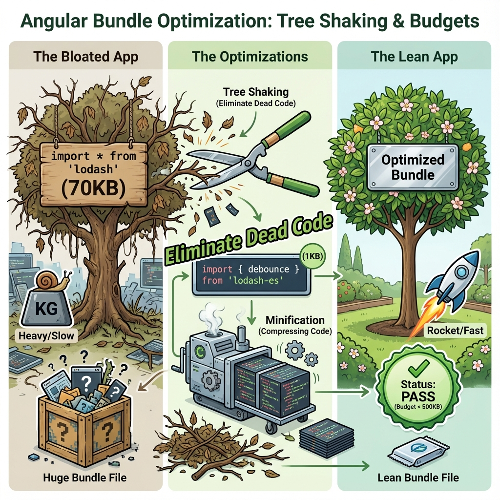

# 🎯 Bundle Optimization

> **💡 Lightbulb Moment**: Import `debounce` from lodash = 1KB. Import all of lodash = 70KB!


## 📋 Table of Contents
- [Key Techniques](#key-techniques)
- [Tools](#tools)
  - [📦 Data Flow Summary (Visual Box Diagram)](#data-flow-summary-visual-box-diagram)

---
---



## Key Techniques

1. **Tree Shaking** - Only used code bundled
2. **Production Mode** - AOT, minification
3. **Bundle Budgets** - Set size limits
4. **Differential Loading** - Modern browser optimization

---

## Tools

```bash
ng build --stats-json
npx webpack-bundle-analyzer dist/stats.json
```

---

### 📦 Data Flow Summary (Visual Box Diagram)

```
┌─────────────────────────────────────────────────────────────┐
│  BUNDLE OPTIMIZATION: SMALLER = FASTER                      │
│                                                             │
│   TREE SHAKING:                                             │
│   ┌───────────────────────────────────────────────────────┐ │
│   │ ❌ import lodash from 'lodash';           // 70KB     │ │
│   │ ✅ import { debounce } from 'lodash-es';  // 1KB      │ │
│   └───────────────────────────────────────────────────────┘ │
│                                                             │
│   PRODUCTION BUILD:                                         │
│   ┌───────────────────────────────────────────────────────┐ │
│   │ ng build --configuration=production                   │ │
│   │ - AOT compilation                                     │ │
│   │ - Minification & uglification                         │ │
│   │ - Dead code elimination                               │ │
│   └───────────────────────────────────────────────────────┘ │
│                                                             │
│   BUNDLE BUDGETS (angular.json):                            │
│   ┌───────────────────────────────────────────────────────┐ │
│   │ "budgets": [{                                         │ │
│   │   "type": "initial",                                  │ │
│   │   "maximumWarning": "500kb",                          │ │
│   │   "maximumError": "1mb"                               │ │
│   │ }]                                                    │ │
│   └───────────────────────────────────────────────────────┘ │
│                                                             │
│   ANALYZE: ng build --stats-json + webpack-bundle-analyzer │
└─────────────────────────────────────────────────────────────┘
```

> **Key Takeaway**: Import specific functions, not entire libraries. Set bundle budgets. Analyze with webpack-bundle-analyzer!

