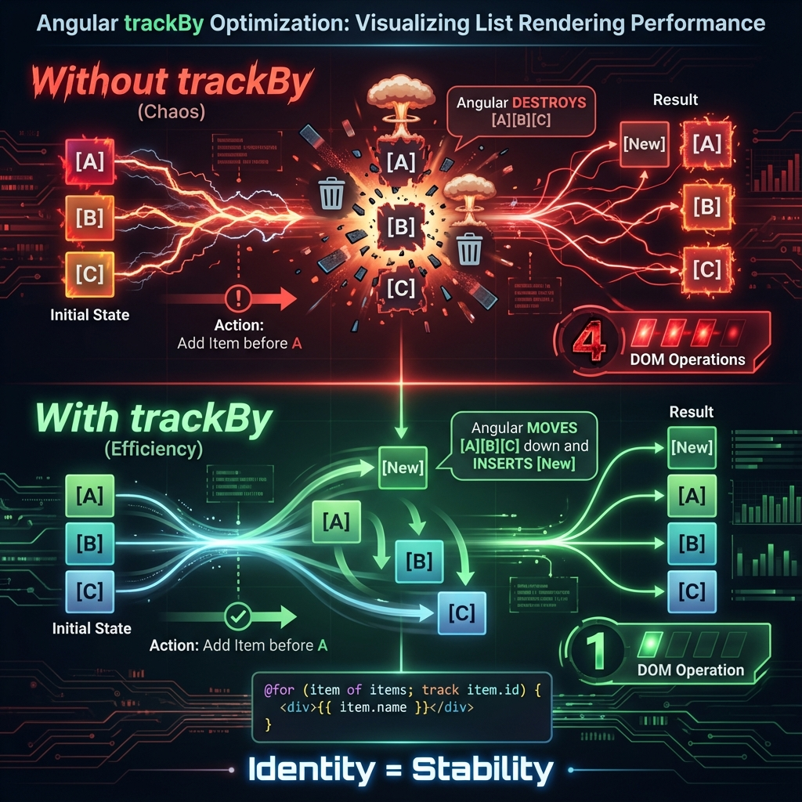

# 📋 TrackBy Optimization

> **💡 Lightbulb Moment**: TrackBy tells Angular "this item is the same as before" so it reuses DOM!


## 📋 Table of Contents
- [Syntax](#syntax)
- [Impact](#impact)
- [Best Practices](#best-practices)
  - [📦 Data Flow Summary (Visual Box Diagram)](#data-flow-summary-visual-box-diagram)

---
---



## Syntax

```typescript
// Modern @for
@for (item of items; track item.id) {
    <div>{{ item.name }}</div>
}

// Legacy *ngFor
*ngFor="let item of items; trackBy: trackById"
```

---

## Impact

| Scenario | Without TrackBy | With TrackBy |
|----------|-----------------|--------------|
| Add 1 to 1000 | 1000 DOM ops | 1 DOM op |

---

## Best Practices

✅ Track by unique ID  
❌ Don't track by index (unless static)  
❌ Don't track by object reference

---

### 📦 Data Flow Summary (Visual Box Diagram)

```
┌─────────────────────────────────────────────────────────────┐
│  TRACKBY: REUSE DOM ELEMENTS                                │
│                                                             │
│   WITHOUT TRACKBY:                                          │
│   ┌───────────────────────────────────────────────────────┐ │
│   │ items = [A, B, C] → [A, B, C, D]                      │ │
│   │                                                       │ │
│   │ Angular: "Array changed! Recreate ALL DOM!" 🐢        │ │
│   │ [❌A] [❌B] [❌C] → [+A] [+B] [+C] [+D]                │ │
│   │ 4 DOM operations even though only 1 item added        │ │
│   └───────────────────────────────────────────────────────┘ │
│                                                             │
│   WITH TRACKBY:                                             │
│   ┌───────────────────────────────────────────────────────┐ │
│   │ @for (item of items; track item.id) { ... }           │ │
│   │                                                       │ │
│   │ Angular: "Same IDs! Reuse existing DOM!" 🚀           │ │
│   │ [✅A] [✅B] [✅C] [+D]                                 │ │
│   │ Only 1 DOM operation for 1 new item                   │ │
│   └───────────────────────────────────────────────────────┘ │
│                                                             │
│   ⚠️ Track by UNIQUE ID, not index or object reference     │
└─────────────────────────────────────────────────────────────┘
```

> **Key Takeaway**: `track item.id` tells Angular "this is the same item" so it reuses DOM instead of recreating!

