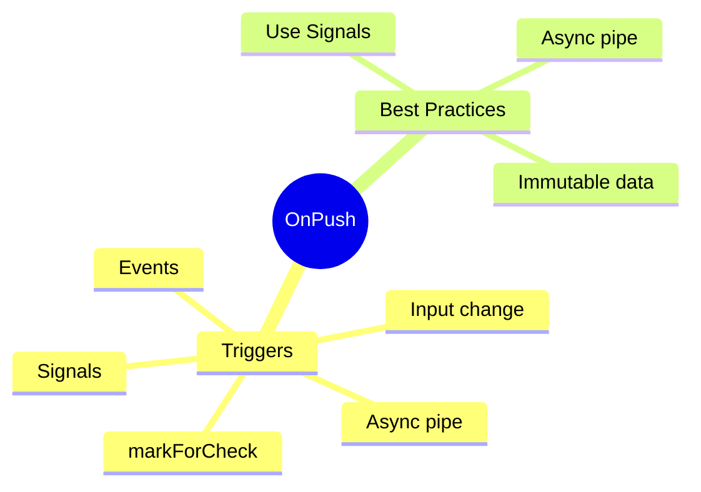

# 🔄 Use Case 1: OnPush Change Detection

> **💡 Lightbulb Moment**: OnPush = "Don't check me unless something I care about changed"

---


## Default vs OnPush

| Aspect | Default | OnPush |
|--------|---------|--------|
| Check frequency | Every event | Only when triggered |
| CD cycles | Many | Few |
| Performance | Lower | Higher |

---

## 5 Triggers for OnPush

1. **@Input()** reference changes
2. **Events** (click, input) in component
3. **Async pipe** emits
4. **markForCheck()** called
5. **Signals** update

---

### 📦 Data Flow Summary (Visual Box Diagram)

```
┌─────────────────────────────────────────────────────────────┐
│  ONPUSH CHANGE DETECTION                                    │
│                                                             │
│   DEFAULT vs ONPUSH:                                        │
│   ┌───────────────────────────────────────────────────────┐ │
│   │ DEFAULT:                                              │ │
│   │ Any event → Check ALL components → Expensive! 🐢      │ │
│   │                                                       │ │
│   │ ONPUSH:                                               │ │
│   │ @Component({ changeDetection: ChangeDetectionStrategy.OnPush })│ │
│   │ Only check when explicitly triggered → Fast! 🚀       │ │
│   └───────────────────────────────────────────────────────┘ │
│                                                             │
│   5 TRIGGERS FOR ONPUSH:                                    │
│   ┌───────────────────────────────────────────────────────┐ │
│   │ 1. @Input() reference changes (new object/array)      │ │
│   │ 2. DOM events in THIS component (click, input)        │ │
│   │ 3. Async pipe emits new value                         │ │
│   │ 4. markForCheck() called manually                     │ │
│   │ 5. Signals update (Angular 17+)                       │ │
│   └───────────────────────────────────────────────────────┘ │
│                                                             │
│   ⚠️ GOTCHA: Mutating object won't trigger (use immutable)│
└─────────────────────────────────────────────────────────────┘
```

> **Key Takeaway**: OnPush = "Don't check me unless something I care about changed". Use with immutable data + async pipe!

---

## 🧠 Mind Map


