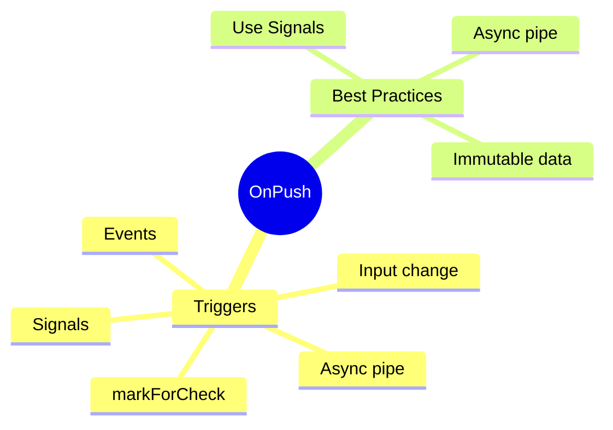

# 🔄 Use Case 1: OnPush Change Detection

> **💡 Lightbulb Moment**: OnPush = "Don't check me unless something I care about changed"

---

## Default vs OnPush

| Aspect | Default | OnPush |
|--------|---------|--------|
| Check frequency | Every event | Only when triggered |
| CD cycles | Many | Few |
| Performance | Lower | Higher |

---

## 5 Triggers for OnPush

1. **@Input()** reference changes
2. **Events** (click, input) in component
3. **Async pipe** emits
4. **markForCheck()** called
5. **Signals** update

---

## 🧠 Mind Map

