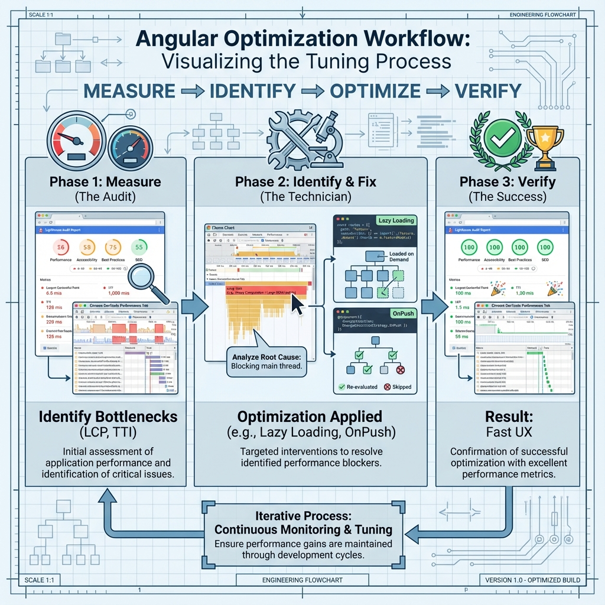

# 🔍 Use Case 7: Profiling & DevTools

> **💡 Lightbulb Moment**: You can't optimize what you don't measure!

---



## Essential Tools

1. **Angular DevTools** - CD profiler, component tree
2. **Chrome DevTools** - Performance/Memory tabs
3. **Lighthouse** - Performance audits
4. **Bundle Analyzer** - Visualize bundles

---

## Core Web Vitals

| Metric | Target |
|--------|--------|
| LCP | < 2.5s |
| FID | < 100ms |
| CLS | < 0.1 |

---

## Workflow

Measure → Identify → Optimize → Verify

---

### 📦 Data Flow Summary (Visual Box Diagram)

```
┌─────────────────────────────────────────────────────────────┐
│  PROFILING & DEVTOOLS                                       │
│                                                             │
│   TOOLS:                                                    │
│   ┌───────────────────────────────────────────────────────┐ │
│   │ Angular DevTools  → CD profiler, component tree       │ │
│   │ Chrome DevTools   → Performance/Memory tabs           │ │
│   │ Lighthouse        → Performance audits                │ │
│   │ Bundle Analyzer   → Visualize bundle sizes            │ │
│   └───────────────────────────────────────────────────────┘ │
│                                                             │
│   CORE WEB VITALS:                                          │
│   ┌───────────────────────────────────────────────────────┐ │
│   │ LCP (Largest Contentful Paint) → Target: < 2.5s       │ │
│   │ FID (First Input Delay)        → Target: < 100ms      │ │
│   │ CLS (Cumulative Layout Shift)  → Target: < 0.1        │ │
│   └───────────────────────────────────────────────────────┘ │
│                                                             │
│   WORKFLOW:                                                 │
│   ┌───────────────────────────────────────────────────────┐ │
│   │                 ┌────────────┐                        │ │
│   │                 │  Measure   │                        │ │
│   │                 └─────┬──────┘                        │ │
│   │                       ↓                               │ │
│   │        ┌──────────────┴──────────────┐                │ │
│   │        ↓                             ↓                │ │
│   │   ┌─────────┐                  ┌─────────┐            │ │
│   │   │Identify │  ←→   Repeat    │ Verify  │            │ │
│   │   └────┬────┘                  └─────────┘            │ │
│   │        ↓                             ↑                │ │
│   │   ┌─────────┐                        │                │ │
│   │   │Optimize │ ───────────────────────┘                │ │
│   │   └─────────┘                                         │ │
│   └───────────────────────────────────────────────────────┘ │
└─────────────────────────────────────────────────────────────┘
```

> **Key Takeaway**: You can't optimize what you don't measure! Use Angular DevTools for CD profiling, Chrome DevTools for runtime, Lighthouse for audits!

