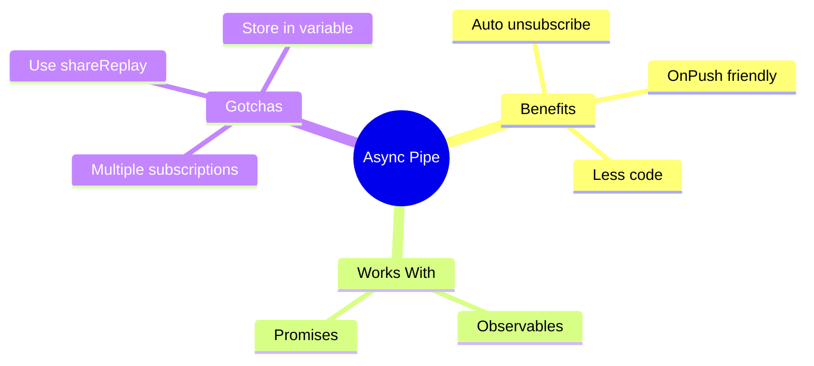

# 🔄 Async Pipe

> **💡 Lightbulb Moment**: The async pipe automatically subscribes AND unsubscribes from Observables - no memory leaks!


## 📋 Table of Contents
- [1. 🔍 What is Async Pipe?](#1--what-is-async-pipe)
- [2. 🚀 Key Benefits](#2--key-benefits)
  - [Automatic Cleanup](#automatic-cleanup)
  - [OnPush Compatibility](#onpush-compatibility)
  - [📦 Data Flow Summary (Visual Box Diagram)](#data-flow-summary-visual-box-diagram)
- [3. ❓ Interview Questions](#3--interview-questions)
  - [Basic Questions](#basic-questions)
    - [Q1: Why prefer async pipe over subscribe?](#q1-why-prefer-async-pipe-over-subscribe)
    - [Q2: Is async pipe pure or impure?](#q2-is-async-pipe-pure-or-impure)
    - [Q3: Can async pipe work with Promises?](#q3-can-async-pipe-work-with-promises)
  - [Scenario-Based Questions](#scenario-based-questions)
    - [Scenario: Multiple Subscriptions](#scenario-multiple-subscriptions)
- [🧠 Mind Map](#mind-map)

---
---

## 1. 🔍 What is Async Pipe?

Subscribes to an Observable/Promise and returns the latest value.

```html
<!-- Subscribes and unsubscribes automatically! -->
<div>{{ user$ | async }}</div>

<!-- With object destructuring -->
@if (user$ | async; as user) {
    <h1>{{ user.name }}</h1>
    <p>{{ user.email }}</p>
}
```

---

## 2. 🚀 Key Benefits

### Automatic Cleanup
```typescript
// WITHOUT async pipe - manual unsubscribe needed
user: User;
subscription: Subscription;

ngOnInit() {
    this.subscription = this.userService.getUser().subscribe(u => this.user = u);
}
ngOnDestroy() {
    this.subscription.unsubscribe();  // Must remember!
}

// WITH async pipe - automatic!
user$ = this.userService.getUser();
// Template: {{ user$ | async }}
// No ngOnDestroy needed!
```

### OnPush Compatibility
```typescript
@Component({
    changeDetection: ChangeDetectionStrategy.OnPush  // Works great!
})
```

---

### 📦 Data Flow Summary (Visual Box Diagram)

```
┌─────────────────────────────────────────────────────────────┐
│  ASYNC PIPE: AUTO SUBSCRIBE + UNSUBSCRIBE                   │
│                                                             │
│   WITHOUT ASYNC PIPE (manual labor):                        │
│   ┌───────────────────────────────────────────────────────┐ │
│   │ ngOnInit() {                                          │ │
│   │   this.sub = this.user$.subscribe(u => this.user = u);│ │
│   │ }                                                     │ │
│   │ ngOnDestroy() {                                       │ │
│   │   this.sub.unsubscribe();  // 😓 Must remember!       │ │
│   │ }                                                     │ │
│   └───────────────────────────────────────────────────────┘ │
│                                                             │
│   WITH ASYNC PIPE (automatic):                              │
│   ┌───────────────────────────────────────────────────────┐ │
│   │ user$ = this.userService.getUser();                   │ │
│   │                                                       │ │
│   │ Template: {{ user$ | async }}                         │ │
│   │                                                       │ │
│   │ ✅ Auto-subscribes on render                          │ │
│   │ ✅ Auto-unsubscribes on destroy                       │ │
│   │ ✅ Works with OnPush change detection                 │ │
│   │ ✅ No memory leaks!                                   │ │
│   └───────────────────────────────────────────────────────┘ │
│                                                             │
│   ⚠️ GOTCHA: Multiple async pipes = Multiple subscriptions  │
│   ┌───────────────────────────────────────────────────────┐ │
│   │ {{ user$ | async }} {{ user$ | async }} = 2 HTTP calls│ │
│   │                                                       │ │
│   │ FIX: @if (user$ | async; as user) {                   │ │
│   │        {{ user.name }} {{ user.email }} = 1 HTTP call │ │
│   │      }                                                │ │
│   └───────────────────────────────────────────────────────┘ │
└─────────────────────────────────────────────────────────────┘
```

> **Key Takeaway**: Always prefer async pipe over manual subscribe. Use `as user` to avoid multiple subscriptions!

---

## 3. ❓ Interview Questions

### Basic Questions

#### Q1: Why prefer async pipe over subscribe?
**Answer:**
1. Auto-unsubscribes (no memory leaks)
2. Works with OnPush change detection
3. Less boilerplate code
4. Template-driven (declarative)

#### Q2: Is async pipe pure or impure?
**Answer:** Impure! It needs to check for new emissions on every change detection cycle.

#### Q3: Can async pipe work with Promises?
**Answer:** Yes! It automatically detects Promise vs Observable:
```html
{{ promiseData | async }}
{{ observableData | async }}
```

---

### Scenario-Based Questions

#### Scenario: Multiple Subscriptions
**Question:** You use `{{ user$ | async }}` in 5 places. How many HTTP calls?

**Answer:** 5 calls! Each async pipe creates a new subscription.
**Solution:** Use `shareReplay()` or single subscription:
```typescript
user$ = this.http.get('/user').pipe(shareReplay(1));

// OR in template
@if (user$ | async; as user) {
    <h1>{{ user.name }}</h1>
    <p>{{ user.email }}</p>  <!-- Same subscription -->
}
```

---

## 🧠 Mind Map


