# 🛠️ Built-in Pipes

> **Goal**: Master Angular's essential built-in pipes to transform data for display without modifying the underlying model.

---

## 1. 🔍 How It Works (The Concept)

### The Mechanism
Pipes are simple functions that live in your template. They take **raw data** (Input), apply a **transformation**, and output a **formatted string**.

Crucially, **Pipes do NOT change your data**. They only change what the user *sees*.

### Default vs. Optimized Behavior

| Feature | Default (Raw Data) | Optimized (With Pipe) |
| :--- | :--- | :--- |
| **Data Integrity** | You modify the actual variable to format it. | Variable stays pure; template handles formatting. |
| **Reusability** | Formatting logic is hardcoded in component. | Formatting logic is standard and reusable. |
| **Localization** | `1234.56` looks same everywhere. | `$1,234.56` (US) vs `1.234,56 €` (DE) automatically. |

### 📊 Data Flow Diagram

```mermaid
flowchart LR
    Data[("💾 Raw Data
    '2025-12-25'")]
    
    Pipe{{"⚡ DatePipe
    Function"}}
    
    View["👁️ User View
    'Dec 25, 2025'"]
    
    Data -->|"Input"| Pipe
    Pipe -->|"Transform"| View
    
    style Data fill:#e3f2fd,stroke:#1565c0,stroke-width:2px
    style Pipe fill:#fff3e0,stroke:#ef6c00,stroke-width:2px,shape:hexagon
    style View fill:#e8f5e9,stroke:#2e7d32,stroke-width:2px
```



---

## 2. 🚀 Step-by-Step Implementation Guide

### Step 1: Component (The Data Provider)
The component simply provides raw data. It typically doesn't know or care how it will be displayed.

```typescript
// built-in-pipes.component.ts
import { Component } from '@angular/core';
import { CommonModule } from '@angular/common'; // 🛡️ CRITICAL: Contains built-in pipes

@Component({
  selector: 'app-built-in-pipes',
  standalone: true,
  imports: [CommonModule],
  templateUrl: './built-in-pipes.component.html'
})
export class BuiltInPipesComponent {
  // 🛡️ CRITICAL: Store data in its raw, machine-friendly format
  today = new Date();       // Date object
  price = 1234.56;          // Number
  message = 'hello world';  // String
}
```

### Step 2: Template (The Consumer)
The template applies the pipes using the pipe operator `|`.

```html
<!-- built-in-pipes.component.html -->
<div class="monitor">
    <!-- 1. Date Pipe -->
    <p>
        <strong>Raw:</strong> {{ today }} <br>
        <!-- 🛡️ CRITICAL: 'short' is an argument passed to the pipe -->
        <strong>Formatted:</strong> {{ today | date:'short' }}
    </p>

    <!-- 2. Currency Pipe -->
    <p>
        <strong>Raw:</strong> {{ price }} <br>
        <strong>Formatted:</strong> {{ price | currency:'USD' }}
    </p>

    <!-- 3. Text Pipes -->
    <p>
        <strong>Raw:</strong> {{ message }} <br>
        <strong>Upper:</strong> {{ message | uppercase }} <br>
        <strong>Title:</strong> {{ message | titlecase }}
    </p>
</div>
```

---

## 3. 🐛 Common Pitfalls & Debugging

### ❌ Pitfall 1: Mutating Data in Component
**Bad Code:**
```typescript
// Component
export class BadComponent {
    price = 100;
    
    ngOnInit() {
        // ❌ MUTATION: Changing the actual data model for display purposes
        this.price = "$" + this.price + ".00"; 
    }
}
```
**Why it fails:** 
1. `price` is now a `string`, not a `number`. You can no longer do math on it (`price + 10` fails).
2. If you need to send this back to an API, you have to "un-format" it.

**✅ Fixed Code (Immutability):**
```typescript
// Keep price as number, format in HTML with {{ price | currency }}
price = 100; 
```

### ❌ Pitfall 2: Forgetting `CommonModule`
**Error:** `The pipe 'date' could not be found`
**Fix:** Ensure `CommonModule` is in your component's `imports` array (for standalone components) or your Module's imports.

---

## 4. ⚡ Performance & Architecture

### Performance
*   **Pure Functions**: Built-in pipes are **pure**. This means Angular executes them *only* when the input reference changes.
*   **Efficiency**: Transforming `1234` to `$1,234` is trivial (microseconds). It is much faster than running complex logic in a component getter.

### Architecture
*   **Separation of Concerns**: 
    *   **Logic Layer (TS)**: Handles business logic, calculations, and API references.
    *   **Presentation Layer (HTML)**: Handles formatting, localization, and styling.
*   **Localization (i18n)**: Pipes like `Date` and `Currency` automatically adapt to the user's locale (e.g., US vs UK vs JP) if configured, saving you massive effort.

---

## 5. 🌍 Real World Use Cases

1.  **E-Commerce Product Cards**: Displaying prices. You store `19.99` in DB, but show `$19.99` in US and `19,99 €` in Germany using `| currency`.
2.  **Dashboards**: Displaying timestamps. Database has `2023-11-15T10:00:00Z`, but user sees `Nov 15, 10:00 AM` using `| date:'medium'`.
3.  **User Profiles**: Displaying names. User types "john doe", you display "John Doe" using `| titlecase`.

---

## 6. 📝 The Analogy: "The Sunglasses" 🕶️

Imagine your data is the **Sun** (bright, raw, intense energy).
The Pipe is a pair of **Sunglasses**.

*   **The Sun (Data)** doesn't change. It's still a giant ball of fire.
*   **You (The User)** see a shaded, comfortable version.
*   If you take the glasses off, the Sun is still there, unchanged.

The pipe merely "filters" how you perceive the object, it doesn't physically alter the object itself.

---

## 7. ❓ Interview & Concept Questions

1.  **Q: What is the primary purpose of a Pipe in Angular?**
    *   **A:** To transform data for display purposes in the template without modifying the underlying data model.

2.  **Q: How do you pass arguments to a pipe?**
    *   **A:** By using a colon `:` after the pipe name. Example: `{{ value | date:'short' }}`.

3.  **Q: Why is it better to use a pipe than a function in the template (e.g., `{{ format(value) }}`)?**
    *   **A:** Pipes are memoized (cached). Angular only re-runs a pure pipe if the input value changes. A function in the template runs on *every* change detection cycle, which kills performance.

4.  **Q: Can you chain pipes?**
    *   **A:** Yes. `{{ date | date:'full' | uppercase }}` works by passing the output of the first pipe as input to the second.

5.  **Q: What module must be imported to use `DatePipe` or `CurrencyPipe`?**
    *   **A:** `CommonModule`.

---

## 🧠 Mind Map


