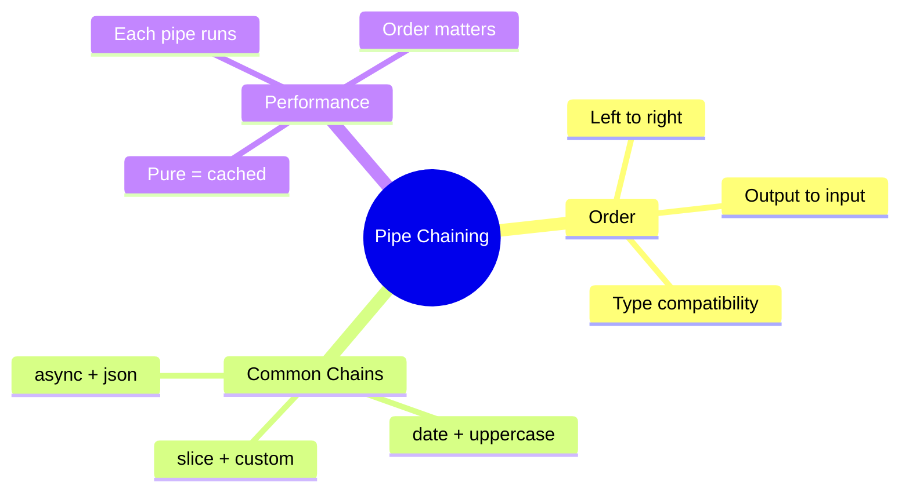

# 🔗 Chaining Pipes

> **💡 Lightbulb Moment**: Pipes can be chained! Output of one becomes input of the next.


## 📋 Table of Contents
- [1. 🔍 How Chaining Works](#1--how-chaining-works)
- [2. 🚀 Examples](#2--examples)
  - [Text Transformation](#text-transformation)
  - [Date + Uppercase](#date--uppercase)
  - [Async + JSON](#async--json)
  - [Slice + Custom](#slice--custom)
  - [📦 Data Flow Summary (Visual Box Diagram)](#data-flow-summary-visual-box-diagram)
- [3. ❓ Interview Questions](#3--interview-questions)
  - [Basic Questions](#basic-questions)
    - [Q1: What order do chained pipes execute?](#q1-what-order-do-chained-pipes-execute)
    - [Q2: Can you chain any pipes?](#q2-can-you-chain-any-pipes)
  - [Scenario-Based Questions](#scenario-based-questions)
    - [Scenario: Format Currency with Symbol](#scenario-format-currency-with-symbol)
    - [Scenario: Top 3 Sorted Users](#scenario-top-3-sorted-users)
- [🧠 Mind Map](#mind-map)

---
---

## 1. 🔍 How Chaining Works

```html
{{ value | pipe1 | pipe2 | pipe3 }}
```

Each pipe transforms the output of the previous one.

---

## 2. 🚀 Examples

### Text Transformation
```html
{{ name | lowercase | titlecase }}
<!-- "JOHN DOE" → "john doe" → "John Doe" -->
```

### Date + Uppercase
```html
{{ birthDate | date:'MMMM' | uppercase }}
<!-- date object → "December" → "DECEMBER" -->
```

### Async + JSON
```html
<pre>{{ user$ | async | json }}</pre>
<!-- Observable → User object → JSON string -->
```

### Slice + Custom
```html
{{ items | slice:0:5 | sortBy:'name' }}
```

---

### 📦 Data Flow Summary (Visual Box Diagram)

```
┌─────────────────────────────────────────────────────────────┐
│  PIPE CHAINING: OUTPUT → INPUT → OUTPUT                     │
│                                                             │
│   EXECUTION FLOW (Left to Right):                           │
│   ┌───────────────────────────────────────────────────────┐ │
│   │ {{ value | pipe1 | pipe2 | pipe3 }}                   │ │
│   │                                                       │ │
│   │     value                                             │ │
│   │       │                                               │ │
│   │       ▼                                               │ │
│   │   [ pipe1 ]  →  result1                               │ │
│   │                    │                                  │ │
│   │                    ▼                                  │ │
│   │               [ pipe2 ]  →  result2                   │ │
│   │                              │                        │ │
│   │                              ▼                        │ │
│   │                         [ pipe3 ]  →  FINAL OUTPUT    │ │
│   └───────────────────────────────────────────────────────┘ │
│                                                             │
│   EXAMPLE:                                                  │
│   ┌───────────────────────────────────────────────────────┐ │
│   │ {{ users$ | async | slice:0:5 | sortBy:'name' }}      │ │
│   │                                                       │ │
│   │   users$                                              │ │
│   │     │                                                 │ │
│   │     ▼                                                 │ │
│   │   [async]    → User[] (from Observable)               │ │
│   │     │                                                 │ │
│   │     ▼                                                 │ │
│   │   [slice]    → First 5 users                          │ │
│   │     │                                                 │ │
│   │     ▼                                                 │ │
│   │   [sortBy]   → Sorted by name                         │ │
│   └───────────────────────────────────────────────────────┘ │
└─────────────────────────────────────────────────────────────┘
```

> **Key Takeaway**: Chain pipes left-to-right. Each pipe's output becomes the next pipe's input. Type must match!

---

## 3. ❓ Interview Questions

### Basic Questions

#### Q1: What order do chained pipes execute?
**Answer:** Left to right. First pipe's output is second pipe's input.

#### Q2: Can you chain any pipes?
**Answer:** Yes, as long as output type of pipe N matches input type of pipe N+1.

---

### Scenario-Based Questions

#### Scenario: Format Currency with Symbol
**Question:** Display price as "$1,234.56 USD" (with code)

**Answer:**
```html
{{ price | currency:'USD':'symbol':'1.2-2' }} USD
<!-- Or create custom pipe that does both -->
```

#### Scenario: Top 3 Sorted Users
**Question:** Get first 3 users sorted by name from observable.

**Answer:**
```html
@for (user of users$ | async | sortBy:'name' | slice:0:3; track user.id) {
    {{ user.name }}
}
```

---

## 🧠 Mind Map


