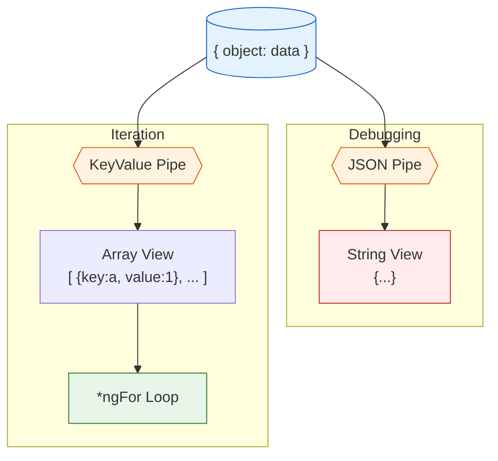

# 🔧 Utility Pipes (JSON & KeyValue)

> **Goal**: Leverage Angular's utility pipes to debug applications faster and iterate over objects directly in templates.

---

## 1. 🔍 How It Works (The Concept)

### The Mechanism
Angular provides two specific pipes that solve structural problems rather than formatting problems:
1.  **JsonPipe**: Converts any JavaScript Object into a stringified JSON representation. Ideally for debugging.
2.  **KeyValuePipe**: Converts an Object or Map into an Array of `{key, value}` pairs, allowing `*ngFor` to loop over them.

### Default vs. Optimized Behavior

| Feature | Without Pipe | With Pipe |
| :--- | :--- | :--- |
| **Debug Object** | Shows `[object Object]` in view. | Shows `{"id":1, "name":"Ali"}` nicely formatted. |
| **Iterate Object** | `*ngFor` fails (only supports Arrays). | `*ngFor` works perfectly on Objects/Maps. |
| **Sorting** | Need complex TS logic to sort keys. | Can pass a comparator function to sort keys in HTML. |

### 🛠️ Utility Flow Diagram



---

## 2. 🚀 Step-by-Step Implementation Guide

### Part A: JsonPipe (For Debugging)

```typescript
// Component has complex data
user = {
  id: 1,
  metadata: { role: 'admin', lastLogin: 'today' }
};
```

```html
<!-- Template -->
<div class="debug-panel">
  <h3>Debug State:</h3>
  <!-- 🛡️ CRITICAL: Shows full object structure instantly -->
  <pre>{{ user | json }}</pre>
</div>
```

### Part B: KeyValuePipe (For Iteration)

```typescript
// Component has a config object (NOT an array)
config = {
  theme: 'dark',
  version: '1.0',
  admin: true
};
```

```html
<!-- Template -->
<ul>
  <!-- 🛡️ CRITICAL: Converts object to iterator -->
  <li *ngFor="let item of config | keyvalue">
    <strong>{{ item.key }}:</strong> {{ item.value }}
  </li>
</ul>
```

---

## 3. 🐛 Common Pitfalls & Debugging

### ❌ Pitfall 1: Leaving JSON Pipe in Production
**Scenario**: You used `{{ data | json }}` to build the UI.
**Problem**: It looks unprofessional if end-users see raw JSON dumps.
**Fix**: Use it for development, then remove it or wrap it in `<div *ngIf="debugMode">`.

### ❌ Pitfall 2: KeyValue Pipe Sorting Order
**Scenario**: You expect keys to appear in the order you wrote them.
**Reality**: Browsers/JS engines don't guarantee object key order, and the pipe by default sorts keys **alphabetically** (Unicode point order).
**Fix**: If order allows, use the `compareFn` input to control sort, or use a `Map` which preserves insertion order.

```html
<!-- Disable sorting (keep original order roughly) or custom sort -->
<div *ngFor="let item of object | keyvalue: originalOrder">...</div>
```

---

## 4. ⚡ Performance & Architecture

### Performance
*   **JsonPipe**: Heavy! It essentially runs `JSON.stringify()`. Do not use it on massive datasets in production or inside loop iterations where it runs hundreds of times. Use it for single-object inspection.
*   **KeyValuePipe**: Creates a new array instance when the object reference changes. It is relatively efficient but involves object traversal.

### Architecture
*   **Rapid Prototyping**: `JsonPipe` is the best friend of a developer building a new feature. "What does the API return?" -> Pipe it to JSON -> See structure -> Build UI.

---

## 5. 🌍 Real World Use Cases

1.  **API Error Handling**: Displaying exact error details from a backend response during development `{{ error | json }}`.
2.  **Dynamic Settings Menus**: You store settings in a key-value object (`{ 'Wifi': true, 'Bluetooth': false }`). Use `KeyValuePipe` to generate the toggle switches dynamically.
3.  **Dictionaries/Lookups**: Displaying a list of translation keys or configuration parameters.

---

## 6. 📝 The Analogy: "The X-Ray and The Shredder" 🦴

*   **JsonPipe (The X-Ray)**:
    *   Normally you only see the "skin" of the app (UI).
    *   The `json` pipe is like X-Ray vision. It lets you look inside the variable and see its bones (structure) exactly as they are.

*   **KeyValuePipe (The Shredder/Sorter)**:
    *   You have a solid block of information (Object).
    *   The pipe shreds it into individual strips (Array items) so you can handle them one by one (Loop).

---

## 7. ❓ Interview & Concept Questions

1.  **Q: Why can't I use `*ngFor` directly on an Object?**
    *   **A:** Because Objects are not iterables in JavaScript. Angular's `*ngFor` only works on Arrays/Iterables.

2.  **Q: How does `KeyValuePipe` solve this?**
    *   **A:** It transforms `{a:1, b:2}` into `[{key:'a', value:1}, {key:'b', value:2}]`, which IS an array.

3.  **Q: What is the default sort order of `KeyValuePipe`?**
    *   **A:** It sorts keys by Unicode point (alphabetical).

4.  **Q: Is `JsonPipe` pure?**
    *   **A:** No, `JsonPipe` is effectively impure (or handles deep checks specially) because it needs to detect changes inside the object to update the stringView. (Note: Actually, JsonPipe is marked pure: false in Angular source to enable deep object checking).

---

## 🧠 Mind Map

```mermaid
mindmap
  root((Utility Pipes))
    JsonPipe 🛠️
      Purpose: Debugging
      Output: String representation
      Warning: Remove in Prod
    KeyValuePipe 🔑
      Purpose: Iteration
      Input: Object / Map
      Output: Array of {key, value}
      Sorting: Alphabetical default
```
