# ⚡ Pure vs Impure Pipes

> **Goal**: Understand the critical performance difference between Pure and Impure pipes and avoiding change detection traps.

---

## 1. 🔍 How It Works (The Concept)

### The Mechanism
Angular optimizes pipes by caching them. It decides when to re-run a pipe based on the "Purity" setting.

*   **Pure Pipe (Default)**: Runs ONLY when the **input reference** changes.
    *   Good for: Primitive values (Strings, Numbers) or immutable objects.
*   **Impure Pipe**: Runs on **EVERY change detection cycle** (mouse move, keypress, timer).
    *   Good for: Mutated arrays or objects (internal changes).

### Default vs. Optimized Behavior

| Feature | Pure Pipe (✅ Recommended) | Impure Pipe (⚠️ Caution) |
| :--- | :--- | :--- |
| **Trigger** | Only when `Input !== OldInput` (Reference check) | Every single change detection tick |
| **Performance** | Extremely Fast 🚀 | Can freeze UI if logic is heavy 🐢 |
| **Object Mutation** | Will IGNORE `array.push()` | Will DETECT `array.push()` |
| **Usage** | 95% of cases | Rare edge cases (filtering mutable arrays) |

### 📉 Change Detection Diagram

```mermaid
graph TD
    Event[Event Triggered
    (Click/Key/Timer)]
    
    CD[Change Detection Cycle Starts]
    
    Event --> CD
    
    subgraph Pure["✅ Pure Pipe"]
        CheckRef{Has Reference Changed?}
        YesRef[Run Transform]
        NoRef[Do Nothing / Return Cached]
        
        CheckRef -->|Yes| YesRef
        CheckRef -->|No| NoRef
    end
    
    subgraph Impure["⚠️ Impure Pipe"]
        Run[Run Transform ALWAYS]
    end
    
    CD --> Pure
    CD --> Impure
    
    style Pure fill:#e8f5e9,stroke:#2e7d32
    style Impure fill:#ffebee,stroke:#c62828
```

---

## 2. 🚀 Step-by-Step Implementation Guide

### Step 1: Defining the Pipe
The difference is just one line configuration: `pure: false`.

```typescript
// impure-filter.pipe.ts
import { Pipe, PipeTransform } from '@angular/core';

@Pipe({
  name: 'impureFilter',
  standalone: true,
  pure: false // 🛡️ CRITICAL: Makes it impure!
})
export class ImpureFilterPipe implements PipeTransform {
  transform(items: any[], term: string): any[] {
    console.log('Calculating...'); // You will see this LOG spam console!
    return items.filter(i => i.includes(term));
  }
}
```

### Step 2: Consuming it
Usage is identical in HTML.

```html
<!-- Will update even if you do items.push('new') -->
<ul>
  <li *ngFor="let item of items | impureFilter:searchTerm">{{ item }}</li>
</ul>
```

---

## 3. 🐛 Common Pitfalls & Debugging

### ❌ Pitfall 1: Filtering Arrays with Pure Pipes
**Scenario**: You allow a user to Add an Item to a list.
**Bad Code:**
```typescript
@Pipe({ name: 'pureFilter' }) // pure: true by default
// Component
addItem(val) {
   this.list.push(val); // ❌ Mutation! Reference didn't change.
}
```
**Result**: The new item is added to the array, **BUT** the view does not update. The pipe thinks "The array variable is the same object, so I won't re-run."

**✅ Fixed Code (Immutability):**
```typescript
// Component
addItem(val) {
   this.list = [...this.list, val]; // ✅ New Reference! Pipe runs.
}
```

### ❌ Pitfall 2: Heavy Logic in Impure Pipes
**Scenario**: You have a sorting algorithm `O(N^2)` in an impure pipe.
**Result**: The app becomes laggy. Typing in an input box feels slow.
**Reason**: Angular runs that sort algorithm 60 times a second if things are changing.
**Fix**: Move complex logic to the Component or Service, or make the pipe Pure and use Immutable Ref updates.

---

## 4. ⚡ Performance & Architecture

### Performance
*   **Pure Pipes** are memoized. If you pass `10` and get `20`, Angular remembers this. If the change detection runs but the input is still `10`, Angular behaves like a bouncer: "I know you, here's `20`, move along."
*   **Impure Pipes** bypass the bouncer. They force recalculation every time.

### Architecture
*   **Best Practice**: Always default to **Pure Pipes**.
*   **State Management**: Modern Angular (Signals, Ngrx) favors Immutability. This aligns perfectly with Pure Pipes. You shouldn't need Impure pipes if you are managing state correctly (e.g., using `computed` signals).

---

## 5. 🌍 Real World Use Cases

1.  **Pure (Standard)**: Date formatting, Currency, heavy Math calculations.
2.  **Impure (Rare)**: An in-place editing grid where rows are mutated directly and you need a "dirty" flag pipe to check status constantly (though better solved with Signals).
3.  **Impure (Legacy)**: Translating strings where the language changes dynamically and the translation service is an external mutable state object.

---

## 6. 📝 The Analogy: "The Chef vs. The Microwave" 🍳

*   **Pure Pipe (The Chef)**:
    *   The Chef cooks a meal. If you ask for "Steak" again, he says "I just gave you Steak, here is the one from the heater." He only cooks if you ask for "Chicken" (New Input).
*   **Impure Pipe (The Microwave)**:
    *   Every time you walk into the kitchen (Change Detection), the Microwave turns on and nukes the food, regardless of whether it's already hot or not. It wastes energy but ensures the food is seemingly "always active".

---

## 7. ❓ Interview & Concept Questions

1.  **Q: Are pipes pure or impure by default?**
    *   **A:** Pure.

2.  **Q: Why does `array.push()` not trigger a pure pipe update?**
    *   **A:** Pure pipes check object references. `push` modifies the content but the array reference (memory address) stays the same.

3.  **Q: How do you force a pure pipe to update an array?**
    *   **A:** Use spread syntax `[...]` or `slice()` to create a new array reference.

4.  **Q: When would you use `pure: false`?**
    *   **A:** When filtering or sorting data that is mutated in place, and refactoring to immutable state is not possible.

---

## 🧠 Mind Map

```mermaid
mindmap
  root((Pipe Purity))
    Pure Pipe ✅
      Default
      Reference Check
      High Performance
      Requires Immutability
    Impure Pipe ⚠️
      pure: false
      Every Cycle Check
      Performance Cost
      Handles Mutation
    Common Issues
      Mutation bugs
      Laggy UI
    Solution
      Use Pure
      Spread Syntax ...
```


