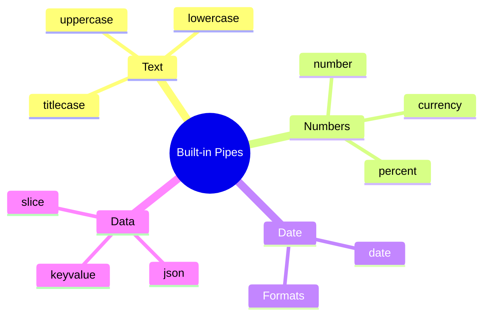

# 🔧 Use Case 1: Built-in Pipes

> **💡 Lightbulb Moment**: Pipes transform data in templates without modifying the original value - like filters for display!

---

## 1. 🔍 What are Pipes?

Pipes transform values for display in templates.

```html
{{ birthday | date:'fullDate' }}
{{ price | currency:'USD' }}
{{ name | uppercase }}
```


---

## 2. 🚀 Common Built-in Pipes

| Pipe | Example | Output |
|------|---------|--------|
| `date` | `{{ date \| date:'short' }}` | 12/11/24, 3:30 PM |
| `currency` | `{{ 99.99 \| currency }}` | $99.99 |
| `number` | `{{ 3.14159 \| number:'1.2-2' }}` | 3.14 |
| `percent` | `{{ 0.75 \| percent }}` | 75% |
| `uppercase` | `{{ 'hello' \| uppercase }}` | HELLO |
| `lowercase` | `{{ 'HELLO' \| lowercase }}` | hello |
| `titlecase` | `{{ 'hello world' \| titlecase }}` | Hello World |
| `json` | `{{ obj \| json }}` | JSON string |
| `slice` | `{{ [1,2,3,4] \| slice:1:3 }}` | [2,3] |

---

### 📦 Data Flow Summary (Visual Box Diagram)

```
┌─────────────────────────────────────────────────────────────┐
│  PIPE: TRANSFORM FOR DISPLAY                                │
│                                                             │
│   ORIGINAL DATA (unchanged):                                │
│   ┌───────────────────────────────────────────────────────┐ │
│   │ birthday = 1734567890000;                             │ │
│   │ price = 1234.567;                                     │ │
│   │ name = "john doe";                                    │ │
│   │                                                       │ │
│   │ (Raw values stay raw!)                                │ │
│   └───────────────────────────────────────────────────────┘ │
│                        │                                    │
│                        │ Pipe transforms FOR DISPLAY only   │
│                        ▼                                    │
│   TEMPLATE DISPLAY:                                         │
│   ┌───────────────────────────────────────────────────────┐ │
│   │ {{ birthday | date:'fullDate' }}                      │ │
│   │     → "December 18, 2024"                             │ │
│   │                                                       │ │
│   │ {{ price | currency:'USD' }}                          │ │
│   │     → "$1,234.57"                                     │ │
│   │                                                       │ │
│   │ {{ name | titlecase }}                                │ │
│   │     → "John Doe"                                      │ │
│   └───────────────────────────────────────────────────────┘ │
│                                                             │
│   CHAINING: {{ price | currency:'USD' | slice:0:5 }}        │
│                │           │                                │
│                ▼           ▼                                │
│           "$1,234.57" → "$1,23"                             │
└─────────────────────────────────────────────────────────────┘
```

> **Key Takeaway**: Pipes transform data for DISPLAY only. Original data is unchanged. Chain pipes for multiple transformations!

---

## 3. ❓ Interview Questions

### Basic Questions

#### Q1: What is a pipe in Angular?
**Answer:** A pipe is a class with `@Pipe()` decorator that implements `PipeTransform` interface. It transforms input values to output values for display.

#### Q2: Do pipes modify the original value?
**Answer:** No! Pipes are pure transformations. The original value is unchanged.

#### Q3: What's the difference between pipes and methods?
**Answer:**
| Pipe | Method |
|------|--------|
| Memoized (pure) | Runs every CD cycle |
| Declarative | Imperative |
| Reusable | Component-specific |

---

### Scenario-Based Questions

#### Scenario: Date Formatting
**Question:** Display date as "December 11, 2024 at 3:30 PM"

**Answer:**
```html
{{ date | date:'MMMM d, yyyy \'at\' h:mm a' }}
```

#### Scenario: Currency Formatting
**Question:** Display price in Euros with 2 decimals.

**Answer:**
```html
{{ price | currency:'EUR':'symbol':'1.2-2' }}
<!-- €99.99 -->
```

---

## 📸 Instagram Filter Analogy (Easy to Remember!)

Think of Pipes like **Instagram filters**:

| Concept | Filter Analogy | Memory Trick |
|---------|---------------|--------------| 
| **Pipe** | 📸 **Instagram filter**: Changes how photo LOOKS, not the original | **"Display transformation"** |
| **Original value** | 🖼️ **Raw photo**: The actual image file stays unchanged | **"Data preserved"** |
| **Transformed value** | ✨ **Filtered view**: What users SEE after filter applied | **"Pretty display"** |
| **Chaining pipes** | 📸📸 **Multiple filters**: Vintage → Brightness → Contrast | **"Stack effects"** |
| **Pure pipe** | 💨 **Cached filter**: "Already processed this photo!" | **"Smart cache"** |

### 📖 Story to Remember:

> 📸 **The Instagram Photographer**
>
> You're editing photos (data) for display:
>
> **Without Pipes (ugly raw data):**
> ```html
> {{ 1734567890000 }}           <!-- Ugly timestamp: 1734567890000 -->
> {{ 'john doe' }}              <!-- Ugly case: john doe -->
> {{ 1234.5 }}                  <!-- Ugly price: 1234.5 -->
> ```
>
> **With Pipes (beautiful display):**
> ```html
> {{ 1734567890000 | date:'fullDate' }}    <!-- Dec 18, 2024 -->
> {{ 'john doe' | titlecase }}              <!-- John Doe -->
> {{ 1234.5 | currency }}                   <!-- $1,234.50 -->
> ```
>
> **Original data UNCHANGED. Just displayed prettier!**

### 🎯 Quick Reference:
```
📸 Pipe          = Instagram filter (transform for display)
🖼️ Original      = Raw data (unchanged)
✨ Displayed     = Filtered result (what users see)
📸📸 Chaining    = Multiple filters (value | pipe1 | pipe2)
```

---

## 🧠 Mind Map



---

## 🎯 What Problem Does This Solve?

### The Problem: Formatting Logic Scattered in Templates/Components

**Without Pipes (BAD):**
```typescript
@Component({...})
export class OrderComponent {
    order = {
        date: 1734567890000,
        total: 1234.567,
        customer: 'john doe'
    };
    
    // ❌ Formatting methods in component
    formatDate(timestamp: number): string {
        const date = new Date(timestamp);
        return date.toLocaleDateString('en-US', { ... });
    }
    
    formatCurrency(value: number): string {
        return new Intl.NumberFormat('en-US', { style: 'currency' }).format(value);
    }
    
    formatName(name: string): string {
        return name.split(' ').map(w => w[0].toUpperCase() + w.slice(1)).join(' ');
    }
}
// Template
{{ formatDate(order.date) }}
{{ formatCurrency(order.total) }}
{{ formatName(order.customer) }}
```

**Problems:**
1. **Code duplication**: Same formatting in multiple components
2. **Performance**: Methods run on every change detection
3. **Testability**: Formatting logic tied to component
4. **Readability**: Template cluttered with function calls

### How Pipes Solve This

**With Pipes (GOOD):**
```html
<!-- Clean, declarative, performant! -->
{{ order.date | date:'fullDate' }}
{{ order.total | currency:'USD' }}
{{ order.customer | titlecase }}
```

| Problem | Pipe Solution |
|---------|--------------|
| Code duplication | **Reusable**: One pipe, use everywhere |
| Performance | **Memoized**: Pure pipes cache results |
| Testability | **Isolated**: Test pipe separately |
| Readability | **Declarative**: Clear intent in template |

---

## 📚 Key Concepts Explained

### 1. Pipe Syntax

```html
{{ value | pipeName }}
{{ value | pipeName:arg1 }}
{{ value | pipeName:arg1:arg2 }}

<!-- Examples -->
{{ amount | currency:'EUR' }}
{{ birthday | date:'short' }}
{{ rating | number:'1.0-2' }}
```

---

### 2. Date Pipe Formats

| Format | Example Output |
|--------|----------------|
| `'short'` | 12/11/24, 3:30 PM |
| `'medium'` | Dec 11, 2024, 3:30:00 PM |
| `'long'` | December 11, 2024 at 3:30:00 PM |
| `'fullDate'` | Wednesday, December 11, 2024 |
| Custom: `'yyyy-MM-dd'` | 2024-12-11 |
| Custom: `'HH:mm:ss'` | 15:30:00 |

---

### 3. Number Pipe Format

```
{{ value | number:'minInt.minFrac-maxFrac' }}

Examples:
{{ 3.14159 | number:'1.2-2' }}    → 3.14
{{ 1234.5 | number:'4.3-3' }}    → 1234.500
{{ 9 | number:'2.0-0' }}          → 09
```

---

### 4. Currency Pipe Options

```html
{{ value | currency:currencyCode:display:digitsInfo }}

<!-- Examples -->
{{ 99.99 | currency }}              → $99.99 (default USD)
{{ 99.99 | currency:'EUR' }}        → €99.99
{{ 99.99 | currency:'GBP':'code' }} → GBP99.99
{{ 99 | currency:'USD':'symbol':'1.2-2' }} → $99.00
```

---

## 🌍 Real-World Use Cases

### 1. E-Commerce Product Display
```html
<div class="product">
    <h3>{{ product.name | titlecase }}</h3>
    <p class="price">{{ product.price | currency:'USD' }}</p>
    <p class="discount">{{ product.discount | percent }}</p>
</div>
```

### 2. Transaction History
```html
<tr *ngFor="let tx of transactions">
    <td>{{ tx.date | date:'medium' }}</td>
    <td>{{ tx.amount | currency:'USD':'symbol':'1.2-2' }}</td>
    <td>{{ tx.status | uppercase }}</td>
</tr>
```

### 3. User Profile Display
```html
<div class="user">
    <h2>{{ user.name | titlecase }}</h2>
    <p>Joined: {{ user.createdAt | date:'longDate' }}</p>
    <p>{{ user.bio | slice:0:100 }}...</p>
</div>
```

### 4. Dashboard Statistics
```html
<div class="stats">
    <div>{{ stats.conversionRate | percent:'1.1-1' }}</div>
    <div>{{ stats.revenue | currency:'USD':'symbol':'1.0-0' }}</div>
    <div>{{ stats.count | number:'1.0-0' }}</div>
</div>
```

### 5. Debugging JSON Data
```html
<pre>{{ complexObject | json }}</pre>
```

---

## ❓ Complete Interview Questions (25+)

### Basic Conceptual Questions

**Q4: What is a pipe in Angular?**
> A: A class decorated with `@Pipe()` that transforms input values to output values for template rendering.

**Q5: What interface do pipes implement?**
> A: `PipeTransform` with a `transform()` method.

**Q6: Do pipes modify the original value?**
> A: No! Pipes are pure transformations. Original data is unchanged.

**Q7: What's the syntax for using a pipe?**
> A: `{{ value | pipeName }}` or `{{ value | pipeName:arg1:arg2 }}`

**Q8: Can you use pipes in component logic?**
> A: Yes! Inject the pipe and call transform():
> ```typescript
> private datePipe = inject(DatePipe);
> formatted = this.datePipe.transform(this.date, 'short');
> ```

---

### Built-in Pipe Questions

**Q9: How do you format a date as "Dec 11, 2024"?**
> A: `{{ date | date:'mediumDate' }}` or `{{ date | date:'MMM d, yyyy' }}`

**Q10: How do you display currency in Euros?**
> A: `{{ price | currency:'EUR' }}`

**Q11: How do you limit decimal places?**
> A: `{{ value | number:'1.0-2' }}` (min 0, max 2 decimals)

**Q12: What does the `keyvalue` pipe do?**
> A: Transforms an object into an array of key-value pairs for iteration.

---

### Performance Questions

**Q13: Why are pipes more performant than methods?**
> A: Pure pipes are memoized. They only re-execute when inputs change, not on every change detection.

**Q14: What's the difference between pure and impure pipes?**
> A:
> - Pure (default): Only runs when input reference changes
> - Impure: Runs on every change detection cycle

**Q15: When would you use an impure pipe?**
> A: When the pipe needs to re-evaluate even if the input reference hasn't changed (e.g., filtering an array).

---

### Chaining Questions

**Q16: Can you chain multiple pipes?**
> A: Yes! `{{ value | pipe1 | pipe2 | pipe3 }}`

**Q17: What's the execution order in chaining?**
> A: Left to right. Output of pipe1 becomes input of pipe2.

**Q18: Chain pipes to truncate and uppercase.**
> A: `{{ text | slice:0:20 | uppercase }}`

---

### Scenario Questions

**Q19: Display phone number as (XXX) XXX-XXXX.**
> A: Create a custom pipe or use slice:
> ```html
> ({{ phone | slice:0:3 }}) {{ phone | slice:3:6 }}-{{ phone | slice:6:10 }}
> ```

**Q20: Format file size (1024 → "1 KB").**
> A: Create a custom pipe. Built-in pipes don't handle file sizes.

**Q21: Display time ago (2 hours ago).**
> A: Create a custom pipe or use a library. Built-in date pipe doesn't support relative time.

**Q22: Highlight search terms in text.**
> A: Create a custom impure pipe that wraps matches with `<mark>` tags.

---

### Advanced Questions

**Q23: How do you register a pipe for standalone components?**
> A: Import in the component's imports array:
> ```typescript
> @Component({
>     imports: [DatePipe, CurrencyPipe]
> })
> ```

**Q24: Can pipes be used with async data?**
> A: Yes! Use with async pipe:
> ```html
> {{ (user$ | async)?.name | titlecase }}
> ```

**Q25: How do you handle null values in pipes?**
> A: Pipes typically return null for null input. Use nullish coalescing:
> ```html
> {{ (date | date:'short') ?? 'Not available' }}
> ```

**Q26: Can you localize pipes?**
> A: Yes! Pipes use the app's locale:
> ```typescript
> providers: [{ provide: LOCALE_ID, useValue: 'fr-FR' }]
> ```

**Q27: What's the benefit of pipes over Intl formatters?**
> A: Pipes are Angular-integrated, memoized by default, and work seamlessly in templates.

