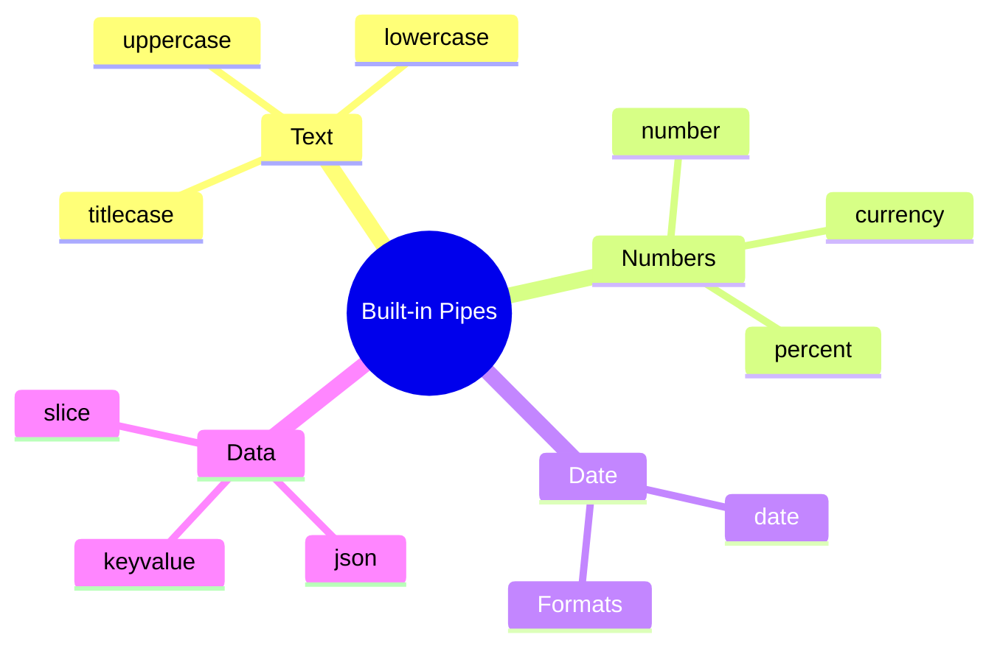

# 🔧 Use Case 1: Built-in Pipes

> **💡 Lightbulb Moment**: Pipes transform data in templates without modifying the original value - like filters for display!

---

## 1. 🔍 What are Pipes?

Pipes transform values for display in templates.

```html
{{ birthday | date:'fullDate' }}
{{ price | currency:'USD' }}
{{ name | uppercase }}
```

---

## 2. 🚀 Common Built-in Pipes

| Pipe | Example | Output |
|------|---------|--------|
| `date` | `{{ date \| date:'short' }}` | 12/11/24, 3:30 PM |
| `currency` | `{{ 99.99 \| currency }}` | $99.99 |
| `number` | `{{ 3.14159 \| number:'1.2-2' }}` | 3.14 |
| `percent` | `{{ 0.75 \| percent }}` | 75% |
| `uppercase` | `{{ 'hello' \| uppercase }}` | HELLO |
| `lowercase` | `{{ 'HELLO' \| lowercase }}` | hello |
| `titlecase` | `{{ 'hello world' \| titlecase }}` | Hello World |
| `json` | `{{ obj \| json }}` | JSON string |
| `slice` | `{{ [1,2,3,4] \| slice:1:3 }}` | [2,3] |

---

### 📦 Data Flow Summary (Visual Box Diagram)

```
┌─────────────────────────────────────────────────────────────┐
│  PIPE: TRANSFORM FOR DISPLAY                                │
│                                                             │
│   ORIGINAL DATA (unchanged):                                │
│   ┌───────────────────────────────────────────────────────┐ │
│   │ birthday = 1734567890000;                             │ │
│   │ price = 1234.567;                                     │ │
│   │ name = "john doe";                                    │ │
│   │                                                       │ │
│   │ (Raw values stay raw!)                                │ │
│   └───────────────────────────────────────────────────────┘ │
│                        │                                    │
│                        │ Pipe transforms FOR DISPLAY only   │
│                        ▼                                    │
│   TEMPLATE DISPLAY:                                         │
│   ┌───────────────────────────────────────────────────────┐ │
│   │ {{ birthday | date:'fullDate' }}                      │ │
│   │     → "December 18, 2024"                             │ │
│   │                                                       │ │
│   │ {{ price | currency:'USD' }}                          │ │
│   │     → "$1,234.57"                                     │ │
│   │                                                       │ │
│   │ {{ name | titlecase }}                                │ │
│   │     → "John Doe"                                      │ │
│   └───────────────────────────────────────────────────────┘ │
│                                                             │
│   CHAINING: {{ price | currency:'USD' | slice:0:5 }}        │
│                │           │                                │
│                ▼           ▼                                │
│           "$1,234.57" → "$1,23"                             │
└─────────────────────────────────────────────────────────────┘
```

> **Key Takeaway**: Pipes transform data for DISPLAY only. Original data is unchanged. Chain pipes for multiple transformations!

---

## 3. ❓ Interview Questions

### Basic Questions

#### Q1: What is a pipe in Angular?
**Answer:** A pipe is a class with `@Pipe()` decorator that implements `PipeTransform` interface. It transforms input values to output values for display.

#### Q2: Do pipes modify the original value?
**Answer:** No! Pipes are pure transformations. The original value is unchanged.

#### Q3: What's the difference between pipes and methods?
**Answer:**
| Pipe | Method |
|------|--------|
| Memoized (pure) | Runs every CD cycle |
| Declarative | Imperative |
| Reusable | Component-specific |

---

### Scenario-Based Questions

#### Scenario: Date Formatting
**Question:** Display date as "December 11, 2024 at 3:30 PM"

**Answer:**
```html
{{ date | date:'MMMM d, yyyy \'at\' h:mm a' }}
```

#### Scenario: Currency Formatting
**Question:** Display price in Euros with 2 decimals.

**Answer:**
```html
{{ price | currency:'EUR':'symbol':'1.2-2' }}
<!-- €99.99 -->
```

---

## 📸 Instagram Filter Analogy (Easy to Remember!)

Think of Pipes like **Instagram filters**:

| Concept | Filter Analogy | Memory Trick |
|---------|---------------|--------------| 
| **Pipe** | 📸 **Instagram filter**: Changes how photo LOOKS, not the original | **"Display transformation"** |
| **Original value** | 🖼️ **Raw photo**: The actual image file stays unchanged | **"Data preserved"** |
| **Transformed value** | ✨ **Filtered view**: What users SEE after filter applied | **"Pretty display"** |
| **Chaining pipes** | 📸📸 **Multiple filters**: Vintage → Brightness → Contrast | **"Stack effects"** |
| **Pure pipe** | 💨 **Cached filter**: "Already processed this photo!" | **"Smart cache"** |

### 📖 Story to Remember:

> 📸 **The Instagram Photographer**
>
> You're editing photos (data) for display:
>
> **Without Pipes (ugly raw data):**
> ```html
> {{ 1734567890000 }}           <!-- Ugly timestamp: 1734567890000 -->
> {{ 'john doe' }}              <!-- Ugly case: john doe -->
> {{ 1234.5 }}                  <!-- Ugly price: 1234.5 -->
> ```
>
> **With Pipes (beautiful display):**
> ```html
> {{ 1734567890000 | date:'fullDate' }}    <!-- Dec 18, 2024 -->
> {{ 'john doe' | titlecase }}              <!-- John Doe -->
> {{ 1234.5 | currency }}                   <!-- $1,234.50 -->
> ```
>
> **Original data UNCHANGED. Just displayed prettier!**

### 🎯 Quick Reference:
```
📸 Pipe          = Instagram filter (transform for display)
🖼️ Original      = Raw data (unchanged)
✨ Displayed     = Filtered result (what users see)
📸📸 Chaining    = Multiple filters (value | pipe1 | pipe2)
```

---

## 🧠 Mind Map


