# ✨ Use Case 2: Custom Pipe

> **Goal**: Learn to extend Angular's capabilities by creating your own reusable transformation logic using the `PipeTransform` interface.

---

## 1. 🔍 How It Works (The Concept)

### The Mechanism
Sometimes built-in pipes aren't enough. You might need to:
*   Truncate text ("Read more...")
*   Convert temperature (C to F)
*   Filter a customized list

A custom pipe is a TypeScript class decorated with `@Pipe` that implements a specific method: `transform()`. Angular calls this method whenever it encounters your pipe in the HTML.

### 🔭 Data Flow Diagram

```mermaid
flowchart LR
    Input["📝 Input
    'Super Long Text...'"]
    
    Pipe{{"Custom Logic
    (transform function)"}}
    
    Arg["⚙️ Argument
    limit: 10"]
    
    Output["✨ Output
    'Super Long...'"]
    
    Input --> Pipe
    Arg --> Pipe
    Pipe --> Output
    
    style Input fill:#e3f2fd,stroke:#1565c0
    style Pipe fill:#f3e5f5,stroke:#7b1fa2,shape:hexagon
    style Arg fill:#fff9c4,stroke:#fbc02d
    style Output fill:#e8f5e9,stroke:#2e7d32
```



---

## 2. 🚀 Step-by-Step Implementation Guide

### Step 1: Create the Pipe Class
This class contains the logic.

```typescript
// truncate.pipe.ts
import { Pipe, PipeTransform } from '@angular/core';

@Pipe({
  name: 'truncate', // 🛡️ CRITICAL: This is the name used in HTML (e.g., | truncate)
  standalone: true
})
export class TruncatePipe implements PipeTransform {
  
  // 🛡️ CRITICAL: Every pipe MUST implement this method
  transform(value: string, limit: number = 20): string {
    if (!value) return '';
    
    // Logic: If plain text is longer than limit, cut it and add "..."
    if (value.length > limit) {
      return value.substring(0, limit) + '...';
    }
    
    return value;
  }
}
```

### Step 2: Register in Component
Import the pipe into your component so appropriate templates can use it.

```typescript
// custom-pipe.component.ts
import { Component } from '@angular/core';
import { TruncatePipe } from './truncate.pipe'; // Import it

@Component({
  selector: 'app-custom-pipe',
  standalone: true,
  imports: [TruncatePipe], // 🛡️ CRITICAL: Add to imports array
  template: `
    <!-- Usage in HTML -->
    <p>{{ 'This is a very long sentence' | truncate:10 }}</p>
  `
})
export class CustomPipeComponent {}
```

---

## 3. 🐛 Common Pitfalls & Debugging

### ❌ Pitfall 1: Incorrect Pipe Name
**Error:** `The pipe 'shorten' could not be found.`

**Bad Code:**
```typescript
@Pipe({ name: 'truncate' }) ...
// HTML: {{ val | shorten }} ❌ Name mismatch
```

**Fix:** The `@Pipe({ name: '...' })` property MUST match exactly what you use in the HTML `| ...`.

### ❌ Pitfall 2: Logic Errors / Crashes
**Bad Code:**
```typescript
transform(value: any) {
  return value.substring(0, 5); // ❌ Crashes if value is null or undefined!
}
```

**Fix:** Always guard your inputs.
```typescript
transform(value: any) {
  if (!value) return null; // ✅ Safe guard
  return value.substring(0, 5);
}
```

---

## 4. ⚡ Performance & Architecture

### Performance
*   **Default Pure**: By default, custom pipes are **Pure**. This means they execute extremely fast because they only run when the input *reference* changes (string, number, boolean). They do *not* run on every mouse move or timer tick.
*   **Reuse**: Instead of writing a helper function `truncate()` in 20 different components, you write the pipe **once** and use it everywhere.

### Architecture
*   **Shared Module**: In large apps, custom pipes are often put in a `SharedModule` or a `@libs/ui` package so the entire company can use `| companyDate` or `| secureMask`.

---

## 5. 🌍 Real World Use Cases

1.  **File Size Converter**: Input `1048576` (bytes) -> Output `1 MB`.
2.  **Time Ago**: Input `2023-12-01` -> Output `3 days ago` (like Facebook/Twitter).
3.  **Credit Card Mask**: Input `1234567812345678` -> Output `**** **** **** 5678`.

---

## 6. 📝 The Analogy: "The Universal Adaptor" 🔌

Imagine creating a **Custom Pipe** is like building a **Universal Travel Adaptor**.

*   Your "device" (Data) has a specific plug shape (Raw format).
*   The "wall socket" (User View) expects a different shape.
*   You build a small adaptor (Pipe) once.
*   Now, wherever you go (any Component), you just snap on the adaptor (apply the Pipe), and it fits perfectly.

---

## 7. ❓ Interview & Concept Questions

1.  **Q: Which interface must a custom pipe implement?**
    *   **A:** `PipeTransform`.

2.  **Q: What is the method signature of `transform`?**
    *   **A:** `transform(value: type, ...args: type[]): returnType`.

3.  **Q: Can a custom pipe accept multiple arguments?**
    *   **A:** Yes. `transform(value, arg1, arg2)`. Usage: `{{ val | pipe:arg1:arg2 }}`.

4.  **Q: How do you make a pipe available to all components in an application?**
    *   **A:** Declare it in a shared `NgModule` and export it, or (in modern Angular) make it `standalone: true` and import it wherever needed (or in a shared array).

---

## 🧠 Mind Map


