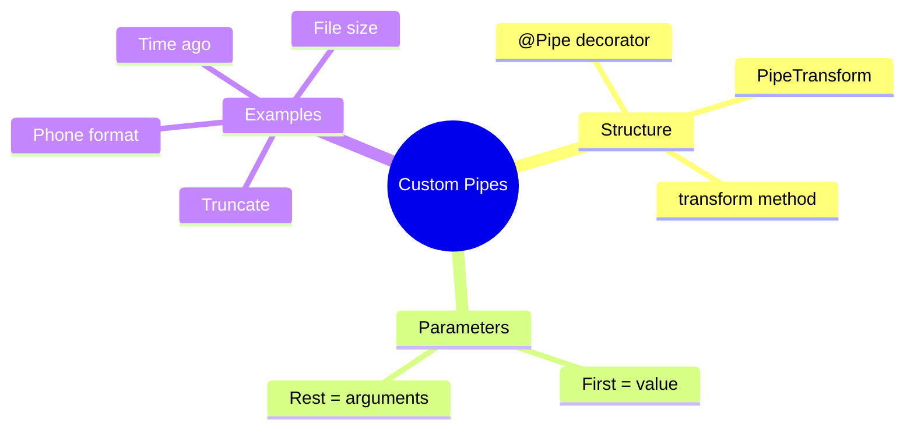

# 🔨 Use Case 2: Custom Pipes

> **💡 Lightbulb Moment**: Create custom pipes for domain-specific transformations that you'll reuse across your app!

---

## 1. 🔍 Creating a Custom Pipe

```typescript
import { Pipe, PipeTransform } from '@angular/core';

@Pipe({
    name: 'truncate',
    standalone: true
})
export class TruncatePipe implements PipeTransform {
    transform(value: string, limit: number = 50, trail: string = '...'): string {
        if (!value) return '';
        if (value.length <= limit) return value;
        return value.substring(0, limit) + trail;
    }
}
```

Usage:
```html
{{ longText | truncate:100:'...' }}
```

---

## 2. 🚀 Examples

### Phone Number Formatter
```typescript
@Pipe({ name: 'phone', standalone: true })
export class PhonePipe implements PipeTransform {
    transform(value: string): string {
        if (!value) return '';
        const cleaned = value.replace(/\D/g, '');
        return `(${cleaned.slice(0,3)}) ${cleaned.slice(3,6)}-${cleaned.slice(6,10)}`;
    }
}
// 5551234567 → (555) 123-4567
```

### Relative Time
```typescript
@Pipe({ name: 'timeAgo', standalone: true })
export class TimeAgoPipe implements PipeTransform {
    transform(value: Date): string {
        const seconds = Math.floor((Date.now() - value.getTime()) / 1000);
        if (seconds < 60) return 'just now';
        if (seconds < 3600) return `${Math.floor(seconds/60)} minutes ago`;
        if (seconds < 86400) return `${Math.floor(seconds/3600)} hours ago`;
        return `${Math.floor(seconds/86400)} days ago`;
    }
}
```

---

## 3. ❓ Interview Questions

### Basic Questions

#### Q1: What interface must custom pipes implement?
**Answer:** `PipeTransform` with the `transform()` method.

#### Q2: How do you make a pipe standalone?
**Answer:** Add `standalone: true` to the @Pipe() decorator (Angular 14+).

---

### Scenario-Based Questions

#### Scenario: File Size Formatter
**Question:** Create a pipe that formats bytes as KB/MB/GB.

**Answer:**
```typescript
@Pipe({ name: 'fileSize', standalone: true })
export class FileSizePipe implements PipeTransform {
    transform(bytes: number, decimals = 2): string {
        if (!bytes) return '0 Bytes';
        const k = 1024;
        const sizes = ['Bytes', 'KB', 'MB', 'GB'];
        const i = Math.floor(Math.log(bytes) / Math.log(k));
        return parseFloat((bytes / Math.pow(k, i)).toFixed(decimals)) + ' ' + sizes[i];
    }
}
// 1536 → 1.5 KB
```

---

## 🧠 Mind Map


