# 🔨 Use Case 2: Custom Pipes

> **💡 Lightbulb Moment**: Create custom pipes for domain-specific transformations that you'll reuse across your app!

---

## 1. 🔍 Creating a Custom Pipe

```typescript
import { Pipe, PipeTransform } from '@angular/core';

@Pipe({
    name: 'truncate',
    standalone: true
})
export class TruncatePipe implements PipeTransform {
    transform(value: string, limit: number = 50, trail: string = '...'): string {
        if (!value) return '';
        if (value.length <= limit) return value;
        return value.substring(0, limit) + trail;
    }
}
```

Usage:
```html
{{ longText | truncate:100:'...' }}
```

---

## 2. 🚀 Examples

### Phone Number Formatter
```typescript
@Pipe({ name: 'phone', standalone: true })
export class PhonePipe implements PipeTransform {
    transform(value: string): string {
        if (!value) return '';
        const cleaned = value.replace(/\D/g, '');
        return `(${cleaned.slice(0,3)}) ${cleaned.slice(3,6)}-${cleaned.slice(6,10)}`;
    }
}
// 5551234567 → (555) 123-4567
```

### Relative Time
```typescript
@Pipe({ name: 'timeAgo', standalone: true })
export class TimeAgoPipe implements PipeTransform {
    transform(value: Date): string {
        const seconds = Math.floor((Date.now() - value.getTime()) / 1000);
        if (seconds < 60) return 'just now';
        if (seconds < 3600) return `${Math.floor(seconds/60)} minutes ago`;
        if (seconds < 86400) return `${Math.floor(seconds/3600)} hours ago`;
        return `${Math.floor(seconds/86400)} days ago`;
    }
}
```

---

### 📦 Data Flow Summary (Visual Box Diagram)

```
┌─────────────────────────────────────────────────────────────┐
│  CUSTOM PIPE: YOUR TRANSFORMATION RECIPE                    │
│                                                             │
│   PIPE STRUCTURE:                                           │
│   ┌───────────────────────────────────────────────────────┐ │
│   │ @Pipe({ name: 'truncate', standalone: true })         │ │
│   │ export class TruncatePipe implements PipeTransform {  │ │
│   │                                                       │ │
│   │   transform(value: string, limit = 50, trail = '...')│ │
│   │             ↑             ↑              ↑           │ │
│   │           INPUT         ARG1            ARG2          │ │
│   │                                                       │ │
│   │     return value.slice(0, limit) + trail;             │ │
│   │   }                                                   │ │
│   │ }                                                     │ │
│   └───────────────────────────────────────────────────────┘ │
│                                                             │
│   USAGE IN TEMPLATE:                                        │
│   ┌───────────────────────────────────────────────────────┐ │
│   │ {{ description | truncate:100:'...' }}                │ │
│   │                   │      │     │                      │ │
│   │                   │      │     └─ trail = '...'       │ │
│   │                   │      └─ limit = 100               │ │
│   │                   └─ pipe name                        │ │
│   │                                                       │ │
│   │ INPUT:  "This is a very long description..."          │ │
│   │ OUTPUT: "This is a very long..."                      │ │
│   └───────────────────────────────────────────────────────┘ │
└─────────────────────────────────────────────────────────────┘
```

> **Key Takeaway**: Custom pipes = reusable transformations. First param is always the value, rest are arguments!

---

## 3. ❓ Interview Questions

### Basic Questions

#### Q1: What interface must custom pipes implement?
**Answer:** `PipeTransform` with the `transform()` method.

#### Q2: How do you make a pipe standalone?
**Answer:** Add `standalone: true` to the @Pipe() decorator (Angular 14+).

---

### Scenario-Based Questions

#### Scenario: File Size Formatter
**Question:** Create a pipe that formats bytes as KB/MB/GB.

**Answer:**
```typescript
@Pipe({ name: 'fileSize', standalone: true })
export class FileSizePipe implements PipeTransform {
    transform(bytes: number, decimals = 2): string {
        if (!bytes) return '0 Bytes';
        const k = 1024;
        const sizes = ['Bytes', 'KB', 'MB', 'GB'];
        const i = Math.floor(Math.log(bytes) / Math.log(k));
        return parseFloat((bytes / Math.pow(k, i)).toFixed(decimals)) + ' ' + sizes[i];
    }
}
// 1536 → 1.5 KB
```

---

## 🍳 Recipe Analogy (Easy to Remember!)

Think of custom pipes like **secret family recipes**:

| Concept | Recipe Analogy | Memory Trick |
|---------|---------------|--------------| 
| **Custom Pipe** | 🍳 **Secret recipe**: Your special way to transform ingredients | **"Your custom formula"** |
| **transform()** | 👨‍🍳 **Cooking process**: Takes raw ingredients, returns cooked dish | **"The magic"** |
| **Input value** | 🥔 **Raw ingredient**: "Raw potatoes" | **"What goes in"** |
| **Output** | 🍟 **Finished dish**: "French fries" | **"What comes out"** |
| **Arguments** | 🧂 **Seasonings**: "How salty? How crispy?" | **"Customization"** |

### 📖 Story to Remember:

> 🍳 **The Family Recipe Book**
>
> You're creating custom recipes (pipes) for your restaurant (app):
>
> **Creating a Recipe (Custom Pipe):**
> ```typescript
> @Pipe({ name: 'truncate' })
> export class TruncatePipe implements PipeTransform {
>   // The recipe/cooking process
>   transform(text: string, limit = 50, trail = '...') {
>     // Raw ingredient (text) → Process → Finished dish
>     return text.length > limit ? text.slice(0, limit) + trail : text;
>   }
> }
> ```
>
> **Using the Recipe:**
> ```html
> {{ longDescription | truncate:100:'...' }}
> <!-- Raw: "This is a very long description that goes on and on..."
>      Cooked: "This is a very long description that goes on..."  -->
> ```
>
> **One recipe (pipe), many dishes (usages)!**

### 🎯 Quick Reference:
```
🍳 Custom Pipe     = Family recipe (your formula)
👨‍🍳 transform()    = Cooking process (the logic)
🥔 Input value     = Raw ingredient
🍟 Output          = Finished dish
🧂 Arguments       = Seasonings/customization
```

---

## 🧠 Mind Map


---

## 3. 🌟 Real-World Example: Smart Data Table (Filter + Sort + Format)

This example combines **three patterns** into one view:
1.  **Filtering**: Searching by text.
2.  **Sorting**: Ordering by price.
3.  **Formatting**: Converting status IDs to badges.

### 📦 The Transformation Flow

This image illustrates how the **Original Data** travels through **3 Pipes** to become the **Final View**.

```mermaid
graph LR
    subgraph Data Source
        Raw[Reference: Raw Data Array]
        style Raw fill:#f9f,stroke:#333,stroke-width:2px
    end

    subgraph Pipe Transformation Chain
        step1("<b>Search Pipe</b><br/><code>items.filter(i => i.name.includes(term))</code>")
        step2("<b>Sort Pipe</b><br/><code>[...items].sort((a,b) => a.price - b.price)</code>")
        step3("<b>Status Pipe</b><br/><code>{'instock':'✅', 'low':'⚠️'}[val]</code>")
        
        Raw -->|"Array"| step1
        step1 -->|"Filter: 'phone'"| step2
        step2 -->|"Sort: Price ASC"| step3
        step3 -->|"Format: 1 → 'Active'"| View
    end

    subgraph Template View
        View["<b>Final Display</b><br/><code>products | search:term | sort:'price' | status</code>"]
        style View fill:#bbf,stroke:#333,stroke-width:2px
    end

    style step1 fill:#dcfce7,stroke:#333
    style step2 fill:#dcfce7,stroke:#333
    style step3 fill:#dcfce7,stroke:#333
```



### 💻 The Code Implementation

Here is the complete code to achieve the flow above.

#### 1. The Template (HTML)
Notice the **pipe chaining** syntax (`|`). The order matters!

```html
<!-- usage-example.component.html -->

<div class="controls">
  <input [(ngModel)]="searchText" placeholder="Search products...">
  <button (click)="toggleSort()">Sort Price {{ isAsc ? '⬆️' : '⬇️' }}</button>
</div>

<div class="product-list">
  @for (product of products | search:searchText | sort:'price':isAsc; track product.id) {
    <div class="card">
      <h3>{{ product.name }}</h3>
      
      <!-- Usage 1: Built-in Currency Pipe -->
      <p class="price">{{ product.price | currency }}</p>
      
      <!-- Usage 2: Custom Status Formatter Pipe -->
      <span class="badge" [class]="product.status">
        {{ product.status | statusBadge }}
      </span>
    </div>
  } @empty {
    <p>No products found!</p>
  }
</div>
```

#### 2. The TypeScript (Pipes & Component)

```typescript
// custom-pipes.ts (All pipes in one file for practice)
import { Pipe, PipeTransform, Component } from '@angular/core';

// ----------------------------------------------------------------
// 1. SEARCH PIPE (Filtering)
// ----------------------------------------------------------------
@Pipe({ name: 'search', standalone: true })
export class SearchPipe implements PipeTransform {
  transform(items: any[], term: string): any[] {
    if (!items || !term) return items;
    // Simple case-insensitive search
    return items.filter(item => 
      item.name.toLowerCase().includes(term.toLowerCase())
    );
  }
}

// ----------------------------------------------------------------
// 2. SORT PIPE (Ordering)
// ----------------------------------------------------------------
@Pipe({ name: 'sort', standalone: true })
export class SortPipe implements PipeTransform {
  transform(items: any[], field: string, isAsc: boolean = true): any[] {
    if (!items) return [];
    // Create a copy to sort (don't mutate original!)
    return [...items].sort((a, b) => {
      const valA = a[field];
      const valB = b[field];
      return isAsc ? (valA - valB) : (valB - valA);
    });
  }
}

// ----------------------------------------------------------------
// 3. STATUS BADGE PIPE (Formatting)
// ----------------------------------------------------------------
@Pipe({ name: 'statusBadge', standalone: true })
export class StatusBadgePipe implements PipeTransform {
  transform(status: string): string {
    // Dictionary mapping for O(1) lookup
    const statusMap: Record<string, string> = {
      'instock': 'In Stock ✅',
      'lowstock': 'Low Stock ⚠️',
      'outofstock': 'Sold Out ❌'
    };
    return statusMap[status] || status;
  }
}

// ----------------------------------------------------------------
// COMPONENT
// ----------------------------------------------------------------
@Component({
  selector: 'app-smart-table',
  standalone: true,
  imports: [SearchPipe, SortPipe, StatusBadgePipe], // Import pipes here
  templateUrl: './usage-example.component.html'
})
export class SmartTableComponent {
  searchText = '';
  isAsc = true;
  
  products = [
    { id: 1, name: 'Laptop', price: 999, status: 'instock' },
    { id: 2, name: 'Phone', price: 599, status: 'lowstock' },
    { id: 3, name: 'Headphones', price: 199, status: 'outofstock' }
  ];

  toggleSort() {
    this.isAsc = !this.isAsc;
  }
}
```

---

## ❓ Additional Interview Questions (20+)

### Basic Questions

**Q3: What's the first parameter of transform() method?**
> A: The value to transform - what's piped in from the left side (|).

**Q4: Can pipes accept multiple arguments?**
> A: Yes - all parameters after the first are arguments: `{{ val | truncate:100:'...' }}`.

**Q5: How do you test a custom pipe?**
> A: Instantiate directly and call transform():
> ```typescript
> const pipe = new TruncatePipe();
> expect(pipe.transform('test', 5)).toBe('te...');
> ```

---

### Pure vs Impure Questions

**Q6: What's a pure pipe?**
> A: Default - only re-executes when input reference changes. More performant.

**Q7: When should you use impure pipes?**
> A: For detecting changes inside objects/arrays (set `pure: false`).

**Q8: What's the performance cost of impure pipes?**
> A: Run on every change detection cycle - can cause performance issues.

---

### Chaining Questions

**Q9: Can you chain multiple pipes?**
> A: Yes: `{{ date | date:'short' | uppercase }}`.

**Q10: What's the execution order for chained pipes?**
> A: Left to right - first pipe output becomes second pipe input.

---

### Scenario Questions

**Q11: Create a pipe that formats numbers with commas.**
> A:
> ```typescript
> @Pipe({ name: 'numberFormat' })
> export class NumberFormatPipe {
>   transform(num: number) {
>     return num.toString().replace(/\B(?=(\d{3})+(?!\d))/g, ',');
>   }
> }
> ```

**Q12: Create a pipe that highlights search terms.**
> A:
> ```typescript
> @Pipe({ name: 'highlight' })
> export class HighlightPipe {
>   transform(text: string, term: string) {
>     return text.replace(new RegExp(term, 'gi'), 
>       `<mark>$&</mark>`);
>   }
> }
> ```

**Q13: Create a safe HTML pipe.**
> A: Use DomSanitizer:
> ```typescript
> @Pipe({ name: 'safe' })
> export class SafePipe {
>   constructor(private sanitizer: DomSanitizer) {}
>   transform(html: string) {
>     return this.sanitizer.bypassSecurityTrustHtml(html);
>   }
> }
> ```

---

### Dependency Injection Questions

**Q14: Can pipes inject services?**
> A: Yes - via constructor injection:
> ```typescript
> constructor(private http: HttpClient) {}
> ```

**Q15: When should you inject services in pipes?**
> A: For async operations or accessing shared data (but prefer pure functions).

---

### Best Practice Questions

**Q16: Should pipes mutate input values?**
> A: No - always return new values. Pipes should be pure functions.

**Q17: When to use pipe vs component method?**
> A: Pipes for reusable transformations; methods for complex logic.

**Q18: How to make pipes standalone?**
> A: Add `standalone: true` to @Pipe decorator.

**Q19: Where should custom pipes be exported?**
> A: In a shared pipes module or as standalone pipes.

**Q20: How do you handle null/undefined in pipes?**
> A: Check at start of transform():
> ```typescript
> if (!value) return '';
> ```

