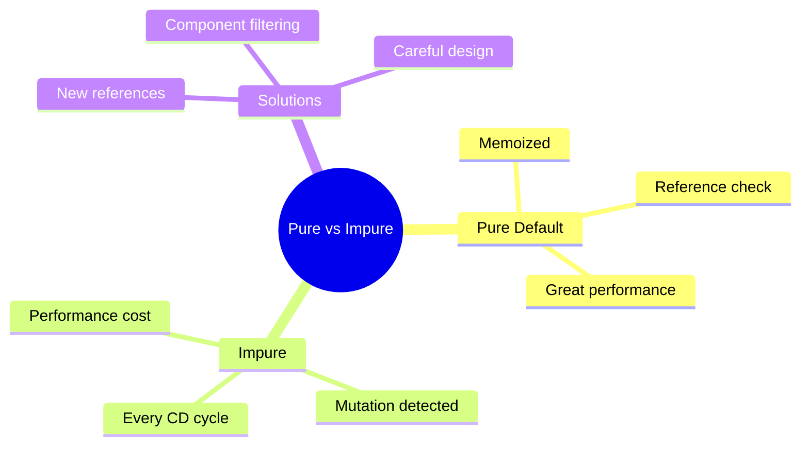

# ⚡ Use Case 3: Pure vs Impure Pipes

> **💡 Lightbulb Moment**: Pure pipes are cached and only run when inputs change. Impure pipes run on EVERY change detection - use carefully!

---

## 1. 🔍 Pure vs Impure

| Aspect | Pure (default) | Impure |
|--------|---------------|--------|
| Caching | Yes (memoized) | No |
| Runs when | Input changes | Every CD cycle |
| Performance | Great | Can be bad |
| Use case | Stateless transforms | Dynamic data |

---

## 2. 🚀 Examples

### Pure Pipe (Default)
```typescript
@Pipe({ name: 'double', standalone: true, pure: true })  // pure: true is default
export class DoublePipe implements PipeTransform {
    transform(value: number): number {
        console.log('DoublePipe called');  // Rarely logs
        return value * 2;
    }
}
```

### Impure Pipe
```typescript
@Pipe({ name: 'filter', standalone: true, pure: false })
export class FilterPipe implements PipeTransform {
    transform(items: any[], searchTerm: string): any[] {
        console.log('FilterPipe called');  // Logs FREQUENTLY
        return items.filter(item => item.name.includes(searchTerm));
    }
}
```

---

## 3. ❓ Interview Questions

### Basic Questions

#### Q1: Why doesn't my pipe update when I push to an array?
**Answer:** Pure pipes only run when the reference changes. `array.push()` doesn't change reference:
```typescript
// Won't trigger pure pipe
this.items.push(newItem);

// Will trigger pure pipe
this.items = [...this.items, newItem];
```

#### Q2: Why are impure pipes bad for performance?
**Answer:** They run on EVERY change detection cycle, potentially hundreds of times per second. Each run recalculates the entire result.

#### Q3: When to use impure pipes?
**Answer:** Rarely! Consider:
- Async pipe (built-in impure)
- Pipes that depend on external state
- When you NEED array mutation detection

---

### Scenario-Based Questions

#### Scenario: Filter Pipe Not Updating
**Question:** Filter pipe doesn't update when array changes. Why?

**Answer:**
```typescript
// Problem: Pure pipe + mutation
this.users.push(newUser);  // No update!

// Solutions:
// 1. Create new array reference
this.users = [...this.users, newUser];

// 2. Make pipe impure (not recommended)
@Pipe({ name: 'filter', pure: false })

// 3. Don't use pipe - filter in component
get filteredUsers() {
    return this.users.filter(...);
}
```

---

## 🏎️ Sports Car vs Bus Analogy (Easy to Remember!)

Think of Pure vs Impure pipes like **sports car vs city bus**:

| Type | Vehicle Analogy | Memory Trick |
|------|----------------|--------------| 
| **Pure pipe** | 🏎️ **Sports car**: Fast, efficient, goes only when needed | **"Smart & fast"** |
| **Impure pipe** | 🚌 **City bus**: Runs every minute whether needed or not | **"Always running"** |
| **Memoization** | 💾 **Memory**: Sports car remembers last trip, doesn't recalculate | **"Cached result"** |
| **Reference change** | 🔑 **New car**: Pure pipe only runs when you get a NEW car | **"New reference"** |
| **Mutation** | 🎨 **Repaint car**: Same car, new color - Pure pipe doesn't notice | **"Same reference"** |

### 📖 Story to Remember:

> 🏎️ **The City Transportation Problem**
>
> You need to get around the city (transform data):
>
> **Pure Pipe (Sports Car):**
> ```typescript
> @Pipe({ pure: true })  // Default
> 
> // 🏎️ Starts ONLY when you get a NEW car (reference change)
> items = [...items, newItem];  // New array = NEW CAR = Pipe runs
> 
> // 🎨 Repaint same car? Sports car stays parked. 
> items.push(newItem);  // Same array = Same car = Pipe DOESN'T run
> ```
>
> **Impure Pipe (City Bus):**
> ```typescript
> @Pipe({ pure: false })
> 
> // 🚌 Bus runs EVERY 10 seconds no matter what
> // Even if nobody's waiting at the stop
> // Wastes fuel! (CPU cycles)
> ```
>
> **Use sports car (pure) unless you NEED the bus schedule!**

### 🎯 Quick Reference:
```
🏎️ Pure (default)    = Sports car (efficient, runs when needed)
🚌 Impure            = City bus (runs constantly, expensive)
💾 Memoization       = Sports car remembers last trip
🔑 New reference     = Get a new car = Pipe runs
🎨 Mutation          = Repaint car = Pipe ignores
```

---

## 🧠 Mind Map


