# ⏳ Use Case 4: Async Pipe

> **Goal**: Master the most important utility pipe in Angular—handling asynchronous data (Observables/Promises) directly in the template without manual subscriptions.

---

## 1. 🔍 How It Works (The Concept)

### The Mechanism
In Angular, data often comes asynchronously (from API, Timers, or Events). Usually, you have to `.subscribe()` in the component and `.unsubscribe()` when it destroys to prevent leaks.

The **Async Pipe** (`| async`) automates this lifecycle entirely in the HTML.

### Default vs. Optimized Behavior

| Feature | Manual Subscribe (Default) | Async Pipe (Optimized) |
| :--- | :--- | :--- |
| **Boilerplate** | High: `subscribe()`, `onDestroy`, `unsubscribe` | Zero: Just `| async` |
| **Memory Leaks** | Risk: If you forget to unsubscribe | Safe: Auto-unsubscribes on destroy |
| **State Management** | You manually update a local variable | Pipe works directly with the Stream |
| **Change Detection** | You must manually trigger or use setters | Pipe triggers CD when new value arrives |

### 🔄 Subscription Flow Diagram

```mermaid
sequenceDiagram
    participant C as Component
    participant T as Template (| async)
    participant O as Observable Stream

    C->>T: Pass Observable Ref
    Note over T: Component Init
    T->>O: 🟢 Auto-Subscribe
    
    loop Data Emission
        O-->>T: 📦 Emit Value (e.g. "Data 1")
        T-->>T: Update View
    end
    
    Note over T: Component Destroy
    T->>O: 🔴 Auto-Unsubscribe
```



---

## 2. 🚀 Step-by-Step Implementation Guide

### Step 1: The Provider (Observable)
Define your data as an Observable stream. Do NOT subscribe in the TS file.

```typescript
// async-pipe.component.ts
import { Component } from '@angular/core';
import { CommonModule } from '@angular/common'; // Contains AsyncPipe
import { interval, map, Observable } from 'rxjs';

@Component({ ... })
export class AsyncPipeComponent {
  // 🛡️ CRITICAL: Naming convention uses '$' suffix for Observables
  count$: Observable<number>;

  constructor() {
    // A stream that emits 0, 1, 2... every second
    this.count$ = interval(1000).pipe(
        map(val => val * 10)
    );
  }
}
```

### Step 2: The Consumer (Template)
Use the pipe to "unwrap" the value.

```html
<!-- async-pipe.component.html -->
<div class="counter">
   <!-- The pipe subscribes, gets value, displays it -->
   <p>Current Count: {{ count$ | async }}</p> 
</div>
```

---

## 3. 🐛 Common Pitfalls & Debugging

### ❌ Pitfall 1: Double Subscription
**Bad Code:**
```html
<p>{{ profile$ | async }}</p>
<p>{{ profile$ | async }}</p> <!-- ❌ Subscribes TWICE! -->
```
**Why it fails:** Each usage of `| async` creates a *new* subscription. If your observable makes an HTTP call, you just made 2 API calls.

**✅ Fixed Code (Alias with `as`):**
```html
<div *ngIf="profile$ | async as profile">
  <!-- ✅ Subscribes ONCE, assigns result to 'profile' variable -->
  <p>{{ profile.name }}</p>
  <p>{{ profile.email }}</p>
</div>
```

### ❌ Pitfall 2: `[object Object]`
**Scenario:** Forgetting the pipe.
**Code:** `<p>{{ data$ }}</p>`
**Result:** Users see `[object Object]` because you are trying to print the Observable class itself, not the value inside it.
**Fix:** Always use `| async`.

---

## 4. ⚡ Performance & Architecture

### Performance
*   **OnPush Strategy**: The Async Pipe fits perfectly with `ChangeDetectionStrategy.OnPush`. When the observable emits, the async pipe explicitly tells Angular "Something changed, please check the view", ensuring UI updates efficiently without checking the whole app constantly.

### Architecture
*   **Reactive Programming**: It forces you to think in "Streams". Instead of "Get data -> Set variable", you define "This view **is** a representation of this stream".
*   **Safety**: It is the #1 way to prevent "Memory Leaks" caused by zombie subscriptions keeping components alive in memory.

---

## 5. 🌍 Real World Use Cases

1.  **API Requests**: Displaying user data from `http.get()`.
2.  **Real-time Feeds**: WebSockets or Chat messages arriving in a stream.
3.  **Route Parameters**: Listening to `route.params` to update ID when URL changes.

---

## 6. 📝 The Analogy: "The TV vs. The DVD" 📺

*   **Observable (The TV Signal)**: It's constantly broadcasting, but if you don't turn the TV on, you see nothing.
*   **Manual Subscribe (You holding the antenna)**: You have to stand there holding the antenna (subscribe). If you walk away (destroy component) but forget to let go (unsubscribe), you're stuck there forever.
*   **Async Pipe (The Smart TV)**: You just turn it on. It handles the signal, the picture, and the sound. When you leave the room (destroy), it turns itself off automatically.

---

## 7. ❓ Interview & Concept Questions

1.  **Q: What does the async pipe do when the component is destroyed?**
    *   **A:** It automatically unsubscribes from the Observable to prevent memory leaks.

2.  **Q: Can the async pipe handle Promises?**
    *   **A:** Yes. It waits for the promise to resolve and displays the result.

3.  **Q: How do you avoid multiple HTTP calls when using async pipe multiple times for the same data?**
    *   **A:** Use `*ngIf="stream$ | async as value"` to capture the result in a template variable, or use the `shareReplay()` operator in the TypeScript definition.

4.  **Q: Why is `async` pipe preferred over `.subscribe()`?**
    *   **A:** Cleaner code (no unsubscribe logic needed), works with OnPush change detection, and reactive paradigm.

---

## 🧠 Mind Map


