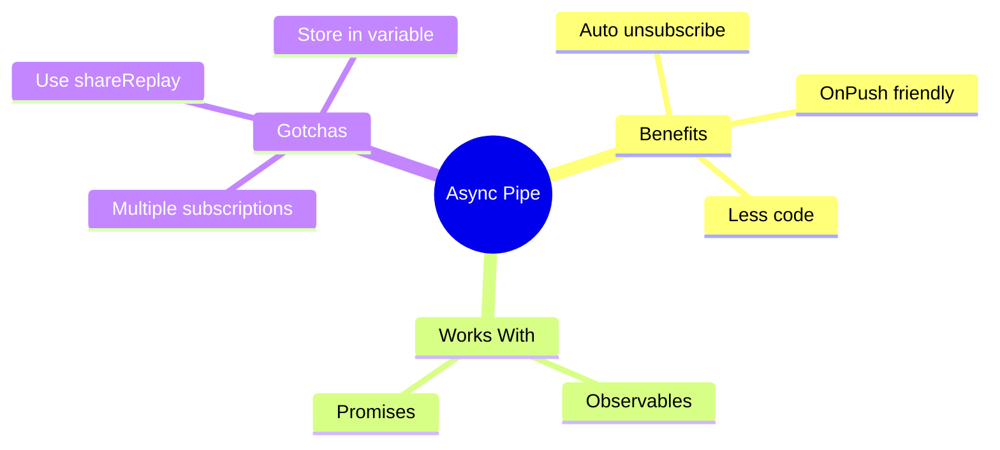

# 🔄 Use Case 4: Async Pipe

> **💡 Lightbulb Moment**: The async pipe automatically subscribes AND unsubscribes from Observables - no memory leaks!

---

## 1. 🔍 What is Async Pipe?

Subscribes to an Observable/Promise and returns the latest value.

```html
<!-- Subscribes and unsubscribes automatically! -->
<div>{{ user$ | async }}</div>

<!-- With object destructuring -->
@if (user$ | async; as user) {
    <h1>{{ user.name }}</h1>
    <p>{{ user.email }}</p>
}
```

---

## 2. 🚀 Key Benefits

### Automatic Cleanup
```typescript
// WITHOUT async pipe - manual unsubscribe needed
user: User;
subscription: Subscription;

ngOnInit() {
    this.subscription = this.userService.getUser().subscribe(u => this.user = u);
}
ngOnDestroy() {
    this.subscription.unsubscribe();  // Must remember!
}

// WITH async pipe - automatic!
user$ = this.userService.getUser();
// Template: {{ user$ | async }}
// No ngOnDestroy needed!
```

### OnPush Compatibility
```typescript
@Component({
    changeDetection: ChangeDetectionStrategy.OnPush  // Works great!
})
```

---

## 3. ❓ Interview Questions

### Basic Questions

#### Q1: Why prefer async pipe over subscribe?
**Answer:**
1. Auto-unsubscribes (no memory leaks)
2. Works with OnPush change detection
3. Less boilerplate code
4. Template-driven (declarative)

#### Q2: Is async pipe pure or impure?
**Answer:** Impure! It needs to check for new emissions on every change detection cycle.

#### Q3: Can async pipe work with Promises?
**Answer:** Yes! It automatically detects Promise vs Observable:
```html
{{ promiseData | async }}
{{ observableData | async }}
```

---

### Scenario-Based Questions

#### Scenario: Multiple Subscriptions
**Question:** You use `{{ user$ | async }}` in 5 places. How many HTTP calls?

**Answer:** 5 calls! Each async pipe creates a new subscription.
**Solution:** Use `shareReplay()` or single subscription:
```typescript
user$ = this.http.get('/user').pipe(shareReplay(1));

// OR in template
@if (user$ | async; as user) {
    <h1>{{ user.name }}</h1>
    <p>{{ user.email }}</p>  <!-- Same subscription -->
}
```

---

## 🧠 Mind Map


