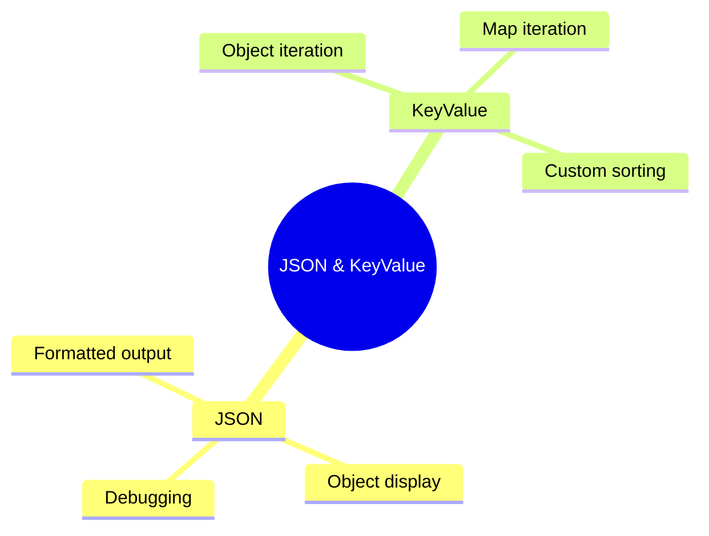

# 📋 Use Case 5: JSON & KeyValue Pipes

> **💡 Lightbulb Moment**: JSON pipe is perfect for debugging, and KeyValue lets you iterate over objects in templates!

---

## 1. 🔍 JSON Pipe

Displays objects as formatted JSON strings - great for debugging!

```html
<pre>{{ user | json }}</pre>
<!-- Output:
{
  "name": "John",
  "age": 30
}
-->
```

---

## 2. 🔍 KeyValue Pipe

Transforms objects/maps into iterable for @for loops.

```html
@for (item of settings | keyvalue; track item.key) {
    <div>{{ item.key }}: {{ item.value }}</div>
}
```

### Custom Sort
```typescript
// Sort by key
keepOrder = (a: any, b: any) => 0;
alphabetical = (a: KeyValue<string, any>, b: KeyValue<string, any>) =>
    a.key.localeCompare(b.key);
```
```html
@for (item of obj | keyvalue:alphabetical; track item.key) { ... }
```

---

### 📦 Data Flow Summary (Visual Box Diagram)

```
┌─────────────────────────────────────────────────────────────┐
│  JSON & KEYVALUE PIPES: DEBUG & ITERATE                     │
│                                                             │
│   JSON PIPE (Debugging):                                    │
│   ┌───────────────────────────────────────────────────────┐ │
│   │ user = { name: 'John', age: 30 };                     │ │
│   │                                                       │ │
│   │ <pre>{{ user | json }}</pre>                          │ │
│   │                                                       │ │
│   │ OUTPUT:                                               │ │
│   │ {                                                     │ │
│   │   "name": "John",                                     │ │
│   │   "age": 30                                           │ │
│   │ }                                                     │ │
│   │                                                       │ │
│   │ 🔍 Perfect for debugging objects in templates!        │ │
│   └───────────────────────────────────────────────────────┘ │
│                                                             │
│   KEYVALUE PIPE (Iterate Objects):                         │
│   ┌───────────────────────────────────────────────────────┐ │
│   │ settings = { theme: 'dark', lang: 'en' };             │ │
│   │                                                       │ │
│   │ @for (item of settings | keyvalue; track item.key) {  │ │
│   │   {{ item.key }}: {{ item.value }}                    │ │
│   │ }                                                     │ │
│   │                                                       │ │
│   │ OUTPUT:                                               │ │
│   │   lang: en                                            │ │
│   │   theme: dark                                         │ │
│   │                                                       │ │
│   │ 📋 Turns object → { key, value }[] for iteration      │ │
│   └───────────────────────────────────────────────────────┘ │
└─────────────────────────────────────────────────────────────┘
```

> **Key Takeaway**: JSON pipe = quick debugging. KeyValue pipe = iterate over objects/Maps in templates!

---

## 3. ❓ Interview Questions

### Basic Questions

#### Q1: When use JSON pipe vs console.log?
**Answer:**
| JSON Pipe | Console.log |
|-----------|-------------|
| In template | In component |
| Visible to user | Dev tools only |
| Real-time updates | Point in time |
| Great for debugging | Standard debugging |

#### Q2: KeyValue default order?
**Answer:** By key value (strings alphabetically, numbers numerically). Use `keyvalue:compareFn` to customize.

---

### Scenario-Based Questions

#### Scenario: Display Dynamic Form Errors
**Question:** Form has errors object like `{ required: 'Field required', minlength: 'Too short' }`. Display all.

**Answer:**
```html
@for (error of form.errors | keyvalue; track error.key) {
    <span class="error">{{ error.key }}: {{ error.value }}</span>
}
```

---

## 🧠 Mind Map


