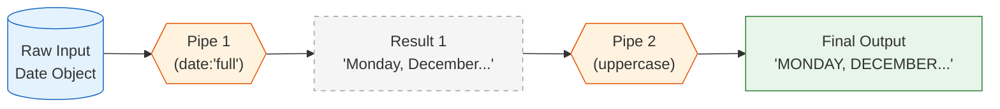
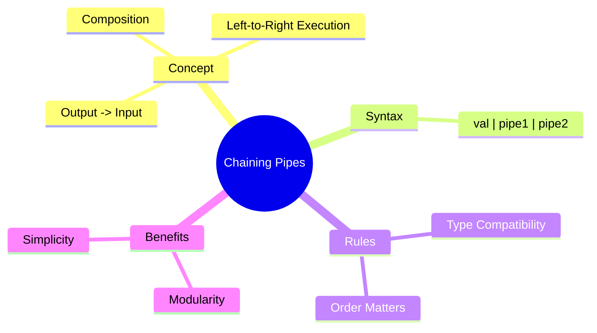

# 🔗 Use Case 6: Chaining Pipes

> **Goal**: Learn how to combine multiple pipes to create complex transformations from simple, building-block pipes.

---

## 1. 🔍 How It Works (The Concept)

### The Mechanism
You accept that one pipe does one thing well. To do complex things, you **chain** them together.
The syntax uses multiple pipe operators `|`.

**Crucially**: They execute from **Left to Right**.
1.  Input enters Pipe 1.
2.  Output of Pipe 1 becomes Input of Pipe 2.
3.  Output of Pipe 2 is displayed.

### ⛓️ Pipeline Diagram



---

## 2. 🚀 Step-by-Step Implementation Guide

### Scenario
We have a list of items. We want to:
1.  Take the first 3 items (`slice`).
2.  Format them as a JSON string to debug (`json`).

### Step 1: The Code
```typescript
// chaining.component.ts
items = ['Apple', 'Banana', 'Cherry', 'Date', 'Elderberry'];
```

### Step 2: The Template Chain
```html
<!-- chaining.component.html -->
<div class="debug">
    <h3>First 3 items (JSON):</h3>
    
    <!-- 
      1. items -> slice:0:3 -> returns ['Apple', 'Banana', 'Cherry']
      2. [...] -> json      -> returns "[\n 'Apple',... ]"
    -->
    <pre>{{ items | slice:0:3 | json }}</pre>
</div>
```

---

## 3. 🐛 Common Pitfalls & Debugging

### ❌ Pitfall 1: Wrong Order
Order matters! Types must match.

**Bad Code:**
```html
{{ today | uppercase | date }}  <!-- ❌ CRASH -->
```
**Why it fails:**
1.  `today` is a Date object.
2.  `uppercase` expects a String. It tries to convert Date to string, might work or crash.
3.  Output of `uppercase` is a String.
4.  `date` expects a Date object or valid ISO string. It receives "MON DEC...", which might be invalid.

**Correct Order:**
```html
{{ today | date | uppercase }} <!-- ✅ Correct -->
```
1.  Date -> String (formatted date).
2.  String -> String (upper case).

### ❌ Pitfall 2: Logic Confusion
If you chain 5 pipes, it becomes hard to read and debug.
**Fix**: If you need that much transformation, create a **single Custom Pipe** that encapsulates that logic (e.g., `| formatInvoice`).

---

## 4. ⚡ Performance & Architecture

### Performance
*   It's functionally equivalent to function composition `f(g(x))`.
*   Since pipes are optimized, chaining efficient pipes is better than writing a complex function in the template that does the same thing.

### Architecture
*   **Unix Philosophy**: "Write programs that do one thing and do it well. Write programs to work together."
*   Angular pipes follow this. Don't write a `UppercaseDatePipe`. Use `date | uppercase`. Keep your tools small and composable.

---

## 5. 🌍 Real World Use Cases

1.  **Date formatting headers**: `{{ eventDate | date:'mediumMonth' | uppercase }}` -> "DEC".
2.  **Debug slicing**: Viewing just the start of a massive array. `{{ bigList | slice:0:5 | json }}`.
3.  **Async + Safe Navigation**: `{{ (stream$ | async)?.name | titlecase }}`. (Handling async data, then safe accessing property, then formatting).

---

## 6. 📝 The Analogy: "The Assembly Line" 🏭

Imagine a car factory.

1.  **Station 1 (Pipe 1)**: Takes a frame, adds an Engine. Output: Moveable Chassis.
2.  **Station 2 (Pipe 2)**: Takes Chassis, adds Paint. Output: Painted Chassis.
3.  **Station 3 (Pipe 3)**: Takes Painted Chassis, adds Wheels. Output: Car.

You can't Paint the car before the Frame exists. The output of one station MUST be the compatible input for the next.

---

## 7. ❓ Interview & Concept Questions

1.  **Q: In which order are chained pipes executed?**
    *   **A:** Left to right. `val | A | B` executes A, then B.

2.  **Q: Why does `{{ dateObj | uppercase | date }}` usually fail?**
    *   **A:** Because `uppercase` turns the date object into a generic string representation that the `date` pipe might not recognize or parse correctly as a date input.

3.  **Q: Can you chain custom pipes with built-in pipes?**
    *   **A:** Yes, absolutely. `{{ text | myTruncate | uppercase }}` works perfectly as long as types match.

---

## 🧠 Mind Map


