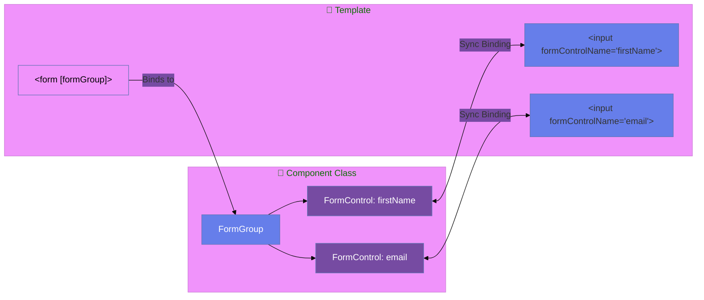
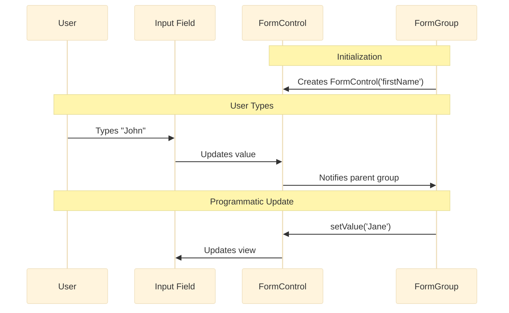
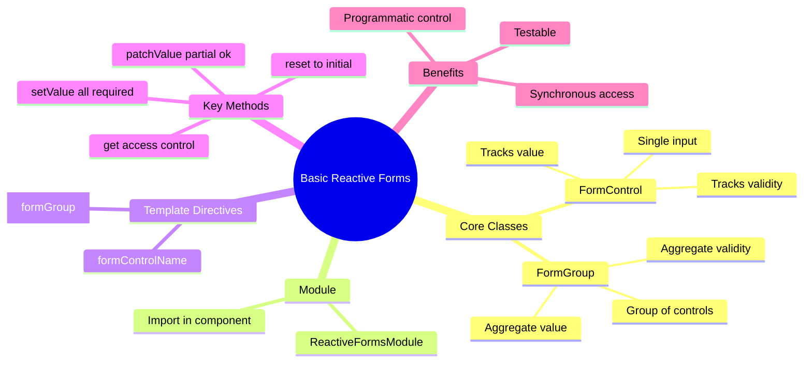

# 🎯 Basic FormControl & FormGroup

> **Goal**: Master the foundation of Reactive Forms - creating and binding form controls in TypeScript.


## 📋 Table of Contents
- [🏛️ What Problem Does It Solve?](#what-problem-does-it-solve)
  - [The "Messy Template" Problem](#the-messy-template-problem)
  - [The Reactive Solution](#the-reactive-solution)
- [🔬 Deep Dive: Important Classes & Directives](#deep-dive-important-classes--directives)
  - [A. The Classes (TypeScript Side)](#a-the-classes-typescript-side)
  - [B. The Directives (HTML Side)](#b-the-directives-html-side)
- [1. 🔍 How It Works (The Concept)](#1--how-it-works-the-concept)
  - [The Core Mechanism](#the-core-mechanism)
  - [Default vs. Optimized Behavior](#default-vs-optimized-behavior)
  - [📊 Data Flow Diagram](#data-flow-diagram)
  - [📦 Data Flow Summary (Visual Box Diagram)](#data-flow-summary-visual-box-diagram)
- [2. 🚀 Step-by-Step Implementation Guide](#2--step-by-step-implementation-guide)
  - [Step 1: Import ReactiveFormsModule](#step-1-import-reactiveformsmodule)
  - [Step 2: Create the FormGroup in your Component](#step-2-create-the-formgroup-in-your-component)
  - [Step 3: Bind the FormGroup in your Template](#step-3-bind-the-formgroup-in-your-template)
  - [📊 Binding Flow Visualization](#binding-flow-visualization)
- [3. 🐛 Common Pitfalls & Debugging](#3--common-pitfalls--debugging)
  - [❌ Pitfall 1: Forgetting ReactiveFormsModule](#pitfall-1-forgetting-reactiveformsmodule)
  - [❌ Pitfall 2: Mismatched formControlName](#pitfall-2-mismatched-formcontrolname)
  - [❌ Pitfall 3: Using setValue with missing fields](#pitfall-3-using-setvalue-with-missing-fields)
- [4. ⚡ Performance & Architecture](#4--performance--architecture)
  - [Performance Benefits](#performance-benefits)
  - [Architecture: Smart & Dumb Components](#architecture-smart--dumb-components)
- [5. 🌍 Real World Use Cases](#5--real-world-use-cases)
- [🏗️ Blueprint Analogy (Easy to Remember!)](#blueprint-analogy-easy-to-remember)
  - [📖 Story to Remember:](#story-to-remember)
  - [🎯 Quick Reference:](#quick-reference)
- [7. ❓ Interview & Concept Questions](#7--interview--concept-questions)
  - [Q1: What is the difference between FormControl and FormGroup?](#q1-what-is-the-difference-between-formcontrol-and-formgroup)
  - [Q2: How do you access a specific control's value?](#q2-how-do-you-access-a-specific-controls-value)
  - [Q3: What is the difference between setValue and patchValue?](#q3-what-is-the-difference-between-setvalue-and-patchvalue)
  - [Q4: Why do we use ReactiveFormsModule instead of FormsModule?](#q4-why-do-we-use-reactiveformsmodule-instead-of-formsmodule)
  - [Q5: How do you test a Reactive Form?](#q5-how-do-you-test-a-reactive-form)
  - [Q6 (Scenario): Form values need to be loaded from an API. How?](#q6-scenario-form-values-need-to-be-loaded-from-an-api-how)
  - [Q7: How do you listen to changes on a specific field?](#q7-how-do-you-listen-to-changes-on-a-specific-field)
  - [Q8: What is `FormBuilder` and why use it?](#q8-what-is-formbuilder-and-why-use-it)
  - [Q9: What are Typed Forms (Angular 14+)?](#q9-what-are-typed-forms-angular-14)
  - [Q10: How does `updateOn: 'blur'` help performance?](#q10-how-does-updateon-blur-help-performance)
  - [Q11: How do you handle "Password" and "Confirm Password" validation?](#q11-how-do-you-handle-password-and-confirm-password-validation)
  - [Q12: Explain `ControlValueAccessor` (CVA).](#q12-explain-controlvalueaccessor-cva)
  - [Q13: What happens if you use `[disabled]="true"` in the template with Reactive Forms?](#q13-what-happens-if-you-use-disabledtrue-in-the-template-with-reactive-forms)
  - [Q14: How do you reset a form but keep one field's value?](#q14-how-do-you-reset-a-form-but-keep-one-fields-value)
  - [Q15: Difference between `dirty` and `touched`?](#q15-difference-between-dirty-and-touched)
  - [Q16: How do you add dynamic fields?](#q16-how-do-you-add-dynamic-fields)
  - [Q17: Can you use `Validators.required` and HTML `required` attribute together?](#q17-can-you-use-validatorsrequired-and-html-required-attribute-together)
  - [Q18: What is an Async Validator?](#q18-what-is-an-async-validator)
  - [Q19: How do you access the parent FormGroup from a child component?](#q19-how-do-you-access-the-parent-formgroup-from-a-child-component)
  - [Q20: (Scenario) User edits a form but navigates away. How to prevent it?](#q20-scenario-user-edits-a-form-but-navigates-away-how-to-prevent-it)
  - [Q21: (Scenario) How to debounce search input to save API calls?](#q21-scenario-how-to-debounce-search-input-to-save-api-calls)
  - [Q22: (Scenario) How to validate that a start date is before an end date?](#q22-scenario-how-to-validate-that-a-start-date-is-before-an-end-date)
  - [Q23: (Scenario) How to auto-save a draft form?](#q23-scenario-how-to-auto-save-a-draft-form)
  - [Q24: (Scenario) A field is hidden with `*ngIf`. Is it still in the form.value?](#q24-scenario-a-field-is-hidden-with-ngif-is-it-still-in-the-formvalue)
  - [Q25: (Scenario) How do you handle file uploads in Reactive Forms?](#q25-scenario-how-do-you-handle-file-uploads-in-reactive-forms)
- [🔧 Implementation Flow Mindmap](#implementation-flow-mindmap)
- [🧠 Mind Map: Quick Visual Reference](#mind-map-quick-visual-reference)

---
---

---

## 🏛️ What Problem Does It Solve?

### The "Messy Template" Problem
In traditional Template-Driven forms (`ngModel`), all your logic lives in the HTML.
*   **The Struggle**: As forms get bigger (20+ fields), your HTML becomes huge and hard to read.
*   **The Issue**: If you need to check if "Field A" matches "Field B" (like password confirmation), you have to write complex template logic.
*   **The Pain**: Testing requires spinning up a browser (E2E), which is slow.

### The Reactive Solution
Reactive Forms move the "brain" of the form from the HTML to your TypeScript class.
*   **Logic in Code**: You create the form structure in TS (`new FormGroup(...)`).
*   **Testability**: You can test the form's logic (validations, value changes) in simple unit tests without any HTML.
*   **Predictability**: Data flows synchronously. You always know the state of the form instantly.

---

## 🔬 Deep Dive: Important Classes & Directives

### A. The Classes (TypeScript Side)
1.  **`FormControl`** (The Atom):
    *   Tracks the value and validity of a **single** input field.
    *   *Analogy*: A single cell in a spreadsheet.
    *   *Usage*: `email = new FormControl('default')`.

2.  **`FormGroup`** (The Container):
    *   Tracks the value and validity of a **collection** of controls.
    *   *Analogy*: A single row in a spreadsheet containing multiple cells.
    *   *Key Behavior*: If ONE control inside is invalid, the WHOLE group is invalid.

3.  **`ReactiveFormsModule`** (The Enabler):
    *   The Angular module that unlocks these features. Without importing this, none of the code above works.

### B. The Directives (HTML Side)
1.  **`[formGroup]`**: 
    *   Binds a complete `FormGroup` instance to a parent DOM element (usually `<form>`).
    *   *Effect*: Connects your TS logic to the View.

2.  **`formControlName`**:
    *   Syncs a specific DOM input with a specific `FormControl` inside the parent group.
    *   *Rule*: The name MUST match the key in your TypeScript `FormGroup` definition exactly.

---

## 1. 🔍 How It Works (The Concept)

### The Core Mechanism

Reactive Forms are Angular's **model-driven** approach to forms. Instead of letting the template control your form (`ngModel`), **you** control the form in your TypeScript class.

| Template Forms | Reactive Forms |
|----------------|----------------|
| `FormsModule` | `ReactiveFormsModule` |
| `[(ngModel)]` | `formControlName` |
| Implicit form model | Explicit form model |
| Template is source of truth | **Component class** is source of truth |

### Default vs. Optimized Behavior

- **Default (Template Forms)**: Angular creates FormControl instances behind the scenes when it sees `ngModel`. You have limited programmatic access.
- **Optimized (Reactive Forms)**: You explicitly create `FormControl` and `FormGroup` instances. You have **full control** over values, validation, and state.

### 📊 Data Flow Diagram



---

### 📦 Data Flow Summary (Visual Box Diagram)

```
┌─────────────────────────────────────────────────────────────┐
│  REACTIVE FORMS: MODEL-DRIVEN APPROACH                      │
│                                                             │
│   COMPONENT CLASS (Source of Truth):                        │
│   ┌───────────────────────────────────────────────────────┐ │
│   │ profileForm = new FormGroup({                         │ │
│   │   firstName: new FormControl(''),  ← FormControl      │ │
│   │   lastName: new FormControl(''),   ← FormControl      │ │
│   │   email: new FormControl('')       ← FormControl      │ │
│   │ });                                                   │ │
│   └───────────────────────────────────────────────────────┘ │
│                      │                                      │
│                      │ [formGroup]="profileForm"            │
│                      ▼                                      │
│   TEMPLATE (View):                                          │
│   ┌───────────────────────────────────────────────────────┐ │
│   │ <form [formGroup]="profileForm">                      │ │
│   │   <input formControlName="firstName">  ← Syncs value  │ │
│   │   <input formControlName="lastName">   ← Syncs value  │ │
│   │   <input formControlName="email">      ← Syncs value  │ │
│   │ </form>                                               │ │
│   └───────────────────────────────────────────────────────┘ │
│                                                             │
│   ACCESSING VALUES:                                         │
│   ┌───────────────────────────────────────────────────────┐ │
│   │ profileForm.value        → { firstName, lastName, ... }│ │
│   │ profileForm.valid        → true/false                 │ │
│   │ profileForm.get('email') → FormControl reference      │ │
│   │ setValue({...})          → Set ALL values             │ │
│   │ patchValue({...})        → Set SOME values            │ │
│   └───────────────────────────────────────────────────────┘ │
└─────────────────────────────────────────────────────────────┘
```

> **Key Takeaway**: FormGroup = container, FormControl = single field. Component class controls everything!

---

## 2. 🚀 Step-by-Step Implementation Guide

### Step 1: Import ReactiveFormsModule

```typescript
// 🛡️ CRITICAL: Import ReactiveFormsModule, NOT FormsModule!
import { ReactiveFormsModule, FormGroup, FormControl } from '@angular/forms';

@Component({
    imports: [ReactiveFormsModule] // <-- Add this!
})
```

### Step 2: Create the FormGroup in your Component

```typescript
export class BasicReactiveComponent implements OnInit {
    // Declare the form group
    profileForm!: FormGroup;

    ngOnInit(): void {
        // 🛡️ CRITICAL: Keys here MUST match formControlName in template!
        this.profileForm = new FormGroup({
            firstName: new FormControl(''),  // Initial value: ''
            lastName: new FormControl(''),
            email: new FormControl('')
        });
    }
}
```

### Step 3: Bind the FormGroup in your Template

```html
<!-- Bind the form to the FormGroup -->
<form [formGroup]="profileForm" (ngSubmit)="onSubmit()">
    
    <!-- Bind inputs to FormControls -->
    <input formControlName="firstName">
    <input formControlName="lastName">
    <input formControlName="email">
    
    <button type="submit">Submit</button>
</form>
```

### 📊 Binding Flow Visualization



---

## 3. 🐛 Common Pitfalls & Debugging

### ❌ Pitfall 1: Forgetting ReactiveFormsModule

**Bad Code:**
```typescript
@Component({
    imports: [CommonModule] // ❌ Missing ReactiveFormsModule!
})
```

**Error:** `Can't bind to 'formGroup' since it isn't a known property`

**Fix:**
```typescript
@Component({
    imports: [CommonModule, ReactiveFormsModule] // ✅ Add ReactiveFormsModule
})
```

---

### ❌ Pitfall 2: Mismatched formControlName

**Bad Code:**
```typescript
// Component
this.profileForm = new FormGroup({
    firstName: new FormControl('') // Key is 'firstName'
});

// Template
<input formControlName="first_name"> // ❌ 'first_name' doesn't match!
```

**Error:** `Cannot find control with name: 'first_name'`

**Fix:**
```html
<input formControlName="firstName"> <!-- ✅ Matches key exactly -->
```

---

### ❌ Pitfall 3: Using setValue with missing fields

**Bad Code:**
```typescript
this.profileForm.setValue({
    firstName: 'John'
    // ❌ Missing lastName and email!
});
```

**Error:** `Must supply a value for form control with name: 'lastName'`

**Fix: Use patchValue for partial updates:**
```typescript
this.profileForm.patchValue({
    firstName: 'John' // ✅ patchValue allows partial updates
});
```

---

## 4. ⚡ Performance & Architecture

### Performance Benefits

| Aspect | Benefit |
|--------|---------|
| **Synchronous Access** | `this.profileForm.value` is always up-to-date. No async waiting. |
| **Reduced Change Detection** | Form state is managed outside Angular's change detection cycle. |
| **Testability** | Test form logic with pure TypeScript, no DOM needed. |

### Architecture: Smart & Dumb Components

- **Smart Component (Container)**: Creates and manages the `FormGroup`. Handles submission.
- **Dumb Component (Presentational)**: Receives a `FormGroup` via `@Input()` and just renders it.

```typescript
// Smart Component
@Component({ template: `<app-profile-form [form]="profileForm"></app-profile-form>` })
export class ProfileContainerComponent {
    profileForm = new FormGroup({ ... });
}

// Dumb Component
@Component({ selector: 'app-profile-form', ... })
export class ProfileFormComponent {
    @Input() form!: FormGroup;
}
```

---

## 5. 🌍 Real World Use Cases

1. **User Registration Form**: First name, last name, email, password. Need programmatic control for password matching.
2. **Settings Page**: Form values loaded from API, then saved on submit. `setValue` populates the form.
3. **Multi-Step Wizard**: Split a large form into pages. Each page is a `FormGroup`. Combine at the end.
4. **🔴 Live Search Filter**: Listening to `valueChanges` on a search box, applying `debounceTime(300)`, and triggering an API search without a submit button.
5. **📝 Dynamic Surveys**: Using `FormArray` to let users "Add Question" dynamically. The form acts as a JSON builder.
6. **🛒 Shopping Cart Items**: Editing quantities in a list (Table Row Editing). Each row is a `FormGroup` inside a `FormArray`.
7. **🔐 Auto-Saving Forms**: Listening to `statusChanges` or `valueChanges` to auto-save drafts to LocalStorage every few seconds.

---

## 🏗️ Blueprint Analogy (Easy to Remember!)

Think of Reactive Forms like **building with blueprints**:

| Concept | Blueprint Analogy | Memory Trick |
|---------|-----------------|--------------|
| **FormGroup** | 📐 **Blueprint**: The master plan with all rooms defined | **"The master plan"** |
| **FormControl** | 🛏️ **Room spec**: Individual room requirements (size, windows) | **"Single field"** |
| **Template Forms** | 🏗️ **Building without plans**: Workers decide on the fly | **"Ad-hoc"** |
| **Reactive Forms** | 📈 **Architect's blueprint**: You design, workers follow | **"You control"** |
| **setValue/patchValue** | ✏️ **Revising plans**: Change room specs after design | **"Update the plan"** |

### 📖 Story to Remember:

> 🏗️ **The Two Construction Sites**
>
> Two builders start a house project:
>
> **Template Forms (No Blueprint):**
> ```
> Builder arrives → "What rooms do you want?"
> Owner: "Hmm, let me think... a bedroom here"
> Builder: "Okay, I'll wing it" 🤷‍♂️
> Result: Hard to predict, hard to test
> ```
>
> **Reactive Forms (With Blueprint):**
> ```
> Architect creates detailed blueprint 📐
> → Living room: 20x30 ft (FormControl)
> → Kitchen: 15x15 ft (FormControl)
> → All specs in master plan (FormGroup)
> 
> Builder: "I just follow the plan" ✅
> Result: Predictable, testable, you control everything!
> ```
>
> **You're the architect. Angular just builds what you specify.**

### 🎯 Quick Reference:
```
📐 FormGroup        = Blueprint (container for all fields)
🛏️ FormControl      = Room spec (single input control)
📈 Reactive Forms   = Architect's approach (you design)
✏️ setValue         = Revise ALL specs (complete update)
📝 patchValue       = Revise SOME specs (partial update)
```

---

## 7. ❓ Interview & Concept Questions

### Q1: What is the difference between FormControl and FormGroup?
**A:** `FormControl` tracks the value of a **single** input. `FormGroup` tracks the value of a **group** of controls. A `FormGroup` contains multiple `FormControl` instances.

### Q2: How do you access a specific control's value?
**A:** Use `formGroup.get('controlName')?.value` or `formGroup.controls['controlName'].value`.

### Q3: What is the difference between setValue and patchValue?
**A:** 
- `setValue`: Requires you to provide values for **ALL** controls. Throws error if any are missing.
- `patchValue`: Allows **partial** updates. Only updates the controls you specify.

### Q4: Why do we use ReactiveFormsModule instead of FormsModule?
**A:** `ReactiveFormsModule` provides directives like `formGroup`, `formControlName`. `FormsModule` provides `ngModel`. They are for different approaches.

### Q5: How do you test a Reactive Form?
**A:** Directly in unit tests without any DOM. Create the `FormGroup`, call `setValue`/`patchValue`, and assert on `formGroup.value` and `formGroup.valid`.

### Q6 (Scenario): Form values need to be loaded from an API. How?
**A:** Call the API in `ngOnInit`, then use `setValue` or `patchValue` to populate the form:
```typescript
ngOnInit() {
    this.userService.getProfile().subscribe(user => {
        this.profileForm.setValue(user); // or patchValue
    });
}
```

### Q7: How do you listen to changes on a specific field?
**A:** subscribe to `control.valueChanges`:
```typescript
this.form.get('email')?.valueChanges.subscribe(val => console.log(val));
```

### Q8: What is `FormBuilder` and why use it?
**A:** It's a syntactic sugar service. Instead of `new FormGroup({ a: new FormControl() })`, you write `fb.group({ a: [] })`. It reduces boilerplate.

### Q9: What are Typed Forms (Angular 14+)?
**A:** Before v14, forms were `any`. Now, `FormGroup<{ email: FormControl<string|null> }>` ensures type safety. If you try to patch a number into a string field, TS throws an error.

### Q10: How does `updateOn: 'blur'` help performance?
**A:** By default, validation runs on every keystroke (`'change'`). Setting `updateOn: 'blur'` delays validation until the user leaves the field, reducing CPU/Memory usage for expensive validators.

### Q11: How do you handle "Password" and "Confirm Password" validation?
**A:** Use a **Cross-Field Validator** on the `FormGroup`, not the controls. The validator checks `group.get('pass').value === group.get('confirm').value`.

### Q12: Explain `ControlValueAccessor` (CVA).
**A:** It's an interface that allows you to turn a custom component (e.g., `<my-slider>`) into a form control that works with `formControlName`. It bridges the DOM to the Angular Form API.

### Q13: What happens if you use `[disabled]="true"` in the template with Reactive Forms?
**A:** **It gives a warning.** In Reactive Forms, you should change status programmatically: `control.disable()` or `control.enable()`. Template binding for disabled state is discouraged.

### Q14: How do you reset a form but keep one field's value?
**A:** Pass the value to the reset method:
```typescript
this.form.reset({ email: 'keep@me.com' }); // Others go null
```

### Q15: Difference between `dirty` and `touched`?
**A:** 
*   **Dirty**: Value changed.
*   **Touched**: Focus entered and left (blurred).

### Q16: How do you add dynamic fields?
**A:** Use `FormArray`. It allows you to `push()` or `removeAt()` controls dynamically.

### Q17: Can you use `Validators.required` and HTML `required` attribute together?
**A:** Yes, but in Reactive Forms, the HTML `required` is just for accessibility/CSS. The logic comes from `Validators.required` in TS.

### Q18: What is an Async Validator?
**A:** A validator that returns a Promise or Observable (e.g., checking if a username exists on the server). It stays `PENDING` until the HTTP call finishes.

### Q19: How do you access the parent FormGroup from a child component?
**A:** Inject `ControlContainer` in the child component's constructor. This allows the child to find the `formGroup` directive provided by the parent.

### Q20: (Scenario) User edits a form but navigates away. How to prevent it?
**A:** Use a **CanDeactivate Guard**. Check `if (this.form.dirty)`. If true, show a confirmation dialog ("Unsaved changes...").

### Q21: (Scenario) How to debounce search input to save API calls?
**A:**
```typescript
this.searchControl.valueChanges.pipe(
  debounceTime(300),
  distinctUntilChanged(),
  switchMap(term => this.api.search(term))
).subscribe();
```

### Q22: (Scenario) How to validate that a start date is before an end date?
**A:** Custom Validator on the FormGroup.
`const start = group.get('start').value; const end = group.get('end').value;`
If `start > end`, return `{ dateInvalid: true }`.

### Q23: (Scenario) How to auto-save a draft form?
**A:** Subscribe to `form.valueChanges` inside `ngOnInit`. Use `debounceTime(1000)` and call your storage service.

### Q24: (Scenario) A field is hidden with `*ngIf`. Is it still in the form.value?
**A:** **No.** `*ngIf` removes the element AND the `formControlName` directive, effectively detaching it. If you want to keep the value but hide it, use `[hidden]` or CSS `display: none`.

### Q25: (Scenario) How do you handle file uploads in Reactive Forms?
**A:** Reactive Forms handle text/numbers well, but not `File` objects natively. You typically create a change listener `(change)="onFileSelect($event)"` and manually `patchValue` the file object into a FormControl (or handle it separately).

---

## 🔧 Implementation Flow Mindmap

```mermaid
mindmap
  root((Implementation))
    Step 1 Setup
      Import ReactiveFormsModule
      Declare FormGroup property
    Step 2 Create Form
      new FormGroup
      new FormControl per field
      Set initial values
    Step 3 Template Binding
      [formGroup] on form tag
      formControlName on inputs
      ngSubmit for submission
    Step 4 Access Data
      formGroup.value
      formGroup.get controlName
      formGroup.valid
    Step 5 Programmatic Control
      setValue all fields
      patchValue partial
      reset form
```

---

## 🧠 Mind Map: Quick Visual Reference


