# 🔗 Cross-Field Validation

> **Goal**: Validate fields that depend on each other using group-level validators.


## 📋 Table of Contents
- [🏛️ What Problem Does It Solve?](#what-problem-does-it-solve)
  - [The "Dependent Fields" Problem](#the-dependent-fields-problem)
  - [The "Logical Constraints" Problem](#the-logical-constraints-problem)
- [🔬 Deep Dive: Important Classes & Directives](#deep-dive-important-classes--directives)
  - [A. The Classes (TypeScript Side)](#a-the-classes-typescript-side)
  - [B. The Directives (HTML Side)](#b-the-directives-html-side)
- [1. 🔍 How It Works (The Concept)](#1--how-it-works-the-concept)
  - [The Core Mechanism](#the-core-mechanism)
  - [Field vs Cross-Field Validation](#field-vs-cross-field-validation)
  - [📊 Validation Scope](#validation-scope)
- [2. 🚀 Step-by-Step Implementation Guide](#2--step-by-step-implementation-guide)
  - [Step 1: Create Cross-Field Validator](#step-1-create-cross-field-validator)
  - [Step 2: Apply to FormGroup](#step-2-apply-to-formgroup)
  - [Step 3: Display Error in Template](#step-3-display-error-in-template)
  - [📊 Error Location Comparison](#error-location-comparison)
- [3. 🐛 Common Pitfalls & Debugging](#3--common-pitfalls--debugging)
  - [❌ Pitfall 1: Checking Error on Wrong Object](#pitfall-1-checking-error-on-wrong-object)
  - [❌ Pitfall 2: Not Accessing Child Controls Properly](#pitfall-2-not-accessing-child-controls-properly)
- [4. ⚡ Performance & Architecture](#4--performance--architecture)
  - [When to Use Cross-Field Validation](#when-to-use-cross-field-validation)
  - [Nested Group Validation](#nested-group-validation)
- [5. 🌍 Real World Use Cases](#5--real-world-use-cases)
  - [📦 Data Flow Summary (Visual Box Diagram)](#data-flow-summary-visual-box-diagram)
- [🏆 Team Captain Analogy (Easy to Remember!)](#team-captain-analogy-easy-to-remember)
  - [📖 Story to Remember:](#story-to-remember)
  - [🎯 Quick Reference:](#quick-reference)
- [7. ❓ Interview & Concept Questions](#7--interview--concept-questions)
  - [Q1: Where are cross-field errors stored?](#q1-where-are-cross-field-errors-stored)
  - [Q2: How do you apply a cross-field validator?](#q2-how-do-you-apply-a-cross-field-validator)
  - [Q3: Can you have both field and cross-field validators?](#q3-can-you-have-both-field-and-cross-field-validators)
  - [Q4 (Scenario): Validate that either email OR phone is provided.](#q4-scenario-validate-that-either-email-or-phone-is-provided)
  - [Q5: How do you access the `FormGroup` inside the validator function?](#q5-how-do-you-access-the-formgroup-inside-the-validator-function)
  - [Q6: Can you manipulate controls inside a validator (e.g., disable them)?](#q6-can-you-manipulate-controls-inside-a-validator-eg-disable-them)
  - [Q7: If I update "Password", does "Confirm Password" validation run?](#q7-if-i-update-password-does-confirm-password-validation-run)
  - [Q8: How to manually trigger cross-field validation?](#q8-how-to-manually-trigger-cross-field-validation)
  - [Q9: (Scenario) "Start Date" is valid, "End Date" is valid, but the Range is invalid. Which control shows the red border?](#q9-scenario-start-date-is-valid-end-date-is-valid-but-the-range-is-invalid-which-control-shows-the-red-border)
  - [Q10: How to ensure `passwordMatch` only shows error when `confirmPassword` is dirty?](#q10-how-to-ensure-passwordmatch-only-shows-error-when-confirmpassword-is-dirty)
  - [Q11: Can shared validators be Async?](#q11-can-shared-validators-be-async)
  - [Q12: What if I have 3 password fields (Old, New, Confirm)?](#q12-what-if-i-have-3-password-fields-old-new-confirm)
  - [Q13: How to handle circular dependencies in validation?](#q13-how-to-handle-circular-dependencies-in-validation)
  - [Q14: How do you test a cross-field validator in isolation?](#q14-how-do-you-test-a-cross-field-validator-in-isolation)
  - [Q15: Why use `AbstractControl` type for the validator argument?](#q15-why-use-abstractcontrol-type-for-the-validator-argument)
  - [Q16: Can I attach a cross-field validator after initialization?](#q16-can-i-attach-a-cross-field-validator-after-initialization)
  - [Q17: What is the `parent` property of a control?](#q17-what-is-the-parent-property-of-a-control)
  - [Q18: Difference between `validator` and `validators` in FormGroup config?](#q18-difference-between-validator-and-validators-in-formgroup-config)
  - [Q19: How to clear a cross-field error?](#q19-how-to-clear-a-cross-field-error)
  - [Q20: (Scenario) Dynamic form where "Confirm Password" field is sometimes removed.](#q20-scenario-dynamic-form-where-confirm-password-field-is-sometimes-removed)
- [🧠 Mind Map: Quick Visual Reference](#mind-map-quick-visual-reference)

---
---

---

## 🏛️ What Problem Does It Solve?

### The "Dependent Fields" Problem
*   **The Problem**: "Password" and "Confirm Password" are valid individually (both have text), but invalid *together* (they don't match). Field-level validators (`required`, `minlength`) can't see the other field.
*   **The Solution**: Cross-field validation runs on the parent `FormGroup`, which has access to *both* children.

### The "Logical Constraints" Problem
*   **The Problem**: "Start Date" cannot be after "End Date". The validity of "Start Date" depends entirely on what the user typed in "End Date".
*   **The Solution**: A group validator compares the two values and marks the *logic* as invalid, rather than a specific input.

---

## 🔬 Deep Dive: Important Classes & Directives

### A. The Classes (TypeScript Side)
1.  **`FormGroup` Options**:
    *   The second argument of `new FormGroup` isn't just validators. It's an options object: `{ validators: [], asyncValidators: [], updateOn: 'blur' }`.
    *   *History*: In older Angular versions, validators were the 2nd argument directly. Now checking `AbstractControlOptions` is preferred.

2.  **`AbstractControl.errors`**:
    *   This property exists on Groups too! `this.form.errors` contains the result of your cross-field validator.

### B. The Directives (HTML Side)
1.  **`form.hasError('key')`**:
    *   A helper method that checks `this.errors['key']`.
    *   *Usage*: `@if (form.hasError('mismatch'))`. It's cleaner than `form.errors?.['mismatch']`.

---

## 1. 🔍 How It Works (The Concept)

### The Core Mechanism

Cross-field validators are applied to a `FormGroup` instead of a `FormControl`. They receive the entire group and can compare multiple fields.

```typescript
// Applied to FormGroup, not FormControl!
new FormGroup({
    password: new FormControl(''),
    confirmPassword: new FormControl('')
}, { validators: [passwordMatchValidator] })
```

### Field vs Cross-Field Validation

| Field Validation | Cross-Field Validation |
|------------------|----------------------|
| One control | Multiple controls |
| Applied to FormControl | Applied to FormGroup |
| `control.errors` | `group.errors` |
| Required, minLength | Password match, date range |

### 📊 Validation Scope

```mermaid
%%{init: {'theme':'base', 'themeVariables': { 'primaryColor':'#667eea'}}}%%
graph TD
    subgraph FormGroup["📋 FormGroup (validators: [passwordMatch])"]
        P["password: FormControl"]
        CP["confirmPassword: FormControl"]
    end
    
    V["passwordMatchValidator(group)"]
    FormGroup --> V
    V --> P
    V --> CP
    V -->|"Compares"| Result{Match?}
    Result -->|Yes| Valid["✅ null"]
    Result -->|No| Error["❌ { passwordMismatch: true }"]
    Error --> FormGroup
    
    style FormGroup fill:#667eea,color:#fff
```



---

## 2. 🚀 Step-by-Step Implementation Guide

### Step 1: Create Cross-Field Validator

```typescript
function passwordMatchValidator(group: AbstractControl): ValidationErrors | null {
    const password = group.get('password')?.value;
    const confirm = group.get('confirmPassword')?.value;
    
    // Only validate if both have values
    if (!password || !confirm) return null;
    
    return password === confirm ? null : { passwordMismatch: true };
}
```

### Step 2: Apply to FormGroup

```typescript
this.form = new FormGroup({
    password: new FormControl(''),
    confirmPassword: new FormControl('')
}, {
    validators: [passwordMatchValidator] // 🛡️ Group-level validator!
});
```

### Step 3: Display Error in Template

```html
<!-- Check error on the FORM, not the control -->
@if (form.hasError('passwordMismatch')) {
    <div class="error">Passwords do not match</div>
}
```

### 📊 Error Location Comparison


---

## 3. 🐛 Common Pitfalls & Debugging

### ❌ Pitfall 1: Checking Error on Wrong Object

**Bad Code:**
```html
<!-- ❌ Error is on group, not control! -->
@if (form.get('confirmPassword')?.hasError('passwordMismatch')) {
    <div>Passwords don't match</div>
}
```

**Issue:** `passwordMismatch` is on the group, not the control.

**Fix:**
```html
<!-- ✅ Check the form (group) for cross-field errors -->
@if (form.hasError('passwordMismatch')) {
    <div>Passwords don't match</div>
}
```

---

### ❌ Pitfall 2: Not Accessing Child Controls Properly

**Bad Code:**
```typescript
function dateRange(group): ValidationErrors | null {
    const start = group.startDate; // ❌ Wrong!
    const end = group.endDate;
}
```

**Fix:**
```typescript
function dateRange(group): ValidationErrors | null {
    const start = group.get('startDate')?.value; // ✅ Use .get()
    const end = group.get('endDate')?.value;
}
```

---

## 4. ⚡ Performance & Architecture

### When to Use Cross-Field Validation

| Scenario | Use Cross-Field? |
|----------|-----------------|
| Password confirmation | ✅ Yes |
| Date range (start < end) | ✅ Yes |
| At least one of X or Y filled | ✅ Yes |
| Email format | ❌ No (field-level) |

### Nested Group Validation

```typescript
// Apply validator to nested group only
this.form = new FormGroup({
    datesGroup: new FormGroup({
        start: new FormControl(''),
        end: new FormControl('')
    }, { validators: [dateRangeValidator] }) // Scoped to dates only
});
```

---

## 5. 🌍 Real World Use Cases

1. **Password Confirmation**: New password vs confirm password.
2. **Date Range**: Check-in must be before check-out.
3. **Quantity Limits**: Min quantity ≤ max quantity.
4. **📞 Contact Preference**: If "Phone" is selected as preferred, the Phone Number field becomes required.
5. **💱 Currency Exchange**: `Buy Price` must be lower than `Sell Price`.
6. **📅 Event Scheduling**: "Event End Time" must be strictly greater than "Event Start Time".
7. **👪 Household Income**: If "Married" is selected, "spousal income" field must be valid (or conditionally required).

---

### 📦 Data Flow Summary (Visual Box Diagram)

```
┌─────────────────────────────────────────────────────────────┐
│  CROSS-FIELD VALIDATION: GROUP-LEVEL CHECKS                 │
│                                                             │
│   FIELD VALIDATOR (on FormControl):                         │
│   ┌───────────────────────────────────────────────────────┐ │
│   │ email: new FormControl('', Validators.email)          │ │
│   │                     ↓                                 │ │
│   │ email.errors = { email: true }  // On the CONTROL     │ │
│   └───────────────────────────────────────────────────────┘ │
│                                                             │
│   CROSS-FIELD VALIDATOR (on FormGroup):                     │
│   ┌───────────────────────────────────────────────────────┐ │
│   │ function passwordMatch(group: AbstractControl) {      │ │
│   │   const password = group.get('password')?.value;      │ │
│   │   const confirm = group.get('confirmPassword')?.value;│ │
│   │   return password === confirm                         │ │
│   │     ? null : { passwordMismatch: true };              │ │
│   │ }                                                     │ │
│   │                                                       │ │
│   │ new FormGroup({ ... }, { validators: [passwordMatch] })│ │
│   │                     ↓                                 │ │
│   │ form.errors = { passwordMismatch: true }  // On GROUP │ │
│   └───────────────────────────────────────────────────────┘ │
│                                                             │
│   TEMPLATE CHECK:                                           │
│   ┌───────────────────────────────────────────────────────┐ │
│   │ // ✅ Check GROUP for cross-field errors              │ │
│   │ @if (form.hasError('passwordMismatch')) {             │ │
│   │   <span>Passwords don't match!</span>                 │ │
│   │ }                                                     │ │
│   └───────────────────────────────────────────────────────┘ │
└─────────────────────────────────────────────────────────────┘
```

> **Key Takeaway**: Cross-field errors are on the FormGroup, not FormControl! Use `group.hasError()` to check.

---

## 🏆 Team Captain Analogy (Easy to Remember!)

Think of cross-field validation like a **team captain**:

| Concept | Team Analogy | Memory Trick |
|---------|-------------|--------------| 
| **Field validators** | 🏃 **Individual stats**: Height, weight, speed | **"Single control"** |
| **Cross-field validator** | 🏆 **Captain check**: Team chemistry | **"Group validator"** |
| **FormGroup** | 👥 **The team**: Multiple players together | **"Parent container"** |
| **group.get()** | 📋 **Check roster**: Look up a player | **"Access field"** |
| **group.errors** | 🚩 **Team issue**: "These two don't work together" | **"Cross-field error"** |

### 📖 Story to Remember:

> 🏆 **Building the Basketball Team**
>
> You're recruiting players:
>
> **Individual Checks (Field Validators):**
> ```typescript
> height: new FormControl('', Validators.min(180)),
> weight: new FormControl('', Validators.required)
> // Each player passes physical ✅
> ```
>
> **Captain Check (Cross-Field):**
> ```typescript
> function passwordMatchValidator(group) {
>   const password = group.get('password')?.value;
>   const confirm = group.get('confirmPassword')?.value;
>   // Captain checks: "Do these work TOGETHER?"
>   return password === confirm ? null : { mismatch: true };
> }
> ```
>
> **Captain looks at the WHOLE TEAM, not individuals!**

### 🎯 Quick Reference:
```
🏃 Field validator    = Individual player check
🏆 Cross-field        = Captain/team check
👥 FormGroup          = The team
📋 group.get()        = Check roster
🚩 group.errors       = Team chemistry issues
```

---

## 7. ❓ Interview & Concept Questions

### Q1: Where are cross-field errors stored?
**A:** On the `FormGroup`, not individual controls. Access via `group.errors` or `group.hasError('key')`.

### Q2: How do you apply a cross-field validator?
**A:** Pass it to the FormGroup options: `new FormGroup({...}, { validators: [myValidator] })`.

### Q3: Can you have both field and cross-field validators?
**A:** Yes! Field validators on controls, cross-field on the group. Both run.

### Q4 (Scenario): Validate that either email OR phone is provided.
**A:**
```typescript
function contactRequired(group): ValidationErrors | null {
    const email = group.get('email')?.value;
    const phone = group.get('phone')?.value;
    return (email || phone) ? null : { noContact: true };
}
```

### Q5: How do you access the `FormGroup` inside the validator function?
**A:** The function receives `control: AbstractControl`. You cast it: `const group = control as FormGroup;` (though it's not strictly necessary to access `.get()`).

### Q6: Can you manipulate controls inside a validator (e.g., disable them)?
**A:** **Avoid it.** Validators should be pure functions that return status. Side effects (like disabling fields) can cause infinite loops or change detection errors.

### Q7: If I update "Password", does "Confirm Password" validation run?
**A:** No, by default, changing a child only validates *that* child and its parents. It does NOT automatically re-validate siblings. Data flows UP.
However, since our validator is on the **Parent Group**, updating *any* child updates the parent, which triggers the Group Validator. So YES, it works!

### Q8: How to manually trigger cross-field validation?
**A:** `form.updateValueAndValidity()`.

### Q9: (Scenario) "Start Date" is valid, "End Date" is valid, but the Range is invalid. Which control shows the red border?
**A:** By default, neither (if they only check their own errors). You must CSS-style the *container* based on `form.invalid`, OR manually set errors on the child controls (not recommended), OR use a helper `isInvalid` covering the group error.

### Q10: How to ensure `passwordMatch` only shows error when `confirmPassword` is dirty?
**A:** In the template: `@if (form.hasError('mismatch') && form.get('confirmPassword')?.dirty)`.

### Q11: Can shared validators be Async?
**A:** Yes, `new FormGroup({ ... }, { asyncValidators: [myAsyncOne] })`.

### Q12: What if I have 3 password fields (Old, New, Confirm)?
**A:** The logic is the same. `group.get('new') === group.get('confirm')`. "Old" might need a separate async validator to check against DB.

### Q13: How to handle circular dependencies in validation?
**A:** Reactive Forms avoids this because data flows one way (Child -> Parent). But if you subscribe to `valueChanges` and call `setValue` inside, you might cause a loop. Use `{ emitEvent: false }`.

### Q14: How do you test a cross-field validator in isolation?
**A:**
```typescript
const group = new FormGroup({ a: new FormControl(1), b: new FormControl(2) });
const result = myValidator(group);
expect(result).not.toBeNull();
```

### Q15: Why use `AbstractControl` type for the validator argument?
**A:** Because validators can be applied to `FormControl`, `FormGroup`, or `FormArray`. `AbstractControl` is the base class for all of them.

### Q16: Can I attach a cross-field validator after initialization?
**A:** Yes, `form.setValidators([newValidator]); form.updateValueAndValidity();`.

### Q17: What is the `parent` property of a control?
**A:** It points to the `FormGroup` (or Array) containing the control. You *could* access siblings via `control.parent.get('sibling')`, but it's cleaner to put the validator on the parent.

### Q18: Difference between `validator` and `validators` in FormGroup config?
**A:** Angular 7 deprecated the direct 2nd argument. In modern Angular, use the options object `{ validators: [] }` to avoid confusion with `asyncValidators`.

### Q19: How to clear a cross-field error?
**A:** You can't "clear" it directly if the validator keeps returning it. You must change the inputs (values) effectively. Or remove the validator.

### Q20: (Scenario) Dynamic form where "Confirm Password" field is sometimes removed.
**A:** Your validator must check if the control exists (`group.get('confirm')`) before accessing `.value`. `group.get()` returns null if missing.

---

## 🧠 Mind Map: Quick Visual Reference


